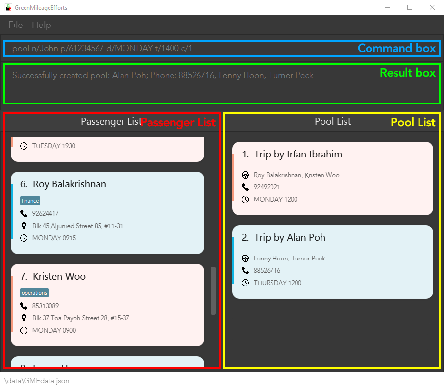

GreenMileageEfforts (GME) is an efficient carpooling management solution designed to help companies reduce their carbon footprint. It is designed as a platform to help Human Resource (HR) managers of any company quickly arrange carpooling among its employees, lowering the company's carbon footprint. GME is a platform that follows a [Command-Line Interface (CLI)](#6-glossary) such that HR employees that are fast typists can efficiently navigate the program.

* Table of Contents
{:toc}

--------------------------------------------------------------------------------------------------------------------

# 1. Introduction

## 1.1 Welcome to GreenMileageEfforts
As a Human Resource (HR) manager of a large company, you may need an efficient way of managing your company's carpooling initiative, the GME system is designed to do just that. GME provides you with a suite of tools to use in the management of employees looking to carpool to and from their office. Through the GME system, you can find employees based on their carpooling preferences and quickly group them with drivers. The system also maintains a database of both the passengers and the arranged carpooling groups, allowing you to easily access and manage the [pools](#6-glossary) of employees.

## 1.2 Navigating the User Guide
For help with the setup of GME, you can refer to the [“Quick Start"](#2-quick-start-) section.

For a full list and more information about GME's features and commands, you can refer to the [“Features”](#3-features-) section.

For a quick overview of GME’s commands, you can refer to the [“Command Summary”](#5-command-summary-) section.

Please note the following symbols used in this User Guide which may serve as points of interests:

* `command`: The grey highlight indicates commands that can be executed by GME.

* :information_source: : This symbol indicates noteworthy information.

* :warning: : This symbol indicates information about actions that may accidentally irreversibly corrupt data.

--------------------------------------------------------------------------------------------------------------------

# 2. Quick start 

1. Ensure you have Java 11 or above installed on your computer.
2. Download the latest [CS2103T-W10-1][GreenMileageEfforts].jar from [here](https://github.com/AY2021S2-CS2103T-W10-1/tp/releases).
3. Copy the file to the folder you want to use as the [home folder](#6-glossary) for your **GreenMileageEfforts**.
4. Double click the file to start the application.
5. Type the command in the command box and press the Enter key to execute it. Some examples of commands you can try are:
   * `list`: Lists all [passengers](#6-glossary) currently stored in the GME system.
   * `pool n/Doctor Iver p/92385810 d/MONDAY t/0930 c/1 c/2 c/3`: adds the employees shown at indexes 1, 2, and 3 as passengers to a new [pool](#6-glossary) with Doctor Iver as the driver.
   * `listPool`: Lists all [pools](#6-glossary) currently stored in the GME system.
   * `unpool 2`: Removes the pool at index 2.
   * `exit`: closes the GME application.

6. Refer to the [Features](#3-features-) below for the details on each command.

--------------------------------------------------------------------------------------------------------------------

# 3. Features 

**:information_source: Notes about the command format:** 

* Words in `UPPER_CASE` are the [parameters](#6-glossary) to be supplied by the user. 
  e.g. in `add n/NAME`, `NAME` is a [parameter](#6-glossary) that can be used as `add n/John Doe`.

* Items in square brackets are optional. 
  e.g. `n/NAME [tag/TAG]` can be used as `n/John Doe tag/finance` or as `n/John Doe`.

* Items with `…`​ after them can be used multiple times including zero times. 
  e.g.`[tag/TAG]…​` can be used as ` ` (i.e. 0 times), `tag/finance`, `tag/finance tag/management` etc.

* [Parameters](#6-glossary) can be in any order. 
  e.g. if you specify `n/NAME p/PHONE_NUMBER`, `p/PHONE_NUMBER n/NAME` is also acceptable.

* If a [parameter](#6-glossary) is expected only once in the command, but you specified it multiple times, only the last occurrence of the parameter is taken. 
  e.g. if you specify `p/61234567 p/98765432`, only `p/98765432` is taken.

* [parameters](#6-glossary) provided to commands that do not take in [parameters](#6-glossary) (such as `help`, `list`, `exit` and `clear`)  are ignored. 
  e.g. if you specify `help 123`, it is interpreted as `help`.

## 3.1 General Purpose Features

### 3.1.1 User Interface

The various sections of the User Interface are described in the picture below.

The passengers are displayed as cards like in this example:

The drivers are also displayed as cards like in this example:

### 3.1.2 Viewing help : `help`

To show a message with a quick summary of the available commands and how to format them, you can enter the `help` command. It also provides you with a link to this user guide for more information.

**Format:** `help`

### 3.1.3 Clearing all entries : `clear`

Clears all entries from the passenger list and pool list.

**Format:** `clear`

### 3.1.4 Exiting the program : `exit`

Exits the program.

**Format:** `exit`

### 3.1.5 Saving the data

GME data is saved in the hard disk automatically after any command that changes the data. There is no need for you to save manually.

### 3.1.6 Editing the data file

GME data is saved as a [JSON](#6-glossary) file `[JAR file location]/data/GMEdata.json`. Advanced users are welcome to update data directly by editing that data file.

* Ensure that the following constraints are met if you decide to edit the file:
    * There are no duplicate `Passengers`
    * There are no duplicate `Pools`
    * Only one `Pool` can reference a `Passenger`
    * The `Passenger` referenced in `Pool` can be found in the `Passenger` object
    * The `Passenger` in a `Pool` must have the same [TRIPDAY](#6-glossary) as the `Pool`

**:warning: GME replaces the JSON file with a new one if it cannot read the file**  
* You can make a backup before any changes in order to prevent unwanted data loss.
* You may edit at your own risk.

## 3.2 Passenger Features

### 3.2.1 Adding passengers: `add`

To add a new passenger in the GME terminal, you can enter the `add` command following the format shown below.

**Format:** `add n/NAME p/PHONE a/ADDRESS d/TRIPDAY t/TRIPTIME [pr/PRICE] [tag/TAG tag/TAG ...]`

**:information_source: Notes about the add command:** 
* [TRIPDAY](#6-glossary) must be a valid day of the week. e.g. `SUNDAY` or `FRIDAY`
* [TRIPTIME](#6-glossary) must be in the 24-hour format. e.g. `0530` or `2359` 
* [Tag](#6-glossary) must be an alphanumeric input and can only have a maximum of 30 characters in length.
* [Price](#6-glossary) is an optional amount that the passenger can include that describes how much they are willing to pay for a carpooling trip. It must be a positive whole number or a positive decimal number rounded to 2 decimal places.
* The TRIPDAY and TRIPTIME specified are intended as weekly specifications for the day and time that the passenger intends to carpool every week.
* As the current iteration of GME(`v1.4`) is only a minimum viable product, each passenger can only specify one day and time a week for their carpooling time.

**Examples:**
* `add n/John Dough p/91234567 a/Geylang d/FRIDAY t/1800`
* `add n/Jane Smith p/98765432 a/Yishun Avenue 4 d/SATURDAY t/0830 tag/female`
* `add n/Jane Wong p/97654321 a/Create Way d/MONDAY t/1200 tag/female tag/finance tag/management`

### 3.2.2 Listing all passengers : `list`

To list all the passengers currently stored in the GME terminal, you can enter the `list` command.

**Format:** `list`

### 3.2.3 Editing a passenger : `edit`

To edit an existing passenger in the GME terminal, you can enter the `edit` command following the format shown below.

**Format:** `edit INDEX [n/NAME] [p/PHONE] [a/ADDRESS] [d/DAY] [t/TIME] [tag/TAG tag/TAG ...]​`

**:information_source: Notes about the edit command:** 

* [Tag](#6-glossary) must be an alphanumeric input and can only have a maximum of 30 characters in length.
* Edits the passenger at the specified `INDEX`. The index refers to the index number shown in the displayed passenger list. The index **must be a positive integer** 1, 2, 3, …​
* At least one of the optional fields must be provided.
* Existing values are updated to the input values.
* When editing tags, the existing tags of the passenger are replaced.
* You can remove all the passenger’s tags by typing `tag/` without
  specifying any tags after it.

**Examples:**
* `edit 1 p/91234567` Edits the phone number of the 1st passenger to be `91234567` respectively.
* `edit 2 n/Betsy Crower tag/` Edits the name of the 2nd passenger to be `Betsy Crower` and clears all existing tags.

### 3.2.4 Locating passengers by prefixes: `find`

To find a passenger in the GME terminal with a keyword, you can enter the `find` command following the format shown below.

**Format:** `find PREFIX/KEYWORD` where PREFIX is one of the following: `n`, `a`, `p`, `tag`, `pr`, `all`, `d`, `t`

**:information_source: Notes about the find command:** 

* The search is case-insensitive. e.g. searching with the keyword `hans` shows `Hans`.
* Only full words are matched. e.g. searching with the keyword `Han` does not show `Hans`.
* Only **one type of prefix** can be specified.
* More than 1 keyword can be specified for a single prefix.
* Words separated by spaces counts as a single phrase instead of multiple individual words.
  e.g. `Hans Yang` returns only `Gruber Hans Yang` and not `Bo Yang` or `Hans Gruber Yang`.
* Prefixes for searching name `n/`, address `a/`, tag `tag/`, phone number `p/`, price `pr/`, day `d/` and time `t/`.
* Multiple spaces are shortened to one when searching with prefixes such as `n/` and `a/`. You may refer to the 4th example for clarification.
* You can use the `all` prefix for searching across names, addresses, tags and phone numbers quickly.
	* However, if any of the words after the `all` prefix are invalid, GME does not inform you as such. It instead shows that no passengers with those words are found.

**Examples:**
* `find n/John` returns `john` and `John Doe`.
* `find a/serangoon` returns `Bernice Yu`, `David Li`. 
* `find d/Monday d/Tuesday` returns `Alex Yeoh`, `Irfan Ibrahim` and `Roy Balakrishnan`.
* <code>find n/Alex&nbsp;&nbsp;&nbsp;Yeoh</code> with multiple spaces between Alex and Yeoh returns both <code>Alex&nbsp;&nbsp;&nbsp;Yeoh</code> and <code>Alex&nbsp;Yeoh</code> as shown below.
  

### 3.2.5 Deleting passengers: `delete`
To delete a specific passenger from the GME terminal, you can enter the `delete` command following the format shown below.

**Format:** <code>delete INDEX [<a title="These extra parameters are optional.">INDEX INDEX...</a>]</code>

**:information_source: Notes about the delete command:** 

* Deletes the passenger at the specified `INDEX`.
* Multiple passengers can be deleted by including additional indexes after the first. 
* The index refers to the index number shown in the displayed passenger list.
* The index **must be a positive integer** 1, 2, 3, …​
* `find tag/female` followed by `delete 3` deletes the *1st* passenger in the results of `find tag/female` command.
* Passengers assigned to a carpool cannot be deleted. The pool containing the passenger must be removed using the `unpool` first before deletion.

**Examples:**
* `list` followed by `delete 3` deletes the *3rd* passenger in the passenger list.
* `delete 1 2 5` deletes the *1st*, *2nd* and *5th* passenger in the passenger list. 

## 3.3 Pool features

### 3.3.1 Selecting passengers to arrange a carpool: `pool`

To create a new pool with a group of passengers, you can enter the `pool` command following the format shown below. 

**Format:** <code>pool n/DRIVER_NAME p/DRIVER_PHONE d/TRIPDAY t/TRIPTIME c/INDEX [<a title="These extra parameters are optional.">c/INDEX c/INDEX ...</a>] [tag/TAG]</code>

**:information_source: Notes about the pool command:** 

* [TRIPDAY](#6-glossary) must be a valid day of the week. e.g. `SUNDAY` or `FRIDAY`.
* [TRIPTIME](#6-glossary) must be in the 24-hour format. e.g. `0530` or `2359`.
* The `c/` prefix here stands for [commuter](#6-glossary).
* GME does not allow you to `delete` a passenger that is assigned to a Pool.
* The index refers to the index number shown in the displayed passenger list.
* The index **must be a positive integer** 1, 2, 3, …​.
* The order of the passengers' index does not matter.
* You must select at least 1 passenger to pool with one command.

**Examples**:
* `find tag/female` followed by `pool n/Alice p/91234567 d/MONDAY t/1930 c/2 c/3` selects the *2nd* and *3rd* passenger in the
  results of `find tag/female` command, and assigns *Alice* with number *91234567* to be the driver of the passengers specified by the indices.

### 3.3.2 Removing pools: `unpool`

To remove an existing [pool](#6-glossary) from the GME terminal, you can enter the `unpool` command following the format shown below.

**Format:** `unpool INDEX`

**:information_source: Notes about the unpool command:** 

* Removes the [pool](#6-glossary) at the specified `INDEX`.
* The index refers to the index number shown in the current displayed [pool](#6-glossary) list.
* The index **must be a positive integer** 1, 2, 3, …​

**Examples:**
* `findPool n/Aileen` followed by `unpool 3` removes the *3rd* pool listed in the results of `findPool n/Aileen` command.

### 3.3.3 Filtering pools: `findPool`

To find pools that contain a passenger with a certain name, you can enter the `findPool` command following the format below.

**Format:** <code>findPool n/KEYWORD [<a title="These extra parameters are optional.">n/KEYWORD n/KEYWORD ...</a>]</code>

**:information_source: Notes about the findPool command:** 

* The search is case-insensitive. e.g. searching with the keyword `alex` shows `Alex`.
* Only full words are matched. e.g. searching with the keyword `alex` does not show `Alexis`.

**Examples:**
* `findPool n/alex` returns `Alex`

### 3.3.4 Listing all passengers : `listPool`

To list the pools currently stored in the GME terminal, you can enter the `list` command.

**Format:** `listPool`

--------------------------------------------------------------------------------------------------------------------

# 4. FAQ 

**Q:** Where can I find the data stored by GME terminal?

**A:** The [JSON](#6-glossary) file containing the data stored is named **GMEdata.json** and you can find it in the **data** folder in the same folder where **[CS2103T-W10-1][GreenMileageEfforts].jar** file is saved.

--------------------------------------------------------------------------------------------------------------------

# 5. Command summary 

Action | Format, Examples
--------|------------------
**help** | `help`
**add** | `add n/NAME p/PHONE a/ADDRESS d/TRIPDAY t/TRIPTIME [tag/TAG tag/TAG ...]`   e.g. `add n/Jane Smith p/91234567 a/Yishun Avenue 4 d/FRIDAY t/1800 tag/female`
**list** | `list` 
**edit** | `edit INDEX [n/NAME] [p/PHONE] [a/ADDRESS] [d/DAY] [t/TIME] [tag/TAG tag/TAG ...]`   e.g. `edit 8 a/Changi Airport d/SATURDAY`
**delete** | `delete INDEX [INDEX INDEX...]`  e.g. `delete 1 3`
**pool** | `pool n/DRIVER_NAME p/DRIVER_PHONE d/TRIPDAY t/TRIPTIME c/INDEX [c/INDEX c/INDEX ...]`  e.g. `pool n/Alice p/91234567 d/MONDAY t/1930 c/2 c/3`
**unpool** | `unpool INDEX`  e.g, `unpool 3`
**listpool** | `listPool`
**find** | `find a/ADDRESS [a/ADDRESS a/ADDRESS ...]` or `find n/NAME [n/NAME n/NAME ...]` or `find p/PHONE NUMBER [p/PHONE NUMBER p/PHONE NUMBER ...]` or `find tag/TAG [tag/TAG tag/TAG ...]` or `find all/KEYWORD [all/KEYWORD all/KEYWORD ...]` or `find d/DAY [d/DAY d/DAY ...]` or `find t/TIME [t/TIME t/TIME ...]`   e.g. `find tag/female`
**findPool** | `findPool n/PASSENGER_NAME`   e.g. `findpool n/Alex`
**clear** | `clear`
**exit** | `exit`

--------------------------------------------------------------------------------------------------------------------

# 6. Glossary

Term used | Meaning
--------|------------------
Pool | A group of employees carpooling together. Consists of one driver and at least one passenger. The pools generated for a specific  day and time are the same every week unless reorganised by the user. 
Passenger | An employee carpooling with at least one driver.
TRIPDAY | Day of the intended carpooling trip.
TRIPTIME| Time of the intended carpooling trip.
Tag | A miscellaneous piece of information about the pool, passenger, or driver that isn't captured by the other fields but is good to have.
Price | The amount of money a passenger is willing to pay for the carpooling trip.
Parameter | Specific details of a command.
Alphanumeric | A combination of letters and numbers only.
Home Folder | The folder where the app's data is stored.
JSON | A file format usually used to save data in a format that is still relatively readable and that can be opened and edited easily.
Command Line Interface (CLI) | An interface that relies primarily on text input and little to no point and click user interface elements exist.
