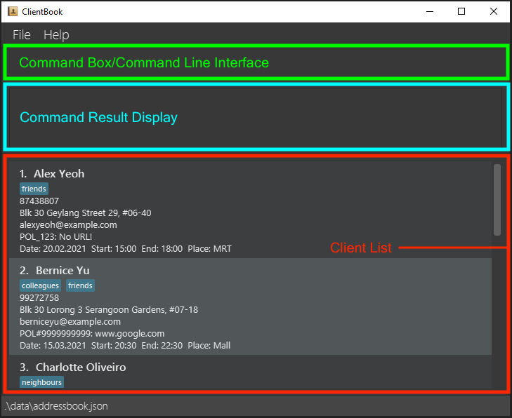
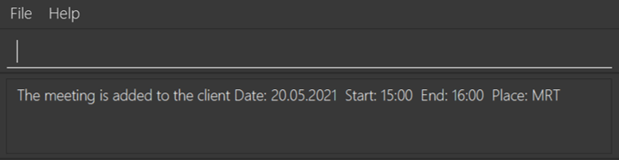
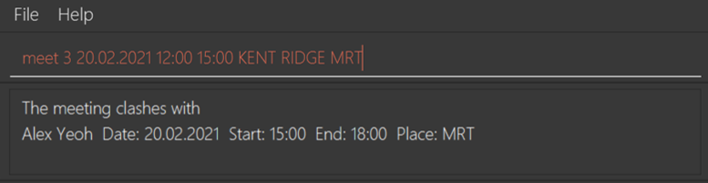
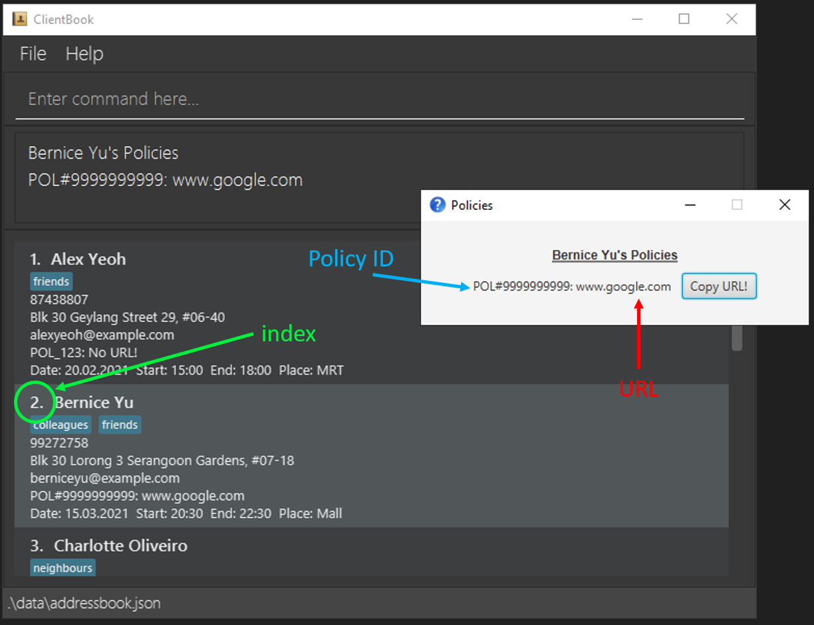

# ClientBook 

ClientBook is an application for insurance agents to manage client contacts, optimized for use with just a keyboard,
but still offering a graphical interface for ease of viewing of client contacts. The purpose of ClientBook is to help 
insurance agents who can type fast to accomplish their client management tasks faster than traditional applications.
If this is the first time that you are using an application like ClientBook, you do not have to worry. We have included
a section [here](#how-to-use-this-user-guide) to guide you through this user guide.

## Why ClientBook?

ClientBook is designed for insurance agents who are always on the go. We understand the pain and inconvenience of having to navigate around
your screen without a mouse while you are out meeting a client. We are also aware that you might have to remember various details about your many clients.
 

Thus, ClientBook is born! 

Requiring **minimal interactions with your cursor**, ClientBook still allows you to complete essential contact management
tasks with our minimal yet essential set of contact management features. 

## Purpose of This User Guide

The purpose of this user guide is to help you, the user get started with using ClientBook as well as to help you to get familiarised
with the features that it has to offer so that you can become comfortable with using it in your day-to-day operations as an insurance agent.

## How to Use This User Guide
If you are a new user, you can start with the [Quick Start](#quick-start) section to get ClientBook running. After that,
we have also provided an [Example Usage](#example-usage) section to help you get familiarised with ClientBook.
If you are an experienced user, we have provided a convenient [Summary of Commands](#summary-of-commands) at the end of this user guide.

## Table of Contents 

Please use the table of contents to navigate through the user guide quickly. ClientBook's commands are grouped into 
**contact management**, 
**contact viewing**,
**shortcuts** and 
**general** commands.

* [**1.** Quick Start](#quick-start)
* [**2.** Example Usage](#example-usage)
* [**3.** Overview](#overview)
    * [**3.1** Feature Summary](#feature-summary)
    * [**3.2** What information can we store for each client contact?](#what-information-can-we-store-for-each-client-contact)
* [**4.** Feature Description](#feature-description)
    * [**4.1** Contact Management](#contact-management-features)
        * [**4.1.1** `add`: Add client contact](#add-add-client-contact)
        * [**4.1.2** `edit`: Edit client contact](#edit-edit-client-contact)
        * [**4.1.3** `delete`Delete client contact](#delete-delete-client-contact)
        * [**4.1.4** `batch` Execute commands in batch](#batch-execute-commands-in-batch)
        * [**4.1.5** `meet`: Schedule a meeting with a client](#meet-schedule-a-meeting-with-a-client)
    * [**4.2** Contact Viewing](#contact-viewing-features)
        * [**4.2.1** `list`: List all clients](#list-list-all-clients)
        * [**4.2.2** `find`: Search for client contact based on keywords](#find-search-for-client-contact-based-on-keywords)
        * [**4.2.3** `policy`: Display policies associated with a client](#policy-display-policies-associated-with-a-client)
        * [**4.2.4** `sort`: Sort list of clients](#sort-sort-list-of-clients)
    * [**4.3** Shortcuts](#shortcuts) 
        * [**4.3.1** `addshortcut`: Add shortcut](#addshortcut-add-shortcut)
        * [**4.3.2** `editshortcut`: Edit shortcut](#editshortcut-edit-shortcut)
        * [**4.3.3** `deleteshortcut`: Delete shortcut](#deleteshortcut-delete-shortcut)
        * [**4.3.4** `listshortcut`: List all shortcuts](#listshortcut-list-all-shortcuts)
        * [**4.3.5** `clearshortcut`: Clear all shortcuts](#clearshortcut-delete-all-shortcuts)
    * [**4.4** General](#general-features)  
        * [**4.4.1** `lock`: Lock ClientBook with a user-selected password](#lock-lock-clientbook-with-a-user-selected-password)
        * [**4.4.2** `unlock`: Unlock ClientBook](#unlock-unlock-clientbook)
        * [**4.4.3** `help`: Viewing help](#help-viewing-help)
        * [**4.4.4** `exit`: Exiting the program](#exit-exiting-the-program)
        * [**4.4.5** Keyboard commands](#keyboard-commands)
        * [**4.4.5** Saving data](#saving-data)
        * [**4.4.6** Upcoming features!](#upcoming-features-v20-and-beyond)
* [**5.** Frequently Asked Questions](#frequently-asked-questions)
  * [**5.1** Setting Up](#setting-up)
* [**6.** Summary of Commands](#summary-of-commands)
* [**7.** Glossary](#glossary)
* [**8.** Contact Us](#contact-us)

## Quick Start

The quick start section provides a tutorial which will guide you through the steps needed to get ClientBook running.

 

<b>Step 1.</b>

Ensure you have Java `11` or above installed in your Computer.
   * To check if you have this installed or for instructions on how to install, refer to our FAQ [here](#frequently-asked-questions).

 

<b>Step 2.</b>

Download the latest `clientbook.jar` [here](https://github.com/AY2021S2-CS2103T-W15-2/tp/releases).
   
 

<b>Step 3.</b>

Copy the file to the folder (we will be referring to this folder as the **_home folder_**) where you want to store the ClientBook application and your client information.

 

<b>Step 4.</b>

Double-click the downloaded `clientbook.jar` file in your home folder to start the app. The screen below should appear in a few seconds. 
   * Alternatively, for those who are tech-savvy, you can launch the application via Command Prompt in Windows or Terminal in Mac OS/Linux using the following command: `java -jar clientbook.jar`. 
   * Note how the app contains some sample data.
    
        

        
Graphical User Interface of ClientBook.

    
 

<b>Step 5.</b>

Type the command in the command box and press Enter to execute it.
   * Some example commands you can try:

   | Command | Purpose |
   | ----------- | ----------- |
   | `help` | Opens the help window with a URL to this User Guide |
   | `list` | Lists all contacts |
   | `add n/John Doe p/98765432 e/johnd@example.com a/Orchard Street, Block 123, #01-01 i/Policy_1022` | Adds a client named `John Doe` and his information to the ClientBook |
   | `delete 3` | Deletes the 3rd contact in the list (i.e. deletes `Charlotte Oliveiro`) |
   | `exit` | Exits the application |

 

Please refer to the [Feature-Description](#feature-description) section below for the full list of commands and their descriptions.

[Return to Table of Contents](#table-of-contents)

--------------------------------------------------------------------------------------------------------------------
## Example Usage

Described below are some commands that you can try to get yourself familiarised with ClientBook.

If you have followed the [Quick Start](#quick-start) guide correctly, you should see the screen below. 
For each of the commands, type them into the command box and press enter to execute the command.

Graphical User Interface of ClientBook.

 

<b>Step 1.</b>
 

**Try adding a new Client contact using the command** `add n/James Lee p/91234567 e/james@gmail.com a/Blk 123 Serangoon Rd t/Friend t/Colleague i/OCBC#412>www.ocbc.com/policy/412`.

That is a very long command, but it can be broken down into simple parts. We have just added a client called James Lee with the following details:
* Phone number: 91234567
* Email address: james@gmail.com
* Address: Blk 123 Serangoon Rd

We have also indicated that James is a friend as well as colleague of ours by adding the tags `Friend` and `Colleague`. Lastly,
we indicated that James has purchased a policy from us with a policy ID of OCBC#412 and that the policy's document can be found at `www.ocbc.com/policy/412`.

Now, if you scroll down the contact list, you should find James at the bottom of the list.

 

<b>Step 2.</b>

**Try editing a Client contact using the command `edit 1 p/61234567`.**

This command edits the phone number of the first client displayed in the contact list to 61234567. In this case, Alex Yeoh's
phone number in ClientBook has been changed to 61234567.

 

<b>Step 3.</b>

**Delete a Client contact using the command `delete 3`.**

This command deletes the contact of the third client displayed in the contact list.

### Conclusion
Now that you have tried out the basic commands available in ClientBook, you can use the command `batch delete 1,2,3,4,5,6,7`
to delete all the sample entries and start using your very own ClientBook.

[Return to Table of Contents](#table-of-contents)

--------------------------------------------------------------------------------------------------------------------

## Overview

### Feature Summary 

| Feature | Description |
| ----------- | ----------- |
|**Contact Management**|
| [`add`](#add-add-client-contact) | Add client contact |
| [`edit`](#edit-edit-client-contact) | Edit client contact |
| [`delete`](#delete-delete-client-contact) | Delete client |
| [`batch`](#batch-execute-commands-in-batch) | Execute commands in batch |
| [`meet`](#meet-schedule-a-meeting-with-a-client) | Schedule a meeting with a client |
|**Contact Viewing**|
| [`list`](#list-list-all-clients) | List all clients |
| [`find`](#find-search-for-client-contact-based-on-keywords) | Search for client contact based on keywords |
| [`policy`](#policy-display-policies-associated-with-a-client) | Display policies associated with a selected client |
| [`sort`](#sort-sort-list-of-clients) | Sort list of clients |
|**Shortcuts**|
| [`addshortcut`](#addshortcut-add-shortcut) | Add shortcut |
| [`editshortcut`](#editshortcut-edit-shortcut) | Edit shortcut |
| [`deleteshortcut`](#deleteshortcut-delete-shortcut) | Delete shortcut |
| [`listshortcut`](#listshortcut-list-all-shortcuts) | List all shortcuts |
| [`clearshortcut`](#clearshortcut-delete-all-shortcuts) | Clear all shortcuts |
|**General**|
| [`lock`](#lock-lock-clientbook-with-a-user-selected-password) | Lock ClientBook with a user-selected password |
| [`unlock`](#unlock-unlock-clientbook) | Unlock ClientBook |
| [`help`](#help-viewing-help) | Viewing help |
| [`exit`](#exit-exiting-the-program) | Exit ClientBook |
| [Keyboard commands](#keyboard-commands) | Keyboard commands to enter command keywords quickly |
| [Saving data](#saving-data) | Save the data to a file in the home folder |

[Return to Table of Contents](#table-of-contents)

### What information can we store for each client contact?

Each client attribute such as name and address have been assigned identifiers so that you do not have to type out
the entire attribute when using ClientBook. For example, name has been abbreviated to `n`. Listed below are all the identifiers
which correspond to client attributes as well as restrictions that have to be followed when they are used as part of a command.

Please note that duplicate clients (having the same information for all attributes) is not allowed. Adding a client that already
exists and editing a client to have the same information as an existing client is invalid.

<table>
  <tr>
    <td> <b>Attribute</b> </td>
    <td> <b>Identifier(s)</b> </td>
    <td> <b>Notes/Restrictions</b> </td>
  </tr>
  <tr>
    <td> Name </td>
    <td> <code>n</code> </td>
    <td> 
        <ul><li>Must only contain <a href="#glossary">alphanumeric</a> characters and spaces</li></ul>
    </td>
  </tr>
  <tr>
    <td> Phone number </td>
    <td> <code>p</code> </td>
    <td> 
        <ul><li>Should only contain numbers</li></ul>
        <ul><li>Must contain at least 3 digits</li></ul>
    </td>
  </tr>
  <tr>
    <td> Address </td>
    <td> <code>a</code> </td>
    <td> NA </td>
  </tr>
  <tr>
    <td> Email </td>
    <td> <code>e</code> </td>
    <td><ul><li>Should be of the form <code>name@email.com</code></li></ul>
        <ul><li><code>name</code> part of email should:
            <ul><li>Consists only of alphanumeric characters and these special characters <code>!#$%&'*+/=?`{|}~^.-</code></li></ul>
        </li></ul>
        <ul><li> <code>email</code> part of email should: 
            <ul><li>Be at least 2 characters long</li></ul>
            <ul><li>Start and end with either alphabets or numbers</li></ul>
            <ul><li>Consist only of alphabets and/or numbers, hyphens, or periods between characters</li></ul>
        </li></ul>
    </td>
  </tr>
  <tr>
    <td> Tag </td>
    <td> <code>t</code> </td>
    <td><ul><li>Optional</li></ul>
        <ul><li>Tags can be used to label your relationship with your client e.g. friend, family, classmate</li></ul>
        <ul><li>Should contain only alphanumeric characters</li></ul>
        <ul><li>Tags associated with a client are shown in alphabetical order in ClientBook</li></ul>
        <ul><li>If duplicate tags are entered in a command, only 1 will be added to the client</li></ul>
    </td>
  </tr>
  <tr>
    <td> Insurance Policies </td>
    <td> <code>i</code> </td>
    <td><ul><li>Optional</li></ul>
        <ul><li>Should be of the form <code>POLICY_ID>POLICY_URL</code> or <code>POLICY_ID</code></li></ul>
        <ul><li>Anything after the <code>></code> character will be considered as the <code>POLICY_URL</code>
            <ul><li>Due to the huge range of possibilities for the <code>POLICY_URL</code>, it is <b>possible that invalid URLs will also be accepted</b></li></ul>
            <ul><li><b>Do check the <code>POLICY_URL</code> before entering the input!</b></li></ul>
        </li></ul>
        <ul><li>A client should not have duplicate insurance policies</li></ul>
        <ul><li>If duplicate insurance policies are entered in a command, only 1 will be added to the client</li></ul>
    </td>
  </tr>
  <tr>
    <td> Meeting </td>
    <td> <code>m</code> </td>
    <td><ul><li>Optional</li></ul> 
        <ul><li>Can only be modified by using the <code>meet</code> command</li></ul> 
        <ul><li>Should be of the form <code>DATE START_TIME END_TIME PLACE</code></li></ul>
        <ul><li><code>DATE</code> part should be in <code>dd.MM.yyyy</code> format, for example <code>20.05.2021</code></li></ul>
        <ul><li><code>START_TIME</code> and <code>END_TIME</code> parts should be in <code>HH:mm</code> format, for example <code>15:30</code></li></ul>
        <ul><li><code>END_TIME</code> of a meeting should be after <code>START_TIME</code> of the same meeting on the same <code>DATE</code></li></ul>
        <ul><li><code>START_TIME</code> of a meeting cannot be the same as <code>END_TIME</code> of another meeting on the same <code>DATE</code></li></ul>
        <ul><li><code>PLACE</code> should not be empty and can have space between characters</li></ul>
    </td>
  </tr>
</table>

[Return to Table of Contents](#table-of-contents)

--------------------------------------------------------------------------------------------------------------------

**:information_source: Notes about the command format:** 

* **Words in UPPER_CASE are the parameters to be supplied by the user**. 
  * e.g. in `add n/NAME`, NAME is a parameter which can be used as `add n/John Doe`.

* **Items in square brackets are optional**. 
  * e.g. `n/NAME [t/TAG]` can be used as `n/John Doe t/friend` or as `n/John Doe`.

* **Items with …​ after them can be used multiple times**. 
  * e.g. `[t/TAG]…​` can be used 0 or more times, `t/basic`, `t/basic t/lifeinsurance` etc.

* **Parameters can be in any order**. 
  * e.g. if the command specifies `n/NAME p/PHONE_NUMBER`, `p/PHONE_NUMBER n/NAME` is also acceptable.

* **Order of flags matter**.
  * e.g. `sort -n -asc` will work, but `sort -asc -n` does not work.

* **Extraneous parameters for commands that do not take in parameters** (such as `help`, `exit` and `listshortcut`) **will be ignored**. 
  * e.g. if the command specifies `help 123`, it will be interpreted as `help`.
  

* **Attributes in the form `-identifier` will be referred to as flags, while attributes in the form `identifier/` will be referred to as prefixes.**
  * e.g. for the `name` attribute, its flag would be `-n`, while its prefix would be `n/`.

--------------------------------------------------------------------------------------------------------------------

## Feature Description

### Contact Management Features
Contact management features are here to help you to manage your many client contacts.
It contains basic features such as adding and removing of client contacts.

### <code>add</code>: Add client contact

**Purpose**: Adds a client as a new contact to ClientBook.

**Format**: `add n/NAME p/PHONE_NUMBER e/EMAIL a/ADDRESS [i/POLICY_ID[>POLICY_URL]]… [t/TAG]…​`

:bulb: 
**Tip**:
A client can have any number of tags and insurance policies (including 0).

* It is optional to include the `POLICY_URL` for the specified `POLICY_ID`.
* To include the URL, remember to use `>` to indicate that a particular insurance policy is linked to a URL, as shown in the second example below.
* Meetings of a client cannot be added with this command.
* If a field (e.g. `n/NAME`) is expected only once in the command, but you specified it multiple times, only the last occurrence of the field will be taken.
    * E.g. if you specify `add n/Alex n/Bob...`, only `n/Bob` will be taken.

**Examples**:
* Example of a client with insurance policy but no URL associated with insurance policy
    * `add n/John Doe p/98765432 e/johnd@email.com a/Orchard i/Pol_#123456 t/basic`
        
* Example of a client with insurance policy and URL associated with insurance policy
    * `add n/Tom Tan p/91234567 e/tomt@email.com a/Orchard i/Policy_1274>www.myinsurancecompany.com/policy_1274 t/basic`
        
* Example with no insurance policy and no tag
    * `add n/Betsy Crowe e/betsycrowe@email.com a/Kent Ridge p/61234567`

[Return to Table of Contents](#table-of-contents)
  

### <code>edit</code>: Edit client contact

**Purpose**: Edits an existing client contact in the ClientBook. The new information passed to this command will replace 
the existing client information.

**Format**: `edit INDEX [n/NAME] [p/PHONE] [e/EMAIL] [a/ADDRESS] [i/POLICY_ID[>POLICY_URL] [-MODE]]…​ [t/TAG]…​`

* Edits the client at the specified `INDEX`.
    * `INDEX` refers to the index number shown in the displayed client list.
    * `INDEX` must be 1 or higher, and less than or equal to the index of the last item in the displayed list.
* At least one of the optional fields must be provided.
* Meetings of a client cannot be modified with this command.
* If a field (e.g. `n/NAME`) is expected only once in the command, but you specified it multiple times, only the last occurrence of the field will be taken.
    * If you specify `edit n/Alex n/Bob...`, only `n/Bob` will be taken.
* For fields that are allowed to be empty, specifying the identifier and leaving it empty will clear the existing information.
    * `edit 1 i/` will clear the existing policies.
* While editing the insurance policies of a client, user can choose to modify, remove or insert policy ids to 
a client, by typing `-MODE` to specify an editing mode after a policy number. 
    * `-MODE` can be -insert, -modify or -remove.
    * If user chooses to modify an existing policy, the user can specify the old and new policies, separated by `;`. An example is shown below.
    * For each edit command, only 1 editing mode can be specified.
    * If no mode is specified, the edit command will replace all existing policies with the policies specified in the command.

:exclamation: **Caution**: Existing values will be **replaced** with the input values.

**Examples**:
*  Edit the phone number and email address of the 1st client to be `91234567` and `johndoe@example.com` respectively.
    * `edit 1 p/91234567 e/johndoe@example.com`
    
      
        
*  Edit the name of the 2nd client to be `Betsy Crower`.
    * `edit 2 n/Betsy Crower`
       
*  Modify the policy id of the 1st client from `Pol#12345` to `Pol#54321`.
    * `edit 1 i/Pol#12345;Pol#54321 -modify`

[Return to Table of Contents](#table-of-contents)
  

### <code>delete</code>: Delete client contact

**Purpose**: Deletes a specified client's contact from ClientBook.

**Format**: `delete INDEX`

* Deletes the client at the specified `INDEX`.
* `INDEX` refers to the index number shown in the displayed client list.
* `INDEX` must be 1 or higher, and less than or equal to the index of the last item in the displayed list.

**Examples**:
* `delete 2` deletes the 2nd client in the currently displayed list.
    
* To easily delete a specific client "Charlotte Chan", `delete` can be used in conjunction with `find`.
    * First, use `find n/Charlotte Chan`. Assuming there is only one Charlotte Chan in the client book, she will be the 
    client at index 1 after we run the command.
    * After we get the filtered list, use `delete 1` to delete the client at index 1, which is 
    Charlotte Chan after the above command.

[Return to Table of Contents](#table-of-contents)
  

### <code>batch</code>: Execute commands in batch

**Purpose**: Executes the same `edit` or `delete` commands for multiple client contacts so that you do not have to
enter the same command multiple times.

**Format**: `batch COMMAND INDICES [ARGUMENTS]`

* Only `edit` and `delete` commands can be executed in batch.
    * For more information on how these commands work and their parameters, refer to the
      [`edit`](#edit-edit-client-contact) and [`delete`](#delete-delete-client-contact) sections accordingly.
* `INDICES` are comma-separated e.g. `1,2,3` or `1, 2, 3` and they refer to the index number shown in the displayed client list.
* Each index in `INDICES` must be 1 or higher, and less than or equal to the index of the last item in the displayed list.
* There must be no repeat index in `INDICES`.
* The optional `ARGUMENTS` input is only applicable if the `COMMAND` is `edit`.
* For `edit`, you can only batch edit the following attributes:
    * phone number
    * address
    * tags
    * insurance policies

:bulb: 
**Tip**:
The same rules apply when editing clients' phone number and address!  
If a parameter is expected only once in the command, but you specified it multiple times, **only the last occurrence** of the parameter will be taken. 

**Examples**:
* Updating the particulars of clients belonging to the same family and owning the same insurance policy.
    * `batch edit 1, 2, 4 p/61234567 a/Hougang Green t/TanFamily i/FamPol#111`
        
* To batch delete more than 1 client contact.
    * `batch delete 1, 2, 4`

[Return to Table of Contents](#table-of-contents)
  

### <code>meet</code>: Schedule a meeting with a client

**Purpose**: Schedules a meeting on a particular date, start time, end time and place with a client in ClientBook.

**Format**: `meet INDEX [-ACTION] DATE START_TIME END_TIME PLACE`

* Schedules a meeting with the client at the specified `INDEX`.
* `INDEX` refers to the index number shown in the displayed client list.
* `INDEX` must be 1 or higher, and less than or equal to the index of the last item in the displayed list.
* `ACTION` can be `add` to add a meeting, `delete` to delete a meeting, `clear` to clear all meetings of a client.
    * If `-ACTION` is empty, the default action for the command is to add a meeting.
* Past meetings are allowed to be added to clients for archival purposes.
* There will be a check for clashes between meetings when adding a new meeting.

**Examples**:
* Add a meeting for a specific client and there are no clashes.
    * `meet 5 -add 20.05.2021 15:00 16:00 MRT`
      
      
  
* Add a meeting for a specific client but there are clashes.
    * `meet 3 20.02.2021 12:00 15:00 KENT RIDGE MRT`
      
      
  
* Delete a meeting of a specific client.
    * `meet 4 -delete 23.08.2021 09:00 12:00 CLEMENTI MRT`
  
* Clear all meetings of a specific client.
    * `meet 1 -clear`

[Return to Table of Contents](#table-of-contents)
  

### Contact Viewing Features
Contact viewing features allow you to view your client contacts in different ways. For example,
you may reorder your contact list or look for specific clients.

### <code>list</code>: List all clients

**Purpose**: Shows a list of all clients in ClientBook. You may use optional identifiers in conjunction with the `-`
symbol to select which client details you want to see, so that you can have a clutter-free view of your client contacts.

**Format**: `list [-p] [-e] [-a] [-i] [-m]`

* A client's name and tags will be shown regardless of the identifiers that you specify.

**Examples**: 
*  `list` without any specified identifiers shows a list of all clients and all their information.
    * `list`
  
      
  
*  One or more identifiers can be used to make `list` only show the specified information. The following command 
   shows a list of all clients and their phone number and insurance policy information.
    * `list -p -i`
    
      

[Return to Table of Contents](#table-of-contents)
  

  
### <code>find</code>: Search for client contact based on keywords

**Purpose**: Finds client contacts based on the attribute and keywords that you specify.
You may use optional identifiers in conjunction with the `-` symbol to limit the details shown, similar to the [`list`](#list-list-all-clients) command.

**Format**: `find IDENTIFIER/KEYWORD [& KEYWORDS]…​ [-p] [-e] [-a] [-i] [-m]`

* The `IDENTIFIER` specifies which attribute of the client you want to search for. For example, if you want to search for a client contact
  by name, use the `n` identifier.
    * For more information about the identifiers for each field, refer to [What information can we store for each client contact?](#what-information-can-we-store-for-each-client-contact).
* You may not use multiple attributes as your search criteria.
    *`find n/David a/Botanic gardens` is invalid.
* The search is **case-insensitive**. 
  * `find n/hans` is equivalent to `find n/Hans`.
* The symbol `&` between keywords allows you to search for Clients using multiple keywords.
* The **order of the keywords does not matter**.
  * `find n/alex & david` is equivalent to `find n/david & alex`
    
**Examples**:
* Find `Alex David` and `Alex Yeoh`.
  * `find n/alex`
      
* Find `Alex David`.
  * `find n/alex david`
  
    
      
* Find `Alex David`, `Alex Yeoh` and `David Li`.
  * `find n/alex & david`
      
* Find all clients whose address contains `geylang`.
  * `find a/geylang` - returns `Alex Yeoh` whose address is `Blk 30 Geylang Street 29, #06-40`
      
* Find the email and phone number of all clients whose names contain `alex` and `david` using the `&` symbol, and only display their email and phone number.
  * `find n/alex & david -e -p`
    
    

[Return to Table of Contents](#table-of-contents)
  

### <code>policy</code>: Display policies associated with a client

**Purpose**: Launches a popup window to show all the policies associated with the selected contact, if the selected contact has any policies.

**Format**: `policy INDEX`

* Displays policies owned by the client at the specified `INDEX`.
* `INDEX` refers to the index number shown in the displayed client list.
* `INDEX` must be 1 or higher, and less than or equal to the index of the last item in the displayed list.

**Examples**:
* Displays the policies associated with the 2nd client in the currently displayed list.
    * `policy 2`  
    
      
    

* To easily view policies of a specific client, named "Bernice Tan" `policy` can be used in conjunction with `find`.
    * First, use `find n/Bernice Tan`. Assuming there is only 1 Bernice Tan in the client book, she will be the 
    client at index 1 after we run the command.
    * After we get the filtered list, use `policy 1` to display the policies associated with the client at index 1, which is 
    Bernice Tan after the above command.

[Return to Table of Contents](#table-of-contents)
  

### <code>sort</code>: Sort list of clients

**Purpose**: Sorts the current list of clients in ClientBook so that you can view your clients in a particular order.

**Format**: `sort -IDENTIFIER -DIRECTION`

* Sorts the list of clients according to the specified `IDENTIFIER` and `DIRECTION`.
* The specified `IDENTIFIER` can be `n` to sort your clients by name alphabetically or `i` to sort by number of insurance policies, but not both.
* The specified `DIRECTION` can be `asc` for ascending order or `des` for descending order, but not both.

**Examples**:
* If you want to see which of your clients have the least policies with you, sort the current list of clients 
  by **ascending** number of insurance policies owned.
    * `sort -i -asc`
        
* You can also sort the current list of clients by name in **descending** alphabetical order.
    * `sort -n -des`

      

[Return to Table of Contents](#table-of-contents)
  

### Shortcuts
We understand that you might have commands that you frequently use. You may use shortcuts to abbreviate
those commands to make using ClientBook more convenient. As this feature is not commonly found in other contact management applications,
we have included the following Example Usage section to guide you through on how to use this feature. 

### Example Usage

<b>Scenario:</b>
 

You are an insurance agent and you have many client contacts stored inside of ClientBook. Your work mainly requires 
you to manage your clients' policies and you would like a way to view all your clients' policies while hiding other 
additional information (e.g. address, email, phone). You know that you can do so with the `list -i` command. However, 
you would like a faster way to do it because you have to use it frequently, so you decided to create a 
shortcut named `li` to perform the same action as `list -i`.

 

<b>Step 1.</b>
 

**Adding the shortcut using the command** `addshortcut sn/li sc/list -i`.

This command creates a shortcut which performs `list -i` everytime you type `li` in the command box, and it is saved to 
your shortcut library.

 

<b>Step 2.</b>
 

**Using the shortcut using the command** `li`.

As you have saved this shortcut in the shortcut library, you may now use `li` to perform the command `list -i` anytime 
and as many times as you want, which will save you from the hassle of having to type `list -i` everytime.

[Return to Table of Contents](#table-of-contents)
  

### <code>addshortcut</code>: Add shortcut

**Purpose**: Adds a command shortcut to the shortcut library.

**Format**: `addshortcut sn/SHORTCUT_NAME sc/SHORTCUT_COMMAND`

* Adds a shortcut named `SHORTCUT_NAME` to the shortcut library and assigns a valid ClientBook command `SHORTCUT_COMMAND` to it.
* The specified `SHORTCUT_NAME` must be [alphanumeric](#glossary) without any spacing and must not already exist the shortcut library.
* The specified `SHORTCUT_COMMAND` must be a valid ClientBook command (e.g. `find n/alex`).

**Examples**:
* Add a shortcut named `li` to represent the command `list -i` (filter all client information to show policy details 
  only) in the shortcut library.
    * `addshortcut sn/li sc/list -i`

[Return to Table of Contents](#table-of-contents)
  

### <code>editshortcut</code>: Edit shortcut

**Purpose**: Edits the command of a shortcut in the shortcut library.

**Format**: `editshortcut sn/SHORTCUT_NAME sc/SHORTCUT_COMMAND`

* Finds a shortcut named `SHORTCUT_NAME` in the shortcut library and replaces its existing command with the provided valid ClientBook command `SHORTCUT_COMMAND`.
* The specified `SHORTCUT_NAME` must be [alphanumeric](#glossary) without any spacing and must exist the shortcut library.
* The specified `SHORTCUT_COMMAND` must be a valid ClientBook command (e.g. `find n/alex`).

**Examples**:
* Edit a shortcut named `ls` in the shortcut library such that it takes on a new command `list`.
    * `editshortcut sn/ls sc/list`

[Return to Table of Contents](#table-of-contents)
  

### <code>deleteshortcut</code>: Delete shortcut

**Purpose**: Deletes a shortcut from the shortcut library.

**Format**: `deleteshortcut SHORTCUT_NAME`

* Finds a shortcut named `SHORTCUT_NAME` in the shortcut library and deletes it from the shortcut library.
* The specified `SHORTCUT_NAME` must be [alphanumeric](#glossary) without any spacing and must exist in the shortcut library.

**Examples**:
* Delete a shortcut named `ls` in the shortcut library.
    * `deleteshortcut ls`

[Return to Table of Contents](#table-of-contents)
  

### <code>listshortcut</code>: List all shortcuts

**Purpose**: Lists all shortcuts in the shortcut library in case you want to view the shortcuts that you have previously
created.

**Format**: `listshortcut`

[Return to Table of Contents](#table-of-contents)
  

### <code>clearshortcut</code>: Delete all shortcuts

**Purpose**: Deletes all shortcuts in the shortcut library.

**Format**: `clearshortcut`

[Return to Table of Contents](#table-of-contents)
  

### General Features

### <code>lock</code>: Lock ClientBook with a user-selected password

**Purpose**: Locks ClientBook and ClientBook's data so that your clients' information is protected against unauthorised access.

**Format**: `lock [CURRENT_PASSWORD] [NEW_PASSWORD]`

* If ClientBook is not yet locked:
    * `CURRENT_PASSWORD` field can be omitted.
    * `NEW_PASSWORD` can also be omitted and ClientBook will attempt to lock itself using your most recently used password.

* If ClientBook is already locked:
    * ClientBook verifies the current password before locking ClientBook with `NEW_PASSWORD`.

:exclamation: **Note**: 
* After setting a password, ClientBook can only be launched through Command Prompt or Terminal.
    * Refer to [Quick Start](#quick-start) on how to launch the application through Command Prompt or Terminal.
* ClientBook's data will be unlocked when ClientBook is running and will only be encrypted when ClientBook closes (except when it closes suddenly, such as when it is terminated by task manager in Windows).

**Examples**:
* Lock ClientBook with password `123`.
  * `lock 123`

    
      
* Change ClientBook's password from `123` to `456`.
  * `lock 123 456`

        

[Return to Table of Contents](#table-of-contents)
  

### <code>unlock</code>: Unlock ClientBook

**Purpose**: Removes ClientBook's password lock.

**Format**: `unlock CURRENT_PASSWORD`

* Verifies the current password before unlocking ClientBook.
* ClientBook's password is removed after executing this command. After executing this command, future launches of ClientBook will not require a password.
* ClientBook's data will no longer be password protected.

**Examples**:
* Unlock ClientBook with wrong password `123`.
    * `unlock 123`

      
        
* Unlock ClientBook with correct password `456`.
    * `unlock 456`

      

[Return to Table of Contents](#table-of-contents)
  

### <code>help</code>: Viewing help

**Purpose**: Shows a message explaining how to access this help page.

**Format**: `help`

[Return to Table of Contents](#table-of-contents)
  

### <code>exit</code>: Exiting the program

**Purpose**: Exits the program.

**Format**: `exit`

[Return to Table of Contents](#table-of-contents)
  

### Keyboard commands

**Purpose**: We note that continuously typing the same command keywords can become tiresome. Hence, we have provided 
keyboard commands which when pressed, will fill in the command keyword for you.

| Command | Output |
| --------|------------------ |
CTRL + A | `add` |
CTRL + D | `delete` |
CTRL + E | `edit` |
CTRL + F | `find` |
CTRL + L | `list` |
CTRL + S | `sort` |

[Return to Table of Contents](#table-of-contents)

### Saving data
ClientBook saves its data file `clientbook.json` in a zip file `clientbook.zip` inside the `data` folder in the [home folder](#quick-start).
Data is saved automatically after any command that changes the data. There is no need to save manually.

* If ClientBook is locked with a password, the zip folder can be unzipped with that same password.

:exclamation: **Caution**:
Please do not make changes to the data file. If the format is invalid, **all your data will be lost** at the next run.

[Return to Table of Contents](#table-of-contents)
  

### Upcoming features (v2.0 and beyond!)

* Archiving data files
* Customisable user interface
* Login interface
* And more!

[Return to Table of Contents](#table-of-contents)

--------------------------------------------------------------------------------------------------------------------
## Frequently Asked Questions

### Setting Up
**Q**: How do I check that Java is installed on my laptop? 
**A**: Launch Command Prompt (for Windows) or Terminal (for Mac OS/Linux) and enter the following command: `java -version`.
If you get an error message (`Java command not found`), it means that Java is not installed on your laptop. 

**Q**: How do I install Java? 
**A**: Head over to the official Java website [here](https://www.oracle.com/sg/java/technologies/javase-jdk11-downloads.html), and download the appropriate file for your system!

**Q**: How do I transfer my data to another laptop? 
**A**: Copy the entire home folder (with all the files inside) over to the other laptop! It's as simple as that!

[Return to Table of Contents](#table-of-contents)

--------------------------------------------------------------------------------------------------------------------

## Summary of Commands

| Action | Format | Example |
| --------|------------------ | --- |
|**Contact Management**|
[**Add**](#add-add-client-contact) | `add n/NAME p/PHONE_NUMBER e/EMAIL a/ADDRESS [i/POLICY_ID[>POLICY_URL]]… [t/TAG]…​` | `add n/James Ho p/22224444 e/jamesho@example.com a/123, Clementi Rd, 1234665 i/Aviva#123>www.aviva.com/123 i/Ocbc#456>www.ocbc.com/456 t/premium t/lifeinsurance` |
[**Edit**](#edit-edit-client-contact) | `edit INDEX [n/NAME] [p/PHONE_NUMBER] [e/EMAIL] [a/ADDRESS] [i/POLICY_ID[>POLICY_URL]]…​ [t/TAG]…​` | `edit 2 n/James Lee e/jameslee@example.com` |
[**Delete**](#delete-delete-client-contact) | `delete INDEX` | `delete 3` |
[**Batch**](#batch-execute-commands-in-batch) | `batch COMMAND INDICES [ARGUMENTS]` | `batch edit 1, 2, 4 p/91234567 a/Hougang Green t/TanFamily i/FamPol#111` |
[**Meet**](#meet-schedule-a-meeting-with-a-client) | `meet INDEX [-ACTION] DATE START_TIME END_TIME PLACE` | `meet 1 -add 20.05.2021 15:00 16:00 KENT RIDGE MRT` |
|**Contact Viewing**|
[**List**](#list-list-all-clients) | `list [-p] [-e] [-a] [-i] [-m]` | `list -i` |
[**Find**](#find-search-for-client-contact-based-on-keywords) | `find IDENTIFIER/KEYWORD [& KEYWORDS]…​ [-IDENTIFIER]…​` | `find a/Bedok & Clementi -p` |
[**Policy**](#policy-display-policies-associated-with-a-client) | `policy INDEX` | `policy 4` |
[**Sort**](#sort-sort-list-of-clients) | `sort -IDENTIFIER -DIRECTION` | `sort -n -des` |
|**Shortcuts**|
[**Add Shortcut**](#addshortcut-add-shortcut) | `addshortcut sn/SHORTCUT_NAME sc/SHORTCUT_COMMAND` | `addshortcut sn/ls sc/listshortcut` |
[**Edit Shortcut**](#editshortcut-edit-shortcut) | `editshortcut sn/SHORTCUT_NAME sc/SHORTCUT_COMMAND` | `editshortcut sn/ls sc/list` |
[**Delete Shortcut**](#deleteshortcut-delete-shortcut) | `deleteshortcut SHORTCUT_NAME` | `deleteshortcut ls` |
[**List Shortcuts**](#listshortcut-list-all-shortcuts) | `listshortcut` | `listshortcut` |
[**Clear Shortcuts**](#clearshortcut-delete-all-shortcuts) | `clearshortcut` | `clearshortcut` |
|**General**|
[**Lock**](#lock-lock-clientbook-with-a-user-selected-password) | `lock [CURRENT_PASSWORD] NEW_PASSWORD` | `lock 123 456` |
[**Unlock**](#unlock-unlock-clientbook) | `unlock [CURRENT_PASSWORD]` | `unlock 456` |
[**Help**](#help-viewing-help) | `help` | `help` |
[**Exit**](#exit-exiting-the-program) | `exit` | `exit` |

[Return to Table of Contents](#table-of-contents)

--------------------------------------------------------------------------------------------------------------------
## Summary of Keyboard Commands

| Command | Output |
| --------|------------------ |
CTRL + A | `add` |
CTRL + D | `delete` |
CTRL + E | `edit` |
CTRL + F | `find` |
CTRL + L | `list` |
CTRL + S | `sort` |

[Return to Table of Contents](#table-of-contents)

--------------------------------------------------------------------------------------------------------------------
## Glossary

1. **Alphanumeric** A character or group of characters is considered alphanumeric if it contains only numbers and alphabets.

2. **Attribute** The types of information you can store in ClientBook. E.g. phone number, address, name of your clients.
   

3. **CLI** (command line interface) A text box like interface which allows a user to enter and execute commands.

4. **Command Prompt** A command line interpreter application on the Windows operating system.

5. **GUI** (graphical user interface) A form of user interface with graphical features such as icons that allows a user to interact with our program.

6. **Identifier** The alphabetical letter associated with an attribute.

7. **Java** A programming language and computing platform that is used to run ClientBook.

8. **JSON** (JavaScript Object Notation) A format for storing and transporting data.

9. **Terminal** A command line interpreter application on MacOS/Linux operating systems.

10. **UI** (user interface) An interface for a user to interact with a program.

[Return to Table of Contents](#table-of-contents)

--------------------------------------------------------------------------------------------------------------------

## Contact Us

Didn't find what you were looking for? Contact us at [clientbook@email.com](clientbook@email.com).

ClientBook is still a work in progress. We hope to be able to further improve ClientBook to suit your needs. 
Should you have any suggestions, feel free to drop us an email! 
We would love to hear from you insurance agents who are actively out and about, providing us with the best services.

[Return to Table of Contents](#table-of-contents)
