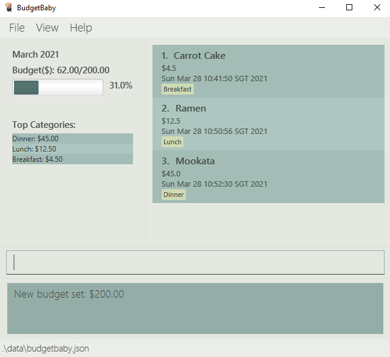

# BudgetBaby User Guide :baby: :money_with_wings:

**BudgetBaby** is a **budget and expenses tracking desktop app for University students and/or those who are looking to
better manage their finances**. It is **optimized for use via a Command Line Interface** (CLI) so that entering and
editing financial records and budgets can be done faster by typing in commands while still having the benefits of a
Graphical User Interface (GUI). This document aims to guide users in using BudgetBaby, providing a complete summary of
the functions and intended usage of the application.

- [Quick Start](#quick-start)
- [UI Overview](#ui-overview)
- [Features](#features)
  - [Viewing help : `help`](#viewing-help--help)
  - [Adding a financial record : `add-fr`](#adding-a-financial-record--add-fr)
  - [Deleting a financial record : `delete-fr`](#deleting-a-financial-record--delete-fr)
  - [Editing a financial record : `edit-fr`](#editing-a-financial-record--edit-fr)
  - [Setting monthly budget : `set-bg`](#setting-monthly-budget--set-bg)
  - [Viewing a specific month : `view-month`](#viewing-a-specific-month--view-month)
  - [Finding financial records : `find-fr`](#finding-financial-records--find-fr)
  - [Resetting filters on financial records : `reset-filter`](#resetting-filters-on-financial-records--reset-filter)
  - [Exiting the program : `exit`](#exiting-the-program--exit)
  - [Viewing top 5 categories spent for the current month](#viewing-top-5-categories-spent-for-the-current-month)
  - [Viewing budget for the current month](#viewing-budget-for-the-current-month)
  - [Checking remaining budget for the current month](#checking-remaining-budget-for-the-current-month)
  - [Saving the data](#saving-the-data)
  - [Editing the data file](#editing-the-data-file)
  - [Archiving data files](#archiving-data-files)
- [FAQ](#faq)
- [Command Summary](#command-summary)
- [Credits](#credits)

## Quick start

1. Ensure that you have Java `11` or above installed on your Computer.

2. You can download the latest `budgetbaby.jar` [here](https://github.com/AY2021S2-CS2103T-W14-2/tp/releases).

3. Copy the file to the folder you want to use as the _home folder_ for the BudgetBaby application.

4. Double-click the file to start the app. You should see a GUI similar to the one below appear in a few seconds. Note
   that the app contains some sample data for you when it starts that may differ from what is shown below. 

   

## UI Overview

The main GUI window consists of UI components that work together to help you to perform tasks.
These components include:
1. [Menu Bar](#menu-bar)
2. [Budget Display](#budget-display)
3. [Financial Record List](#financial-record-list)
4. [Command Box](#command-box)
5. [Result Display](#result-display)
6. [Status Bar](#status-bar)

### Menu Bar

The `Menu Bar` contains drop-down menus which provides access to common useful functions.
These functions include:
- [Exit](#exiting-the-program-:-`exit`) - Exits the program
- `Toggling CLI's visibility` - Shows/Hides the [Command Box](#command-box) and [Result Display](#result-display)
- [Category Statistics](#viewing-top-5-categories-spent-for-the-current-month) - Opens the Category statistics window
- [Month Statistics](#viewing-budget-for-the-current-month) - Opens the Month statistics window
- [Help](#viewing-help-:-`help`) - Opens the Help window

### Budget Display

The `Budget Display` interactively display the details of a given month.
You get to see the given month's budget in the form of a text and a progress bar. On top of that, there is a 'Top Categories' section where the top six categories of the given month based on their total amount is being shown in <strong>descending order</strong>.

### Financial Record List

The `Financial Record List` interactively display all the financial records of a given month.
Each record in the list contain details like description, amount, timestamp as well as tagged categories.

### Command Box

The `Command Box` is where you can supply your command inputs. The application will processs these inputs and make changes to your data when necessary. The available command inputs (format and examples) can be found in the [Features](#features) section.

**:bulb: Tips:** 

- You may press the `UP` and `DOWN` arrow keys to access past command inputs.

### Result Display

The `Result Display` interactively display results of a given command so you can identify its details and check whether the given command was executed successfully.

### Status Bar

The `Status Bar` displays the location of the data file being used by the application.
To find out more about how the data file is being managed, please refer to [Saving the data](#saving-the-data) and [Editing the data file](#editing-the-data-file)

## Features

**:information_source: Notes about the command format:** 

- Words in `UPPER_CASE` are arguments which must be supplied by you when you type in a command. 
  For example, in the command `add-fr d/FR_DESCRIPTION a/FR_AMOUNT`, `FR_DESCRIPTION` and `FR_AMOUNT` are arguments
  which must be supplied by you. An example of supplied arguments look like this `add-fr d/Lunch a/10`.

- You may choose to omit items in square brackets as they are optional. 
  For example, with the command `add-fr d/FR_DESCRIPTION a/FR_AMOUNT [t/DATE] [c/CATEGORY]…`, you may omit the category and
  use `add-fr d/Lunch a/10 t/01-01-2021 c/food` or `add-fr d/Lunch a/10`.

- For items suffixed with `…`​ you may repeat it multiple times within the command. 
  For example, with the command `add-fr d/FR_DESCRIPTION a/FR_AMOUNT [t/DATE] [c/CATEGORY]…`, you may repeat `[c/FR_CATEGORY]…​` multiple
  times with `c/food`, `c/transportation`, `c/shopping` etc.

- You may key in arguments in any order. 
  For example, you can use `d/FR_DESCRIPTION a/FR_AMOUNT` or `a/FR_AMOUNT d/FR_DESCRIPTION` as both are acceptable.

- If an argument is expected only once in the command, but you specify multiple arguments, only the last occurrence of
  the argument is used. 
  For example, if you specify `d/Lunch d/Dinner`, only `d/Dinner` will be used.

- If you key in extraneous arguments for commands that do not take in arguments (such as `reset-filter`, `help` and `exit`),
  they will be ignored. 
  For example, if you specify `reset-filter 123`, it will be interpreted as `reset-filter`.

### Viewing help : `help`

[coming in v1.3]

If this is your first time opening BudgetBaby, or if you have forgotten what commands you can use, you may utilise the `help`
command to access the help page for a detailed guide on using the application.

Format: `help`

**:bulb: Tips:** 

You may use the `F5` hotkey to open up the Help window.

### Adding a financial record : `add-fr`

If you just spent some money and want to record it, you may use the `add-fr` command to add this expenditure as a financial record in BudgetBaby.

Format: `add-fr d/FR_DESCRIPTION a/FR_AMOUNT [t/DATE] [c/CATEGORY]…`

**:bulb: Tips:**  

- You must replace `FR_DESCRIPTION` with the description of your financial record. The description should not exceed 100 characters.
- You must replace `FR_AMOUNT` with a **positive number** containing up to **two decimal places** (additional decimal places will be rounded to two decimal places). The upper limit for `FR_AMOUNT`is 1,000,000.
- You may include more than 1 `CATEGORY`, but each of it should not exceed 20 characters
- The date you input must follow the format `DD-MM-YYYY` and it should be between 01-01-1970 and 31-12-2100. (e.g. 31-12-2020)
- `DD` is the numeric value of the date, `MM` is the numeric value of the month and `YYYY` is the numeric value of the year
- You must use a date number with 2 digits, a month number with 2 digits, and a year number with 4 digits

Examples:

- `add-fr d/Lunch a/10`
- `add-fr d/Movie a/13.50 t/01-03-2021 c/Entertainment c/Friends`

### Deleting a financial record : `delete-fr`

If you mistyped a financial record or added a financial record incorrectly, you may use the `delete-fr` command to delete a financial record from BudgetBaby.

Format: `delete-fr FR_INDEX [FR_INDEX]`

**:bulb: Tips:** 

- You may include more than 1 `FR_INDEX` after the command to delete multiple financial records.
- You must replace `FR_INDEX` with the index of the financial record you want to delete.
- `FR_INDEX` refers to the index number shown in the displayed financial record list.
- `FR_INDEX` must be a **positive integer** (e.g. 1, 2, 3, …​)

Examples:

- `delete-fr 10` deletes the 10th financial record displaying on the screen

### Editing a financial record : `edit-fr`

If you mistyped the details of a financial record, instead of deleting it completely, you may use the `edit-fr` command to edit an existing financial record in BudgetBaby.

Format: `edit-fr FR_INDEX [d/FR_DESCRIPTION] [a/FR_AMOUNT] [t/DATE] [c/CATEGORY]...`

**:bulb: Tips:** 

- You must replace `FR_INDEX` with the index of the financial record you want to delete.
- `FR_INDEX` refers to the index number shown in the displayed financial record list.
- `FR_INDEX` must be a **positive integer** (e.g. 1, 2, 3, …​)
- Existing values will be overwritten by the input values
- Use `c/` (leave `CATEGORY` blank) to completely remove existing categories of a record.
- For the specifications on `FR_DESCRIPTION`, `FR_AMOUNT`, `DATE` and `CATEGORY`, please refer to `add-fr` command.

Examples:

- `edit-fr 1 d/new description` changes the description of the first financial record displaying on the screen to `new description`.

### Setting monthly budget : `set-bg`

If you would like to change your budget to something different from what it currently is in BudgetBaby, you may use the `set-bg` command to set the budget for the current month and the following 12 months.

Format: `set-bg BG_AMOUNT`

**:bulb: Tips:** 

- You must replace `BG_AMOUNT` with a **positive number** containing up to **two decimal places**.

Examples:

- `set-bg 100`
- `set-bg 1300.50`

### Viewing a specific month : `view-month`

If you would like to take a look at how you managed your budget for a particular month, you may use the `view-month` command to display the data associated with a specific month.

Data associated with a month includes:

- The budget set by you for that month
- Your total expense for that month
- The amount you have spent in relation to the total budget for that month (in term of percentage)
- Your list of financial records for that month

Format: `view-month MM-YYYY`

**:bulb: Tips:** 

- The month you input must follow the format `MM-YYYY` (e.g. 09-2020)
- `MM` is the numeric value of the month and `YYYY` is the numeric value of the year
- You must use a month number with 2 digits, and a year number with 4 digits

Examples:

- `view-month 01-2021`

### Finding financial records : `find-fr`

If you would like to find financial records matching description, amount and/or categories, you may use the `find-fr` command to filter the list of financial records based on specified fields.

Format: `find-fr [d/FR_DESCRIPTION] [a/FR_AMOUNT] [c/FR_CATEGORY]`

**:bulb: Tips:**

- `d/FR_DESCRIPTION`, `a/FR_AMOUNT` and `c/FR_CATEGORY` are optional fields, but the command expects at least 1 field present.
- `c/FR_CATEGORY` accepts multiple categories (i.e. `c/Food c/Picnic c/Family`)
- The function only filters records that satisfies all the fields provided.

Examples:

- `find-fr d/Lunch a/10 c/Food c/Family`

### Resetting filters on financial records : `reset-filter`

If you currently have a filter set, such as a particular month or category, and you would like to go back to the original view of the application, you may use the `reset-filter` command to reset all filters on financial records.

Format: `reset-filter`

### Undoing commands : `undo`

If you made a mistake from executing any commands, `undo` allows you to revert multiple latest changes made.

Format: `undo`

### Redoing commands : `redo`

If you made a mistake from executing any commands, `redo` allows you to advance multiple latest changes made.
It works in the opposite way from `undo`,

Format: `redo`

### Exiting the program : `exit`

After you are done with editing details in BudgetBaby, you may use the `exit` command to exit the program.

Format: `exit`

### Viewing top 5 categories spent for the current month

The UI displays the top 5 categories that were spent on a particular month.

**:bulb: Tips:** 

You may use the `F6` hotkey to open up the Month statistics window.

### Viewing budget for the current month

The UI displays the current monthly budget that has been set automatically.

**:bulb: Tips:** 

You may use the `F7` hotkey to open up the Month statistics window.

### Checking remaining budget for the current month

The UI displays and updates the remaining budget for the current month automatically.

### Saving the data

You do not have to worry about saving your data manually. It will be saved to your hard disk automatically after any you
enter any command that updates data.

### Editing the data file

Data is saved as a JSON file to the following location `[JAR file location]/data/budgetbaby.json`. If you are an
advanced user, feel free to update data directly by editing that file.

**:exclamation: Caution:**
If your changes to the data file makes invalidates its format, BudgetBaby will discard all your data and start with an
empty data file at the next run.

### Archiving data files

[coming in v2.0]

_Details coming soon ..._

---

## FAQ

**Q**: How do I transfer my data to another Computer? 
**A**:

1. You can follow the [quick start](#quick-start) guide to install the app to your other computer.
2. On your current computer send the data file located at `[JAR file location]/data/budgetbaby.json` to your other
   computer.
3. Overwrite the empty data file on your other computer with the data file you sent over.

---

## Command summary

| Action                        | Format, Examples                                                                                                    |
| ----------------------------- | ------------------------------------------------------------------------------------------------------------------- |
| **Add a Financial Record**    | `add-fr d/FR_DESCRIPTION a/FR_AMOUNT [t/DATE] [c/CATEGORY]…`   e.g., `add-fr d/Lunch a/10`                       |
| **Delete a Financial Record** | `delete-fr FR_INDEX`   e.g., `delete-fr 10`                                                                      |
| **Edit a Financial Record**   | `edit-fr FR_INDEX [d/FR_DESCRIPTION] [a/FR_AMOUNT] [t/DATE] [c/CATEGORY]…`   e.g., `edit-fr 1 d/new description` |
| **Find a Financial Record**   | `find-fr c/FR_CATEGORY`   e.g., `find-fr c/Food`                                                                 |
| **Set Monthly Budget**        | `set-bg BG_AMOUNT​`   e.g., `set-bg 100`                                                                      |
| **View a Particular Month**   | `view-month MM-YYYY`   e.g., `view-month 01-2021`                                                                |
| **Reset Filter**              | `reset-filter`                                                                                                      |
| **Help**                      | `help`                                                                                                              |
| **Exit**                      | `exit`                                                                                                              |

## Credits

This user guide format has been adapted
from [AddressBook Level 3 User Guide](https://github.com/nus-cs2103-AY1920S2/addressbook-level3/blob/master/docs/UserGuide.adoc)
