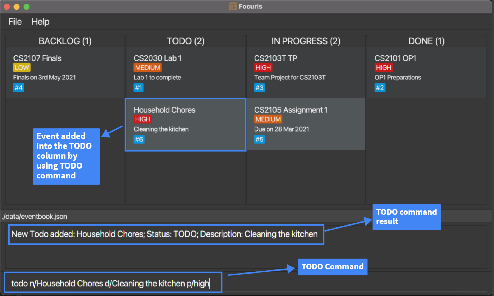
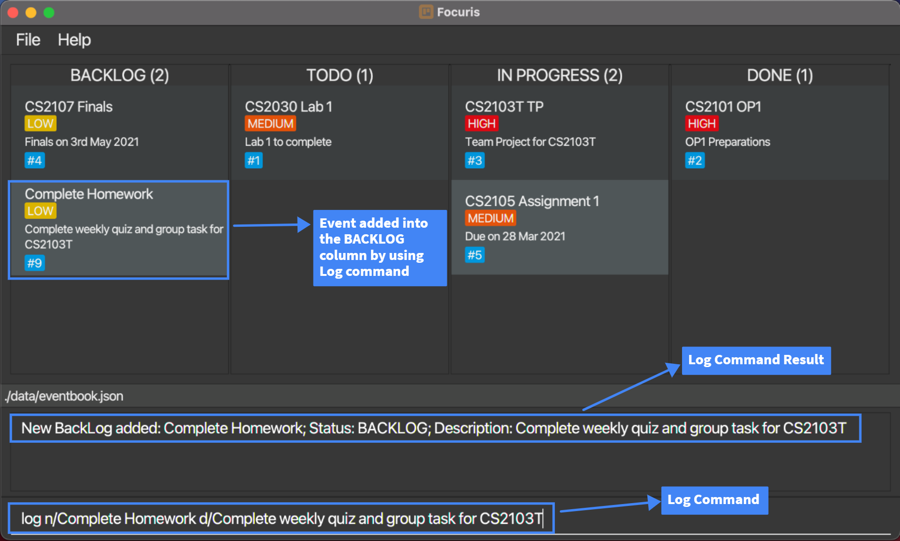
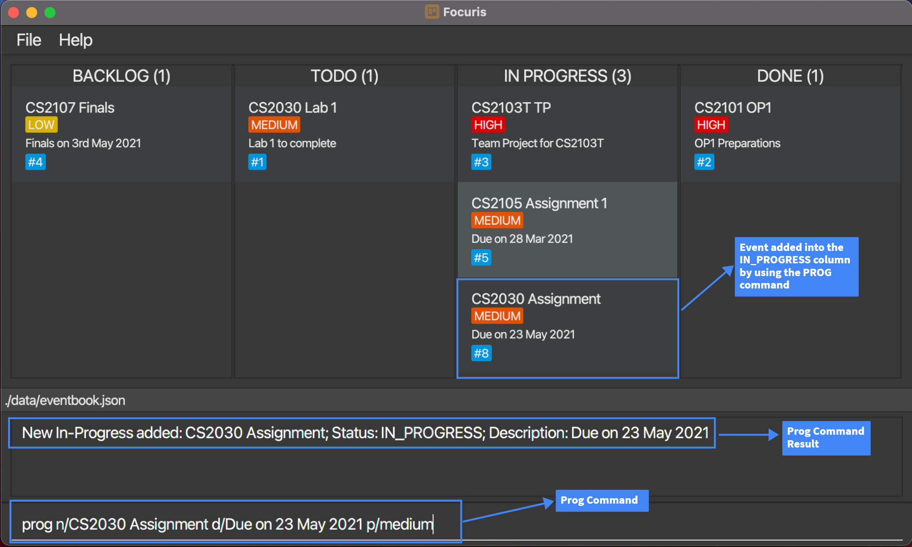
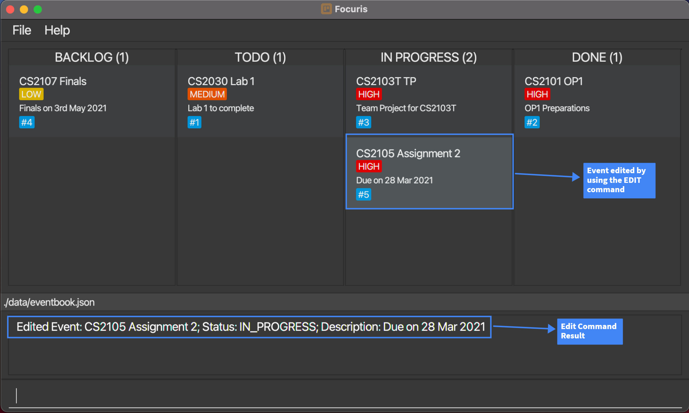
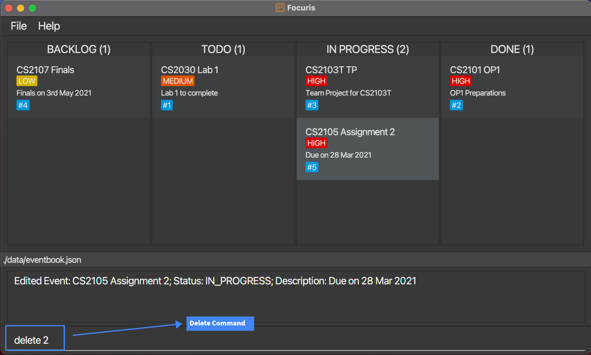
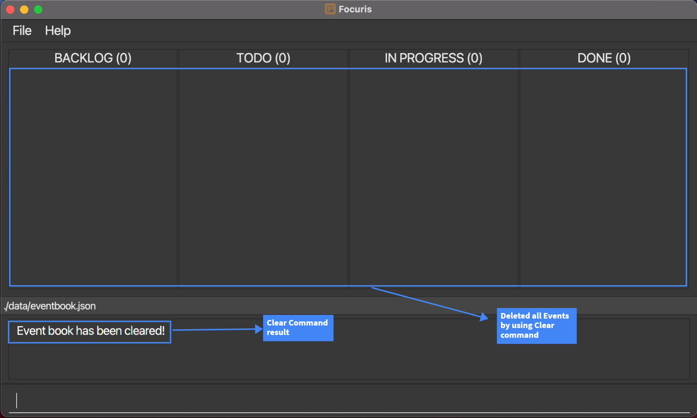

# Welcome to Focuris User Guide!

Focuris is a **desktop application** for **managing events** with a KanBan board, which is a board where your **events displayed according to the level of completion** of each event, which consists of Backlog, Todo, In-Progress and Done.

## Here's why you should use Focuris:

- Focuris is made specially for **university students** like you to keep track of your tasks to complete.
- Use of a Command Line Interface (CLI) allows fast typists to manage your event boards faster than applications with a Graphical User Interface (GUI).
- Gain ability to prioritize your tasks by looking at their priority level, from **Low** to **High**.
- Get instant overview on the level of completion of each of your tasks.

---

<div class="page-break-before"></div>

# Table Of Contents

<!-- prettier-ignore-start -->
<!-- AUTO-GENERATED TOC - START -->

* Table of Contents
{:toc}

<!-- AUTO-GENERATED TOC - END -->
<!-- prettier-ignore-end -->

---

<div class="page-break-before"></div>

# 1. Quick start

1. Ensure you have Java `11` or above installed on your Computer.

1. Download the latest `focuris.jar` from [here](https://github.com/AY2021S2-CS2103T-W15-4/tp/releases/tag/v1.3).

1. Copy the `focuris.jar` file to the folder you want to use as the _home folder_ for your Focuris.

1. Double-click the `focuris.jar` file to start the application. The GUI similar to the below should appear in a few seconds. Note how the app contains some sample data.<br>

   

1. Type the command in the command box and press Enter to execute it. e.g. typing **`help`** and pressing Enter will open the help window.<br>
   Some example commands you can try:

   - **`todo`**`n/CS2030 Lab 1 d/Lab 1 to complete` : Adds an event named `CS2030 Lab 1` to the application with status `TODO`.

   - **`log`**`n/CS2107 Finals d/Finals on 3rd May 2021` : Adds an event named `CS2107 Finals` to the application with status `BACKLOG`.

   - **`prog`**`n/CS2100 d/Lab` : Adds an event named `CS2100` to the application with status `IN PROGRESS`.

   - **`delete`**`3` : Deletes the event with the identifier of 3 shown on the KanBan board.

   - **`exit`** : Exits the application.

1. Refer to the [Features](#features) below for details of each command.

<a class="md-btn md-btn-raised" href="#table-of-contents">Return to Table of Contents</a>

<div class="page-break-before"></div>

# 2. Features

<div markdown="block" class="alert alert-info">

**:information_source: Notes about the command format:**<br>

- Words in `UPPER_CASE` are the [parameters](#parameters) to be supplied by the user.<br>
  e.g. in `todo n/NAME d/DESCRIPTION`, `NAME` is a [parameter](#parameters) which can be used as `todo n/CS2030`.

- Items in square brackets are optional.<br>
  e.g `n/NAME d/DESCRIPTION [p/PRIORITY]` can be used as `n/CS2030 d/Assignement p/HIGH` or as `n/CS2030 d/Assignment`.

- [Parameters](#parameters) can be in any order.<br>
  e.g. if the command specifies `n/NAME d/DESCRIPTION`, `d/DESCRIPTION n/NAME` is also acceptable.

- If a [parameter](#parameters) is expected only once in the command but you specified it multiple times, only the last occurrence of the [parameter](#parameters) will be taken.<br>
  e.g. if you specify `d/walk d/run`, only `d/run` will be taken.

- Extraneous [parameters](#parameters) for commands that do not take in [parameters](#parameters) (such as `help` and `exit`) will be ignored.<br>
  e.g. if the command specifies `help 123`, it will be interpreted as `help`.

</div>

<a class="md-btn md-btn-raised" href="#table-of-contents">Return to Table of Contents</a>

<div class="page-break-before"></div>

## 2.1 Summary

### 2.1.1 Command Summary

If you are an experienced user who has used Focuris before, then here is a summary of the commands for easier navigability!

For our new users, don't be too intimidated! You can use this summary to better familiarize yourself with
the different commands available. We will delve deeper into the specifics at chapters [2.2](#22-general)
and [2.3](#23-event-commands).

| Command                           | Description                                      | Format, Examples                                                                                           |
| --------------------------------- | ------------------------------------------------ | ---------------------------------------------------------------------------------------------------------- |
| [**Clear**](#236-clear-command)   | **Clears** all events in Focuris                 | `clear`                                                                                                    |
| [**Delete**](#235-delete-command) | **Deletes** an existing event                    | `delete IDENTIFIER`<br> e.g., `delete 3`                                                                   |
| [**Edit**](#234-edit-command)     | **Edits** an existing event's attributes         | `edit IDENTIFIER [n/NAME] [s/STATUS] [d/DESCRIPTION] [p/PRIORITY]`<br> e.g.,`edit 2 n/CS2030 d/Assignment` |
| [**Find**](#237-find-command)     | **Finds** an existing event by specific keywords | `find KEYWORD [KEYWORD]...`<br> e.g., `find James Jake`                                                    |
| [**Exit**](#222-exit-command)     | **Exits** the application                        | `exit`                                                                                                     |
| [**Help**](#221-help-command)     | Displays **help menu** pop-up                    | `help`                                                                                                     |
| [**List**](#232-list-command)     | Clears previous filters and lists all events     | `list`                                                                                                     |
| [**Log**](#232-log-command)       | Creates a new event with status **Backlog**      | `log n/NAME d/DESCRIPTION [p/PRIORITY]` <br> e.g., `log n/CS2030 d/Lab`                                    |
| [**Prog**](#233-prog-command)     | Creates a new event with status **In-Progress**  | `prog n/NAME d/DESCRIPTION [p/PRIORITY]` <br> e.g., `prog n/CS2100 d/Tutorial`                             |
| [**Todo**](#231-todo-command)     | Creates a new event with status **Todo**         | `todo n/NAME d/DESCRIPTION [p/PRIORITY]` <br> e.g., `todo n/CS2040 d/Assignment`                           |

<a class="md-btn md-btn-raised" href="#table-of-contents">Return to Table of Contents</a>

<div class="page-break-before"></div>

### 2.1.2 Attribute Summary

| [Attribute](#attributes) | Prefix    | Description                              | Constraints                                                                                                                                                                                                                                                      |
| ------------------------ | --------- | ---------------------------------------- | ---------------------------------------------------------------------------------------------------------------------------------------------------------------------------------------------------------------------------------------------------------------- |
| NAME                     | `n/`      | Name of your Event                       | Event names should not contain any [special characters](#special-characters) or be blank                                                                                                                                                                         |
| DESCRIPTION              | `d/`      | Description of your Event                | Event descriptions should not contain any [special characters](#special-characters) or be blank                                                                                                                                                                  |
| PRIORITY                 | `p/`      | Priority of your Event                   | Event priorities should be either `high`, `medium` or `low`. <br/> Priorities can be shorthanded to be `h` , `m` or `l` respectively. <br/>Priorities are case insensitive, meaning `high` or `HiGH` would be understood the same way.                           |
| STATUS                   | `s/`      | Status of your Event                     | Event statuses should be either `backlog`, `todo`, `in_progress` or `done`. <br/> Statuses can be shorthanded to be `bl` , `td`, `ip` or `d` respectively. <br/> Statuses are case insensitive, meaning `backlog` or `BackLog` would be understood the same way. |
| IDENTIFIER               | No Prefix | Identifier of your Event in Focuris      | Event identifier should exist in the KanBan board.                                                                                                                                                                                                               |
| KEYWORD                  | No Prefix | Keywords for searching Events in Focuris | No Constraints                                                                                                                                                                                                                                                   |

<a class="md-btn md-btn-raised" href="#table-of-contents">Return to Table of Contents</a>

<div class="page-break-before"></div>

## 2.2 General

You can refer to the follow diagram as reference for names of fields in the event card.


<a class="md-btn md-btn-raised" href="#table-of-contents">Return to Table of Contents</a>

<div class="page-break-before"></div>

### 2.2.1 `help` Command

Shows you a pop-up with a link to the Focuris user guide.

#### Format

```bash
help
```

#### Expected Outcome

- Pop-up displays link to the user guide.


<a class="md-btn md-btn-raised" href="#table-of-contents">Return to Table of Contents</a>

<div class="page-break-before"></div>

### 2.2.2 `exit` Command

Exits out of Focuris.

#### Format

```
exit
```

#### Expected Outcome

- Your Focuris application window closes.

<a class="md-btn md-btn-raised" href="#table-of-contents">Return to Table of Contents</a>

<div class="page-break-before"></div>

### 2.2.3 Saving of your data

Event data in Focuris is saved **automatically** whenever you execute any command that makes changes to events. As such, there is no need for you to trigger manually saving of data.

<a class="md-btn md-btn-raised" href="#table-of-contents">Return to Table of Contents</a>

### 2.2.4 Editing your data file

Focuris' data is saved as a JSON file `[JAR_FILE_LOCATION]/data/eventbook.json`.

<div markdown="block" class="alert alert-info">
:information_source: **Advanced Users:**
If you are an advanced user, you are welcome to update the data file by editing the data file directly.
</div>

<div markdown="span" class="alert alert-warning">:exclamation: **Caution:**
If your changes to the data file makes its format invalid, Focuris will discard all your existing data and start with an empty data file on the next run.
</div>

<a class="md-btn md-btn-raised" href="#table-of-contents">Return to Table of Contents</a>

<div class="page-break-before"></div>

## 2.3 Event Commands

For the majority of event commands, you can simply execute them via these simple steps:

1. Type in the command you desire in the various formats detailed below.
2. Hit `enter` on your keyboard!
3. The results and outcome of your command should be visible on the application.

### 2.3.1 `todo` Command

Adds an event with status `TODO` to Focuris.

#### Format

```
todo n/NAME d/DESCRIPTION [p/PRIORITY]
```

#### Examples



**Figure 1. Shows the result after execution of Example Command 1 in the table below.**

| No  | Example Command                                                               | Expected Command Result                                                                                                        |
| --- | ----------------------------------------------------------------------------- | ------------------------------------------------------------------------------------------------------------------------------ |
| 1   | `todo n/Household Chores d/Cleaning the kitchen p/high`                       | New Todo added: Household Chores; Priority: HIGH; Description: Cleaning the kitchen; Status: TODO;                             |
| 2   | `todo n/CS2030 Assignment 1 d/Due on 23 Mar 2021 p/high`                      | New Todo added: CS2030 Assignment 1; Priority: HIGH; Description: Due on 23 Mar 2021; Status: TODO;                            |
| 3   | `todo n/Lunch with John d/At VivoCity on Friday p/medium`                     | New Todo added: Lunch with John; Priority: MEDIUM; Description: At VivoCity on Friday; Status: TODO;                           |
| 4   | `todo n/Complete Homework d/Complete weekly quiz and group tasks for CS2103T` | New Todo added: Complete Homework; Priority: LOW; Description: Complete weekly quiz and group tasks for CS2103T; Status: TODO; |
| 5   | `todo n/Run d/Exercise p/h`                                                   | New Todo added: Run; Priority: HIGH; Description: Exercise; Status: TODO;                                                      |

<a class="md-btn md-btn-raised" href="#table-of-contents">Return to Table of Contents</a>

<div class="page-break-before"></div>

### 2.3.2 `log` Command

Adds an event with status `BACKLOG` to Focuris.

#### Format

```
log n/NAME d/DESCRIPTION [p/PRIORITY]
```

#### Examples



**Figure 2. Shows the result after execution of Example Command 1 in the table below.**

| No  | Example Command                                                              | Expected Command Result                                                                                                              |
| --- | ---------------------------------------------------------------------------- | ------------------------------------------------------------------------------------------------------------------------------------ |
| 1   | `log n/Complete Homework d/Complete weekly quiz and group tasks for CS2103T` | New BackLog added: Complete Homework; Priority: LOW; Description: Complete weekly quiz and group tasks for CS2103T; Status: BACKLOG; |
| 2   | `log n/Household Chores d/Cleaning the kitchen p/high`                       | New BackLog added: Household Chores; Priority: HIGH; Description: Cleaning the kitchen; Status: BACKLOG;                             |
| 3   | `log n/CS2030 Assignment 1 d/Due on 23 Mar 2021 p/high`                      | New BackLog added: CS2030 Assignment 1; Priority: HIGH; Description: Due on 23 Mar 2021; Status: BACKLOG;                            |
| 4   | `log n/Lunch with John d/At VivoCity on Friday p/medium`                     | New BackLog added: Lunch with John; Priority: MEDIUM; Description: At VivoCity on Friday; Status: BACKLOG;                           |
| 5   | `log n/Run d/Exercise p/h`                                                   | New BackLog added: Run; Priority: HIGH; Description: Exercise; Status: BACKLOG;                                                      |

<a class="md-btn md-btn-raised" href="#table-of-contents">Return to Table of Contents</a>

<div class="page-break-before"></div>

### 2.3.3 `prog` Command

Adds an event with status `IN PROGRESS` to Focuris.

#### Format

```
prog n/NAME d/DESCRIPTION [p/PRIORITY]
```

#### Examples



**Figure 3. Shows the result after execution of Example Command 1 below.**

| No  | Example Command                                                               | Expected Command Result                                                                                                                      |
| --- | ----------------------------------------------------------------------------- | -------------------------------------------------------------------------------------------------------------------------------------------- |
| 1   | `prog n/CS2030 Assignment d/Due on 23 May 2021 p/medium`                      | New In-Progress added: CS2030 Assignment 1; Priority: MEDIUM; Description: Due on 23 Mar 2021; ; Status: IN_PROGRESS;                        |
| 2   | `prog n/Complete Homework d/Complete weekly quiz and group tasks for CS2103T` | New In-Progress added: Complete Homework; Priority: LOW; Description: Complete weekly quiz and group tasks for CS2103T; Status: IN_PROGRESS; |
| 3   | `prog n/Household Chores d/Cleaning the kitchen p/high`                       | New In-Progress added: Household Chores; Priority: HIGH; Description: Cleaning the kitchen; Status: IN_PROGRESS;                             |
| 4   | `prog n/Lunch with John d/At VivoCity on Friday p/medium`                     | New In-Progress added: Lunch with John; Priority: MEDIUM; Description: At VivoCity on Friday; Status: IN_PROGRESS;                           |
| 5   | `prog n/Run d/Exercise p/h`                                                   | New In-Progress added: Run; Priority: HIGH; Description: Exercise; Status: IN_PROGRESS;                                                      |

<a class="md-btn md-btn-raised" href="#table-of-contents">Return to Table of Contents</a>

<div class="page-break-before"></div>

### 2.3.4 `edit` Command

Edits an existing event in Focuris.

#### Format

```
edit IDENTIFIER [n/NAME] [d/DESCRIPTION] [s/STATUS] [p/PRIORITY]
```

- Edits the event at the specified `IDENTIFIER`.
- The identifier refers to the index number shown in the respective displayed event list.
- The identifier **must be a positive integer** 1, 2, 3, …​
- At least one of the optional fields must be provided.

<div markdown="block" class="alert alert-info">
:exclamation: **Caution**

Existing event will have its data overwritten by the new values taken in by the `edit` command

</div>

#### Examples

- `edit 1 n/CS2030 d/Assignment` Edits the event name and event description of the event with identifier `#1` to be `CS2030` and `Assignment` respectively.
- `edit 2 s/backlog` Edits the status of the event with identifier `#2` to be `BACKLOG`
- `edit 3 n/CS1101S d/Streams assignment s/in_progress p/high` Edits event the event name, description, status and priority of the event with identifier `#3` to be `CS1101S`, `Streams assignment`, `IN_PROGRESS`, `HIGH` respectively.
- `edit 4 s/d p/l` Edits the status and the priority of the event with identifier `#4` to be `DONE` and `LOW` respectively.


**Figure 4. Shows Focuris before execution of the edit command in the command box.**



**Figure 5. Shows Focuris after execution of the edit command in the command box.**

<a class="md-btn md-btn-raised" href="#table-of-contents">Return to Table of Contents</a>

<div class="page-break-before"></div>

### 2.3.5 `delete` Command

Deletes the specified event from Focuris.

#### Format

```
delete IDENTIFIER
```

- Deletes the event at the specified `IDENTIFIER`
- The identifier refers to the number beside the hex symbol, e.g. `#10` has an identifier of 10.
- The identifier **must be a positive integer** 1, 2, 3, …​

#### Examples



**Figure 6. Shows Focuris _before_ the execution of the delete command in the command box.**


**Figure 7. Shows Focuris _after_ the execution of the delete command in the command box.**

| No  | Example Command | Expected Command Result                                                                  |
| --- | --------------- | ---------------------------------------------------------------------------------------- |
| 1   | `delete 1`      | Deleted Event: CS2030 Lab 1; Status: TODO; Description: Lab 1 to complete;               |
| 2   | `delete 5`      | Deleted Event: CS2105 Assignment 2; Status: IN_PROGRESS; Description: Due on 28 Mar 2021 |

<div markdown="block" class="alert alert-info">

**:information_source: Note** <br>
The commands in the table above make reference to the events in Focuris as seen in Figure 7.

</div>

<a class="md-btn md-btn-raised" href="#table-of-contents">Return to Table of Contents</a>

<div class="page-break-before"></div>

### 2.3.6 `clear` Command

Clears all events in Focuris.

#### Format

```
clear
```

<div markdown="span" class="alert alert-warning">

:exclamation: **Caution:**
All events will be cleared from Focuris and this is **irreversible**. Please use this command with care.

</div>

#### Expected Outcome

- All events are cleared from Focuris.



**Figure 8. Shows Focuris after a clear command has been executed.**

<a class="md-btn md-btn-raised" href="#table-of-contents">Return to Table of Contents</a>

<div class="page-break-before"></div>

### 2.3.7 `find` Command

Finds events whose names contain any of the given keywords.

#### Format

```
find KEYWORD [MORE_KEYWORDS]...
```

- The search is case-insensitive. e.g `cs2040` will match `CS2040`
- The order of the keywords does not matter. e.g. `Household Chores` will match `Chores Household`
- Only the name and description is searched.
- Only full words will be matched e.g. `Chor` will not match `Chore`
- Events matching at least one keyword will be returned (i.e. OR search). e.g. `Household` will return `Household Tidy`, `Household Clean`

#### Examples

- `find CS2103` returns `CS2103` and `CS2103T`
- `find assignment` returns `CS2101 assignment`, `CS2103 assignment`


**Figure 9. Before execution of find command**


**Figure 10. After execution of sample find command**

<a class="md-btn md-btn-raised" href="#table-of-contents">Return to Table of Contents</a>

<div class="page-break-before"></div>

### 2.3.8 `list` Command

Lists all of your events in Focuris. Typically used after using [`find`](#237-find-command).

#### Format

```
list
```

#### Example


**Figure 11. Execution of list command after find command in Figure 10**

<a class="md-btn md-btn-raised" href="#table-of-contents">Return to Table of Contents</a>

<div class="page-break-before"></div>

## 3. FAQ

**Q**: How do I transfer my data to another Computer?<br>
**A**: Install the app in the other computer and overwrite the empty data file it creates with the file that contains the data of your previous Focuris home folder.

**Q**: Does this application require an Internet connection?<br>
**A**: No, Focuris does not require an Internet connection to use.

**Q**: What is the maximum length of text I can enter into a event name or event description?<br>
**A**: Focuris does not limit the maximum length of text that can be entered and stored as it will increase the size
of the card to fit the text given. However, the general notion we try to promote is **efficiency** and **productivity**,
and thus we recommend keeping the text under **20 characters** for the event name, and **40 characters** for the description.

**Q**: Will my data be sent anywhere else or shared with third parties?<br>
**A**: Your data is stored locally on your own computer. Focuris does not use any Internet connection so no data can be
sent to any online servers.

<a class="md-btn md-btn-raised" href="#table-of-contents">Return to Table of Contents</a>

<div class="page-break-before"></div>

## 4. Glossary

<a name="special-characters"><bold>Special Characters</bold>: Characters that are neither alphabets, from A to Z, nor digits, from 0 to 9.</a>

<a name="attributes"><bold>Attributes</bold>: Attributes are names of different inputs that a command takes in.</a>

<a name="parameters"><bold>Parameters</bold>: Parameters are the input given to commands behind prefixes such as `n/`.</a>

<a class="md-btn md-btn-raised" href="#table-of-contents">Return to Table of Contents</a>
