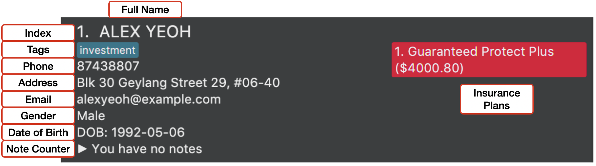

Are you finding it difficult to keep track of your insurance clients? Life as an insurance agent isn't easy. We understand. Link.me 
is a **desktop app built for insurance agents** to help you manage your clients. It is **optimized for use via a 
Command Line Interface (CLI)** while still having the benefits of a Graphical User Interface (GUI). 
If you can type fast, Link.me can get your client management tasks done faster than traditional GUI apps.

This user guide will guide you, as an insurance agent, through the process of setting up Link.me, introduce you to 
the capabilities of Link.me and facilitate your usage of Link.me so that you can better manage your
ever-increasing clients.

---

* Table of Contents 
{:toc}

--------------------------------------------------------------------------------------------------------------------

## Quick start

1. Ensure you have Java `11` or above installed in your Computer.

2. Download the latest `linkme.jar` from [here](https://github.com/AY2021S2-CS2103T-W12-3/tp/releases).

3. Copy the file to the folder you want to use as the _home folder_ for `Link.me`.

4. Double-click the file to start `Link.me`. A window similar to the one shown below should appear in a few seconds. Note how your Link.me already contains some sample data. 
   

5. Type a command in the command box and press Enter to execute it. e.g. typing **`help`** and pressing Enter will open the help window. 
   Some example commands you can try:

    * **`list`** : Lists all of your clients.

    * **`add`**`n/John Doe p/98765432 e/johnd@example.com a/John street, block 123, #01-01` : Adds a client named `John Doe` to your Link.me.

    * **`delete`**`3` : Deletes the 3rd client shown in the current list.

    * **`clear`** : Deletes all of your clients.

    * **`exit`** : Exits Link.me.

1. Refer to the [Features](#features) section below for details of each command.

--------------------------------------------------------------------------------------------------------------------
## Overview 

### Layout
The structure of the Link.me interface is split into five main parts:

The Input Command Line is where the user inputs the commands for execution.

The Result Display displays the result of the user input.

The Client List displays a list of client stored in Link.me, and changes according to the use input.

The Meeting List displays a list of meetings that are scheduled in Link.me.

The Status Bar displays status information regarding the storage unit. (Not relevant for basic users.)

Each client has basic information stored, as well as insurance plans and premiums attached.

Each meeting has the client stores, as well as the meeting time and a brief description of the meeting agenda.

### Functionalities
The features of Link.me mainly revolve around adding and editing clients as Link.me is first and foremost a client
managing app.

Features of Link.me include adding, editing, deleting, searching for and filtering clients. Link.me also supports peripheral features such as meeting scheduling, 
recording client notes and notifying the user of important upcoming events. 

Details on how to use each command are explained in the [Features](#features) section below.

Action                            | Format
----------------------------------|------------------------------------------------------------------------------------
**Add a client**                  | `add n/NAME p/PHONE_NUMBER e/EMAIL a/ADDRESS g/GENDER b/BIRTHDATE [t/TAG]...`
**Add or remove insurance plans** | `plan INDEX i/PLAN_NAME $PREMIUM` (add) `plan INDEX c/PLAN_INDEX` (remove)
**Clear all clients**             | `clear`
**Delete a client**               | `delete INDEX`
**Edit a client**                 | `edit INDEX [n/NAME] [p/PHONE_NUMBER] [e/EMAIL] [a/ADDRESS] [g/GENDER] [b/BIRTHDATE] [t/TAG]...`
**Exit Link.me**                  | `exit`
**Filter by attribute**           | `filter PREFIX/KEYWORD [PREFIX/MORE_KEYWORDS]`
**Find by name**                  | `find KEYWORD [MORE_KEYWORDS]`
**List all clients**              | `list`
**Record, clear or view notes**   | `note INDEX r/NOTE` (record)  `note INDEX c/` (clear) `note INDEX v/` (view)
**Remove meetings**               | `unschedule INDEX` (remove specified meeting)  `unschedule all` (remove all meetings)  `unschedule expired` (remove expired meetings)
**Schedule meetings**             | `schedule INDEX m/DESCRIPTION @ DATE_TIME`
**Show notifications**            | `notif`
**View Help**                     | `help`

--------------------------------------------------------------------------------------------------------------------
## Features

**:information_source: Notes about the command format:** 

* Words in `UPPER_CASE` are the inputs to be supplied by you, the user. 
  e.g. in `add n/NAME`, `NAME` represents the client's name that will be inputted by you, the user. 
  For instance, if the client's name is "John Doe", you should input: `add n/John Doe`. 
  

* Inputs in square brackets are optional. 
  e.g. in `n/NAME [t/TAG]`, while the input for `n/NAME` is mandatory, the omission of `[t/TAG]` will not lead
  to an input error. For instance, these two inputs are valid:
  * `n/John Doe t/friend`
  * `n/John Doe`
    

* Inputs with `…`​ after them can be used multiple times including zero times. 
  e.g. in `[t/TAG]…​`, the following inputs are valid:
  * `t/friend`
  * `t/friend t/family`
  * ` `  (an empty input)

    
* You can enter your inputs in any order. 
  e.g. if the command specifies `n/NAME p/PHONE_NUMBER`, `p/PHONE_NUMBER n/NAME` is also acceptable.

* If an input is expected only once in the command, but you specified it multiple times, only the last occurrence of the 
  input will be taken. 
  e.g. if you specify `p/12341234 p/56785678`, only `p/56785678` will be taken.

* For commands that do not take in parameters (such as `help`, `list`, `exit` and `clear`), any additional inputs
  will be ignored. 
  e.g. for the `help` command, if you input `help 123`, it will be interpreted as `help` as `123` will be considered as
  a redundant command.

* The commands of Link.me generally follow the following format:
  `COMMAND [client_INDEX] [PREFIX]/[DESCRIPTION]`

### Listing all of your clients : `list`

You can view a list of all of your clients stored in Link.me.

Format: `list`

### Adding a client: `add`

You can add a client to Link.me, by specifying each of the fields below:
* Name
* Phone number
* Email
* Address
* Gender
* Birthdate
* Tags (optional)

Format: `add n/NAME p/PHONE_NUMBER e/EMAIL a/ADDRESS g/GENDER b/BIRTHDATE [t/TAG]...`

* `BIRTHDATE` should be given in the format yyyy-mm-dd

:bulb: **Tip:**
A client can have any number of tags (including 0)

Examples:
* `add n/John Doe p/98765432 e/johnd@example.com a/John street, block 123, #01-01 g/M b/1995-01-01 t/investment`
* `add n/Betsy Crowe t/medical e/betsycrowe@example.com a/Newgate Prison p/91234567 t/life g/F b/1998-02-03`

### Editing a client : `edit`

You can edit the information of an existing client.

Format: `edit INDEX [n/NAME] [p/PHONE_NUMBER] [e/EMAIL] [a/ADDRESS] [g/GENDER] [b/BIRTHDATE] [t/TAG]...`

* Edits your client at the specified `INDEX`. The index refers to the index number shown in the displayed client list. The index **must be a positive integer** 1, 2, 3, …​
* At least one of the optional fields must be provided.
* Existing values will be updated to the input values.
* When editing tags, the existing tags of your client will be removed i.e. adding of tags is not cumulative.

:bulb: **Tip:**
You can remove all your client’s tags by typing `t/` without specifying any tags after it.

  
Examples:
*  `edit 1 p/91234567 e/johndoe@example.com` Edits the phone number and email address of the 1st client to be `91234567` and `johndoe@example.com` respectively.
*  `edit 2 n/Betsy Crower t/` Edits the name of the 2nd client to be `Betsy Crower` and clears all existing tags.
*  `edit 2 t/medical` Edits the insurance tag of the 2nd client to be `medical`.

### Deleting a client : `delete`

You can delete a specific client from Link.me.

Format: `delete INDEX`

* Deletes your client at the specified `INDEX`. Note that `INDEX` is used to avoid ambiguity like this:
  * `delete Tom` (if `NAME` was used instead of `INDEX`), but multiple clients named "Tom" are stored in Link.me (e.g.
    Tom Tan, Tom Lim)
* The index refers to the index number shown in the displayed client list.
* The index **must be a positive integer** 1, 2, 3, …​

Examples:
* `list` followed by `delete 2` deletes the 2nd client in Link.me.
* `find Betsy` followed by `delete 1` deletes the 1st client in the results of the `find` command.

### Clearing all clients : `clear`

You can remove all clients from Link.me.

Format: `clear`

### Adding or removing insurance plans of a client : `plan`

#### Adding an insurance plan

You can add a new insurance plan to an existing client.

Format: `plan INDEX i/PLAN_NAME $PREMIUM`

* `INDEX` refers to the index number shown in the displayed client list.
* `INDEX` **must be a positive integer** 1, 2, 3, …​
* `PLAN_NAME` refers to the name of the insurance plan.
* `PREMIUM` refers to the yearly premium amount that the client pays for this plan.
* `PREMIUM` **must be a positive integer** 1, 2, 3, …​

Example:

* `plan 3 i/Protecc $4000` Adds a new insurance plan Protecc with a yearly premium amount of $4000 to the 3rd client.

#### Removing an insurance plan

You can remove an existing insurance plan from a client.

Format: `plan INDEX c/PLAN_INDEX`

* `INDEX` refers to the index number shown in the displayed client list.
* `INDEX` **must be a positive integer** 1, 2, 3, …​
* `PLAN_INDEX` refers to the index number shown in the displayed plan list.
* `PLAN_INDEX` **must be a positive integer** 1, 2, 3, …​

Example:

* `plan 2 c/3` Removes the 3rd insurance plan of the 2nd client in the displayed client list.

### Recording, clearing or viewing notes : `note`

#### Recording a note

You can record a note for a specific client.

Format: `note INDEX r/NOTE`

* Adds the provided `NOTE` to the client specified at `INDEX`.
* `INDEX` refers to the index number shown in the displayed client list.
* `INDEX` **must be a positive integer** 1, 2, 3, …​
* `NOTE` should not be empty.

Example:

* `note 3 r/Wants to upgrade insurance coverage` adds the note "Wants to upgrade insurance coverage" to the 3rd client.

#### Clearing all notes

You can clear all existing notes from a specific client.

Format: `note INDEX c/`

* Clears all notes from the client specified at `INDEX`.
* `INDEX` refers to the index number shown in the displayed client list.
* `INDEX` **must be a positive integer** 1, 2, 3, …​

Example:

* `note 4 c/` clears all notes from the 4th client.

#### Viewing notes

You can view all existing notes from a specific client. Notes will be displayed in a popup box, with each note listed as a bullet point.

Format: `note INDEX v/`

* View notes from the client specified at `INDEX`.
* `INDEX` refers to the index number shown in the displayed client list.
* `INDEX` **must be a positive integer** 1, 2, 3, …​

Example:

* `note 4 v/` generates a popup box displaying the notes taken for the 4th client.

### Arranging Meetings with Clients
#### Scheduling a meeting : `schedule`

You can schedule a meeting with a specific client in Link.me.

New schedule commands overwrite the original meeting scheduled with a client.

Format: `schedule INDEX m/DESCRIPTION @ DATE_TIME`

* You can have the `@` symbol within the description as the system uses the last appearing `@` to find the meeting datetime.
* Adds your client at the specified `INDEX`, and the `DATE_TIME` of the meeting, to the schedule list.
* The `INDEX` refers to the index number shown in the displayed client list.
* The `INDEX` **must be a positive integer** 1, 2, 3, …​
* `DATE_TIME` refers to the date and time of the scheduled meeting
* `DATE_TIME` should be inputted in the specific datetime format `yyyy-mm-dd HH:MM`
* Blank spaces typed in front of and behind the `@` will be ignored by the system in order to increase typo leniency.

Example:

* `schedule 2 m/Insurance Plan @ 2020-02-28 14:30` schedules an Insurance Plan meeting with your client indexed 2 in the
  displayed list on 28th October 2020 2:30 pm.
* `schedule 2 m/Insurance Plan@2020-02-28 14:30` will do the same as the previous command.

#### Removing a meeting : `unschedule`

Removing meetings comes in three flavors:

* `unschedule INDEX` removes the specified meeting in the meeting list.
* `unschedule all` removes all meetings in the meeting list.
* `unschedule expired` removes all expired meetings in the meeting list.

Format: `unschedule INDEX` or `unschedule all` or `unschedule expired`

* The `INDEX` refers to the index number shown in the displayed meeting list.
* The `INDEX` **must be a positive integer** 1, 2, 3, …​

Example:

* `unschedule 2` removes the second meeting on the meeting list.

### Searching for clients

#### Finding clients by name: `find`

You can find clients by their name.

Format: `find KEYWORD [MORE_KEYWORDS]`

* The search is case-insensitive. e.g. `hans` will match `Hans`
* The order of the keywords does not matter. e.g. `Hans Bo` will match `Bo Hans`
* Only the name is searched.
* Only full words will be matched e.g. `Han` will not match `Hans`
* clients matching at least one keyword will be returned (i.e. `OR` search).
  e.g. `Hans Bo` will return `Hans Gruber`, `Bo Yang`

Examples:
* `find John` returns `john` and `John Doe`
* `find alex david` returns `Alex Yeoh`, `David Li` 
  

#### Filtering by attributes : `filter`

You can filter clients by their address, gender, age, tags or insurance plan name.

Format of filter command: `filter PREFIX/KEYWORD [PREFIX/MORE_KEYWORDS]...`

Format of keyword:

* address: `a/ADDRESS`
* gender: `g/GENDER`
* tag: `t/TAG`
* age: `age/[AGE]` or `age/[AGE_LOWER_BOUND]-[AGE_HIGHER_BOUND]`
* insurance plan name: `i/PLAN_NAME`

Lists all of your clients that has one of their attributes that match your search keywords.

Only attributes that are exactly the same will be matched.

Examples:

`filter a/Clementi g/M t/medical i/Protecc age/23-30` returns:
* clients that has "Clementi" in their address, OR
* clients that are Male, OR
* clients with the "medical" tag, OR
* clients with the insurance plan "Protecc", OR
* clients aged between 23 and 30 years old, inclusive

### Displaying notifications : `notif`

You can view a notification window informing you of client birthdays within the next two weeks and upcoming meetings,
which should notify you in time with a reasonable amount of time to prepare beforehand.

This notification window is also shown when starting up Link.me.

Format: `notif`

Notification window contains:
* All meetings occurring today, arranged in order of time.
* All client birthdays within the next two weeks, arranged in order of time.

### Viewing help : `help`

You can view a message explaining how to access the help page.

Format: `help`

### Exiting the program : `exit`

You can exit Link.me.

Format: `exit`

### Saving the data

Link.me data is saved in the hard disk automatically after any command that modifies existing data. There is no need to save manually.

#### Editing the data file

Link.me data is saved as a JSON file `[JAR file location]/data/linkme.json`. 
We generally discourage editing the JSON file directly. 
<!---We have locked the JSON as a precaution, but users are still able to unlock the file and forcibly edit the file.--->
The Link.me team does not take any responsibility in data loss or startup failures following invalid inputs.

:exclamation: **Caution:**
If your changes to the data file make its format invalid, 
Link.me will try to discard all data and start with an empty data file at the next run,
but if the damage is too excessive, Link.me may be unable to start up. 
In the case that this happens, please manually discard the data file to start the app.

--------------------------------------------------------------------------------------------------------------------

## FAQ

**Q**: How do I transfer my data to another computer? 
**A**: Install Link.me in the other computer and overwrite the empty data file it creates with the data file in your current Link.me home folder.

--------------------------------------------------------------------------------------------------------------------
