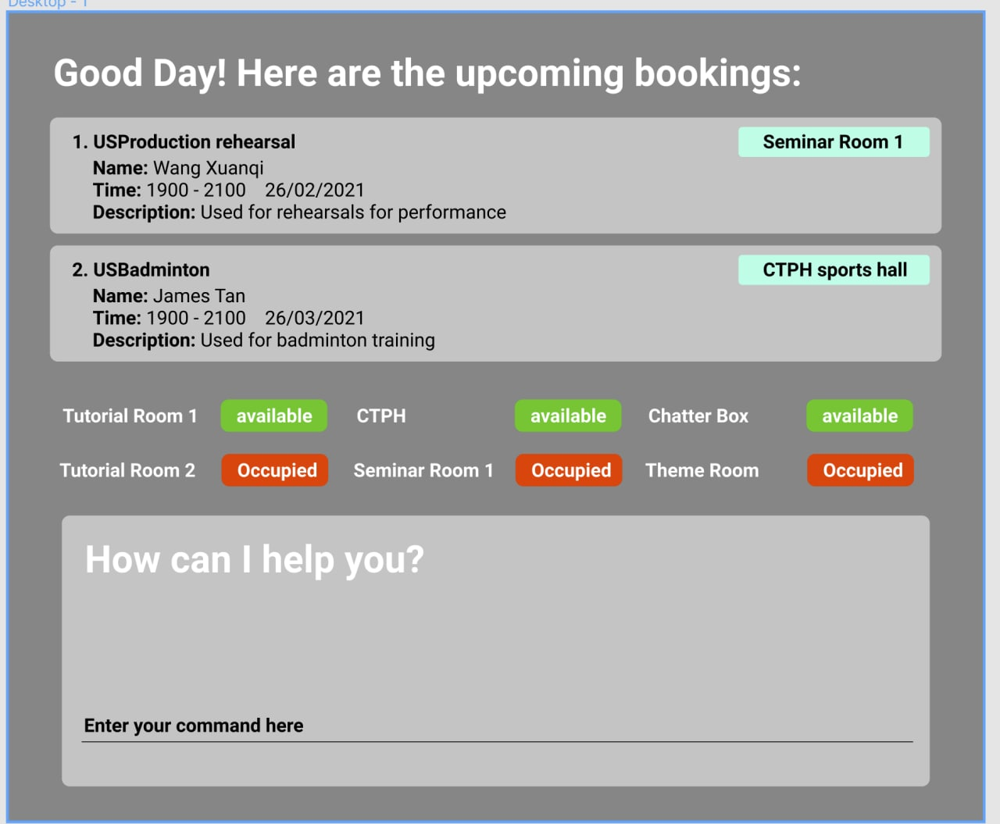

BookCoinToTheMoon is a **desktop app for managing bookings and presents users a structured and detailed information on facility availability via a Command Line Interface** (CLI) while still having the benefits of a Graphical User Interface (GUI). If you can type fast, BookCoinToTheMoon can get your facility management tasks done faster than traditional GUI apps.

* Table of Contents
{:toc}

--------------------------------------------------------------------------------------------------------------------

## Quick start

1. Ensure you have Java `11` or above installed in your Computer.

1. Download the latest `bookcointothemoon.jar` `[coming in v2.0]`

1. Copy the file to the folder you want to use as the _home folder_ for your BookCoinToTheMoon.

1. Double-click the file to start the app. The GUI similar to the below should appear in a few seconds. Note how the app contains some sample data. 
   

1. Type the command in the command box and press Enter to execute it. e.g. typing **`help`** and pressing Enter will open the help window. 
   Some example commands you can try:

   * **`list_venues`** : Lists all venues.

   * **`add_venue`**`n/Chua Thian Poh Hall max/40` : Adds a venue named `Chua Thian Poh Hall` to the BookCoinToTheMoon.

   * **`bye`** : Exits the app.

1. Refer to the [Features](#features) below for details of each command.

--------------------------------------------------------------------------------------------------------------------

## Features

**:information_source: Notes about the command format:** 

* Words in `UPPER_CASE` are the parameters to be supplied by the user. 
  e.g. in `find_venue v/VENUE_ID`, `VENUE_ID` is a parameter which can be used as `find_venue v/1`.

* Items in square brackets are optional. 
  e.g. `add_venue n/VENUE_NAME [max/MAXIMUM_OCCUPANCY]` can be used as `n/Chua Thian Poh Hall max/40` or as `n/Chua Thian Poh Hall`.
 
* If a parameter is expected only once in the command but you specified it multiple times, only the last occurrence of the parameter will be taken. 
  e.g. if you specify `p/12341234 p/56785678`, only `p/56785678` will be taken.

* Extraneous parameters for commands that do not take in parameters (such as `bye`) will be ignored. 
  e.g. if the command specifies `bye 123`, it will be interpreted as `bye`.

### Adding a venue : `add_venue`

Adds a new venue for the booking app.

Format: `add_venue n/VENUE_NAME [max/MAXIMUM_OCCUPANCY]`

Examples:
* `add_venue n/Chua Thian Poh Hall max/40`

### Adding a booking : `add_booking`

Adds a new booking into the booking app. The default booking is set to one hour for the first iteration.

Format: `add_booking d/DATE t/TIMING n/VENUE_NAME`

Examples:
* `add_booking d/2020-12-12 t/2359 n/Chua Thian Poh Hall`

### Listing all venues : `list_venues`

Shows a list of all venues and their corresponding IDs in the booking app.

Format: `list_venues`

### Listing all bookings : `list_bookings`

Shows a list of all bookings and their corresponding IDs in the booking app.

Format: `list_bookings`

### Finding a venue : `find_venue`

Shows information about the booking corresponding to the given venue ID.

Format: `find_venue v/VENUE_ID`

Examples:
* `find_venue v/1`

### Finding a booking : `find_booking`

Shows information about the booking corresponding to the given booking ID.

Format: `find_booking b/BOOKING_ID`

Examples:
* `find_booking b/2`

### Deleting a venue : `delete_venue`

Deletes a venue corresponding to the venue ID specified.

Format: `delete_venue v/VENUE_ID`

Examples:
* `delete_venue v/1`

### Deleting a booking : `delete_booking`

Deletes booking corresponding to the booking ID specified.

Format: `delete_booking b/BOOKING_ID`

Examples:
* `delete_booking b/2`

### Exiting the program : `bye`

Exits the program.

Format: `bye`

### Saving the data 

BookCoinToTheMoon data are saved in the hard disk automatically after any command that changes the data. There is no need to save manually.

### Editing the data file `[coming in v2.0]`

_Details coming soon ..._

### Archiving data files `[coming in v2.0]`

_Details coming soon ..._

--------------------------------------------------------------------------------------------------------------------

## FAQ

**Q**: How do I transfer my data to another Computer? 
**A**: Install the app in the other computer and overwrite the empty data file it creates with the file that contains the data of your previous BookCoinToTheMoon home folder.

--------------------------------------------------------------------------------------------------------------------

## Command summary

Action | Format, Examples
--------|------------------
**Add** | `add_venue n/VENUE_NAME [max/MAXIMUM_OCCUPANCY]`   e.g., `add_venue n/Chua Thian Poh Hall max/40`   `add_booking`e.g., `add_booking d/2020-12-12 t/2359 n/Chua Thian Poh Hall`
**Delete** | `delete_venue v/VENUE_ID`  e.g., `delete_venue v/1`    `delete_booking b/BOOKING_ID`  e.g., `delete_booking b/2`
**Find** | `find_venue v/VENUE_ID`  e.g., `find_venue v/1`   `find_booking b/BOOKING_ID`  e.g., `find_booking b/2`
**List** | `list_venues`   `list_bookings`
**Exit** | `bye`
