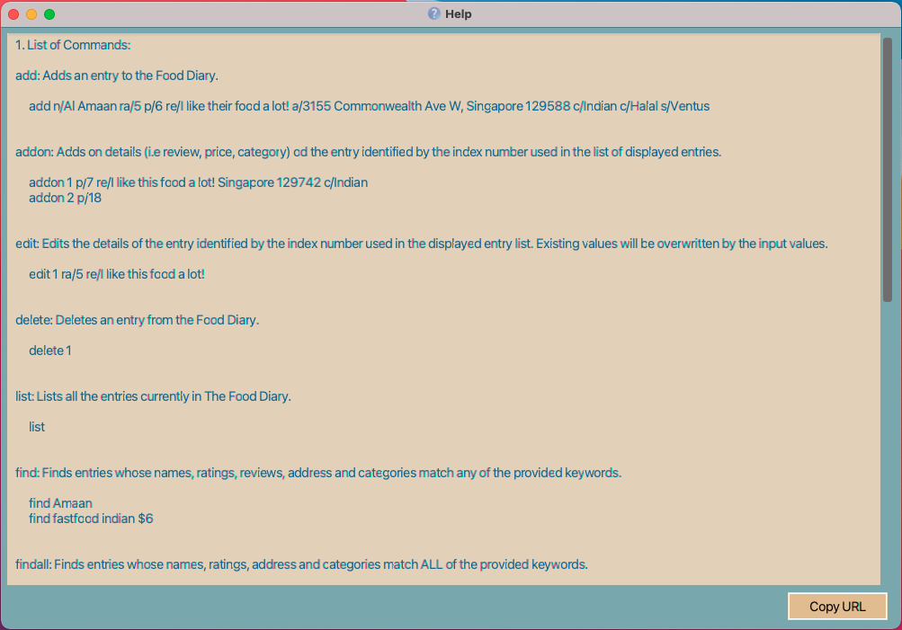

###  Done by (CS2103-T14-2):
Donavan Lim, Marcus Lee Eugene, Chong Sidney, Dinesh S/O Magesvaran, Prabhakaran Gokul

---

* Table of Contents
{:toc}

--------------------------------------------------------------------------------------------------------------------

## Description

The Food Diary is a desktop app for managing food diary entries, optimized with a Command Line Interface (CLI) and packaged with a Graphical User Interface (GUI).

The Food Diary caters to food-passionate NUS students who would ideally benefit from keeping records of food options tasted in the vicinity of NUS.

The Food Diary will allow students to save time and effort when finding places to eat around the NUS vicinity. The Food Diary especially caters to students mainly on 4 aspects:

1. The ability for users to save food diary entries for future reference.
2. The ability for users to find entries based on specific fields.
3. The ability for users to have multiple food reviews for a food place.
4. The option for users to use Commands / UI to perform some tasks quickly.

--------------------------------------------------------------------------------------------------------------------

## Features

### View all the food reviews : `list`

Lists all the restaurants with food reviews.

Format: `list`

Parameters: none

    list

Example:
(Refer to Main Window Ui in Appendix)

### Add a FoodDiary entry: `add`

Adds an entry to the Food Diary.

Format: `add n/<RESTAURANT NAME> ra/RATING p/PRICE re/REVIEW a/ADDRESS [c/CATEGORY]... [s/SCHOOL]...`

Note:
- A FoodDiary entry can have any number of categories or schools
- Price range: $0 - 999

Parameters:

1. `Restaurant Name`
2. `Rating`
3. `Price`
3. `Address`
4. `Review`
5. `Categories (optional)`
6. `Schools (optional)`

Schools are limited to the following NUS locations:
    `BIZ`, `CLB`, `DENT`, `FASS`, `FOE`,`MED`, `NUSS`, `PGP`, `SCIENCE`, `SDE`, `SOC`,
`USC`, `UTOWN`, `UHALL`, `VENTUS`, `YIH`

Categories are limited to the following:
    `Chinese`, `Dessert`, `Fastfood`, `Fruits`, `Fusion`, `Halal`, `Indian`, `Japanese`, `Korean`, `Malay`,
`Vegan`, `Vegetarian` ,`Western`, `Others`

Example:

    add  n/Al Amaan Restaurant ra/5 p/8 re/best for Butter Chicken a/12 Clementi Rd, Singapore 129742 c/Indian s/FOE
    add  n/7 Eleven ra/3 p/4 re/Mac and cheese there is amazing a/NUS c/Halal s/YIH s/SOC

### Addon a review or a price to a FoodDiary entry: `addon`
Adds-on a review and/or a price to a FoodDiary entry of the Food Diary.

Format: `addon <INDEX> [re/REVIEW] [p/PRICE]` or `addon <INDEX> [p/PRICE] [re/REVIEW]...`

Parameters:

1. `Index`
2. `Review` or `Price` or both.

- Adds on a review and/or a price to a FoodDiary entry at the specified `INDEX`.
- Multiple reviews with one price can be added on.
- Index refers to the index number shown in the displayed FoodDiary entry list. The index must be a
  positive integer (e.g. 1,2,3,...)
- At least one of the optional fields must be provided
- Existing reviews in the FoodDiary entry (at the specified `INDEX`) will be added on to the input reviews
- Existing price/price range in the FoodDiary entry (at the specified `INDEX`) will be updated according the
input price

Examples:

    addon 1 re/I like the way the rice is cooked p/6
    addon 2 re/I like the way the rice is cooked
    addon 3 p/6
    addon 3 p/6 re/I like the way the rice is cooked

### Delete a FoodDiary entry: `delete`

Deletes a FoodDiary entry from the Food Diary.

Format: `delete n/<NAME>` or `delete i/<INDEX>`

Parameters:

1. `Restaurant name` or `Index`.

Example:

    delete n/McDonald’s Clementi Mall

### Find FoodDiary entries generally: `find`

Finds FoodDiary entries whose names, ratings, price, address, categories and schools match any of the provided keywords.

- More than one keyword per field can be accepted as parameters.
- Different fields can also be simultaneously accepted as parameters.
- For the price field, a price range can also be accepted as a parameter, and any
 FoodDiary entry that contains at least one of the prices within the specified range will be returned as a search result.

Format: `find <KEYWORD> ...`

Parameters:

Keyword(s) of any number and sequence:
1. `Restaurant Name`
2. `Rating/5`
3. `$Price`
4. `$Price-Price`
5. `Address`
6. `Categories`
7. `Schools`

Example:

    find techno
    find science fass
    find fastfood indian $6
    find clementi 5/5 $8-15 western

### Find specific FoodDiary entries: `findall`

Finds for FoodDiary entries whose names, ratings, price, address, categories and schools match all of the provided keywords.

- More than one keyword per field can be accepted as parameters.
- Different fields can also be simultaneously accepted as parameters.
- For the price field, a price range can also be accepted as a parameter, and any FoodDiary entry that contains at least
 one of the prices within the specified range will be returned as a search result.
- **Unlike the find feature, the findall feature only returns search results of FoodDiary entries that contain all of
 the provided keywords.**

Format: `findall <KEYWORD> ...`

Parameters:

Keyword(s) of any number and sequence:
1. `Restaurant Name`
2. `Rating/5`
3. `$Price`
4. `$Price-Price`
5. `Address`
6. `Categories`
7. `Schools`

Example:

    findall clementi fastfood 5/5 $9

### View a specific FoodDiary entry: `view`

Opens up a window, showing the details of a specified FoodDiary entry in a full expanded view. Allows the user to read through
 reviews that are too lengthy to be shown in the main UI window.

Format: `view <INDEX>`

Parameter:

1. `Index of FoodDiary entry`

Example:

    view 1

### List all the FoodDiary entries : `list`

Shows a list of all FoodDiary entries.

Format: `list`

Parameter: none

Example:

    list

### Open Help Window : `help`
Opens up a window to show a condensed form of all the different commands,
 and parameters of the commands,
 that can be typed by the user in The Food Diary.

Format: `help`

Parameter: none

Example:

    help

### Revise a specific FoodDiary entry `revise`

Opens up a window, showing the existing details of a FoodDiary entry and allows for quick corrections and updates without
requiring the use of prefixes and command syntax in the UI. Mainly used to revise entry with many existing reviews as compared
to using the `edit` command.

**Available Shortcut keys for fast typists:**
- `TAB` key to iterate through fields
- `Ctrl + S` (Windows) or `Command + S` (Mac) to save
- `ESC` key to quickly exit the revise window
 
**Take note when revising an entry:**
- Leave a white-space between categories to separate them
- Leave a white-space between schools to separate them
- Leave a blank line to differentiate between each reviews

**Expected behaviour: Revise window will close, showing successful edit of entry in Main Window's command box** 

**Unexpected behaviour: Revise window will close, showing error message in Main Window's command box**

Format: `revise <INDEX>`

Parameter:

1. `Index of FoodDiary entry`

Example:

    revise 1

### Editing a specific FoodDiary entry `edit`

Edits the details of the FoodDiary entry specified. Existing values will be overwritten by the new values.

Format: `edit <INDEX> n/<RESTAURANT NAME> ra/<RATING> p/<PRICE> re/<REVIEW> a/<ADDRESS> c/<CATEGORIES> s/<SCHOOLS>`

Note: 
- Price range: $0 - 999
- Categories and schools are stated in `add` command

Parameters:

1. `Restaurant Name`
2. `Rating`
3. `Price`
3. `Address`
4. `Review`
5. `Categories (tag)`
6. `Schools (tag)`

Example:

    edit 1 ra/5 p/7 re/I like this food a lot! a/Science c/Indian c/Halal s/Ventus
    edit 1 re/I like the chicken re/ I like the rice

### Clear all entries `clear`
Clearing all entries from food diary.

Format: `clear`

Parameters: none

### Exiting food diary `exit`
Close and exit the program.

Format: `exit`

Parameters: none

------------------------------------------------------------------------------------
## FAQ

Q: How do I transfer my data to another Computer?

A: Install the app in the other computer and overwrite the empty data file it creates with the file that
contains the data of your previous AddressBook home folder.

-------------------------------------------------------------------------------------

## Command summary

Action | Format, Examples
--------|------------------
**Add** | `add n/<RESTAURANT NAME> ra/<RATING FROM 0-5> p/<PRICE> re/<REVIEW> a/<ADDRESS> c/<CATEGORIES>`   e.g. `add  n/Al Amaan Restaurant ra/4 p/6 re/best for Butter Chicken a/12 Clementi Rd, Singapore 129742 c/Indian Muslim`
**AddOn** |`addon <INDEX> re/<REVIEW> p/<PRICE>` or `addon <INDEX> p/<PRICE> re/<REVIEW>`  e.g.`addon 1 re/I like this food a lot p/5`
**Delete** | `delete <INDEX>`   e.g. `delete 1`
**List** | `list`   e.g. `list`
**Find** | `find <KEYWORD> ...`   e.g. `find kfc`
**FindAll** |`findall <KEYWORD> ...`   e.g. `findall clementi fastfood 5/5 $5-10`
**Help** | `help`   e.g. `help`
**View** |`view <INDEX>`   e.g. `view 1`
**Revise** |`revise <INDEX>`   e.g. `revise 1`
**Edit** |`edit <INDEX> n/<RESTAURANT NAME> ra/<RATING> p/<PRICE> re/<REVIEW> a/<ADDRESS> c/<CATEGORIES> s/<SCHOOLS>`   e.g `edit 1 ra/5 p/7 re/I like this food a lot! a/Science c/Indian c/Halal s/Ventus`
**Clear**| `clear`   e.g. `clear`
**Exit** | `exit`   e.g. `exit`

## Keyboard Shortcuts Summary

Action | Keyboard Shortcut| Windows where Keyboard shortcut is available
:-------:|:------------------:|:---------------------------------------------:
**Exit/Close Window** | `ESC` | Main Window, View Window, Revise Window, Help Window
**Open Help Window** | `F1` | Main Window
**Skip through text fields in Revise Window** | `TAB` | Revise Window
**Save Changes in Revise Window** | `Ctrl + S (Windows OS)` or `Command + S (macOS)` | Revise Window

## Glossary

- **Main Window:** The Window that appears when the application starts up
- **View Window:** The Window that appears when viewing a FoodDiary entry through the `view` command
- **Revise Window** The Window that appears when revising a FoodDairy entry through the `revise` command

## UI mock-up

