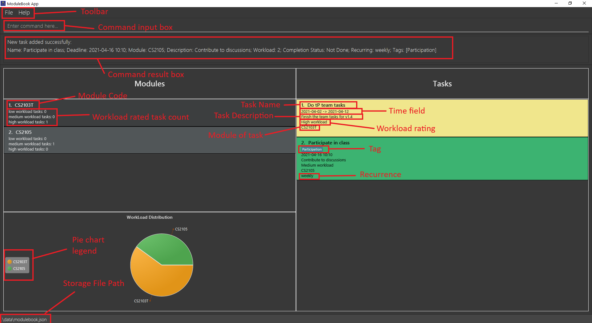
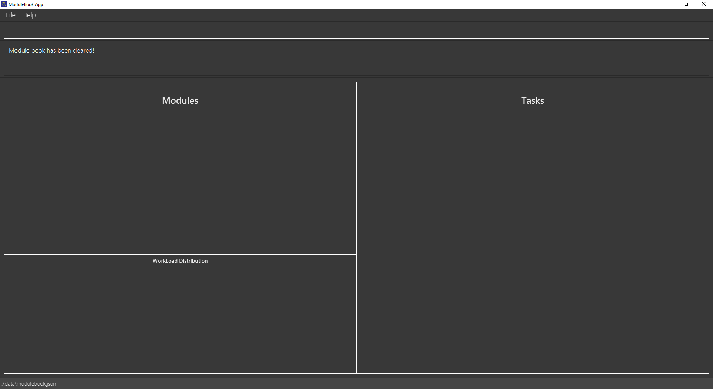
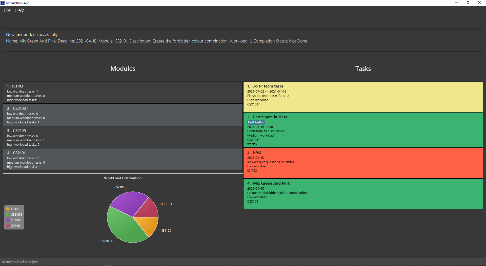
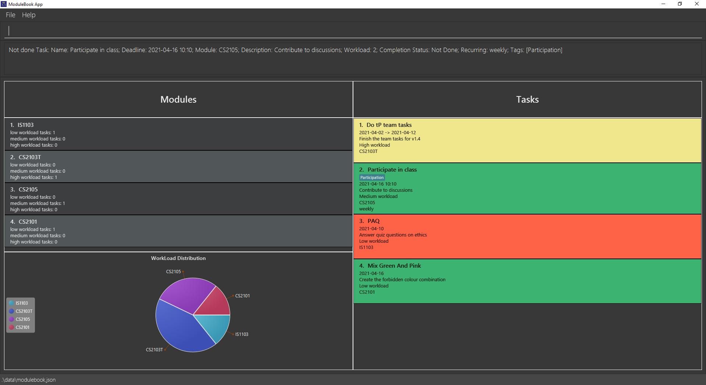
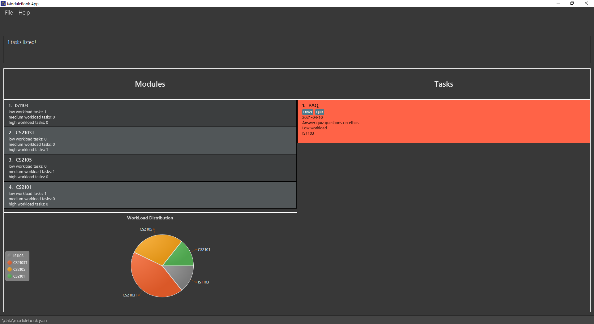
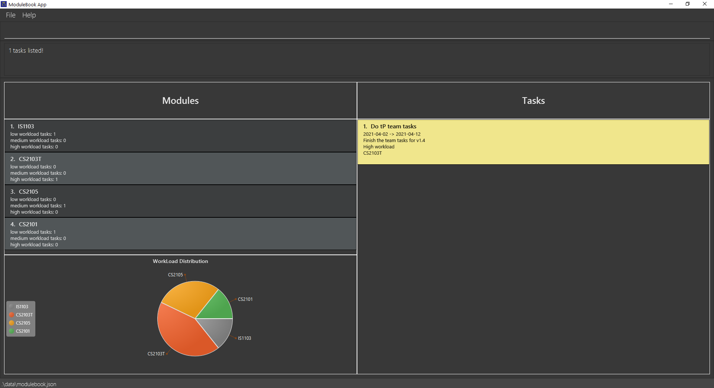
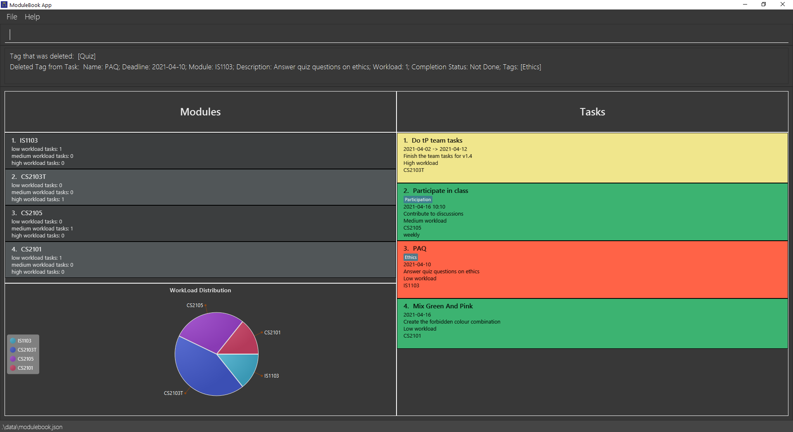
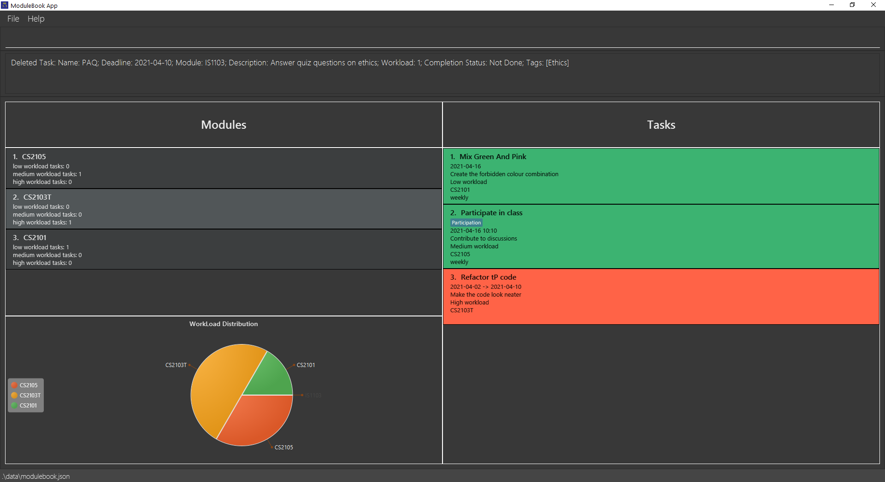

ModuleBook3.5 is the go-to tool for busy students/professionals who are confident that typing can save them time. 
Using ModuleBook3.5, one can organise and keep track of tasks and their deadlines in an 
*Easy, Seamless and Straightforward* manner, all without the need for consistent internet connection. 
Even if your online learning portal fails, you can still see your task details
on ModuleBook3.5.

* Table of Contents
{:toc}
  

--------------------------------------------------------------------------------------------------------------------

## Quick start
1. This user guide is best read at a zoom level of 125% on your browser. 
   For viewing images in greater clarity, you may need to use 150% zoom or above.

1. ModuleBook3.5 can run on a computer installed with a major operating system (e.g. Windows/Mac/Linux) and Java 11.

1. First, download the jar file for the latest release from [github](https://github.com/AY2021S2-CS2103T-T13-2/tp/releases)

1. Once the jar file is ready, simply double-click the file in the download section.

1. Read through the [Features](#Features) section and [Command Notes](#Command Notes) to understand how the application should be used.

1. Go through the tutorial in the given order. Simply look out for blue boxes with a bulb icon and titled "Tutorial Example:", 
   such as the one below.

1. Once you are familiar with the app, you may use the table of contents to jump to a command that you may be unsure of.

:bulb: **Tutorial Example:**
First time using the app? Or want to refresh your handling of the app? Simply look out for these boxes.
Commands for this tutorial are arranged in the sequential order of this User Guide and are accompanied by screenshots.

--------------------------------------------------------------------------------------------------------------------

## Features

* At the top of the display is a toolbar to either exit the app (under `File`) 
   or access this user guide (under `Help`).
   
* Below the toolbar is a command line to key in any of the below commands. 
   The result is displayed in a box underneath this command line.
   
* A list of modules for which tasks are available is also shown.
    1. For each module, the number of tasks across each workload rating is displayed.
    2. The distribution of workload across all modules is calculated and displayed on a pie chart.

:exclamation: **Alert:**
Within the workload pie chart, each module's colour may change as a command is executed. 
However, the colours will be arranged such that no two modules with the same colour will be next to each other.

* The pie chart is used to show workload distribution.
   1. The color of pie chart is randomly assigned.
   2. The workload of each module is counted by summing up the workload counts of all tasks for the module 
      including those that are already done as well as those that are not finished yet.
    
* You can rate a task's expected workload using the following mapping:

Input Parameter | Workload Rating
--------|------------------
**w/1** | Low
**w/2** | Medium
**w/3** | High

E.g. for a low workload rating, key in `w/1`.

* Tasks are colour coded based on done status.
    1. Done tasks are coloured pink.
    2. Tasks that are not done are classified into 4 different categories (colors):

Color | Time to deadline
--------|------------------
**Green** | More than 3 days
**Yellow** | Between 1 to 3 days
**Orange** | Less than 1 day
**Purple** | Expired

## Supported Module Codes

Module Code | Subject Description
--------|------------------
CS1101S | Programming Methodology 
CS1010S | Programming Methodology in Python
CS1231S | Discrete Structures
CS2030 | Programming Methodology II
CS2040S | Data Structures and Algorithms
CS2101 | Effective Communication for Computing Professionals
CS2103T | Software Engineering
CS2105 | Introduction to Computer Networks
CS2106 | Introduction to Operating Systems
CS3103 | Computer Networks Practice
CS3210 | Parallel Computing
CS3212 | Programming Languages
CS3217 | Software Engineering on Modern Application Platforms
CS3219 | Software Engineering Principles and Patterns
CS3220 | Computer Architecture
CS3223 | Database Systems Implementation
CS3225 | Combinatory Methods in Bioinformatics
CS3230 | Design and Analysis of Algorithm
CS3231 | Theory of Computation
CS3233 | Competitive Programming
CS3243 | Introduction to Artificial Intelligence
CS3244 | Machine Learning
IS1103 | Computing Ethics
ST2131 | Probability
    
If your module code does not appear in the above table, 
you may use a substitute module code based on the subject description.

--------------------------------------------------------------------------------------------------------------------
  

## Command Notes

### Parameter Prefixes
Below is a table of prefixes mapped to the respective parameters: 

 Prefix | Parameter | How to Remember 
--------|----------|-------------
n/ | NAME | 
m/ | MODULE | 
d/ | DESCRIPTION | 
a/ | START TIME | "start AT"
b/ | DEADLINE | "finish BY"
w/ | WORKLOAD |
r/ | RECURRENCE |
t/ | TAG |

### Parameter Descriptions

* Words in `UPPER_CASE` are parameters to be supplied by you. 
  e.g. in `add d/DESCRIPTION`, `DESCRIPTION` is a parameter which can be used as `add d/DESCRIPTION`.

* Parameters in square brackets are optional. Parameters without square brackets are compulsory. 
  If you wish to include any optional parameter, you must follow its format,
  otherwise command parsing will fail even if all the compulsory fields are valid. 
  e.g. `d/DESCRIPTION [t/TAG]` can be used as `d/CS3243 Assignment4 t/Minimax` or as `d/CS3243 Assignment4`.

* For commands that take in an `INDEX`, only one index is to be supplied. 
  e.g. `delete 1` will work but `delete 1 3` (2 indices) will not.

* The `INDEX` starts from 1 and is taken relative to the list of tasks that is currently displayed. 
  e.g. If you do `mod CS2101` and a task at position 4 is pushed up to position 1, the `INDEX` for this task
  will be `1` for the next command.

* For `NAME`, the length of name should not be greater than 60 English characters. We do not guarantee a correct display
  with the minimum window size if you exceed this limit. 

* For `DESCRIPTION` and `TAG`, the length of these fields should not be greater than 100 English characters. We do not
  guarantee a correct display with the minimum window size if you exceed this limit. 

* For `MODULE`, the letters in module code should be upper-case. 
  e.g. `CS2103T` and not `cs2103t`.

* For `START TIME` and `DEADLINE`, the accepted date-time formats are: yyyy-MM-dd HH:mm or yyyy-MM-dd (HH:mm taken as current time). 
  e.g. `2021-03-21 10:10` or `2021-03-21`.

* Items with `…`​ after them can be used multiple times including zero times. 
  e.g. `[t/TAG]…​` can be used as ` ` (i.e. 0 times), `t/Minimax`, `t/Minimax t/CSP` etc.

* Parameters can be in any order. 
  e.g. if the command specifies `d/DESCRIPTION t/TAG`, `t/TAG d/DESCRIPTION` is also acceptable.

* If a parameter is expected only once in the command but you specified it multiple times,
  only the last occurrence of the parameter will be taken. Please refer to [Duplicate Parameters](#Duplicate Parameters). 
  e.g. if you specify `d/CS2103T team project for week7 d/CS3243 Assignment 4`, only `d/CS3243 Assignment 4` will be taken.

* Extraneous parameters for commands that do not take in parameters (such as`list`) will be ignored. 
  e.g. if the command specifies `list 123`, it will be interpreted as `list`.
  

### Duplicate Parameters
1. Most commands take in only one instance of a unique parameter. In such cases, the last instance of the parameter is accepted.

1. E.g. For `edit 1 m/CS2103T m/CS2101`, `m/CS2101` is taken as the argument for `MODULE`.

1. All other preceding arguments of the same parameter (including invalid ones) will be ignored.
   In the above example, `m/CS2103T` is ignored.

1. However, if the last argument happens to be invalid, the command will not execute. 
   E.g. for `edit 1 m/CS2101 m/Invalid`, `m/Invalid` will be taken as the module argument, which is invalid. 
   Even though m/CS2101 is valid, it is ignored entirely.
   
1. Tag prefix for `add`, `tag` and `edit` commands are an exception. 
   All arguments with `t/` prefix will be accepted for processing.
   
1. For 2 or more tags which share the same spelling, only the first tag is accepted. 
   Note that tag spelling check is case-insensitive. This also means that if a blank `t/` is passed in, 
   the app will give an error message due to the tag being empty.
   E.g. for `tag 1 t/quiz t/QUIZ, t/Quiz`, only `t/quiz` is accepted and the actual tag will be spelt as `quiz`.

--------------------------------------------------------------------------------------------------------------------

## Command list
This list serves to categorise commands based on similarities in functionality and are not arranged in tutorial order:

* [**`list`**](#list-out-tasks--list) : List out tasks

* [**`add`**](#add-a-task-add) : Add a task

* [**`clear`**](#delete-all-tasks-clear) : Delete all tasks

* [**`delete`**](#delete-a-task--delete) : Delete a task

* [**`done`**](#mark-a-task-as-done--done) : Mark a task as done

* [**`notdone`**](#mark-a-task-as-not-done--notdone) : Mark a task as not done

* [**`tag`**](#add-tags-tag) : Add a tag to a task

* [**`find`**](#search-tasks-with-name-of-task-find) : Search for tasks with name

* [**`findTag`**](#search-tasks-with-tag-findtag) : Search for tasks with tag

* [**`deleteTag`**](#delete-tag-of-task-deletetag) : Delete a tag of a task

* [**`mod`**](#search-tasks-associated-to-a-module-mod) : Search for tasks of a specific module

* [**`edit`**](#edit-a-task-edit) : Edit task

* [**`sort`**](#sort-tasks--sort) : Sort tasks

* [**`recur`**](#recur-tasks-recur) : Recur tasks

* [**`refresh`**](#refresh-all-tasks-refresh) : Refresh all showing tasks

* [**`exit`**](#close-app-exit) : Close the app

--------------------------------------------------------------------------------------------------------------------

### Delete all tasks: `clear`

Deletes all tasks from the module book.

Application: Used to clear out module book after a school term ends.

Format: `clear`

:bulb: **Tutorial Example:**
For this tutorial, let's start by clearing out any existing tasks. Type: 
`clear` in the command line and press `ENTER` on your keyboard.

--------------------------------------------------------------------------------------------------------------------

### Add a task: `add`

Adds a task to ModuleBook3.5. All newly added tasks are not done by default.

Application: Used to add new tasks for tracking purposes.

Format: `add n/TASK NAME m/MODULE d/DESCRIPTION [a/START TIME] b/DEADLINE w/WORKLOAD [r/RECURRENCE] [t/TAG]…​`

* If you wish to include a start time for your task, the start time should not be later than deadline.

* Recurrence should be either "daily", "weekly" or "biweekly".

* Enter the time you wish to complete your task in any of these formats: 
  * yyyy-MM-dd HH:mm
  * yyyy-MM-dd (HH:mm set to 00:00)

:bulb: **Tutorial Example:**
Now, key in the following commands in this order: 
1. `add n/Do tP team tasks m/CS2103T d/Finish the team tasks for v1.4 w/3 a/2021-04-02 b/2021-04-12` 
2. `add n/Participate in class m/CS2105 d/Contribute to discussions w/2 b/2021-04-16 10:10 r/weekly t/Participation` 
3. `add n/PAQ m/IS1103 d/Answer quiz questions on ethics w/1 b/2021-04-10` 
4. `add n/Mix Green And Pink m/CS2101 d/Create the forbidden colour combination w/1 b/2021-04-16` 
Note that your tasks may have a different colour from the one in the screenshots.

Other Examples:
* `add n/v1.2 TP m/CS2103T d/implement basic features b/2021-03-13 23:59 w/3 t/urgent`
* `add n/practice sets m/CS3230 d/practice master's theorem a/2021-03-14 00:00 b/2021-03-15 00:00 w/1 r/weekly`

--------------------------------------------------------------------------------------------------------------------

### Mark a task as done : `done`

Mark an existing task as done. Done tasks are coloured green.

Application: Used to indicate task is completed and does not need any attention at the moment.

Format: `done INDEX`

* Mark the task as done at the specified `INDEX`.
* The index refers to the index number shown in the displayed task list.
* The index **must be a positive integer** 1, 2, 3, …​

:bulb: **Tutorial Example: **
`done 2`

Other Examples:
* `list` followed by `done 2` marks the 2nd task as done in the ModuleBook3.5.
* `find Quiz` followed by `done 1` marks the 1st task in the results of the `find` command as done.

--------------------------------------------------------------------------------------------------------------------

### Mark a task as not done : `notdone`

Mark an existing task as not done. Not done tasks are coloured pink.

Application: Used to indicate task may need to be re-attempted.

Format: `notdone INDEX`

* Mark the task as not done at the specified `INDEX`.
* The index refers to the index number shown in the displayed task list.
* The index **must be a positive integer** 1, 2, 3, …​

:bulb: **Tutorial Example: **
`notdone 2`

Other Examples:
* `list` followed by `notdone 2` marks the 2nd task as not done in the ModuleBook3.5.
* `find Quiz` followed by `notdone 1` marks the 1st task in the results of the `find` command as not done.

--------------------------------------------------------------------------------------------------------------------

### Add tag(s): `tag`

Adds a tag or multiple tags to a task.

Application: Used to briefly indicate the nature of the task.

Format: `tag INDEX t/TAG [t/MORETAGS]...​` 

* Attaches one or more tags to the task associated with INDEX. Tags can be used to identify related tasks.
* If only `t/` is provided without any value, no new tag will be added.

:bulb: **Tutorial Example: **
`tag 3 t/Ethics t/Quiz`

Other Examples:
* `tag 1 t/SoftwareEng` adds `SoftwareEng` tag to task 1.
* `tag 3 t/Participation` adds `Participation` tag to task 3.

--------------------------------------------------------------------------------------------------------------------

### Search tasks with name of task: `find`

Searches for tasks with a name of task provided.

Application: Used to find a certain task that may be further down the list.

Format: `find KEYWORD`

* Searches through ModuleBook3.5 for tasks whose names contain `KEYWORD`.
* You may key in multiple keywords. ModuleBook3.5 will list down all tasks that contains any of the given keyword.
* Once another command is executed, even if it is not `list` command, the original unfiltered task list is restored for viewing.

:bulb: **Tutorial Example: **
`find Green` (Here, we are not looking for tasks that are coloured green, 
but rather, tasks that have the word "Green" in their names.)

--------------------------------------------------------------------------------------------------------------------

### List out tasks : `list`

Shows a list of all tasks you have added.

Application: Used to display all tasks if you previously entered a command meant to show only certain tasks like `find`.

Format: `list`

:bulb: **Tutorial Example: **
`list`

--------------------------------------------------------------------------------------------------------------------

### Search tasks with tag: `findTag`

Searches for tasks with an associated tag. Tag is case-insensitive for your convenience.

Application: Used to find tasks that tend to have the same tags due to similarities between them.

Format: `findTag KEYWORD`

* Searches through ModuleBook3.5 for tasks which have a tag named `KEYWORD`.
* Only allows one tag as input. The rest will be ignored.
* Tag provided must be alphanumerical.
* Once another command is executed, even if it is not `list` command, the original unfiltered task list is restored for viewing.

:bulb: **Tutorial Example: **
`findTag ethics` (To demonstrate that finding tags is case-insensitive.)

--------------------------------------------------------------------------------------------------------------------

### Search tasks associated to a Module: `mod`

Searches for tasks of a specific Module from all tasks.

Application: Used to find tasks from one Module.

Format: `mod MODULE`

* Searches through ModuleBook3.5 for tasks which belong to `MODULE`.
* Once another command is executed, even if it is not `list` command, the original unfiltered task list is restored for viewing.

:bulb: **Tutorial Example: **
`mod CS2103T` (Note that although the CS2103T task is not shown after applying the previous tutorial command,
this command still works.)

Other Examples:
* `mod CS3243` lists out tasks associated with module CS3243.

--------------------------------------------------------------------------------------------------------------------

### Delete tag of Task: `deleteTag`

Deletes a tag from its associated task. Tags are case-insensitive, so a tag with the same spelling (regardless of case)
will be deleted.

Application: Used to remove a tag without the need to reset all other tags.

Format: `deleteTag INDEX t/TAG`

* Deletes the task at the specified `INDEX`. 
  The index refers to the index number shown in the displayed task list. 
  The index must be a positive integer 1, 2, 3, …​

:bulb: **Tutorial Example: **
1. `list` (You need to key this in first to see all tasks) 
2. `deleteTag 3 t/Quiz`

--------------------------------------------------------------------------------------------------------------------

### Edit a task: `edit`

Edits an existing task in the module book.

Application: Used to change details of a task without the need to delete them.

Format: `edit INDEX [n/NAME] [m/MODULE] [d/DESCRIPTION] [a/START TIME] [b/DEADLINE] [w/WORKLOAD] [r/RECURRENCE] [t/TAG] …​`

* Edits the task at the specified `INDEX`. The index refers to the index number shown in the displayed task list. The index **must be a positive integer** 1, 2, 3, …​
* At least one of the optional fields must be provided.
* Recurrence should be either "daily", "weekly" or "biweekly".
* Existing values will be updated to the input values.
* If you wish to include a start time for your task, the start time should not be later than deadline.
* Editing tags through the `edit` command overrides all existing tags. 
  If you wish to add or delete only certain tags, use `tag` and `deleteTag` commands instead.
* `edit INDEX t/` is provided as a mean to clear all tags for a task, you cannot add tags while clear other tags. For example, `edit 1 t/ t/tag`.

:bulb: **Tutorial Example: **
`edit 1 n/Refactor tP code d/Make the code look neater b/2021-04-10`

In this screenshot, the colour of task 1 changed because the new deadline is closer.

Other Examples:
*  `edit 1 d/Finish User Guide` Edits the description of the 1st task to `Finish User Guide`.
*  `edit 2 d/Finish User Guide b/2021-03-21 10:10` Edits the description of the 2nd task to be `Finish User Guide` and its deadline to date `2021-03-21 10:10`.
*  `edit 2 b/2021-03-25` Edits the deadline of the 3rd task to `2021-03-25`

--------------------------------------------------------------------------------------------------------------------

### Sort tasks : `sort`

Sorts the list of all tasks by one attribute of the tasks. If no prefix is supplied, the tasks will be sorted by deadline.

Application: Used to group and prioritise tasks based on a certain criteria.

Format:  `sort` or `sort n/` or `sort d/` or `sort m/` or `sort w/` or `sort b/` or `sort t/` 

*  `sort n/` Sorts the tasks by name alphabetically in ascending order.
*  `sort d/` Sorts the tasks by the length of description in descending order.
*  `sort w/` Sorts the tasks by workload in descending order.
*  `sort` or `sort b/` Sorts the tasks by deadline so that a task with a closer deadline appears towards the top of the list.
*  `sort m/` Sorts the tasks by module code alphabetically in descending order.
*  `sort t/` Sorts the tasks by number of tags in descending order.

:bulb: **Tutorial Example: **
`sort n/`

--------------------------------------------------------------------------------------------------------------------

### Recur tasks: `recur`

Recurs a task either daily, biweekly or weekly or removes the recurrence of the task.

Application: Used to reset the recurring task deadline and done status when appropriate without having to manually edit the task.

Format: `recur INDEX r/RECURRENCE`

* Recurs the task at the specified `INDEX`.
* `INDEX` refers to the index number displayed in ModuleBook3.5.
   It must be a positive integer.
* `RECURRENCE` refers to the regularity of the task that recurs periodically.
* `RECURRENCE` can only be `daily`, `weekly` or `biweekly` if a task needs to be recurred.
* `RECURRENCE` should be left empty if the recurrence of a task needs to be removed.
   The prefix `r/` must still be used.
  

:bulb: **Tutorial Example: **
`recur 1 r/weekly`

Other Examples:
* `recur 1 r/biweekly` Recurs the 1st task in ModuleBook3.5 every two weeks.
* `recur 2 r/weekly` Recurs the 4th task in ModuleBook3.5 every week.
* `recur 3 r/daily` Recurs the 3rd task in ModuleBook3.5 every day.
* `recur 4 r/` Removes the recurrence of the 4th task in ModuleBook3.5.

### Refresh all tasks: `refresh`

Refreshes the current list that is showing, updates the deadline if necessary.

Application: Used to update deadlines based on recurrences. Also done automatically.

Format: `refresh`

:bulb: **Tutorial Example: **
1. `edit 1 b/2021-04-09` (Let's set this task to have a deadline that is past) 
2. `refresh` 

Note that you may get a new deadline for task 1 that is different from what is in the screenshot.

--------------------------------------------------------------------------------------------------------------------

### Delete a task : `delete`

Deletes the specified task from the module book.

Application: Used to remove tasks when tracking them is no longer necessary.

Format: `delete INDEX`

* Deletes the task at the specified `INDEX`.
* The index refers to the index number shown in the displayed task list.
* The index **must be a positive integer** 1, 2, 3, …​

:bulb: **Tutorial Example: **
`delete 2`

Other Examples:
* `list` followed by `delete 2` deletes the 2nd task in the ModuleBook3.5.
* `find CS2103T` followed by `delete 1` deletes the 1st task in the results of the `find` command.

--------------------------------------------------------------------------------------------------------------------

### Close app: `exit`

Closes the app.

Application: Used to exit the app. You may also click the close button or the `Exit` button under `File` in the toolbar.

Format: `exit`

--------------------------------------------------------------------------------------------------------------------

### Save data

ModuleBook3.5 data is saved in the hard disk automatically after any command that changes the data. There is no need to save manually.

--------------------------------------------------------------------------------------------------------------------

### Edit the data file

ModuleBook3.5 data is saved as a JSON file `[JAR file location]/data/modulebook.json`. Advanced users are welcome to update data directly by editing that data file.

:exclamation: **Caution:**
If your changes to the data file makes its format invalid, ModuleBook3.5 will discard all data and start with an empty data file at the next run.

--------------------------------------------------------------------------------------------------------------------

## FAQ
**Q**: I tried double-clicking the jar file but it did not open. What happened? 
**A**: Try checking if any security software is blocking the jar file. If that still does not work, navigate to command prompt and run the following command:
`java -jar modulebook.jar`

**Q**: How do I transfer my data to another Computer? 
**A**: Install the app in the other computer and overwrite the empty data file it creates with the file that contains the data of your previous ModuleBook3.5 home folder.

--------------------------------------------------------------------------------------------------------------------

## Command summary

Action | Format, Examples
--------|------------------
**list** | `list`
**add** | `add n/TASK NAME m/MODULE d/DESCRIPTION [a/START TIME] b/DEADLINE w/WORKLOAD [r/RECURRENCE] [t/TAG]…​`   e.g. `add n/TP m/CS2103T d/Team tasks b/2021-01-20 20:00 w/3 t/tagname`
**delete** | `delete INDEX`  e.g. `delete 3`
**clear** | `clear`
**deleteTag** | `deleteTag INDEX [t/TAG NAME]`  e.g. `delete 3 [t/SoftwareEng]`
**done** | `done INDEX`  e.g. `done 1`
**notdone** | `notdone INDEX`  e.g. `notdone 1`
**tag** | `tag INDEX [t/TAG NAME]`  e.g. `tag 1 [t/SoftwareEng]`
**find** | `find KEYWORD`  e.g. `find Assignment`
**findTag** | `findTag KEYWORD`  e.g. `find Assignment`
**mod** | `mod MODULE`  e.g. `mod CS2103T`
**edit** | `edit INDEX [d/DESCRIPTION] [b/DEADLINE]…​`  e.g. `edit 2 d/Finish User Guide b/2021-03-21 10:10`
**recur** | `recur INDEX r/RECURRENCE`  e.g. `recur 1 r/biweekly`
**refresh** | `refresh`
**sort** | `sort` or `sort n/` or `sort d/` or `sort m/` or `sort w/` or `sort b/` or `sort t/`   e.g. `sort b/`
**exit** | `exit`
