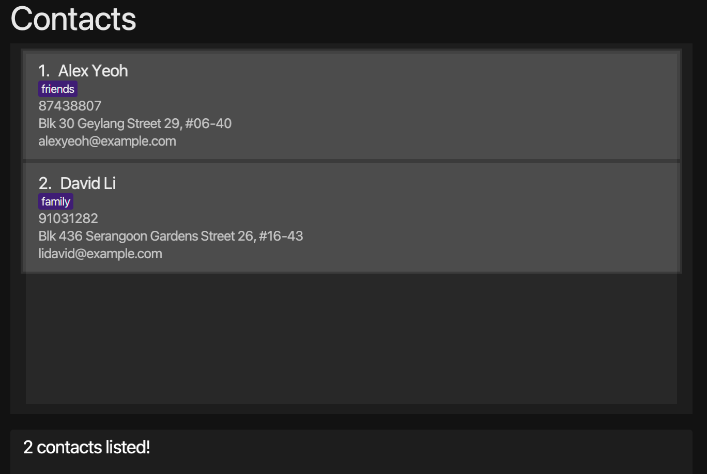

<div style="text-align: center">
   
</div>

Our world is more connected than ever. There are numerous interactions between multiple people daily in our lives. 
As we move forward towards more of an asynchronous and remote way of living, daily interactions become more transient and harder to remember. 
FriendDex aims to act as a tool to bridge that gap so that interactions become more permanent. FriendDex will empower you to have better relationships with people around you.

Welcome to the FriendDex User Guide. FriendDex, a portmanteau of Friend and Pokedex, is a relationship management tool, catered to those who would like to maintain their personal relationships without compromising on other aspects of their life. 
A good example is students who are struggling to do well in both their studies and social life. Managing your relationships should not be any more tedious than doing your laundry.

FriendDex uses a command line interface; this means that you type commands to interact with the application. 

To help you get started, we recommend reading the [Installation](#installation) and [Quick Start](#quick-start) sections first.

* Table of Contents
{:toc}

--------------------------------------------------------------------------------------------------------------------
## About
This document can be thought of as a manual and reference guide for FriendDex. It will guide you on how to use FriendDex and will provide complete information on all available commands.
Furthermore, the guide gives information on the User Interface (UI) and the other useful features of FriendDex. Each section of the guide can be read independently.
For an outline of the content in this document, refer to the Table of Contents above. You may also use your document viewer’s Find function to quickly navigate to the content you want to know more about.

It is generally advisable for new users to visit the [Installation](#installation) and [Quick Start](#quick-start) section first to install and familiarise themselves with FriendDex.

### Symbols

Note the following symbols and formatting used in this document:


<div markdown="block" class="alert alert-info">
`list n/Close Friends` <br>
* This grey highlight, also known as markup, is used to distinguish parts of the document from normal text. For example, it can be used to indicate the syntax of commands.
</div>

<div markdown="block" class="alert alert-info">
:information_source: **Notes:**<br>

* This block is used for detailing information about formatting, handling exceptional cases or special keywords used in the corresponding section.
</div>

<div markdown="span" class="alert alert-primary">
:bulb: **Tip:**
This block is used to provide you extra details about the feature that will enable you to use it more effectively.
</div>

<div markdown="span" class="alert alert-warning">
:exclamation: **Caution:** This block is used to point out any dangerous actions that may result in the loss of data or the app crashing.
</div>

--------------------------------------------------------------------------------------------------------------------

## Installation

1. Ensure you have Java `11` or above installed in your Computer. Your Computer's operating system (OS) needs to be Windows, macOS or Linux, and the OS version you are using should still be supported by the respective companies.
   For more detailed Java installation instructions, please click [here](https://docs.oracle.com/en/java/javase/11/install/preface.html#).

2. Download the latest `frienddex.jar` from [here](https://github.com/AY2021S2-CS2103T-W14-1/tp/releases).

3. Copy the jar file to the folder you want to use as the _home folder_ for FriendDex.

4. Double-click the jar file to start the app. The GUI similar to the image below should appear in a few seconds. Note how the app contains some sample data. Once the GUI finishes loading, you are ready to start using FriendDex.<br>
   
   
5. You can move on to the [Quick Start](#quick-start) section to learn about the common operations for FriendDex.

--------------------------------------------------------------------------------------------------------------------

## Quick Start

1. Once FriendDex is installed, you first want to begin by populating it with your friends’ information. You might notice that FriendDex comes with some sample data. You may remove this sample data using the `clear` command.

2. To add a person to the FriendDex, you may use the `add` command followed by their relevant details. 
   For example, you have a friend, John Doe, with the following particulars:

   Friend Detail  | Value
   ---------------|------------------
   Phone number | 98765432
   E-mail | johnd@example.com 
   Address | John street, block 123, #01-01
   Birthday | 19th January 1998
   
   Using the `add` command, type the following into the command bar to execute it and John will be added into FriendDex.
    * `add n/John Doe p/98765432 e/johnd@example.com a/John street, block 123, #01-01 b/19-01-1998`
<br/><br/>

3. If you made a mistake while adding a person, you can easily amend it with the `edit` command. 
    For example, changing the phone number of John Doe to ‘87654321’. Assuming John is the first person in the list of friends on the screen, you may use the `edit` command as follows,
    * `edit 1 p/87654321`
<br/><br/>    

4. Now that you have populated the app, you are ready to explore the various relationship management features that FriendDex has to offer. Here are some things you can try:
    * `set-goal` : Set a goal for how often you would like to meet a friend
    * `add-meeting` : Record details about a meeting you’ve had with a friend
    * `add-group` : Categorise and group your friends on the app (e.g. RC neighbours, CCA mates)
    * `add-date` : Record special dates for a friend (e.g. Anniversary)
<br/><br/>
    
5. FriendDex comes with a built-in autocomplete feature, so there's no need to memorise any of the commands. If you need help with the commands, a thorough documentation for each command is provided [here](#features), complete with usage instructions and examples.

--------------------------------------------------------------------------------------------------------------------

## UI 


### Group Panel
The left panel of FriendDex shows the list of groups that are available in the application.

To list the friends within a specific group, use `list n/GROUP_NAME`. See [List Command](#listing-all-persons--list) for more details.

### Friend Panel
The centre panel shows the currently listed friends in the application.
Commands such as `list`, `find`, `add`, `clear`, `delete` will change the listed friends. 
See [Features](#features) for more details. 

### Details Panel
The right panel of FriendDex is a multi-purpose details panel. It displays upcoming events by default, and can be toggled to display different information. 
The available dashboards are detailed below.

#### Upcoming Events
By default, FriendDex displays your upcoming events on the details panel, such as upcoming birthdays and special dates.

#### Streaks Dashboard
The Streaks dashboard shows how consistent you are in meeting your friends up till today. More information on Streaks is available [here](#streaks).

#### Full Details of a Person
As a person in the FriendDex can contain a lot of information, not all of it is displayed in the main list of persons.
Upon execution of the `details` command, FriendDex will display the full details of the specified person on the details panel. See [Details Command](#viewing-full-details--details) for more details.

### Autocomplete


There is no need to remember commands as FriendDex will suggest them to you as you type. To use a suggested command, press `up`/`down` to the desired command and hit `enter`.
The suggested command will be automatically filled into the command bar.

--------------------------------------------------------------------------------------------------------------------

## Friends

FriendDex allows you to store certain information about your friends, so you don't have to.
The information below provides further description about your friends' details you can store.

Further description on how to add/modify these fields are provided in the [Features](#features) section.

### Name

Your friend's name, so you don't have those embarrassing moments where you forget their name.

This field is what uniquely identifies each friend in FriendDex.
Names are case-insensitive in FriendDex. This means that FriendDex interprets "John Doe" and "JoHn DoE" as the same name.

### Phone Number

Your friend's phone number, so you don't have to remember their phone number everytime you call.

This field should only contain numbers and should at least be 3 digits long.

### Address

Your friend's home address so that you don't have to remember their address whenever you want to hang out with them.

This field can take any values, but it should not be blank.
It is okay for two friends to share the same address.

### Birthday

Your friend's birthday so that you don't forget one of their most important days of the year.

This field should follow the following date format: `dd-MM-yyyy` e.g `01-01-2020`.
This field additionally should not be a date from the future.

### Debt

The amount of debt you owe to your friend so that you can pay back your dues. 

A positive amount of debt would mean that your friend owe you the specified amount.
A negative amount of debt would mean that you owe your friend the specified amount instead.

Whenever a friend is added, the debt is automatically 0. The range of this debt is from -999,999,999,999 to 999,999,999,999.

### Special Dates

Special Dates that you would like to be reminded of yearly so that you can celebrate them whenever the date draws near.

### Meetings

Meetings you had with your friend that you would like to record the details of so.

FriendDex additionally allows you to [set meeting goals](#setting-meeting-goal-set-goal) so you can be reminded of when to
schedule your next meeting with your friend.

--------------------------------------------------------------------------------------------------------------------
## Features

<div markdown="block" class="alert alert-info">

**:information_source: Notes about the command format:**<br>

* Words in `UPPER_CASE` are the parameters to be supplied by the user.<br>
  e.g. in `add n/NAME`, `NAME` is a parameter which can be used as `add n/John Doe`.

* Items in square brackets are optional.<br>
  e.g. `n/NAME [t/TAG]` can be used as `n/John Doe t/friend` or as `n/John Doe`.

* Items with `…`​ after them can be used multiple times including zero times.<br>
  e.g. `[t/TAG]…​` can be used as ` ` (i.e. 0 times), `t/friend`, `t/friend t/family` etc.<br>

* Parameters can be in any order.<br>
  e.g. if the command specifies `n/NAME p/PHONE_NUMBER`, `p/PHONE_NUMBER n/NAME` is also acceptable.

* If a parameter is expected only once in the command, but you specified it multiple times, only the last occurrence of the parameter will be taken.<br>
  e.g. if you specify `p/12341234 p/56785678`, only `p/56785678` will be taken.

* Extraneous parameters for commands that do not take in parameters (such as `help`, `exit` and `clear`) will be ignored.<br>
  e.g. if the command specifies `help 123`, it will be interpreted as `help`.
  
* The `INDEX` parameter in a command will refer to the index number shown in the currently displayed person list. The index **must be a positive whole number** 1, 2, 3, ...​
  e.g. `edit 2 n/Gregory` will change the name of the 2nd person on the displayed person list to Gregory.

</div>

### Adding a person : `add`

Adds a person to FriendDex.

Format: `add n/NAME p/PHONE_NUMBER e/EMAIL a/ADDRESS b/BIRTHDAY [t/TAG]…​`

* FriendDex only allows unique friends to be added. This means that each friend should only have a single entry in FriendDex.
* FriendDex determines uniqueness solely based on the person's names ignoring their letter case, i.e. `John Tan` and `JoHn TaN` are the same name.
* FriendDex only allow alphanumeric characters (A - Z, a - z, 0 - 9).

<div markdown="span" class="alert alert-primary">:bulb: **Tip:**
You can provide any number of tags (including 0)
</div>

Examples:
* `add n/John Doe p/98765432 e/johnd@example.com a/John street, block 123, #01-01 b/19-01-1998`
* `add n/Betsy Crowe t/friend e/betsycrowe@example.com b/19-03-1998 a/Newgate Prison p/1234567 t/criminal`

See also:
* [What is a valid email format?](#faq)

### Adding a special date : `add-date`

Adds a special date for an existing person in FriendDex.

Format: `add-date INDEX d/DATE desc/DESCRIPTION`

* Adds a special date with the person at the specified `INDEX`.

<div markdown="block" class="alert alert-info">
:information_source: **Notes: Special dates**<br>

* A special date is a date that repeats annually, e.g. Anniversaries.
* The event that the special date is commemorating should have already occurred.
</div>

Examples:
* `add-date 1 d/16-02-2021 desc/Anniversary`
* `add-date 2 d/17-02-2021 desc/Dog's birthday`

### Adding debt : `add-debt`

Adds a specified amount to the debt owed to the friend at the specified `INDEX`.

Format: `add-debt INDEX DEBT_AMOUNT`

<div markdown="block" class="alert alert-info">

:information_source: **Notes: Add Debt Command**<br>

* `DEBT_AMOUNT` provided should be a **positive number** of up to 2 decimal places
  e.g `10.10` or `10.1000` and **not** `10.103`.
* `DEBT_AMOUNT` provided should be within the range of from 0 to 999,999,999,999.
* Adding by `DEBT_AMOUNT` should not cause the friend's debt to be above the limit given in [Debt](#debt)
</div>

Examples:
* `add-debt 1 100` adds 100 to the debt owed to the 1st listed friend.

### Adding a friend group : `add-group`

Creates a new friend group to FriendDex with a specified name and adds all the people at the specified
indexes to the group.

Format: `add-group n/GROUP_NAME p/INDEX…​`

* You need to provide at least one index.
* If the group name you provided already exists, the friends at the specified `INDEX…​` will be added to the group.
* If some friends specified already exist in the group, they will be ignored.
* Each group needs to have a unique name, ignoring their letter case, i.e. `Friends` and `frIeNds` are the same group.   

Examples:
* `add-group n/Close Friends  p/1 2 3 4 5`

### Adding a meeting : `add-meeting`

Records a meeting with an existing person in FriendDex.

Format: `add-meeting INDEX d/DATE t/TIME desc/DESCRIPTION`

* Records a meeting with the person at the specified `INDEX`.

<div markdown="block" class="alert alert-info">
:information_source: **Notes: Meetings**<br>

* The meeting should have already occurred before it is recorded into FriendDex.
</div>

Examples:
* `add-meeting 1 d/16-02-2021 t/1130 desc/We had lunch together!`
* `add-meeting 2 d/17-02-2021 t/1930 desc/We went to see the sunset!`

See also:
* [Goals](#goals) and [Streaks](#streaks) to learn how FriendDex uses your meeting data to motivate you to meet your friends more!  

### Adding a profile picture : `add-picture`

Adds a profile picture to an existing person in FriendDex.

Format: `add-picture INDEX FILE_PATH`

* The image of the friend should be at the `FILE_PATH` you provided.
* Supported image file extensions: `.png`, `.jpeg` and `.jpg`

Examples:
* `add-picture 1 /Users/john/Desktop/jake.png`

<div markdown="span" class="alert alert-warning">:exclamation: **Caution:**
To edit your profile picture, use the `add-picture` command again.
Editing of pictures directly from the `/data` folder is not supported.
</div>

### Clearing all entries : `clear`

Clears all entries from FriendDex.

Format: `clear`

### Deleting a person : `delete`

Deletes the specified person from FriendDex.

Format: `delete INDEX`

* Deletes the person at the specified `INDEX`.

Examples:
* `list` followed by `delete 2` deletes the 2nd person in FriendDex.
* `find Betsy` followed by `delete 1` deletes the 1st person in the results of the `find` command.

### Deleting a special date : `del-date`

Deletes a special date from an existing person in FriendDex.

Format: `del-date INDEX i/DATE_INDEX`

* Deletes a special date with the person at the specified `INDEX`.

Examples:
* `del-date 1 i/2` deletes the 2nd special date from the 1st listed friend.

### Deleting a friend group: `del-group`

Deletes a friend group from FriendDex with the specified name.

Format: `del-group n/GROUP_NAME`

* The group name provided should already exist in FriendDex.

<div markdown="block" class="alert alert-info">

:information_source: **Notes: Deleting a friend group**<br>

* The command ignores the letter case of the group name, 
  i.e. `del-group n/Close friends` and `del-group n/ClOse FriendS` are the same commands.
</div>

Examples:
* `del-group n/Close Friends`

### Deleting a meeting: `del-meeting`

Deletes a meeting from an existing person in FriendDex.

Format: `del-meeting INDEX i/MEETING_INDEX`

* Deletes a meeting with the person at the specified `INDEX`.

Examples:
* `del-meeting 1 i/3` deletes the 3rd meeting from the 1st person in FriendDex.

### Deleting a profile picture: `del-picture`

Deletes a profile picture from an existing person in FriendDex.

Format: `del-picture INDEX`

* The person selected should already have a profile picture.

### Viewing full details : `details`

Displays the full details of the specified person from FriendDex on the [Details Panel](#details-panel).

Format: `details INDEX`

* Displays the full details of the person at the specified `INDEX`.


Examples:
* `list` followed by `details 2` displays the details of the 2nd person in FriendDex.
* `find Betsy` followed by `details 1` displays the details of the 1st person in the results of the `find` command.

### Editing a person : `edit`

Edits an existing person in FriendDex.

Format: `edit INDEX [n/NAME] [p/PHONE] [e/EMAIL] [a/ADDRESS] [b/BIRTHDAY] [t/TAG]…​`

* Edits the person at the specified `INDEX`.
* At least one of the optional fields must be provided.
* Existing values will be updated to the input values.
* When editing tags, the existing tags of the person will be removed i.e. adding of tags is not cumulative.
* You can remove all the person’s tags by typing `t/` without
  specifying any tags after it.

Examples:
*  `edit 1 p/91234567 e/johndoe@example.com` Edits the phone number and email address of the 1st person to be `91234567` and `johndoe@example.com` respectively.
*  `edit 2 n/Betsy Crower t/` Edits the name of the 2nd person to be `Betsy Crower` and clears all existing tags.

### Exiting the program : `exit`

Exits the program.

Format: `exit`

### Locating persons by name : `find`

Finds persons whose names contain any of the given keywords.

Format: `find KEYWORD [MORE_KEYWORDS] [p/]`

<div markdown="block" class="alert alert-info">

:information_source: **Notes: Find Command**<br>

* The search is case-insensitive. e.g. `hans` will match `Hans`
* The order of the keywords does not matter. e.g. `Hans Bo` will match `Bo Hans`
* Only the name is searched.
* Only full words will be matched e.g. `Han` will not match `Hans`
* Persons matching at least one keyword will be returned (i.e. `OR` search).
  e.g. `Hans Bo` will return `Hans Gruber`, `Bo Yang`
* If the `p/` flag is set, then the argument(s) `KEYWORD [MORE KEYWORDS]` will be treated as a
  [regular expression](https://pubs.opengroup.org/onlinepubs/7908799/xbd/re.html).
</div>

Examples:
* `find John` returns `john` and `John Doe`
* `find alex david` returns `Alex Yeoh`, `David Li`<br>
  
* `find ^a.*h$ p/` return contacts with names that starts with `a` and ends with `h`: `Alex Yeoh`

Note that the [Java regex engine](https://docs.oracle.com/javase/7/docs/api/java/util/regex/Pattern.html) conforms to PERL5 regex specification and thus PERL5 regex should be used.

### Viewing help : `help`

Shows a message explaining how to access the help page.


Format: `help`

### Listing all persons : `list`

Shows a list of all persons in FriendDex.

<div markdown="span" class="alert alert-primary">:bulb: **Tip:**
You can optionally provide a group name to list all friends in that group. 
The group names provided are case-insensitive (i.e. `Friends` and `FrIenDs` will match the same group).
</div>

Format: `list [n/GROUP_NAME]`

Example:
* `list n/Primary School` to list persons in the `Primary School` group
* `list` to list all persons in FriendDex

### Setting meeting goal: `set-goal`

Format: `set-goal INDEX f/FREQUENCY`

* Sets a goal to achieve an ideal frequency for meeting a contact
* FriendDex will set a deadline to meet the contact based on the frequency specified and the latest meeting the user had with that person.
* Accepts the following as FREQUENCY: weekly (`w`, `week`, `weekly`), monthly (`m`, `month`, `monthly`), yearly (`y`, `year`, `yearly`), and none (`n`, `none`).
* See [Goals](#goals) to learn more about how deadlines are calculated. 

Example:
* `set-goal 1 f/w`, `set-goal 1 f/week` and `set-goal 1 f/weekly` will do the same thing by setting the goal to meet the person at index 1 every week.
* `set-goal 1 f/n` and `set-goal 1 f/none` will remove the goal set with the person at the specified index.

### Subtracting debt: `subtract-debt`

Subtracts a specified amount to the debt owed to the friend at the specified `INDEX`.

<div markdown="block" class="alert alert-info">

:information_source: **Notes: Subtract Debt Command**<br>

* `DEBT_AMOUNT` provided should be a **positive number** of up to 2 decimal places,
  e.g `10.10` or `10.1000` and **not** `10.103`.
* `DEBT_AMOUNT` provided should be within the range of from 0 to 999,999,999,999.
* Subtracting by `DEBT_AMOUNT` should not cause the friend's debt to be below the limit given in [Debt](#debt)
</div>

Format: `subtract-debt INDEX DEBT_AMOUNT`

Examples:
`subtract-debt 1 100` subtracts 100 to the debt owed to the 1st listed friend.

### Styling the application : `theme`

Applies a colorscheme to the application based on the supplied theme.

Format `theme THEME`

* Applies the theme specified by the argument `THEME`.
* FriendDex is shipped with the following preinstalled themes:
  * `monokai`
  * `sweetlove`
  * `pulp`
  * `paraiso-light`
* To apply a preinstalled theme, prepend it with an `@`.
* Applied themes will persist for subsequent sessions. 

<div markdown="span" class="alert alert-primary">
:bulb: **Tip:**
You can also define your own theme. Find out more [here](#defining-your-own-theme). To apply a custom theme, 
pass the file path to the custom theme as the `THEME` parameter.     
</div>

Example:
* `theme @monokai` applies the `monokai` theme to the application.
* `theme /Users/john/Desktop/themes/solarized.dark.json` applies the custom theme found at the given file path to the application.

See also:
* [Defining your own Theme](#defining-your-own-theme)

### Viewing a different tab on the details panel: `view`

Updates the [Details Panel](#details-panel) to display the specified tab. Available tabs:
* Upcoming Events (`upcoming events`)
* Streaks (`streaks`)

Format: `view (upcoming events | streaks)`

* You can find more information on the Streaks dashboard [here](#streaks-dashboard)

Example:
* `view streaks` will display the Streaks dashboard on the details panel.
* `view upcoming events` will display upcoming events on the details panel.

--------------------------------------------------------------------------------------------------------------------

## Goals
### How are goal deadlines calculated?

If the ideal frequency to meet a friend is weekly, the deadline to meet will always be on the Sunday of every week. 
To give an example, you met your friend on Wednesday this week. You have completed your goal of meeting your friend every week for this week.
The deadline for the next meeting will be the next Sunday after the coming Sunday. You can think of it as weekly assignments. 
If your assignment is due every Sunday and you complete the current week's assignment on Wednesday. The next weekly assignment will be due two Sundays after.   

The same idea goes for calculating the goal deadline for monthly and yearly. A monthly goal's deadline will always fall on the last day of the month. 
A yearly goal's deadline will always fall on the last day of the year. To illustrate, assume that you have set a monthly goal of meeting your friend. 
The last time you met your friend was on 13th March. Since you have already achieved your goal of meeting your friend for the month of March, you have to meet your friend
again by 30th April to ensure that you always meet your friend once a month.

## Streaks

A streak is a number that shows how consistent you've met your goal of meeting a friend. Your streak increases if you've met a friend. Simply put, if you have a high streak with a friend, you've made meeting that friend a routine!
It is recommended to have a good understanding of how goal deadlines are calculated before reading this section. Refer to [here](#how-are-goal-deadlines-calculated) for the relevant information.

### The dashboard


You will be rewarded if you managed to stick to your goal consistently. You can maintain a streak (think of it as Snapchat's Streak feature) with a friend if you have been meeting him/her regularly.
To ensure that you are able to see your friend's name on the Streaks dashboard, they need to have a goal set to them first. More information on setting goal can be found [here](#setting-meeting-goal-set-goal). 
To reiterate, your friend will only appear on the dashboard if you explicitly set a goal. Just recording meetings with them will not work.

The dashboard can be viewed by running the `view streaks` command. The Streaks dashboard will show up on the details panel on the right of FriendDex. 
It will contain a list of friends and their streak indicated by a number beside their name. The dashboard will be sorted in descending order with the friend that has the highest streak right at the top.

### How are streaks calculated?

For those who have not used Snapchat before, do not fear. We will try our best to give a detailed explanation here. 

Streaks are calculated relative to the date today. A year has approximately 52 weeks. Assume that your friend, John, has a weekly meeting goal set and the current week is week 10, 
you started to meet your friend on week 7 and you consistently met him for weeks 8 and 9 but not yet on week 10. John's streak will be 3 on week 10. 
If you managed to meet him on week 10, his streak will be incremented by 1, to 4. However, if you did not meet him in week 10 and once the Monday of week 11 reaches, John's streak will 
be reset back to 0. The goal deadline for weekly goals is 11:59pm on Sundays. Since you did not manage to meet John for the whole of week 10, you failed to keep to your goal of meeting 
John weekly and so the streak resets. 

Streaks for monthly and yearly goals are calculated the same way. You can switch the week numbers to months or years. Another thing to note is if you have already achieved the goal
for that time period (e.g. week) for a particular friend, any additional meetings with that friend during the same period will be added to his/her streak.   

## Data Storage
### Saving the data

FriendDex data is saved in the hard disk automatically after any command that changes the data. There is no need to save manually.

### Editing the data file

FriendDex data is saved as a JSON file at `[JAR file location]/data/frienddex.json`. 
Gui-related settings such as theme preference are saved in the same directory under `preferences.json`.
Advanced users are welcome to update the data directly by making edits to these files.

<div markdown="span" class="alert alert-warning">:exclamation: **Caution:**
If your changes to the data file makes its format invalid, FriendDex will discard all data and start with an empty data file at the next run.
</div>

## Defining your own theme

FriendDex allows advanced users to customize and apply their own theme. This can be done by supplying the path to a `json` file specifying the theme.

### Theme format

A valid theme is a JSON object containing the following fields:

| Name         | Type         | Description                                                                                                                                                             |
|--------------|--------------|-------------------------------------------------------------------------------------------------------------------------------------------------------------------------|
| `foreground` | `String`     | The foreground color of the application in valid hex color string                                                                                                       |
| `background` | `String`     | The background color of the application in valid hex color string                                                                                                       |
| `color`      | `String[16]` | Colors 0 to 15 of the application in valid hex color strings. Refer to [XTerm colors](https://invisible-island.net/xterm/manpage/xterm.html#h3-VT100-Widget-Resources). |

A sample theme (Monokai Dark)
```
{
  "color": [
    "#272822", "#f92672", "#a6e22e", "#f4bf75",
    "#66d9ef", "#ae81ff", "#a1efe4", "#f8f8f2",
    "#75715e", "#f92672", "#a6e22e", "#f4bf75",
    "#66d9ef", "#ae81ff", "#a1efe4", "#f9f8f5"
  ],
  "foreground": "#f8f8f2",
  "background": "#272822"
}
```

### Applying the theme

Instead of providing a preinstalled `THEME` as an argument, simply supply the file path instead.

Example:
* `theme sample-theme.json` applies the theme defined in the file `sample-theme.json`.

<div markdown="span" class="alert alert-warning">:exclamation: **Caution:**
If the previous theme file supplied is not found or unreadable, then the default theme will be applied.
</div>

--------------------------------------------------------------------------------------------------------------------

## FAQ

**Q**: How do I transfer my data to another Computer?<br>
**A**: Install the app in the other computer and overwrite the files it creates with the files in your previous FriendDex home folder.

**Q**: Where can I find more themes?<br>
**A**: Certain online tools such as [terminal.sexy](https://terminal.sexy) can be used to generate the required `json` file.

**Q**: What is a valid email format?<br>
**A**: The email allowed in FriendDex shall adhere to the following rules:
* Emails shall have the format `local-part@labels`.
* `local-part` local-part can contain any characters provided that they are either
    * Alphanumeric (A - Z, a - z, 0 - 9), or
    * Any character from the set <code>.!#$%&'*+\/=?^_`{|}~-</code>
* This is followed by a `@` and then one or more `label`.
* A `label` should be shorter than 64 characters.
* Multiple `label`s are allowed, provided that they are delimited by a single period. <br>
Note that email does NOT conform to [RFC](https://tools.ietf.org/html/rfc5322) standards.

--------------------------------------------------------------------------------------------------------------------

## Troubleshooting Instructions

If FriendDex is unresponsive, you can force quit the application through your OS’s task manager and restart it. The data saved from the last operation will automatically be loaded back into the app. 
If FriendDex is still not working, you can reinstall the app by deleting `friendDex.jar` from the _home folder_ of FriendDex and redownloading the latest version [here](https://github.com/AY2021S2-CS2103T-W14-1/tp/releases).

--------------------------------------------------------------------------------------------------------------------

## Where to get additional help

If you are still facing an issue that is not addressed in the guide, you can submit an issue on our Github page [here](https://github.com/AY2021S2-CS2103T-W14-1/tp/issues).
Instructions on how to create an issue can be found [here](https://docs.github.com/en/github/managing-your-work-on-github/creating-an-issue).

--------------------------------------------------------------------------------------------------------------------

## Command summary

Action | Format, Examples
--------|------------------
**Add** | `add n/NAME p/PHONE_NUMBER e/EMAIL a/ADDRESS b/BIRTHDAY [t/TAG]…​`<br> e.g. `add n/James Ho p/22224444 e/jamesho@example.com a/123, Clementi Rd, 1234665 b/12-03-1995 t/friend t/colleague`
**Add Date** | `add-date INDEX d/DATE desc/DESCRIPTION`<br> e.g. `add-date 1 d/16-02-2021 desc/Anniversary`
**Add Debt** | `add-debt INDEX DEBT_AMOUNT`<br> e.g. `add-debt 1 100`
**Add Group** | `add-group n/GROUP_NAME p/INDEX...`<br> e.g. `add-group n/Close Friends p/1 2 3 4`
**Add Meeting** | `add-meeting INDEX d/DATE t/TIME desc/DESCRIPTION`<br> e.g. `add-meeting 1 d/17-02-2021 t/1930 desc/We went to see the sunset!`
**Add Picture** | `add-picture INDEX FILE_PATH`<br> e.g. `add-picture 1 /Users/john/Desktop/jake.png`
**Clear** | `clear`
**Delete** | `delete INDEX`<br> e.g. `delete 1`
**Delete Date** | `del-date INDEX i/DATE_INDEX`<br> e.g. `del-date 1 i/1`
**Delete Group** | `del-group n/GROUP_NAME` <br> e.g. `del-group n/Close Friends`
**Delete Meeting** | `del-meeting INDEX i/MEETING_INDEX`<br> e.g. `del-meeting 1 i/1`
**Delete Picture** | `del-picture INDEX` <br> e.g. `del-picture 1`
**Details** | `details INDEX`<br> e.g. `details 1`
**Edit** | `edit INDEX [n/NAME] [p/PHONE_NUMBER] [e/EMAIL] [a/ADDRESS] [b/BIRTHDAY] [t/TAG]…​`<br> e.g. `edit 2 n/James Lee e/jameslee@example.com`
**Exit** | `exit`
**Find** | `find KEYWORD [MORE_KEYWORDS] [p/]`<br> e.g. `find James Jake`
**Help** | `help`
**List** | `list [n/GROUP_NAME]` <br> e.g. `list` or `list n/Close Friends`
**Set Goal** | `set-goal INDEX f/FREQUENCY` <br> e.g. `set-goal 1 f/w`
**Subtract Debt** | `subtract-debt INDEX DEBT_AMOUNT`<br> e.g. `subtract-debt 1 100`
**Theme** | `theme THEME`<br> e.g. `theme @monokai` or `theme /Users/john/Desktop/solarized.json`
**View** | `view (upcoming events | streaks)` <br> e.g. `view streaks`
