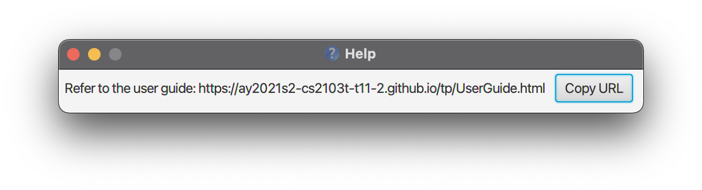

## Table of Contents
* [Introduction](#introduction)
* [Feature List](#feature-list)
  * [General Commands](#general-commands)
  * [Task-Specific Commands](#task-specific-commands)
  * [Event-Specific Commands](#event-specific-commands)
  * [Commands Related to Both Task and Event](#commands-related-to-both-task-and-event)
* [Public Parameters for Tasks and Events](#public-parameters-for-tasks-and-events)
  * [Common to both Task and Event](#common-to-both-task-and-event)
  * [Task-Specific](#task-specific)
  * [Event-Specific](#event-specific)
* [Common Arguments](#common-arguments)
* [Quick start](#quick-start)
* [Features](#features)
* [FAQ](#faq)
* [Command Summary](#command-summary)

**:information_source: Note:** 

The name SOChedule is case-insensitive in the text and images in this User Guide. 
i.e. SOChedule, SoChedule, Sochedule can be used interchangeably.

## Introduction
SOChedule is a one-stop solution for NUS School of Computing (SoC) students to manage their tasks and events effectively.
Targeted at users who can type fast and prefer typing to mouse input, SOChedule is optimized for use via a Command Line Interface (CLI) 
while still having the benefits of a Graphical User Interface (GUI).

## Feature List

### General Commands
* Viewing help: [`help`](#viewing-help-help)
* Exiting the program: [`exit`](#exiting-the-program-exit)
  
### Task-Specific Commands
* Adding a task: [`add_task`](#adding-a-task-add_task)
* Deleting a task: [`delete_task`](#deleting-a-task-delete_task)
* Editing a task: [`edit_task`](#editing-a-task-edit_task)
* Listing all tasks: [`list_task`](#listing-all-tasks-list_task)
* Marking one or more tasks as done : [`done_task`](#marking-one-or-more-tasks-as-done-done_task)
* Marking a task as uncompleted : [`undone_task`](#marking-a-task-as-uncompleted-undone_task)
* Getting today's tasks: [`today_task`](#getting-todays-tasks-today_task)
* Finding tasks by name: [`find_task`](#finding-tasks-by-name-find_task)
* Sorting all tasks: [`sort_task`](#sorting-all-tasks-sort_task)
* Pinning a task: [`pin_task`](#pinning-a-task-pin_task)
* Unpinning a task: [`unpin_task`](#unpinning-a-task-unpin_task)
* Clearing completed tasks: [`clear_completed_task`](#clearing-completed-tasks-clear_completed_task)
* Clearing expired tasks: [`clear_expired_task`](#clearing-expired-tasks-clear_expired_task)
  
### Event-Specific Commands
* Adding an event: [`add_event`](#adding-an-event-add_event)
* Deleting an event: [`delete_event`](#deleting-an-event-delete_event)
* Editing an event: [`edit_event`](#editing-an-event-edit_event)
* Listing all events: [`list_event`](#listing-all-events-list_event)
* Getting today's events: [`today_event`](#getting-todays-events-today_event)
* Finding events by name: [`find_event`](#finding-events-by-name-find_event)
* Clearing expired events: [`clear_expired_event`](#clearing-expired-events-clear_expired_event)
* Finding free time slots: [`free_time`](#finding-free-time-slots-free_time)

### Commands Related to Both Task and Event
* Finding schedule given a date: [`find_schedule`](#finding-schedule-given-a-date-find_schedule)
* Summarising tasks and events completion status: [`summary`](#summarising-tasks-and-events-statistics-summary)
* Clearing SOChedule: [`clear`](#clearing-sochedule-clear)

[Return to Table of Contents](#table-of-contents)

## Public Parameters for Tasks and Events
As listed below are the attributes to be specified for Tasks and Events. All parameters are mandatory unless otherwise stated.

### Common to both Task and Event

<table>
    <tr>
        <th>Attribute</th>
        <th>Identifier</th>
        <th>Restriction(s)</th>
    </tr>
    <tr>
        <td><code>Name</code></td>
        <td><code>n/</code></td>
        <td>
            <ul>
                <li>Maximum 30 characters in length</li>
            </ul>
        </td>
    </tr>
    <tr>
        <td><code>Category</code></td>
        <td><code>c/</code></td>
        <td>
            <ul>
                <li>Maximum 15 characters in length each</li>
                <li>None, single or multiple Categories can be assigned to a single element</li>
                <li>No spaces are allowed</li>
            </ul>
        </td>
    </tr>
    <tr>
        <td><code>Tag</code></td>
        <td><code>t/</code></td>
        <td>
            <ul>
                <li>Maximum 15 characters in length each</li>
                <li>None, single or multiple Tags can be assigned to a single element</li>
                <li>No spaces are allowed</li>
            </ul>
        </td>
    </tr>
</table>

### Task-Specific

<table>
    <tr>
        <th>Attribute</th>
        <th>Identifier</th>
        <th>Restriction(s)</th>
    </tr>
    <tr>
        <td><code>Deadline</code></td>
        <td><code>d/</code></td>
        <td>
            <ul>
                <li>Follows the format YYYY-MM-DD</li>
                <li>Must be a date later than or on the date of task creation</li>
            </ul>
        </td>
    </tr>
    <tr>
        <td><code>Priority</code></td>
        <td><code>p/</code></td>
        <td>
            <ul>
                <li>Single digit integer ranging from 0 to 9 inclusive</li>
                <li>0 is highest in priority, while 9 is lowest</li>
            </ul>
        </td>
    </tr>
</table>

### Event-Specific

<table>
    <tr>
        <th>Attribute</th>
        <th>Identifier</th>
        <th>Restriction(s)</th>
    </tr>
    <tr>
        <td><code>Start Date</code></td>
        <td><code>sd/</code></td>
        <td>
            <ul>
                <li>Follows the format YYYY-MM-DD</li>
                <li>Date earlier than date of creation allowed (for ongoing events)</li>
            </ul>              
        </td>
    </tr>
    <tr>
        <td><code>End Date</code></td>
        <td><code>ed/</code></td>
        <td>
            <ul>
                <li>Follows the format YYYY-MM-DD</li>
                <li>Must be a date later than or on the date of creation</li>
                <li>Must be a date after or on start date (Subject to Time attribute constraints)</li>
            </ul>
        </td>
    </tr>
    <tr>
        <td><code>Start Time</code></td>
        <td><code>st/</code></td>
        <td>
            <ul>
                <li>Follows the format of hh:mm, in a 24-hour format</li>
            </ul>
        </td>
    </tr>
    <tr>
        <td><code>End Time</code></td>
        <td><code>et/</code></td>
        <td>
            <ul>
                <li>Follows the format of hh:mm, in a 24-hour format</li>
                <li>If start date is the same as end date, end time must be a time after start time</li>
            </ul> 
        </td>
    </tr>
</table>

[Return to Table of Contents](#table-of-contents)

## Common Arguments
Below are a few arguments commonly found in SOChedule commands, and their corresponding restrictions, command-specific restrictions notwithstanding.
Breaking any of the below restrictions will result in a invalid command format error.

<table>
    <tr>
        <th>Attribute</th>
        <th>Restriction(s)</th>
        <th>Used in</th>
        <th>Examples</th>
    </tr>
    <tr>
        <td><code>INDEX</code></td>
        <td>
            <ul>
                <li>Positive integer greater than zero</li>
                <li>Not greater than <code>2147483647</code> (Due to language constraints)</li>
                <li>Only one <code>INDEX</code> allowed per command, unless explicitly stated otherwise</li>
                <li>Subject to command-specific restrictions</li>
            </ul>
        </td>
        <td>
            <ul>
                <li><code>delete_task</code></li>
                <li><code>edit_task</code></li>
                <li><code>done_task</code></li>
                <li><code>undone_task</code></li>
                <li><code>pin_task</code></li>
                <li><code>unpin_task</code></li>
                <li><code>delete_event</code></li>
                <li><code>edit_event</code></li>
            </ul>
        </td>
        <td>
            Valid:
            <ul>
                <li><code>1</code></li>
                <li><code>2147483647</code></li>
            </ul>
            Invalid:
            <ul>
                <li><code>!#&%</code></li>
                <li><code>2147483648</code></li>
                <li><code>0</code></li>
                <li><code>-123</code></li>
            </ul>
        </td>
    </tr>
    <tr>
        <td>Date-related arguments 
            <ul>
                <li><code>DEADLINE</code> (For Task)</li>
                <li><code>STARTDATE</code> (For Event)</li>
                <li><code>ENDDATE</code> (For Event)</li>
            </ul>
        </td>
        <td>
            <ul>
                <li>Follows the format of YYYY-MM-DD</li>
                <li><code>y</code> means the year, <code>M</code> means the month and <code>D</code> means the day</li>
                <li>All characters are integers, less delimiters</li>
                <li>Must be a valid date</li>
                <li>Subject to command-specific restrictions</li>
            </ul>
        </td>
        <td>
            <ul>
                <li><code>add_task</code></li>
                <li><code>edit_task</code></li>
                <li><code>add_event</code></li>
                <li><code>edit_event</code></li>
            </ul>
        </td>
        <td>
            Valid:
            <ul>
                <li><code>1990-12-25</code></li>
                <li><code>2020-04-01</code></li>
            </ul>
            Invalid:
            <ul>
                <li><code>!#&%</code></li>
                <li><code>XXXX-XX-XX</code></li>
                <li><code>2021-02-29</code></li>
            </ul>
        </td>
    </tr>
    <tr>
        <td>Time-related arguments 
            <ul>
                <li><code>STARTTIME</code> (For Event)</li>
                <li><code>ENDTIME</code> (For Event)</li>
            </ul>
        </td>
        <td>
            <ul>
                <li>Follows the format of hh:mm, in a 24-hour format</li>
                <li><code>h</code> means the hour, <code>m</code> means the time</li>
                <li>All characters are integers, less delimiters</li>
                <li>Must be a valid time</li>
                <li>Subject to command-specific restrictions</li>
            </ul>
        </td>
        <td>
            <ul>
                <li><code>add_event</code></li>
                <li><code>edit_event</code></li>
            </ul>
        </td>
        <td>
            Valid:
            <ul>
                <li><code>23:59</code></li>
                <li><code>08:00</code></li>
                <li><code>00:00</code></li>
            </ul>
            Invalid:
            <ul>
                <li><code>!#&%</code></li>
                <li><code>XX:XX</code></li>
                <li><code>24:00</code></li>
            </ul>
        </td>
    </tr>
</table>

[Return to Table of Contents](#table-of-contents)

--------------------------------------------------------------------------------------------------------------------

## Quick start

1. Ensure you have Java `11` or above installed in your Computer.

1. Download the latest `SOChedule.jar` from [here](https://github.com/AY2021S2-CS2103-W16-1/tp/releases).

1. Copy the file to the folder you want to use as the _home folder_ for your SOChedule.

1. Double-click the file to start the app. The GUI similar to the below should appear in a few seconds. A sample SOChedule is given below. There would not be pre-entered data on first launch so that users start using immediately.
      
    

1. Type the command in the command box and press Enter to execute it. e.g. typing **`help`** and pressing Enter will open the help window. 
   Some example commands you can try:

   * **`list_task`** : Lists all tasks.

   * **`add_task`**`n/CS2103 assignment d/2022-04-07 p/1 c/schoolwork t/urgent` : Adds a task named `CS2103 assignment` to the SOChedule with its respective attributes. Please verify the validity of the date parameter.

   * **`delete_task`**`3` : Deletes the 3rd task shown in the current list.

   * **`exit`** : Exits the app.

1. Refer to the [Features](#features) below for details of each command.

[Return to Table of Contents](#table-of-contents)

--------------------------------------------------------------------------------------------------------------------

## Features

**:information_source: Notes about the command format:** 

* Words in `UPPER_CASE` are the parameters to be supplied by the user. 
  e.g. in `undone_task INDEX`, `INDEX` is a parameter which can be used as `undone_task 1`.

* Items in square brackets are optional. 
  e.g `n/TASKNAME [t/TAG]` can be used as `n/Quiz t/CS2103` or as `n/Quiz`.

* Items with `…`​ after them can be used multiple times including zero times. 
  e.g. `[t/TAG]…​` can be used as ` ` (i.e. 0 times), `t/friend`, `t/friend t/family` etc.

* If a parameter is expected only once in the command, but you specified it multiple times, only the last occurrence of the parameter will be taken. 
  e.g. if you specify `p/1 p/2`, only `p/2` will be taken.

* Extraneous parameters for commands that do not take in parameters (such as `list_task`, `list_event`) will be ignored. 
  e.g. if the command specifies `list_task 123`, it will be interpreted as `list_task`.

[Return to Table of Contents](#table-of-contents)

### Viewing help: `help`
Shows a message explaining how to access the help page.

[Return to Feature List](#feature-list)

### Exiting the program: `exit`
Exits the program.

[Return to Feature List](#feature-list)

### Adding a task: `add_task`
Adds a task into the task list.

Format: `add_task n/TASKNAME d/DEADLINE p/PRIORITY [c/CATEGORY]... [t/TAG]...`
* `n/` is followed by the task name, it is case-sensitive.
* `d/` is followed by the date of deadline, with the format `YYYY-MM-DD`.  
  Deadline cannot be a past date.
* `p/` is followed by the priority, with 0 being highest and 9 being lowest.  
  Other inputs are not accepted.
* `c/` is followed by the category. Different categories are separated by white space (e.g. `c/c1 c/c2`).  
  It is optional.
* `t/` is followed by the tag. Different tags are separated by white space (e.g. `t/t1 t/t2`).  
  It is optional.

**:information_source: Note:**  

* Any valid prefixes and input arguments (e.g. <code>n/Homework 1</code> or <code>p/1</code>) followed by invalid prefixes and input arguments (e.g. <code>name/Name</code>, <code>tag/Tag</code> or <code>T&sk</code>) will lead to an error.
* If the same prefix (excluding <code>c/</code>, <code>t/</code>) appears multiple times in the input (e.g. <code>n/n1 n/n2 n/n3</code>), only the last occurrence would be taken (i.e. <code>n/n3</code>).

Examples:
* `add_task n/CS2103 assignment d/2022-02-27 p/1 c/schoolwork t/urgent` adds a new task named "CS2103 assignment" with the respective parameters.
* `add_task n/CCA admin work d/2022-02-28 p/2 c/CCA` adds a new task "CCA admin work" with the respective parameters.

[Return to Feature List](#feature-list)

### Deleting a task: `delete_task`
Deletes a task from the task list.

Format: `delete_task INDEX`
* Deletes the task at the specified INDEX.
* The `INDEX` refers to the index number shown in the currently **displayed** task list.

Examples:
* `list_task` followed by `delete_task 2` deletes the second task in the full task list.
* `find_task homework` followed by `delete_task 1` deletes the first task in the result of the `find_task` command.

[Return to Feature List](#feature-list)

### Editing a task: `edit_task`
Edits an **existing and uncompleted** task in the task list.

Format: `edit_task INDEX [n/TASKNAME] [d/DEADLINE] [p/PRIORITY] [c/CATEGORY]... [t/TAG]...`
* Edits the task at the specified `INDEX`. 
* Only an **existing and uncompleted** task can be edited.  
  (i.e. Completed tasks cannot be edited)
* **At least one** of the optional fields must be provided.
* `DEADLINE` provided cannot be a past date.
* When editing tags/categories, the existing tags/categories of the task will be removed.  
  (i.e. adding of tags/categories is not cumulative)
* Edited task cannot be the same as the original task or equivalent to another existing task in the task list.  
  Same tasks means the name, priority, deadline, tags (if any) and categories (if any) of two tasks are equal.
* When editing tags and categories, the order given in the input and the order as shown in the UI can be different.  
  For example, in input `edit_task 1 t/tag1 t/tag2`, `t/tag1` is before `t/tag2`, but `tag2` may appear in the UI before `tag1`.

**:information_source: Note:**  

* Any valid prefixes and input arguments (e.g. <code>n/Homework 1</code> or <code>p/1</code>) followed by invalid prefixes and input arguments (e.g. <code>name/Name</code>, <code>tag/Tag</code> or <code>T&sk</code>) will lead to an error.

* You can remove all the task’s tags by typing <code>t/</code> without specifying any tags after it. 
  Similarly, you can remove all the task’s categories by typing <code>c/</code> without specifying any categories after it
  
* If the same prefix (excluding <code>c/</code>, <code>t/</code>) appears multiple times in the input (e.g. <code>n/n1</code> <code>n/n2</code>), the latter one would be taken (i.e. <code>n/n2</code>).

Examples:
* `edit_task 1 n/t1` edits the name of the first task (if present in SOChedule) to be `editedTaskName`.
* `edit_task 2 p/3 t/` edits the priority of the second task (if present in SOChedule) to be `3` and clears all existing tags. 

#### Illustration of usage of `edit_task`:

[Return to Feature List](#feature-list)

### Listing all tasks: `list_task`
Lists all tasks from the task list.

Format: `list_task`

[Return to Feature List](#feature-list)

### Marking one or more tasks as done: `done_task`
Marks one or more task from the task list as completed.

Format: `done_task INDEX1 [INDEX2] ...`
* Marks the task(s) at the specified INDEX(es) as completed.
* Specified task(s) must not be completed.
* Multiple indices are to be separated by a whitespace, e.g. `1 2`.
* All specified tasks must be **uncompleted and existing** before calling this command.
* **Duplicate indices** are not allowed.  
  Otherwise, an error message indicating invalid command format will be returned.

**:information_source: Note:**  

* If indices provided include both an index for a task not existing in task list and an index for a completed task,
  the error message will only be about the non-existing task.

Examples:
* `done_task 1 2` marks the first and second task in the task list as completed.

#### Illustration of usage of `done_task`:

[Return to Feature List](#feature-list)

### Marking a task as uncompleted: `undone_task`
Marks a completed task from the task list as uncompleted.

Format: `undone_task INDEX`
* Marks the task at the specified INDEX as uncompleted.
* Specified task must be complete.

Examples:
* `undone_task 1` marks the first task in the task list as uncompleted.

#### Illustration of usage of `undone_task`:

[Return to Feature List](#feature-list)

### Getting today's tasks: `today_task`
Lists all tasks that have deadline on today from the task list.

Format: `today_task`

[Return to Feature List](#feature-list)

### Finding tasks by name: `find_task`
Finds tasks whose names contain any of the given keywords from the task list.

Format: `find_task KEYWORD1 [KEYWORD2] ...`
* The search is **case-insensitive**, e.g. `homework` will match `Homework`.
* The search scope is the **full** task list.
* The order of the keywords does not matter.  
  E.g. `Practice Problems` will match `Problems Practice`.
* Only the name of the tasks is searched.
* Only full words will be matched. E.g. `CS` will not match `CS2103`.
* Tasks matching at least one keyword will be returned (i.e. `OR` search).  
  E.g. `CS2103 Homework` will return `ST2131 Homework`, `CS2103 Quiz`.

Examples:
* `find_task Homework` returns `st2131 homework` and `Homework 1`
* `find_task assignment homework` returns `Assignment 1`, `Homework 2`
  

[Return to Feature List](#feature-list)

### Sorting all tasks: `sort_task`
Sorts the task list.

Format: `sort_task ARGUMENT`
* Sorts task list and updates UI based on supplied argument.
* Accepted arguments (case-sensitive):
   * `name`: Sorts by task name, in increasing lexicographical order
   * `deadline`: Sorts by task deadline, in increasing date order
   * `completion`: Sorts by task completion status, with completed tasks at the bottom
   * `priority`: Sorts by task priority, in decreasing order, from priority 0 on top, to priority 9 at the bottom
* On subsequent boots, the following will happen:
   * Relative order from previous launch will be preserved.
   * However, if any order-altering command (`pin_task`, `unpin_task`, and `find_task`) is issued, tasks will be sorted by name by default, unless otherwise stated by another `sort_task` command.
   * Marking a task as complete (`done_task`) or incomplete (`undone_task`) or adding (`add_task`) and editing (`edit_task`) tasks does not constitute an order-altering command.
    
Examples:
* `sort_task completion` sorts the task list by completion status.
* `sort_task name` sorts the task list by name.

#### Illustration of usage of `sort_task`:

[Return to Feature List](#feature-list)

### Pinning a task: `pin_task`
Pins a task from the task list.

Format: `pin_task INDEX`
* Pins the task at the specified INDEX.
* Already pinned tasks will be unable to be pinned a second time.
* The index refers to the index number shown in the displayed task list.
* After pinning, the Task List will be sorted either according to previously entered `sort_task` command, or name (by default). See [here](#illustration-of-the-interaction-between-pin_task-and-sort_task).
    * Should there be two or more pinned tasks, the pinned tasks will be sorted as well.
    * Only the fact that pinned tasks will appear over the unpinned tasks is guaranteed.  
      Internal order of pinned tasks is not persistent over `sort_task`.
* Pinned tasks are persistent over instances of SOChedule.

Examples:
* `pin_task 1` pins the first task in the task list

#### Illustration of usage of `pin_task`:

#### Illustration of the interaction between `pin_task` and `sort_task`:

[Return to Feature List](#feature-list)

### Unpinning a task: `unpin_task`
Unpins a task from the task list.

Format: `unpin_task INDEX`
* Unpins the task at the specified INDEX.
* Follows similar restrictions to `pin_task`.

Examples:
* `unpin_task 1` unpins the first task in the task list

#### Illustration of usage of `unpin_task`:

[Return to Feature List](#feature-list)

### Clearing completed tasks: `clear_completed_task`
Clears tasks marked as completed from the task list.

Format: `clear_completed_task`
  

**:information_source: Note:**  

* This command is still able to be executed on a task list without any completed tasks.  
  In this case, success message `Completed tasks (if any) have been cleared!` will still be displayed.  
  However, no tasks will be cleared since there are no completed tasks.

#### Illustration of usage of `clear_completed_task`:

[Return to Feature List](#feature-list)

### Clearing expired tasks: `clear_expired_task`
Clear tasks with past deadlines from the task list.

Format: `clear_expired_task`
* For a task to be considered expired, the task's `deadline` should be an earlier date as compared to the local date on the user's computer.   
  Hence, changing of date on a computer could affect the judgement of expiration.
  

**:information_source: Note:**  

* This command is still able to be executed on a task list without any expired tasks.  
  In this case, success message `Expired tasks (if any) have been cleared!` will still be displayed.  
  However, no tasks will be cleared since there are no expired tasks.

#### Illustration of usage of `clear_expired_task`:

[Return to Feature List](#feature-list)

### Adding an event: `add_event`
Adds an event to the event list.

Format: `add_event n/EVENTNAME sd/STARTDATE st/STARTTIME ed/ENDDATE et/ENDTIME [c/CATEGORY]... [t/TAG]...`
* `n/` is followed by the event name, it is case-sensitive.
* `sd/` is followed by the starting date, in the format of **YYYY-MM-DD**.
* `st/` is followed by the starting time in the 24-hour format and in the format of **hh:mm**
* `ed/` is followed by the ending date.
* `et/` is followed by the ending time in the 24-hour format.
* The `ENDDATE` and `ENDTIME` provided must be **after** `STARTDATE` and `STARTTIME`.
* The `ENDDATE` and `ENDTIME` provided cannot be a past date and time.
* `c/` is followed by the category. Different categories are separated by white space (e.g. `c/c1 c/c2`).  
  It is optional.
* `t/` is followed by the tag. Different tags are separated by white space (e.g. `t/t1 t/t2`).  
  It is optional.
  

**:information_source: Note:**  

* The `STARTDATE` and `STARTTIME` provided can be in the past for ongoing events.
  
* Events that overlap in date and time are allowed.
  
* Any valid prefixes and input arguments (e.g. <code>n/Meeting 1</code> or <code>st/14:00</code>) followed by invalid prefixes and input arguments (e.g. <code>name/Name</code>, <code>tag/Tag</code> or <code>E@ent</code>) will lead to an error.

* If the same prefix (excluding <code>c/</code>, <code>t/</code>) appears multiple times in the input (e.g. <code>n/n1 n/n2 n/n3</code>), only the last occurrence would be taken (i.e. <code>n/n3</code>).

Examples:
* `add_event n/CS2103 meeting sd/2021-05-27 st/15:00 ed/2022-02-27 et/17:00` adds an event with name `CS2103` and its 
  respective attributes to the event list.

[Return to Feature List](#feature-list)

### Deleting an event: `delete_event`
Deletes an event from the event list.

Format: `delete_event INDEX`
* Deletes the event at the specified INDEX.
* Note that only one `INDEX` is accepted, multiple `INDEX` will lead to input format error.
* The `INDEX` refers to the index number shown in the **displayed** event list.

Examples:
* `delete_event 3` deletes the third event from the event list.

[Return to Feature List](#feature-list)

### Editing an event: `edit_event`
Edits an **existing and uncompleted** event in the event list.

Format: `edit_event INDEX [n/EVENTNAME] [sd/STARTDATE] [st/STARTTIME] [ed/ENDDATE] [et/ENDTIME] [c/CATEGORY]... [t/TAG]...`
* Edits the event at the specified `INDEX`.
* An expired event could only be edited when users edit the past end date and time to an unexpired end date and time.  
  (i.e. top extend the event).
* Except the condition above, only **unexpired** event can be edited.
* **At least one** of the optional fields must be provided.
* The `ENDDATE` and `ENDTIME` provided must be **after** `STARTDATE` and `STARTTIME`.
* The `ENDDATE` and `ENDTIME` provided cannot be a past date and time.
* When editing tags/categories, the existing tags/categories of the event will be removed.  
  (i.e. adding of tags/categories is not cumulative)
* When editing tags and categories, the order given in the input and the order as shown in the UI can be different.  
  For example, in input `edit_event 1 t/tag1 t/tag2`, `t/tag1` is before `t/tag2`, but `tag2` may appear in the UI before `tag1`.
  

**:information_source: Note:**  

* The `STARTDATE` and `STARTTIME` provided can be in the past for ongoing events.

* Events that overlap in date and time are allowed.
  
* Any valid prefixes and input arguments (e.g. <code>n/Meeting</code> or <code>st/00:00</code>) followed by invalid prefixes and input arguments (e.g. <code>name/Name</code>, <code>tag/Tag</code> or <code>E@ent</code>) will lead to an error.

* You can remove all the event’s tags by typing <code>t/</code> without specifying any tags after it. 
  Similarly, you can remove all the event’s categories by typing <code>c/</code> without specifying any categories after it

* If the same prefix (excluding <code>c/</code>, <code>t/</code>) appears multiple times in the input (e.g. <code>n/n1</code> <code>n/n2</code>), the latter one would be taken (i.e. <code>n/n2</code>).

Examples:
* `edit_event 1 n/editedEventName` edits the name of the first event (if present in the event list) to be 
  `editedEventName`.
* `edit_event 2 sd/2021-03-18 t/` edits the start date of the second event (if present in the event list) to be 
  `2021-03-18`and clears all existing tags.

[Return to Feature List](#feature-list)

### Listing all events: `list_event`
Lists all events from the event list.

Format: `list_event`

[Return to Feature List](#feature-list)

### Getting today's events: `today_event`
Lists all events whose duration have overlap with today from the event list.

Format: `today_event`

[Return to Feature List](#feature-list)

### Finding events by name: `find_event`
Finds events whose names contain any of the given keywords from the event list.

Format: `find_event KEYWORD1 [KEYWORD2] ...`
* The search is case-insensitive, e.g. `meeting` will match `Meeting`.
* The search scope is the **full** task list.
* The order of the keywords does not matter.  
  E.g. `Attending Lecture` will match `Lecture Attending`.
* Only the name of the events is searched.
* Only full words will be matched. E.g. `CS` will not match `CS2103`.
* Events matching at least one keyword will be returned (i.e. `OR` search).  
  E.g. `CS2103 Meeting` will return `Project Meeting`, `CS2103 Lecture`.

Examples:
* `find_event Meeting` returns `project meeting` and `Research Meeting`.
* `find_event talk competition` returns `Career Talk`, `Coding Competition`
  

[Return to Feature List](#feature-list)

### Clearing expired events: `clear_expired_event`
Clears events with past end date time from the event list.

Format: `clear_expired_event`
* For an event to be considered expired, the event should have earlier end date and time as compared to the local time on the user's computer.   
  Hence, changing of timing on a computer could affect the judgement of expiration.

**:information_source: Note:**  

* This command is still able to be executed on a event list without any expired event.  
  In this case, success message `Expired events (if any) have been cleared!` will still be displayed.  
  However, no event will be cleared since there are no expired event.

#### Illustration of usage of `clear_expired_event`:

[Return to Feature List](#feature-list)

### Finding free time slots: `free_time`
Finds all free time slots on the given date from the event list.

Format: `free_time DATE`
* **Free time slots** refer to all times in the given date without any ongoing event.
* Date entered must be a valid date and in the format of `YYYY-MM-DD`.
* Date entered must be a date from current date onwards.
* Only one single date can be entered.

Examples:
* `free_time 2022-02-01` finds all free time slots on the given date `2022-02-01`.

#### Illustration of usage of `free_time`:

[Return to Feature List](#feature-list)

### Finding schedule given a date: `find_schedule`
Given a specified date, finds uncompleted tasks that are due before or on the date 
and events that are ongoing on the date.

Format: `find_schedule DATE`
* Tasks found will be incomplete tasks with deadlines before or on the specified date.
* Events found will be events where specified date falls between start date (inclusive) and end date (inclusive).  
  (i.e. ongoing events)
* Date entered must be in the format of `YYYY-MM-DD`.  
  It can be a date that is earlier than today.
* Only one single date can be entered. 
  

**:information_source: Note:**  

* After running `find_schedule`, `list_task` and `list_event` can be used to display the whole task list and event list respectively.

Examples:
* `find_schedule 2021-04-10` finds:
  * All existing uncompleted tasks with deadlines before or on `2021-04-10`.
  * All existing events where `2021-04-10` falls between start date (inclusive) and end date (inclusive).

#### Illustration of usage of `find_schedule`:

Due to size constraint, this illustration is split into the before and after view for task list and that for event list.

For task list:

For event list:

[Return to Feature List](#feature-list)

### Summarising tasks and events statistics: `summary`
Displays a summary of tasks completion status and events upcoming for the next 7 days.

Format: `summary`
* **Completed tasks** refer to tasks that are done regardless of when the deadline is.
* **Overdue tasks** refer to incomplete tasks, and current date has passed the deadline.
* **Tasks to be completed before deadline** refer to incomplete tasks, and current date now has not passed the deadline.
* **Events upcoming in the next 7 days** refer to events that are going to happen in the next 7 days.  
  Events that are happening today are not included.

#### Illustration of usage of `summary`:

[Return to Feature List](#feature-list)

### Clearing SOChedule: `clear`
Clears all tasks and events in the SOChedule's task list and event list.

Format: `clear`

#### Illustration of usage of `clear`:

[Return to Feature List](#feature-list)

[Return to Table of Contents](#table-of-contents)

--------------------------------------------------------------------------------------------------------------------

## FAQ

**Q**: How do I transfer my data to another Computer? 
**A**: Download the JAR file onto the other computer and overwrite the empty data file it creates with the file that contains the data of your previous SOChedule home folder (this is contained within the `/data` folder in the same location as your SOChedule.jar.

[Return to Table of Contents](#table-of-contents)

--------------------------------------------------------------------------------------------------------------------

## Command summary

### General commands

Action | Format, Examples
--------|------------------
**Help** | `help`
**Exit** | `exit`

### Task-related commands

Action | Format, Examples
--------|------------------
**Add** | `add_task n/TASKNAME d/DEADLINE p/PRIORITY [c/CATEGORY]... [t/TAG]...`   e.g. `add_task n/CS2103 assignment d/2022-02-27 p/1 c/schoolwork t/urgent`
**Delete** | `delete_task INDEX` e.g. `delete_task 1`
**Edit** | `edit_task INDEX [n/TASKNAME] [d/DEADLINE] [p/PRIORITY] [c/CATEGORY]... [t/TAG]...`   e.g. `edit_task 1 n/editedTaskName`
**List** | `list_task`
**Done** | `done_task INDEX1 [INDEX2] ...` e.g. `done_task 1 2`
**Undone** | `undone_task INDEX` e.g. `undone_task 1`
**Today** | `today_task`
**Find** | `find_task KEYWORD1 [KEYWORD2] ...` e.g. `find_task homework`
**Sort** | `sort_task ARGUMENT` e.g. `sort_task name`
**Pin** | `pin_task INDEX` e.g. `pin_task 1`
**Unpin** | `unpin_task INDEX` e.g. `unpin_task 1`
**Clear Completed** | `clear_completed_task`
**Clear Expired** | `clear_expired_task`

### Event-related commands

Action | Format, Examples
--------|------------------
**Add** | `add_event n/TASKNAME sd/STARTDATE st/STARTTIME ed/ENDDATE et/ENDTIME [c/CATEGORY]... [t/TAG]...`  e.g. `add_event n/CS2103 meeting sd/2022-02-27 st/15:00 ed/2022-02-27 et/17:00`
**Delete** | `delete_event INDEX` e.g. `delete_event 3`
**Edit** | `edit_event INDEX [n/EVENTNAME] [sd/STARTDATE] [st/STARTTIME] [ed/ENDDATE] [et/ENDTIME] [c/CATEGORY]... [t/TAG]...`   e.g. `edit_event 1 n/editedEventName`
**List** | `list_event`
**Today** | `today_event`
**Find** | `find_event KEYWORD1 [KEYWORD2] ...` e.g. `find_event meeting`
**Clear Expired** | `clear_expired_event`
**Find Free Time** | `free_time DATE`  e.g. `free_time 2022-01-01`

### Commands related to both task and event

Action | Format, Examples
--------|------------------
**Find Schedule** | `find_schedule DATE`  e.g. `find_schedule 2022-06-01`
**Clear Schedule** | `clear`
**Summary** | `summary`

[Return to Table of Contents](#table-of-contents)
