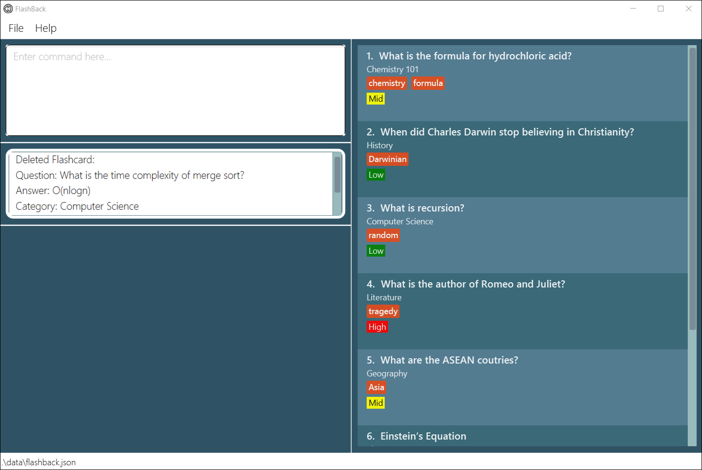
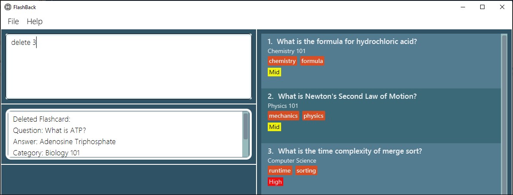
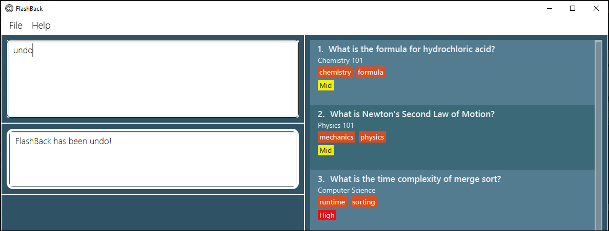

FlashBack is a **desktop application for managing notes, optimized for use via a Command Line Interface** (CLI) while
still having the benefits of a Graphical User Interface (GUI). This application allows the improvement of student
performance via improved accessibility and organisation of notes, together with interactive sessions that enhance memory
retention.

## Table of Contents

* [Quick start](#quick-start)
* [Application layout](#application-layout)
* [Features](#features)
    * [Main mode](#main-mode)
        * [Viewing help](#viewing-help-help): `help`
        * [Adding a new card](#adding-a-new-card-add): `add`
        * [Listing all cards](#listing-all-cards--list): `list`
        * [Deleting a card](#deleting-a-card--delete): `delete`
        * [Viewing a card](#viewing-a-card--view): `view`
        * [Finding cards](#finding-cards--find): `find`
        * [Filtering cards](#filtering-cards-filter): `filter`
        * [Clearing all cards](#clearing-all-entries--clear): `clear`
        * [Undoing a command](#undoing-a-command--undo): `undo`
        * [Entering review mode](#entering-review-mode-review): `review`
        * [Viewing statistics of cards](#viewing-statistics-of-cards-stats): `stats`
        * [Sort all cards](#sort-all-cards--sort): `sort`
        * [Exiting the program](#exiting-the-program--exit): `exit`
        * [Saving data](#saving-the-data)
        * [Editing the data file](#editing-the-data-file)
    * [Review mode](#review-mode)
        * [Showing next card](#showing-next-card--n): `n`
        * [Showing previous card](#showing-previous-card--p): `p`
        * [Showing answer](#showing-answer--a): `a`
        * [Hiding answer](#hiding-answer--h): `h`
        * [Review flashcard as correct](#review-flashcard-as-correct--t): `t`
        * [Review flashcard as wrong](#review-flashcard-as-wrong--f): `f` 
        * [Quitting review mode](#quitting-review-mode--q): `q`
* [FAQ](#faq)
* [Command Summary](#command-summary)
    * [Main mode command](#main-mode-command)
    * [Review mode command](#review-mode-command)

--------------------------------------------------------------------------------------------------------------------

## Quick start

1. Ensure you have Java `11` or above installed in your Computer.
1. Download the latest `FlashBack.jar` from [here](https://github.com/AY2021S2-CS2103T-T13-3/tp/releases).
1. Copy the file to the folder you want to use as the home folder for your FlashBack.
1. Double-click the file to start the app. The GUI should appear in a few seconds.   
      
1. Below are some commands you can try, type the command in the command box and press Enter to execute it:
    * **`help`** : Opens the help window.
    * **`add`**`q/ What is the Einstein’s Equation? a/e=mc^2 c/Physics p/High t/ModernPhysics`: Adds a new flashcard
      named `What is the Einstein's Equation?` to FlashBack.
    * **`view`**`2`: Views the 2nd card shown in the current list.
    * **`delete`**`1`: Deletes the 1st card shown in the current list.
    * **`clear`**: Deletes all cards.
    * **`exit`**: Exits the application.
1. Refer to the Features below for details of each command.

--------------------------------------------------------------------------------------------------------------------

## Application layout

The figures below explain the different components in FlashBack.  
Main window  
   
Review mode   
   
Brief explanation of each components:

Components      | Explanation
----------------|------------------
Command Box | This is where you type all the commands.
Result Display | This is where the result of your input to the command box is displayed.
View Pane |
Flashcard List |

--------------------------------------------------------------------------------------------------------------------

## Features

**:information_source: Notes about the command format:** 

* Words in UPPER_CASE are the parameters to be supplied by the user.  
  eg. In `add q/QUESTION`, `QUESTION` is a parameter which can be used as `add q/What is Fermat's Last Theorem?`. 

* Items in square brackets are optional.  
  eg. `q/QUESTION [t/TAG]` can be used as `q/What is Singapore Independence Day?` or
  as `q/What is Singapore Independence Day? t/Singapore` 

* Items with `…​` after them can be used multiple times including zero times.  
  e.g. `[t/TAG]…`​ can be used as `t/vocabulary`, `t/vocabulary t/SAT` etc.

* Parameters can be in any order.  
  eg. If the command specifies `q/QUESTION a/ANSWER`, `a/ANSWER q/QUESTION` is also acceptable. 

* Extraneous parameters for commands that do not take in parameters (such as `help`, `list`, `undo`, `exit` and `clear`)
  will be ignored.  
  e.g. If the command specifies `help 123`, it will be interpreted as `help`.

* Prefixes are case-sensitive.  
  e.g. `q/` is not the same as `Q/`.

* If a parameter is expected only once in the command, but you specified it multiple times, only the last occurrence of
  the parameter will be taken.  
  e.g. If you specify `c/Geography c/History`, only `c/History` will be taken.

## Main mode

### Viewing help: `help`

Shows a message explaining how to access the help page.  
   
Format: `help`

### Adding a new card: `add`

Adds a new card to the card list. 
Format: `add q/QUESTION a/ANSWER c/CATEGORY p/PRIORITY [t/TAG]...`  
Note: The TAG is optional when adding a new card.

:memo: **Note:**
Priority can only take 1 out of 3 values: `High`, `Mid` or `Low`.

Examples:

* `add q/Einstein’s Equation a/e=mc^2 c/Physics p/High`   
     
* `add q/Independence day of Singapore a/August 9th 1965 c/History p/Mid t/Singapore`

### Editing a card: `edit`

Edits an existing flashcard in the card list.

Format: `edit INDEX [q/NEW QUESTION] [a/NEW ANSWER] [c/NEW CATEGORY]`  
`[p/NEW PRIORITY] [t/TAG]`

* Edits the card at the specified `INDEX`.
* The index refers to the index number shown in the displayed card list.
* The index **must be a positive integer** 1, 2, 3, …​
* At least 1 updated card field must be provided for modification.

Examples:

* `edit 1 p/Low`   
     
* `edit 3 q/What is the time complexity for Quick Sort? t/Algorithms`

### Listing all cards : `list`

Shows all cards in the card list.

Format: `list`

### Deleting a card : `delete`

Deletes the specified card from the card list.

Format: `delete INDEX`

* Deletes the card at the specified `INDEX`.
* The index refers to the index number shown in the displayed card list.
* The index **must be a positive integer** 1, 2, 3, …​

Examples:

* `list` followed by `delete 2` deletes the 2nd card in the card list.  
  Before executing command `delete 2`:   
     
  After executing command `delete 2`:   
  

### Viewing a card : `view`

Views a specific card from the card list.  

Format: `view INDEX`

* Views the flashcard at the specified `INDEX`.
* The index refers to the index number shown in the displayed flashcard list.
* The index **must be a positive integer** 1, 2, 3, …​

Examples:

* `view 3` shows the 3rd flashcard (in the displayed flashcard list).   
  

### Finding cards : `find`

Find flashcards containing any of the given keywords.

Format: `find KEYWORD [MORE_KEYWORDS]`

* The search is case-insensitive. e.g. `equation` will match `Equation`
* The order of the keywords does not matter. e.g. `Newton Equation` will match `Equation Newton`
* Partial words can be matched when searching. e.g. `Wh` will match `What?` but `What?` will not match `What`
* Any card's fields (e.g. question, answer, category, priority, and tag) matching any keyword will be returned.

:bulb: **Tip:** You can list all flashcards again by using `list` command

Examples:
* `find computer` will return cards with `computer` in any of its fields.
   
* `find computer formula` will return cards with `computer` or `formula` in any of its fields.
   
* `find phy` will return cards with `phy` contained in any of the words in any of its fields.
   

### Filtering cards: `filter`

Filter flashcards based on field(s) (e.g. question, category, priority, tag) input.

Format: `filter [q/QUESTION] [c/CATEGORY] [p/PRIORITY] [t/TAG]`

* The filter is case-insensitive. e.g. `equation` will match `Equation`
* Must filter by at least 1 field, but not every field is required.
* Can filter by multiple keywords for each field. e.g. `filter q/einstein math`
* The order of the keywords does not matter. e.g. `Newton Equation` will match `Equation Newton`
* The order of the field input does not matter. e.g. `filter q/QUESTION c/CATEGORY` is same as `filter c/CATEGORY q/QUESTION`
* Filtered cards must match all field inputs. e.g. `filter q/einstein p/mid` will only display cards with question containing `einstein` and `mid` priority.
* Partial words can be matched when filtering. e.g. `Wh` will match `What?` but `What?` will not match `What`

:bulb: **Tip:** You can list all flashcards again by using `list` command

Examples:
* `filter q/charles recursion` will return cards with `charles` or `recursion` contained in its question.
     
* `filter p/mid q/formula` will return cards with `formula` contained in its question and `mid` priority.
     
* `filter c/com t/ran` will return cards with `com` contained in its category and `ran`contained in any of its tags.
     

### Clearing all entries : `clear`

Clears all entries from FlashBack.

Format: `clear`

### Undoing a command : `undo`

Restore FlashBack to the state before the previous command was executed.

:memo:
**Note:**  Only commands that modify FlashBack's content can be reversed. (`add`, `delete`, `edit` and `clear`).

Examples:
`delete 3`   
   
`clear`    
   
`undo` will reverse the `clear` command.   
   
`undo` will reverse the `delete 3` command.   
   

Format: `undo`

### Sorting all cards: `sort`
Sorts all flashcards according to a given option.

:bulb: **Note:** You can only sort by `priority` or `question`.

Examples:
`sort priority -a` will sort the flashcards by ascending priority.   
`sort priority -d` will sort the flashcards by descending priority.   
`sort question -a` will sort the flashcards by ascending question.   
`sort question -d` will sort the flashcards by descending question.   

### Entering review mode: `review`
Reviews the current list of flashcards. 
When the user enters `review` in the command box, this new window will appear.   
   
Format: `review`

### Viewing statistics of cards: `stats`
Shows the statistics of an individual flashcard, or the statistics of all flashcards.

The following statistics are displayed:
* Number of times the user reviewed the flashcard(s).
* Number of times the user reviewed the flashcard(s) and got the correct answers.
* The correct rate of the flashcard(s). i.e The number of correct answer reviews over the total number of reviews.
* The wrong rate of the flashcard(s). i.e The number of wrong answer reviews over the total number of reviews.

Format: `stats INDEX`  
Note: If a valid INDEX is provided, the statistics of the flashcard identified by the provided index is shown.
If the INDEX field is omitted, Flashback will display overall statistics for all flashcards in the current list.

Examples:

When user enters `stats 2` in the command box and presses `enter`, the statistics of the  
2nd flashcard in the list is displayed.

   

When user enters `stats` in the command box and presses `enter`, the overall statistics of  
the current flashcard list is displayed.

   

### Exiting the program : `exit`

Exits the program.

Format: `exit`

### Saving the data

FlashBack data are saved in the hard disk automatically after any command that changes the data. There is no need to
save manually.

### Editing the data file

FlashBack data are saved as a JSON file `[JAR file location]/data/flashback.json`. Advanced users are welcome to update
data directly by editing that data file.

:exclamation: **Caution:**
If your changes to the data file makes its format invalid, FlashBack will discard all data and start with an empty data
file at the next run.

## Review mode

### Showing next card : `n`

Moves on to the next flashcard. 
Format: `n`

### Showing previous card : `p`

Moves back to the previous flashcard.  
Format: `p`

### Showing answer : `a`

Displays the answer of the current flashcard.  
Format: `a`

### Hiding answer : `h`

Hides the answer of the current flashcard.  
Format: `h`

### Review flashcard as correct : `t`

Marks that the user got the answer correct for the current flashcard.  
Note: This command can only be executed if the answer of the current flash card is shown.  
Format: `t`

### Review flashcard as wrong : `f`

Marks that the user got the answer wrong for the current flashcard.  
Note: This command can only be executed if the answer of the current flash card is shown.  
Format: `f`

### Quitting review mode : `q`

Quits the review mode and goes back to the main window.  
Format: `q`

--------------------------------------------------------------------------------------------------------------------

## FAQ

**Q**: How do I transfer my data to another Computer? 
**A**: Install the app in the other computer and overwrite the empty data file it creates with the file that contains
the data of your previous FlashBack home folder.

--------------------------------------------------------------------------------------------------------------------

## Command summary

### Main mode command

Action | Format, Examples
--------|------------------
**Add** | `add q/QUESTION a/ANSWER c/CATEGORY p/PRIORITY [t/TAGS]...`   e.g., `add q/ What is the Einstein’s Equation? a/e=mc^2 c/Physics p/High t/ModernPhysics`
**Delete** | `delete INDEX`   e.g., `delete 1`
**Edit** | `edit INDEX`   e.g., `edit 3 a/NEW ANSWER p/NEW PRIORITY`
**View** | `view INDEX`   e.g., `view 2`
**Find** | `find KEYWORD [MORE_KEYWORDS]`  e.g., `find equation`
**Filter** | `filter [q/QUESTION] [c/CATEGORY] [p/PRIORITY] [t/TAG]`  e.g. `filter q/einstein c/phy p/high t/modern`   or `filter p/low t/formula`
**Clear** | `clear`
**Undo** | `undo`
**Sort** | `sort OPTION ORDER`   e.g, `sort priority -a`
**Review** | `review`
**Statistics** | `stats [INDEX]`   e.g, `stats 4` `stats`
**List** | `list`
**Help** | `help`
**Exit** | `exit`

### Review mode command

Action          | Format
----------------|------------------
**Next card**   | `n`
**Previous card** | `p`
**Show answer** | `a`
**Review card as correct** | `t`
**Review card as wrong** | `f`
**Hide answer** | `h`
**Quit review** | `q`
