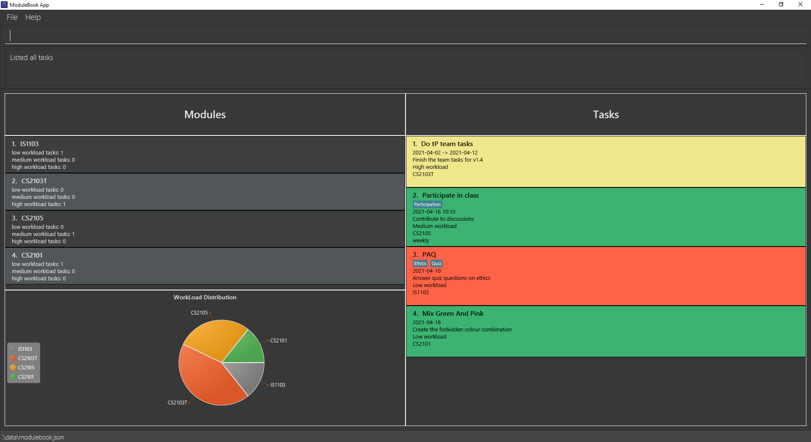
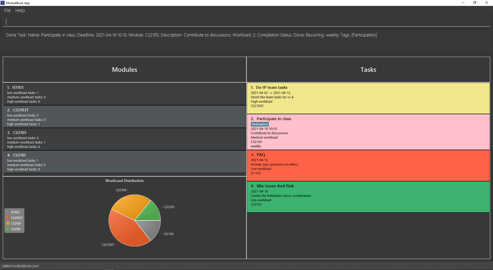
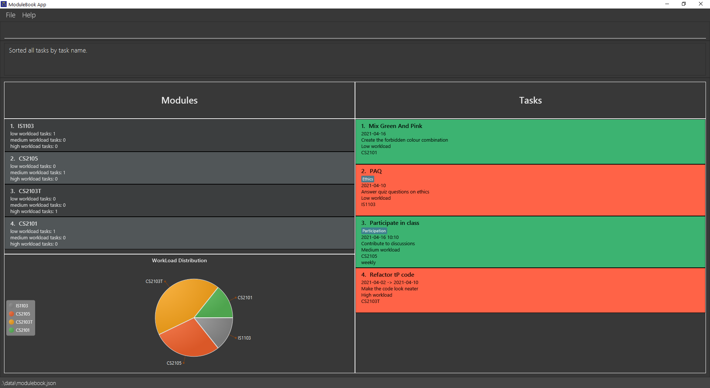
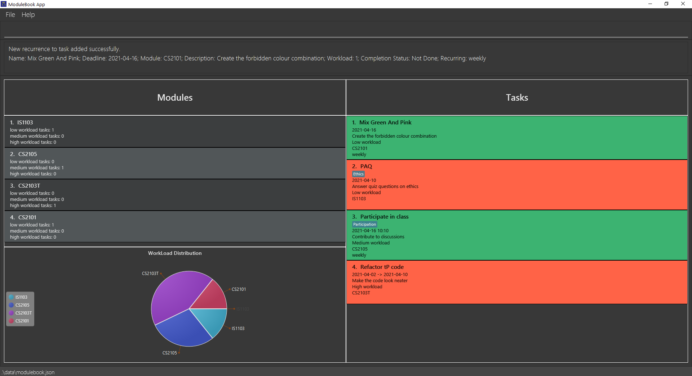

Have you ever been overwhelmed by the number of assignments given by your module instructors? How amazing would it be 
if you just have a helper, to note down those things for you, and remind you as the deadline gets closer. If 
this is you, then ModuleBook3.5 is the right fit for you.

ModuleBook3.5 is the go-to tool for busy students/professionals who are confident that typing can save them time. 
Using ModuleBook3.5, one can organise and keep track of tasks and their deadlines without the need for consistent 
internet connection.

* Table of Contents
{:toc}

Current module codes supported: CS1101S, CS1231S, CS2030, CS2040S, CS2101,
  CS2103T, CS2105, CS2106, CS3230, CS3243, CS3244, IS1103, ST2131

--------------------------------------------------------------------------------------------------------------------

## Quick start

1. ModuleBook3.5 can run on a computer installed with a major operating system (e.g. Windows/Mac/Linux) and Java 11.

2. First, download the jar file for the latest release from [github](https://github.com/AY2021S2-CS2103T-T13-2/tp/releases)

3. Once the jar file is ready, simply double-click the file in the download section.

4. Refer to the [Commands](#commands) below for details of each command.

--------------------------------------------------------------------------------------------------------------------

## Features

1. Tasks are colour coded based on done status. 
   1. Done tasks are coloured green. 
   1. Tasks that are not done are coloured pink.
  

--------------------------------------------------------------------------------------------------------------------

## Commands

**:information_source: Notes about the command format:** 

* Words in `UPPER_CASE` are the compulsory parameters to be supplied by you. 
  e.g. in `add d/DESCRIPTION`, `DESCRIPTION` is a parameter which can be used as `add d/DESCRIPTION`.

* For `MODULE`, the letters in module code should be upper-case. 
  e.g. `CS2103T` and not `cs2103t`.
  
* For `START TIME` and `DEADLINE`, the accepted date-time formats are: yyyy-MM-dd HH:mm or yyyy-MM-dd (HH:mm taken as current time). 
  e.g. `2021-03-21 10:10` or `2021-03-21`.

* Items in square brackets are optional. 
  e.g. `d/DESCRIPTION [t/TAG]` can be used as `d/CS3243 Assignment4 t/Minimax` or as `d/CS3243 Assignment4`.

* Items with `…`​ after them can be used multiple times including zero times. 
  e.g. `[t/TAG]…​` can be used as ` ` (i.e. 0 times), `t/Minimax`, `t/Minimax t/CSP` etc.

* Parameters can be in any order. 
  e.g. if the command specifies `d/DESCRIPTION t/TAG`, `t/TAG d/DESCRIPTION` is also acceptable.

* If a parameter is expected only once in the command but you specified it multiple times, only the last occurrence of the parameter will be taken. 
  e.g. if you specify `d/CS2103T team project for week7 d/CS3243 Assignment 4`, only `d/CS2103T team project for week7` will be taken.

* Extraneous parameters for commands that do not take in parameters (such as`list`) will be ignored. 
  e.g. if the command specifies `list 123`, it will be interpreted as `list`.

   * **`list`** : List out tasks

   * **`add`** : Add a task

   * **`delete`** : Delete a task

   * **`done`** : Mark a task as done

   * **`notdone`** : Mark a task as not done

   * **`tag`** : Add a tag to a task

   * **`find`** : Search for tasks with name

   * **`findTag`** : Search for tasks with tag
     
   * **`deleteTag`** : Delete a tag of a task

   * **`mod`** : Search for tasks of a specific module

   * **`edit`** : Edit task

   * **`sort`** : Sort tasks
   
   * **`recur`** :  Recur tasks

--------------------------------------------------------------------------------------------------------------------

### List out tasks : `list`

Shows a list of all tasks you have added.

Format: `list`

### Add a task: `add`

Adds a task to ModuleBook3.5. All newly added tasks are not done by default.

Format: `add n/TASK NAME m/MODULE d/DESCRIPTION [a/START TIME] b/DEADLINE w/WORKLOAD [r/RECURRENCE] [t/TAG]…​`

* If you wish to include a start time for your task, the start time should not be later than deadline.

* Recurrence should be either "daily", "weekly" or "monthly".

* Enter the time you wish to complete your task in the format: yyyy-MM-dd HH:mm or yyyy-MM-dd (HH:mm set to 00:00)

Examples:
* `add n/v1.2 TP m/CS2103T d/implement basic features b/2021-03-13 23:59 w/3 t/urgent`
* `add n/practice sets m/CS3230 d/practice master's theorem a/2021-03-14 00:00 b/2021-03-15 00:00 w/1 r/weekly`

### Delete a task : `delete`

Deletes the specified task from the module book.

Format: `delete INDEX`

* Deletes the task at the specified `INDEX`.
* The index refers to the index number shown in the displayed task list.
* The index **must be a positive integer** 1, 2, 3, …​

Examples:
* `list` followed by `delete 2` deletes the 2nd task in the ModuleBook3.5.
* `find CS2103T` followed by `delete 1` deletes the 1st task in the results of the `find` command.

### Mark a task as done : `done`

Mark an existing task as done. Done tasks are coloured green.

Format: `done INDEX`

* Mark the task as done at the specified `INDEX`.
* The index refers to the index number shown in the displayed task list.
* The index **must be a positive integer** 1, 2, 3, …​

Examples:
* `list` followed by `done 2` marks the 2nd task as done in the ModuleBook3.5.
* `find CS2103T` followed by `done 1` marks the 1st task in the results of the `find` command as done.

### Mark a task as not done : `notdone`

Mark an existing task as not done. Not done tasks are coloured pink.

Format: `notdone INDEX`

* Mark the task as not done at the specified `INDEX`.
* The index refers to the index number shown in the displayed task list.
* The index **must be a positive integer** 1, 2, 3, …​

Examples:
* `list` followed by `notdone 2` marks the 2nd task as not done in the ModuleBook3.5.
* `find CS2103T` followed by `notdone 1` marks the 1st task in the results of the `find` command as not done.

### Add a tag: `tag`

Adds a tag to a task.

Format: `tag INDEX t/TAG [t/MORETAGS]` 

* Attaches one or more tags to the task associated with INDEX. Tags can be used to identify related tasks.

Examples:
* `tag 1 t/SoftwareEng`

### Search tasks with name of task: `find`

Searches for tasks with a name of task  provided.

Format: `find KEYWORD`

* Searches through ModuleBook3.5 for tasks whose names contain `KEYWORD`.

Examples:
* `find revise`

### Search tasks with tag: `findTag`

Searches for tasks with an associated tag.

Format: `findTag KEYWORD`

* Searches through ModuleBook3.5 for tasks which have a tag named `KEYWORD`.

Examples:
* `findTag homework`

### Search tasks associated to a Module: `mod`

Searches for tasks of a specific Module.

Format: `mod MODULE`

* Searches through ModuleBook3.5 for tasks which belong to `MODULE`.

Examples:
* `mod CS3243`

### Delete tag of Task: `deleteTag`

Deletes a tag from its associated task.

Format: `deleteTag INDEX [t/TAG]`

* Deletes the task at the specified `INDEX`. 
  The index refers to the index number shown in the displayed task list. 
  The index must be a positive integer 1, 2, 3, …​

Examples:
* `deleteTag 1 t/homework`

### Edit a task: `edit`

Edits an existing task in the module book.

Format: `edit INDEX [n/NAME] [m/MODULE] [d/DESCRIPTION] [a/START TIME] [b/DEADLINE] [w/WORKLOAD] [r/RECURRENCE] [t/TAG] …​`

* Edits the task at the specified `INDEX`. The index refers to the index number shown in the displayed task list. The index **must be a positive integer** 1, 2, 3, …​
* At least one of the optional fields must be provided.
* Recurrence should be either "daily", "weekly" or "monthly".
* Existing values will be updated to the input values.
* If you wish to include a start time for your task, the start time should not be later than deadline.
* Editing tags through the `edit` command overrides all existing tags. If you wish to add or delete only certain tags, use `tag` and `deleteTag` commands instead.

Examples:
*  `edit 1 d/Eat Biscuits` Edits the description of the 1st task to `Eat Biscuits`.
*  `edit 2 d/Eat Biscuits b/2021-03-21 10:10` Edits the description of the 2nd task to be `Eat Biscuits` and its deadline to date `2021-03-21 10:10`.
*  `edit 2 b/2021-03-21` Edits the deadline of the 3rd task to `2021-03-25`

### Sort tasks : `sort`

Sorts the list of all tasks by workload/deadline/module.

Format:  `sort n/` or `sort d/` or `sort m/` or `sort w/` or `sort b/` or `sort t/` 

*  `sort n/` Sorts the tasks by name alphabetically in ascending order.
*  `sort d/` Sorts the tasks by description alphabetically in ascending order.
*  `sort w/` Sorts the tasks by workload in descending order.
*  `sort b/` Sorts the tasks by deadline so that the the task with closer the deadline in the list, the higher the task.
*  `sort m/` Sorts the tasks by module code alphabetically in descending order.
*  `sort t/` Sorts the tasks by number of tags in descending order.

Examples:
* `sort w/`

### Recur tasks: `recur`

Recurs a task either daily, monthly or weekly in the module book.

Format: `recur INDEX r/RECURRENCE`

* Recurs the task at the specified `INDEX`.
* `INDEX` refers to the index number displayed in ModuleBook3.5.
   It must be a positive integer.
* `RECURRENCE` refers to the regularity of the task that recurs periodically.
* `RECURRENCE` can only be `daily`, `weekly` or `monthly`. It is case-insensitive.

Examples:
* `recur 1 r/monthly` Recurs the 1st task in ModuleBook3.5 every month.
* `recur 2 r/weekly` Recurs the 4th task in ModuleBook3.5 every week.
* `recur 3 r/daily` Recurs the 3rd task in ModuleBook3.5 every day.

--------------------------------------------------------------------------------------------------------------------

### Save data

ModuleBook3.5 data is saved in the hard disk automatically after any command that changes the data. There is no need to save manually.

--------------------------------------------------------------------------------------------------------------------

### Edit the data file

ModuleBook3.5 data is saved as a JSON file `[JAR file location]/data/modulebook.json`. Advanced users are welcome to update data directly by editing that data file.

:exclamation: **Caution:**
If your changes to the data file makes its format invalid, ModuleBook3.5 will discard all data and start with an empty data file at the next run.

--------------------------------------------------------------------------------------------------------------------

## FAQ
**Q**: I tried double-clicking the jar file but it did not open. What happened? 
**A**: Try checking if any security software is blocking the jar file. If that still does not work, navigate to command prompt and run the following command:
`java -jar modulebook.jar`

**Q**: How do I transfer my data to another Computer? 
**A**: Install the app in the other computer and overwrite the empty data file it creates with the file that contains the data of your previous ModuleBook3.5 home folder.

--------------------------------------------------------------------------------------------------------------------

## Command summary

Action | Format, Examples
--------|------------------
**list** | `list`
**add** | `add n/TASK NAME m/MODULE d/DESCRIPTION [a/START TIME] b/DEADLINE w/WORKLOAD [r/RECURRENCE] [t/TAG]…​`   e.g. `add n/TP m/CS2103T d/Team tasks b/2021-01-20 20:00 w/3 t/tagname`
**delete** | `delete INDEX`  e.g. `delete 3`
**deleteTag** | `deleteTag INDEX [t/TAG NAME]`  e.g. `delete 3 [t/SoftwareEng]`
**done** | `done INDEX`  e.g. `done 1`
**notdone** | `notdone INDEX`  e.g. `notdone 1`
**tag** | `tag INDEX [t/TAG NAME]`  e.g. `tag 1 [t/SoftwareEng]`
**find** | `find KEYWORD`  e.g. `find Assignment`
**findTag** | `findTag KEYWORD`  e.g. `find Assignment`
**mod** | `mod MODULE`  e.g. `mod CS2103T`
**edit** | `edit INDEX [d/DESCRIPTION] [b/DEADLINE]…​`  e.g. `edit 2 d/Eat Biscuits b/2021-03-21 10:10`
**recur** | `recur INDEX r/RECURRENCE`  e.g. `recur 1 r/monthly`
**sort** | `sort n/` or `sort d/` or `sort m/` or `sort w/` or `sort b/` or `sort t/`   e.g. `sort b/`
