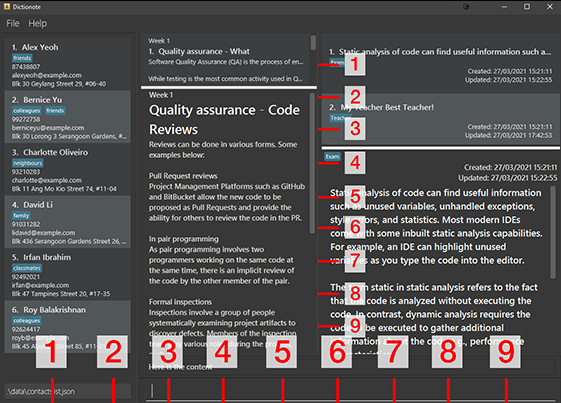

**Dictionote** is a desktop application that helps CS2103T students in finding information about the module's materials, writing notes about them, and sharing these notes with others. It is optimised for Command Line Interface (CLI) users so that searching and writing operations can be done quickly by typing in commands.

* Table of Contents
{:toc}

--------------------------------------------------------------------------------------------------------------------

## Quick start

1. Ensure you have Java `11` or above installed in your Computer.

1. Download the latest `dictionote.jar` from [here](https://github.com/AY2021S2-CS2103T-W13-1/tp/releases).

1. Copy the file to the folder you want to use as the _home folder_ for your Dictionote application.

1. Download the additional files 'dictionarybook.json' and 'definitionbook.json' from [here](https://github.com/AY2021S2-CS2103T-W13-1/tp/releases/tag/v1.4) into the ***same*** folder as the one you have downloaded the application into in Step 3. This step will add the contents and definitions into the Dictionary of the application for your usage.

1. Double-click the file to start the app. The GUI should appear in a few seconds.  
   

1. Type the command in the command box and press Enter to execute it. e.g. typing **`help`** and pressing Enter will open the help window.

1. Refer to the [Features](#features) below for details of each command.

--------------------------------------------------------------------------------------------------------------------

## Features

**:information_source: Notes about the command format:** 

* Words in `UPPER_CASE` are the parameters to be supplied by the user. 
  e.g. in `addNote c/CONTENT`, `CONTENT` is a parameter which can be used as `addnote c/This is a note`.

* Items in square brackets are optional. 
  e.g `n/NAME [t/TAG]` can be used as `n/John Doe t/friend` or as `n/John Doe`.

* Items with `…`​ after them can be used multiple times including zero times. 
  e.g. `[t/TAG]…​` can be used as ` ` (i.e. 0 times), `t/friend`, `t/friend t/family` etc.

* Parameters can be in any order. 
  e.g. if the command specifies `n/NAME p/PHONE_NUMBER`, `p/PHONE_NUMBER n/NAME` is also acceptable.

* If a parameter is expected only once in the command but you specified it multiple times, only the last occurrence of the parameter will be taken. 
  e.g. if you specify `p/12341234 p/56785678`, only `p/56785678` will be taken.

* Extraneous parameters for commands that do not take in parameters (such as `help`, `listcommand`, `exit` and `clearcontact`) will be ignored. 
  e.g. if the command specifies `help 123`, it will be interpreted as `help`.

* Extraneous parameter for commands that only take in one parameters (such as `open`, `close`, and `setdividerc` will **not** be ignored. 
  e.g. if the command specifies `open -c 123`, the command will be invalid.

### Guide Feature
#### Viewing help : `help`

Shows a message explaning how to access the help page.

Format: `help`

#### Viewing Command List : `listcommand`

Shows a list of available command

Format: `listcommand`

#### Viewing Command Details

##### Viewing Dictionary Command Details : `commanddetaild`

Shows a list of available dictionary command with description

Format: `commanddetaild`

##### Viewing note Command Details : `commanddetailn`

Shows a list of available note command with description

Format: `commanddetailn`

##### Viewing Contact Command Details : `commanddetailc`

Shows a list of available contact command with description

Format: `commanddetailc`

##### Viewing Ui Command Details : `commanddetailu`

Shows a list of available Ui command with description

Format: `commanddetailu`

### Dictionary Features
This section will introduce to you the commands to be used in the Dictionary Panel.

#### Listing all content : `listcontent`

Shows a list of all contents in the Dictionary.

* This command allows you to view the entire list of contents in the dictionary panel.
* It will be useful to use this command in scenarios where the list in the panel had been trimmed by other commands such as `findcontent`, or when the dictionary panel is showing definitions instead of contents.

Format: `listcontent`  
This command will return you the content in the dictionary panel:

#### Finding content in the Dictionary using keywords: `findcontent`

Finds relevant content in the dictionary that matches the keywords.

Format: `findcontent KEYWORD [MORE_KEYWORDS]`

* The search is case-insensitive. e.g `programming` will match `PROGRAMMING` or `Programming`
* The order of the keywords does not matter. e.g. `content some` will match `some content`
* Only the content is searched, headers and titles are not included.
  (the breakdown of the content is as follows):
  
  
* Only full words will be matched e.g. `prog` will not match `programming`, `OOP` will also not return `(OOP)`
* Contents matching at least one keyword will be returned (i.e. `OR` search).
  e.g. `some different` will return `some content`, `different thing`

Examples:
* `findcontent programming` returns `Programming` and `PROGRAMMING LANGUAGE`
* `findcontent some different` returns `some content`, `different thing` 
* `findcontent program` will return the following 2 contents:
  

#### Listing all definitions : `listdef`

Shows a list of all the definitions in the Dictionary.

* This command allows you to view the entire list of definitions in the dictionary panel.
* It will be useful to use this command in scenarios where the list in the panel had been trimmed by other commands such as `finddef`, or when the dictionary panel is showing content instead of definitions.

Format: `listdef`  
This command will show you the list of definitions in the dictionary panel:
  

#### Finding definition in the Dictionary using keywords: `finddef`

Finds relevant content in the dictionary that matches the keywords.

Format: `finddef KEYWORD [MORE_KEYWORDS]`

* The search is case-insensitive. e.g `programming` will match `PROGRAMMING` or `Programming`
* The order of the keywords does not matter. e.g. `content some` will match `some content`
* Only the content is searched, headers and week numbers are not included.
* Only full words will be matched e.g. `prog` will not match `programming`
* Contents matching at least one keyword will be returned (i.e. `OR` search).
  e.g. `some different` will return `some content`, `different thing`

Examples:
* `finddef programming` returns `Programming Language` and `Object-Oriented Programming`  
  

#### Show a dictionary content : `showdc`

Showcases a dictionary content.

Format: `showdc INDEX​`

* Shows the dictionary content at the specified `INDEX`.
* The index refers to the index number shown in the displayed dictionary list. The index **must be a positive integer** 1, 2, 3, …​
* If the list shown in the dictionary panel is the content's list, then the indexes will correspond to the content in the content list.   
  E.g. in the contents list, show the content of index 1:
  
* If the list shown in the dictionary panel is the definitions list, then the indexes will correspond to the content in the definitions list.  
  E.g. in the definitions list, show the definition of index 1:
  
  

#### Copying content to a note: `copytonote`

Copies the content/definition into a note

Format: Format: `copytonote INDEX​`

* This command allows you to copy the content, at the index that you have keyed in, over from the displayed dictionary panel into a new note.
* The index and corresponding content will depend on the currently displayed list in the Dictionary List Panel. 
  i.e. if the list displayed is a list of definitions, then keying in `copytonote 1` will create a note that contains the definition of index 1.
  Similarly, if the list displayed is a list of content, then keying in `copytonote 1` will create a note that contains the content of index 1.

Example: `copytonote 1`
    
You will see that a new note with the details of the content at index 1 will be created in the note list panel.  

To see/edit the note/carry out other commands, please view the detailed commands under the [Note Features](#note-features).

### Note Features

#### Adding a new note: `addnote`

Adds a note equipped with some tags.

Format: `addnote c/CONTENT [t/TAG]...`

* Tags are optional.
* When adding multiple contents, only the last content will be added.
* In the current version, notes will be stored as a pure string.
* Note with the same exact content can only be added once regardless of different tags. 
* Tags must be in alphanumeric format.
* `...` means that you can add multiple tags.

Examples:
* `addnote c/Do Homework`
* `addnote c/Study for Midterms t/CS2103`
* `addnote c/Go to school t/Panic t/Confused`

#### Listing all notes : `listnote`

Lists every note on the note list.

Format: `listnote​`

#### Showing a note : `shownote`

Showcases a note.

Format: `shownote INDEX​`

* Shows the note at the specified `INDEX`.
* The index refers to the index number shown in the displayed Note list. The index **must be a positive integer** 1, 2, 3, …​
* To view the note created in the note content panel (by [`copytonote`](#Copying-content-to-a-note:-copytonote))), use the command `shownote` at the respective index, in this case index 6  
  `shownote 6`:
  

Examples:
* `shownote 2` Shows the note at position 2.

#### Editing a note : `editnote`

Edits an existing note in the note list.

Format: `editnote INDEX [c/CONTENT] [t/TAG]…​`

* Edits the note at the specified `INDEX`. The index refers to the index number shown in the displayed note list. The index **must be a positive integer** 1, 2, 3, …​
* At least one of the optional fields must be provided.
* If only content are provided, then the tags will be unchanged. Empty content field is not allowed.
* If only tags are provided, then the content will be unchanged. Multiple tags are supported.
* If both content and tags are provided, then existing values will be updated to the input values.
* When editing tags, the existing tags of the note will be removed (i.e., adding of tags is not cumulative).

Examples:
* `editnote 1 c/Hello t/Important` Edits the content and tags of the 1st contact to be `Hello` and `Important` respectively.
* `editnote 1 c/Hi` Edits the content of the 1st contact to be `Hi` and keep the tags. 

#### Editing a note in edit mode : `editmode`

Edits a note in edit mode.

Format: `editmode`

* A note have to be show on the note content panel using `shownote` command.
* The user will be able to edit the note content in the text box.
* The user will not be able to edit the tag.
* In edit note mode, all others note related command will be disable.
* To exit edit note mode, use `quit` to discard all changes or `save` to save all changes

Examples:
* `editmode`
  * Note Content will be editable
    

:bulb: **Tip:** Use <kbd>Esc</kbd> to return to command box and <kbd>Tab</kbd> to focus on next element.

#### Quiting edit mode : `quit`

Quit edit mode and discard all changes.

Format: `quit`

* The program have to be in edit mode.
* All changes will be discarded.
* The program will exit edit mode.

Examples:
* `quit`
  * quit edit mode and discard all changes.

#### Saving and exiting edit mode: `save`

Save edited content and exit edit mode.

Format: `save`

* The program have to be in edit mode.
* All changes will be saved.
* The program will exit edit mode after saving.

Examples:
* `save`
  * exit edit mode and save all changes.

#### Finding notes using a keyword : `findnote`

Find notes whose names contain any of—or tags contain all of—the given keywords.

Format: `findnote c/NAME_KEYWORD... [t/TAG_KEYWORD]...`

* The search is case-insensitive. e.g `c/cs2103` will match the name `CS2103`
* Only the content and tags are searched.
* Notes and tags will be matched if they contain the given keywords e.g. `c/CS` will match the note containing `CS2103T`
* Notes matching at least one content keyword will be returned (i.e. OR search). e.g. `c/CS c/Important` will return `CS Midterm`, `Important stuff`
* Notes matching all of the given tag keywords will be returned (i.e. AND search). e.g. `t/urgent` will return all notes that are tagged with `urgent`.
* When both `c/` and `t/` are used, notes that satisfy BOTH of the constraints will be returned. 
Examples:

* `findnote c/CS2103` returns note containing `CS2103`
* `findnote c/CS t/urgent` will return all notes containing `CS` and tagged with `urgent`.

#### Deleting a new note: `deletenote`

Deletes the specified note from the note list.

Format: `deletenote INDEX`

* Deletes the note at the specified `INDEX`.
* The index refers to the index number shown in the displayed note list.
* The index **must be a positive integer** 1, 2, 3, …​

Examples:
* `deletenote 1` Deletes the note at the first position.

#### Sorting all notes : `sortnote`

Sort every note on the note list alphabetically.

Format: `sortnote`

#### Sorting all notes based on last edit time: `sortnotebytime`

Sort every note on the note list based on last edit time.

Format: `sortnotebytime`

#### Marking a note as done: `markasdonenote`

Marks a note in a list as done.

Format: `markasdonenote INDEX`

* Marks the note at the specified `INDEX` as done.
* The index refers to the index number shown in the displayed note list.
* The index **must be a positive integer** 1, 2, 3, …​
* After execution, the affected note will be marked with a green tick.
* A note can only be marked as done if it is currently not done. Otherwise, an exception will be raised.

Examples:
* `markasdonenote 1` Marks note at the first position as done.

#### Marking a note as undone: `markasundonenote`

Marks a note in a list as undone.

Format: `markasundonenote INDEX`

* Marks the note at the specified `INDEX` as undone.
* The index refers to the index number shown in the displayed note list.
* The index **must be a positive integer** 1, 2, 3, …​
* After execution, the affected note will not be marked with a green tick.
* A note can only be marked as undone if it is currently done. Otherwise, an exception will be raised.

Examples:
* `markasundonenote 1` Marks note at the first position as undone.

#### Marking all notes as undone: `markallasundonenote`

Marks all notes in a list as undone.

Format: `markallasundonenote`

* Marks all the notes as undone.
* After execution, all notes marked with a green tick will be reset.

#### Merging two notes into one : `mergenote`

Merge two notes into one note.

Format: `mergenote INDEX_1 INDEX_2`

* Merge two notes in the specified index into one note.
* The two notes that are merged are deleted.

Examples:
* `mergenote 2 5` Merges the note in the second and fifth position. 

#### Converting a note into a .txt file : `converttxtnote`

Converts a note into a text file.

Format: `converttxtnote INDEX`

* Merge two notes in the specified index into one note.
* The two notes that are merged are deleted.
* The file name will be the content of the note itself. Also, it can be found in the `data` folder of the `Dictionote`.

Examples:
* `converttxtnote 2` Converts the second note in the list into a text file. 

### Contact Features

For the following contact features, irrelevant panels of the user interface were closed (see [Closing UI Panel](./UserGuide.md#closing-ui-panel-close) below).  
Thus, for the upcoming examples, assume the following as the current state of Dictionote:

#### Adding a contact: `addcontact`

Adds a contact to the contacts list.

Format: `addcontact n/NAME p/PHONE_NUMBER e/EMAIL a/ADDRESS [t/TAG]…​`

:bulb: **Tip:**
A contact can have any number of tags (including 0)

* Contacts may share names, addresses, and tags.
* Contacts **must not** share phone numbers or emails, as they are considered unique to each contact.

Examples:
* `addcontact n/John Doe p/98765432 e/johnd@example.com a/John street, block 123, #01-01`
* `addcontact n/Betsy Crowe t/friend e/betsycrowe@example.com a/Newgate Prison p/1234567 t/criminal`

#### Listing all contacts : `listcontact`

Shows a list of all contacts in the contacts list.

Format: `listcontact`

#### Editing a contact : `editcontact`

Edits an existing contact in the contacts list.

Format: `editcontact INDEX [n/NAME] [p/PHONE] [e/EMAIL] [a/ADDRESS] [t/TAG]…​`

* Edits the contact at the specified `INDEX`. The index refers to the index number shown in the displayed contacts list. The index **must be a positive integer** 1, 2, 3, …​
* At least one of the optional fields must be provided.
* Existing values will be updated to the input values.
* The new phone number or email-if specified-**must not** be present as a value for any other existing contact.
* When editing tags, the existing tags of the contact will be removed (i.e., adding of tags is not cumulative).
* You can remove all of the contact’s tags by typing `t/` without
  specifying any tags after it.

Examples:
*  `editcontact 1 p/91234567 e/johndoe@example.com` Edits the phone number and email address of the 1st contact to be `91234567` and `johndoe@example.com` respectively.
*  `editcontact 2 n/Betsy Crower t/` Edits the name of the 2nd contact to be `Betsy Crower` and clears all existing tags.

#### Locating contacts: `findcontact`

Finds contacts whose names and emails contain any of—or tags contain all of—the given keywords.

Format: `findcontact [n/NAME_KEYWORD]... [e/EMAIL_KEYWORD]... [t/TAG_KEYWORD]...`

* The search is case-insensitive. e.g `n/hans` will match the name `Hans`
* The order of the keywords does not matter. e.g. `n/Hans n/Bo` will match the name `Bo Hans`
* Only the name, email, and tags are searched.
* Names, emails, and tags will be matched if they contain the given keywords e.g. `n/Han` will match the name `Hans`
* Contacts matching at least one name keyword will be returned (i.e. `OR` search).
  e.g. `n/Hans n/Bo` will return `Hans Gruber`, `Bo Yang`
* Contacts matching at least one email keyword will be returned (i.e. `OR` search).
  e.g. `e/@mail.com e/@mail.net` will return contacts with the following emails: `hans@mail.com`, `bo@mail.net`
* Contacts matching all of the given tag keywords will be returned (i.e. `AND` search).
  e.g. `t/friends t/university` will only return all contacts that are tagged with both `Friends` and `University`

Examples:
* `findcontact n/John` returns `john` and `John Doe`
* `findcontact n/jack e/@email.net t/friends t/university` returns all contacts containing `Jack` in their name, `@email.net` in their email, and both `Friends` and `University` as part of their tags.
* `findcontact n/alex n/david` returns `Alex Yeoh`, `David Li` 
  
* `findcontact t/colleagues t/friends` returns `Bernice Yu`  
  
* `findcontact t/colleagues n/roy` returns `Roy Balakrishnan`  
  

#### Deleting a contact : `deletecontact`

Deletes the specified contact from the contacts list.

Format: `deletecontact INDEX`

* Deletes the contact at the specified `INDEX`.
* The index refers to the index number shown in the displayed contacts list.
* The index **must be a positive integer** 1, 2, 3, …​

#### Sending an email to a contact : `emailcontact`

Opens a new window to send an email to the specified contact from the contacts list.

Format: `emailcontact INDEX [ni/NOTE_INDEX]`

* Opens a new message composition window with the *to* field containing the email address of the contact at the specified `INDEX`.
* If `ni/NOTE_INDEX` is provided, the contents of the note at `NOTE_INDEX` will be copied to the *body* field of the new message.
* The application uses the user's default mailing application to provide email features.
* The application **does not guarantee** the success of sending an email, as it is handled by the mailing application used.
* The index refers to the index number shown in the displayed contacts list or notes list.
* The index **must be a positive integer** 1, 2, 3, …​

Examples:
* `listcontact` followed by `emailcontact 2` opens a new message composition window targeting the 2nd contact in the contacts list.
* `findcontact n/Alice` followed by `emailcontact 1` opens a new message composition window targeting the 1st contact in the results of the `findcontact` command.
* `listcontact` followed by `emailcontact 3 ni/1` opens a new message composition window targeting `Charlotte Oliveiro` with the body containing `CS2103T exam is coming.`.  
    * This example uses Microsoft Outlook as a mailing application on a Windows 10 machine. 
    
   

#### Sorting the contacts list by most frequently-contacted: `mostfreqcontact`

Sorts the contacts list in descending order based on the number of email sending attempts to each contact.

Format: `mostfreqcontact`

* This command sorts the entire contacts list, including the contacts that did not match the latest `findcontact` query.
* Each successful execution of `emailcommand` will be counted as an email sending attempt, regardless of whether an email was actually sent or not.
* The ordering of the contacts list after sorting will replace the original ordering. (i.e., the sorted ordering is stored by Dictionote)

Example:
* Assume the following:
    * Five emails were sent to `Charlotte Oliveiro`.
    * Four emails were sent to `David Li`.
    * Two emails were sent to `Bernice Yu`.
    * One email was sent to `Alex Yeoh`.
* `mostfreqcontact` results in the following:  
  

#### Clearing the contacts list : `clearcontact`

Clears the contacts list from all contacts.

Format: `clearcontact`

### User Interface Feature
Dictionote allows the user to manipulate the user-interface via command.
The following are the 5 region where the user can manipulate

#### Opening and Closing UI Panel

##### Opening UI Panel: `open`
Dictionote will open the UI Panel you've chosen. When you open the panel, it is set to be visible.

Format: `open OPTION`

* The following `OPTION` are supported
    * `-a`: All panel
    * `-c`: Contact panel
    * `-d`: Both dictionary list panel and dictionary content panel
    * `-dc`: Dictionary content panel
    * `-dl`: Dictionary list panel
    * `-n`: Both note list panel and note content panel
    * `-nc`: Note content panel
    * `-nl`: Note list panel
    * `-l`: Both dictionary list and note list panel

Examples:
* `open -c`
    * The Contact panel will be visible to the user
* `open -a`
    * All panel will be visible to the user

##### Closing UI Panel: `close`
Dictionote will close the UI Panel you've chosen. The panel is set to be invisible when closed.

Format: `close OPTION`

* The following `OPTION` are supported
    * `-a`: All panel
    * `-c`: Contact panel
    * `-d`: Both dictionary list panel and dictionary content panel
    * `-dc`: Dictionary content panel
    * `-dl`: Dictionary list panel
    * `-n`: Both note list panel and note content panel
    * `-nc`: Note content panel
    * `-nl`: Note list panel
    * `-l`: Both dictionary list and note list panel

Examples:
* `close -c`
    * The Contact panel will be invisible to the user
* `close -a`
    * All panel will be invisible to the user

#### Setting UI Divider Position
Dictionote allows the user to manipulate the divider between the region via command.
The following are the 4 divider where the user can manipulate

The following images show the position the divider will be set when user enter a value from 1 to 9
in either horizontally or vertically mode.

The following is the meaning of the suffix found in `setdivider` command
* m - Main
* d - Dictionary
* n - Note
* c - Contact

##### Set contact divider position: `setdividerc`

Sets the position of the contact divider.
The contact divider is the divider separating the contact and others user interface.
When the divider position changes, Contact Panel become visible.

Format: `setdividerc POSITION`

* The `POSITION` **must be a between 1 to 9** (inclusive)
* The `POSITION` **must be a positive integer** 1, 2, 3, …​

Examples:
* `setdividerc 8`

##### Set dictionary divider position: `setdividerd`

Sets the position of the dictionary divider.
The dictionary divider is the divider separating the dictionary list and dictionary content.
When the divider position changes,
both the Dictionary List Panel and the Dictionary Content Panel become visible.

Format: `setdividerd POSITION`

* The `POSITION` **must be a between 1 to 9** (inclusive)
* The `POSITION` **must be a positive integer** 1, 2, 3, …​

Examples:
* `setdividerd 5`

##### Set note divider position: `setdividern`

Sets the position of the note divider.
The note divider is the divider separating the note list and note content.
When the divider position changes,
both the Note List Panel and the Note Content Panel become visible.

Format: `setdividern POSITION`

* The `POSITION` **must be a between 1 to 9** (inclusive)
* The `POSITION` **must be a positive integer** 1, 2, 3, …​

Examples:
* `setdividern 6`

##### Set main divider position: `setdividerm`

Sets the position of the main divider.
The main divider is the divider separating the note and dictionary.
When the divider position changes,
both the Note List Panel and the Dictionary List Panel become visible.

Format: `setdividerm POSITION`

* The `POSITION` **must be a between 1 to 9** (inclusive)
* The `POSITION` **must be a positive integer** 1, 2, 3, …​

Examples:
* `setdividerm 3`

#### Toggle Divider Orientation
Dictionote allows the user to change the orientation of the divider between the region via command.
The following are the 2 divider where the user can manipulate

The following is the meaning of the suffix found in `toggledivider` command
* d - Dictionary
* n - Note

##### Toggle dictionary divider orientation: `toggledividerd`

Toggle the orientation of the dictionary divider. 
If the current orientation of the dictionary divider on horizontal,
it will be changed to vertical and vice versa.
When the orientation changes, 
both the Dictionary List Panel and the Dictionary Content Panel become visible.

Format: `toggledividerd`

##### Toggle note divider orientation: `toggledividern`

Toggle the orientation of the note divider.
If the current orientation of the note divider horizontal,
it will be changed to vertical and vice versa.
When the orientation changes,
both the Note List Panel and the Note Content Panel become visible.

Format: `toggledividern`

### Others Feature

#### Exiting the program : `exit`

Exits the program.

Format: `exit`

#### Saving the data

Dictionote data are saved in the hard disk automatically after any command that changes the data. 
There is no need to save manually.

#### Editing dictionary content, definition and others data file

Dictionote data are saved as a JSON file at directory `[JAR file location]/data/`. 
* Dictionary contents are saved as `dictionarybook.json`.
* Dictionary definitions are saved as `definitionbook.json`.
* Contact list are saved as `contactlist.json`
* Note list are saved as `notebook.json`

If you would like to contribute to the content and definitions of our dictionary,
you are welcome to update the data directly by editing that data file.
To avoid making mistakes, it is recommended that you use a JSON editor to edit the data file.

:exclamation: **Caution:**
If your changes to the data file makes its format invalid, 
Dictionote will discard all data and start with an empty data file at the next run.

### Customizing themes `[coming in v2.0]`

_Details coming soon ..._

--------------------------------------------------------------------------------------------------------------------

## FAQ

**My data is missing after I edited my JSON file.**
* When an invalid JSON file is detected, Dictionote discards all data and starts over with an empty data file. 
* Please use a JSON editor software to ensure that the format is still valid after you've edited it.

**I tried to open the closed panel with my mouse, but there is no content displayed when I drag the panel open.**
* Dictionote currently does not allow user to change the visibility of the panel using mouse, 
  please use the `open` command instead.

**How do I contribute to the project? I have added some new dictionary content and definitions.**
* You are welcome to do a pull request [here](https://github.com/AY2021S2-CS2103T-W13-1/tp/pulls). 
  Refer to [this](https://nus-cs2103-ay2021s2.github.io/website/se-book-adapted/chapters/gitAndGithub.html#creating-prs) 
  for details on how to do a pull request.
--------------------------------------------------------------------------------------------------------------------

## Command summary

Action | Format, Examples
--------|------------------
**Viewing help** | `help`
**Viewing Command List** | `listcommand`
**Viewing Dictionary Command Details** | `commanddetaild`
**Viewing Note Command Details** | `commanddetailn`
**Viewing Contact Command Details** | `commanddetailc`
**Viewing UI Command Details** | `commanddetailu`
**Exit** | `exit`
***Dictionary Features*** | 
**Find content** | `findcontent KEYWORD [MORE_KEYWORDS]`
**Find definition** | `finddef KEYWORD [MORE_KEYWORDS]`
**Show specific content** | `showdc INDEX`   e.g., `showdc 1`
**List content** | `listcontent`
**List definitions** | `listdef`
**Copy content to note** | `copytonote`
***Note Features*** | 
**Add note** | `addnote c/CONTENT [t/TAG]…​`
**List all notes** | `listnote`
**Show note** | `shownote INDEX`   e.g., `shownote 1`
**Edit note** | `editnote INDEX c/CONTEXT [t/TAG]…​`
**Edit note in edit mode** | `editmode`
**Quit edit mode** | `quit`
**Save changes to note** | `save`
**Find notes using keywords** | `findnote c/NAME_KEYWORD…​ [t/TAG_KEYWORD]…​`
**Delete note** | `deletenote INDEX`
**Sort all notes** | `sortnote`
**Sort all notes based on the last edit time** | `sortnotebytime`
**Mark note as done** | `markasdonenote INDEX`
**Mark note as undone** | `markasundonenote INDEX`
**Mark all notes as undone** | `markallasundonenote`
**Merge two notes** | `mergenote INDEX_1 INDEX_2`
**Convert note into .txt** | `converttxtnote INDEX`
***Contact Features*** | 
**Add contact** | `addcontact n/NAME p/PHONE_NUMBER e/EMAIL a/ADDRESS [t/TAG]…​`   e.g., `addcontact n/James Ho p/22224444 e/jamesho@example.com a/123, Clementi Rd, 1234665 t/friend t/colleague`
**List all contacts** | `listcontact`
**Edit contact** | `editcontact INDEX [n/NAME] [p/PHONE_NUMBER] [e/EMAIL] [a/ADDRESS] [t/TAG]…​`  e.g.,`editcontact 2 n/James Lee e/jameslee@example.com`
**Find contacts** | `findcontact [n/NAME_KEYWORD]... [e/EMAIL_KEYWORD]... [t/TAG_KEYWORD]...`  e.g., `findcontact n/James e/@mail.com t/family`
**Delete contact** | `deletecontact INDEX`  e.g., `deletecontact 3`
**Send email to contact** | `emailcontact INDEX [ni/NOTE_INDEX]`  e.g., `emailcontact 2 ni/1`
**Sort contacts by most-frequent** | `mostfreqcontact`
**Clear contacts list** | `clearcontact`
***UI Features*** | 
**Open UI panel** | `open OPTION`   e.g., `open -c`
**Close UI panel** | `close OPTION`   e.g., `close -c`
**Set contact divider position** | `setdividerc POSITION`   e.g., `setdividerc 3`
**Set dictionary divider position** | `setdividerd POSITION`   e.g., `setdividerd 3`
**Set note divider position** | `setdividern POSITION`   e.g., `setdividern 3`
**Set main divider position** | `setdividerm POSITION`   e.g., `setdividerm 5`
**Toggle dictionary divider orientation** | `toggledividerd`
**Toggle note divider orientation** | `toggledividern`
