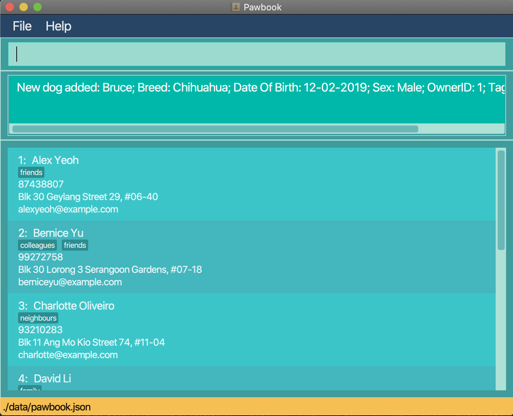

# **Table of Contents**

1. [Overview](#overview)
   * [Introduction](#introduction)
   * [Purpose](#purpose)
   * [Contributors](#contributors)
   * [Navigating the User Guide](#navigating-the-user-guide)
2. [About the User Guide](#about-the-user-guide)
   * [Syntax Format](#syntax-format)
   * [GUI Layout](#gui-layout)
3. [Quick Start](#quick-start)
4. [Commands](#commands)
   * [Add Command](#add-command)
   * [Delete Command](#delete-command)
   * [Edit Command](#edit-command)
   * [Enrol Command](#enrol-command)
   * [Drop Command](#drop-command)
   * [List Command](#list-command)
   * [Find Command](#find-command)
   * [View Command](#view-command)
   * [Help Command](#help-command)
   * [Exit Command](#exit-command)
5. [FAQ](#faq)
6. [Command Summary](#command-summary)
7.  [Glossary](#glossary)

# Overview

Welcome to the Pawbook User Guide! 
In this section, you will be given a brief overview of what Pawbook is all about and what you can takeaway from this document. 
We will guide you from a user's perspective as to how to use Pawbook. 

This user guide contains (but not limited to) a [quick start guide](#quick-start), a [features walkthrough](#commands) and a [command summary table](#command-summary) for easy reference. 
In each feature or functionality, we further provide command formats and command examples to ensure that users can become proficient in using Pawbook.

## Introduction

Managing a business is definitely not easy, so imagine if your business includes taking care of countless energetic 
furpals. That's right! We are talking about the job of dog school managers. <br> 

As dog schools and dog day cares rise in popularity due to the hectic work life of dog owners, the operations of dog schools can get out of hand. But no worries, 
we have Pawbook to save the day!

With Pawbook, you can add and delete owner and dog profiles alike, to easily keep track of dogs and their respective owners.
Pawbook also allows the managing of the various canine-training programs to cater to your furry customers.
With the many programs taking place in the school, Pawbook helps to condense your hectic schedule for you. 
By viewing your schedule, you are able to better plan for the day ahead.

Pawbook is a desktop application for dog school managers to facilitate their bookkeeping of puppies and dogs in the 
school, optimized for use via a **Command Line Interface (CLI)** which caters to fast-typers who prefer to use a keyboard. 
You can navigate the application with ease and execute instructions by typing text-based commands in the command box provided.

Pawbook also has the benefits of a **Graphical User Interface (GUI)** to provide you with a visually appealing view, thus bringing you the best user experience.

## Purpose

The aim of this user guide is to guide novel users on how to get started with Pawbook. 
It also aids more experienced users by providing a detailed explanation on the different features and components of Pawbook. 
This allows old and new users alike to easily use the various features and functionalities provided by Pawbook. 

## Contributors

This user guide is created by **CS2103T-T10-Group1**.
* Charles Lee Lin Ta
* John Alec Mendoza Branzuela
* Kou Yong Kang
* Lam Xuan Yi, Shaelyn
* Wei Yutong
* Zhang Anli

## Navigating the User Guide

This user guide provides you with all the information you need to utilise Pawbook. We understand the 
pains of using a Command Line Interface (CLI) program and have bested our efforts into ensuring a very readable guide
on how to use our program <br>

If you need help setting up Pawbook, you can go to the _[Quick Start](#quick-start)_ section. <br>

If you want to find out more about Pawbook's features and commands, you can go to the _[Commands](#commands)_ section. <br>

If you need an overview regarding the usage of Pawbook's commands, head on to the _[Command Summary](#command-summary)_ section. <br>

Here are some important syntax to take note of to facilitate your reading before continuing.

| **Symbol/Format** | **Meaning** |
| :------------------:|:-------------|
|<kbd>Enter</kbd> | Indicates the enter button on the user's keyboard |
| `Markdown` | Example of what to type in the command textbox |
| **Bold** | Note-worthy keywords |
| [Repeated Parameters] | Indicates the parameters/prefixes that may be repeated multiple times |
| :bulb: | Indicates there is something important to take note of


# About the User Guide

In this section, you will learn what the different notations and symbols used in Pawbook. 

## Syntax Format

Syntax | Meaning  | Example
--------|------------------|----------
**`lower_case/`** |  Prefix | `n/`, `p/`, `t/`
**`[UPPER_CASE]/`** |  Parameter | [keyword] [entity ID]

## GUI Layout

In this section, you will be given an introduction to the layout of Pawbook's Graphical User Interface (GUI). This will 
help you better understand what each component that you observe on-screen represents. <br>

There are a total of two pages that you can navigate to when using Pawbook:
* Main Page
* Help Page

### Main Page View

You will be directed to the main page upon launching Pawbook. On this page, you can see the list of owners, dogs and programs
that are currently stored in Pawbook. <br>

Here is how the main page looks like:


### Help Page View

This page helps you to better understand what each component seen on screen represents.

* Table of Contents
{:toc}

---

## Quick Start

If this is your first time using Pawbook, follow these simple steps to jump straight into the action:

1. Ensure you have **Java 11 or above** installed in your Computer.
2. Download the **latest** pawbook.jar [here][insertlinkhere].
3. Copy the _pawbook.jar_ file to the folder you want to use as the root directory for Pawbook.
4. Double-click the file to start the app. The GUI should appear in a few seconds.
5. Congratulations, you have successfully launched Pawbook! For new users, type `help` in the command box to view the instruction list
6. Type the command in the command box and press <kbd>Enter</kbd> to execute it. e.g.
   typing `add` and pressing <kbd>Enter</kbd>  will allow you to start adding information to
   the database.

:bulb: Please refer to the features below for details of each command.

----

# Commands 

In this section, you will learn about the commands available in Pawbook and how to use them.

### Add Command

Adds a **dog/owner/program** to Pawbook.

Format:

```
add dog n/DOGNAME b/BREED d/DATEOFBIRTH s/SEX o/OWNERID t/TAG
add owner n/OWNERNAME p/PHONE_NUMBER e/EMAIL a/ADDRESS
add program n/PROGRAMNAME s/TIMEANDDATEOFSESSION t/TAG
```

You can use this command to add an entity (dog/owner/program) to Pawbook.

- Different prefixes should be used for the respective entities to specify details.
- Tags are optional.

Examples:

1. Adds an owner named John with the details provided in Pawbook. <br>
   Command: `add owner n/John Doe p/98765432 e/johnd@example.com a/311, Clementi Ave 2, #02-25 t/friends t/owesMoney`
2. Adds a dog named BRUCE belonging to owner with ID 1 in Pawbook. <br>
   Command: `add dog n/Bruce b/Chihuahua d/12-02-2019 s/Male o/1 t/playful t/active`
3. Creates a program with Program ID 3. <br>
   Command: `add program n/3 s/02-02-2020 18:00 t/puppies`
   
:bulb: The order of the prefixes do not matter, feel free to add your information in any order that is convenient for you!

 | 

### Delete Command

Deletes a dog/owner/program from Pawbook.

Format:

```
delete dog [DOG ID]
delete owner [OWNER ID]
delete program [PROGRAM ID]
```

You can use this command to delete an entity (dog/owner/program) from Pawbook.

- Deletes the dog/owner/program with the given ID.
- The ID must be a positive integer 1, 2, 3 etc

Examples:

1. Deletes the owner with ID 1 in Pawbook.<br>
   Command: `delete owner 1`
2. Deletes the dog with ID 2 in Pawbook.<br>
   Command: `delete dog 2`
3. Deletes the program with ID 3 in Pawbook.<br>
   Command: `delete program 3`
   
:bulb: Deleting using ID instead of name? Yes, all commands other than `add` and `find` uses the entity's ID. 
When a new entity is added to Pawbook, the system assigns a unique ID to each entity and is given by the first number
of each entity in the list.

 | 

### Edit Command

Edits a dog/owner/program from Pawbook.

Format:

```
edit dog d/[DOG ID] n/[NAME] b/[BREED] d/[DATEOFBIRTH] s/[SEX] o/[OWNERID] [t/TAGS]...
edit owner o/[OWNER ID] n/[NAME] p/[PHONE] e/[EMAIL] a/[ADDRESS] [t/TAGS]...
edit program o/[PROGRAM ID] n/[NAME] [s/SESSION]... [t/TAGS]...
```

You can use this command to change the details of specific fields of an entity.

- Edits the dog/owner/program with the given ID.
- The ID must be a positive integer 1, 2, 3, ...
- Only include the variables that need to be edited after the integer

Examples:

1. Edits the owner with ID 1 in Pawbook.<br>
   Command: `edit owner 1 p/12345678`
2. Edits the dog with ID 2 in Pawbook.<br>
   Command: `edit dog 2 n/Bruce t/playful`
3. Edits the program with ID 3 in Pawbook.<br>
   Command: `edit program 3 t/learn`

 | 

   
### Enrol Command

Adds a specified dog to a specified program that the dog was previously not enrolled in.

Format:

```
enrol d/[DOG ID] p/[PROGRAM ID]
```

You can use this command to associate a specific dog with a specific program.

- The dog and program must both be valid.

Examples:

1. Enrol dog with Dog ID 2 into program with Program ID 3, assuming that Dog ID 2 was previously not enrolled in 
   Program ID 3. <br> 
   Command: `enrol d/2 p/3`
   
 | 

### Drop Command

Removes a specified dog from a specified program that the dog was previously enrolled in.

Format:
```
drop d/[DOG ID] p/[PROGRAM ID]
```

You can use this command to delete a specific dog from a specific program.

- The dog and program must both be valid.
- Dog must be enrolled in the program.

Examples:
1. Remove dog with Dog ID 2 from program with Program ID 3, assuming that Dog ID 2 was previously enrolled in 
   Program ID 3. <br> 
   Command: `drop d/2 p/3`
   
 | 

### List Command

Display entities filtered by type.

Format:
```
list [dog/owner/program]
```

You can use this command to see the all the entries of the specified entity.

- At most one keyword needs to be provided
- If no keyword is provided, i.e. `list`, then all dogs/owner/program will be displayed

Examples:

1. List all dogs.<br>
   Command: `list dog`
2. List all owners.<br>
   Command: `list owner`
  
 | 

### Find Command 

Shows the list of search results based on one/many keywords. 

Format: 

```
find [KEYWORD1] 
find [KEYWORD1] [KEYWORD2] 
find [KEYWORD1] [KEYWORD2] [KEYWORD3] 
```

You can use this command to easily find entities related to the entered keywords.

Examples: 

1. Find all entities with the name 'Alice'. <br>
   Command: `find alice`
2. Find all entities with the name 'Alice' or 'Bob' or 'Charlie'.<br>
   Command: `find alice bob charlie`
   
:bulb: Find is able to take in multiple keywords and returns all results as long as the name contains any one of the keywords. 

 | 

### View Command 

Views the list of all entities related to the searched entity. Used in cases when trying to find all the dogs enrolled 
in a program or all the dogs belonging to one owner. 

```
view [ENTITY ID] 
```

You can use this command to have a quick overview of the entities related to each other.

Examples: 

1. If entity 1 is an owner, a list of the owner with Owner ID 1 and all his dogs will be displayed. <br>
   Command: `view 1` 
2. If entity 2 is a dog, a list containing the dog with Dog ID 2 and its respective owner will be displayed. <br>
   Command: `view 2` 
3. If entity 3 is a program, a list of the program with Program ID 3 and all the dogs enrolled in this program will be displayed. <br>
   Command: `view 3`

 | 

### Help Command

If you are unsure about how to use Pawbook, execute the `help` command to view a complete list of application instructions.

Format: `help`

 | 

### Exit Command

Pawbook automatically saves the existing information of the dogs and will close the program.

Format: `exit`


-----

## FAQ

Q: How do I transfer my data to another computer? <br>
A: Install the app in the other computer and overwrite the empty data file it creates with the file that contains the 
data of your previous Pawbook home folder.

Q: Where is my data saved? <br>
A: They are stored in the <kbd>data</kbd> folder where the Pawbook application can be found.

Q: How can I make backups of my data in Pawbook? <br>
A: Copy and paste the <kbd>data</kbd> folder located in the Pawbook home folder to somewhere safe and 
easy to remember. 
In order to restore the backup, copy the entire folder back into the same home folder and rewrite the existing folder.

Q: How do I delete all my data in Pawbook? <br>
A: Delete the <kbd>data</kbd> folder in the Pawbook home folder.

Q: Will my data be compromised? <br>
A: Fret not! All your data on Pawbook is stored in your local device and will not be transferred over the Internet.

Q: Does Pawbook require an internet connection to function? <br>
A: Pawbook does not access any web services and can be run completely offline.

-----

## Command Summary

Action | Format
--------|------------------
**Add** | 1. `add dog n/DOGNAME b/BREED d/DATE OF BIRTH s/SEX o/OWNERID t/TAG`<br> 2. `add owner n/OWNERNAME p/PHONE e/EMAIL a/ADDRESS [t/TAG]...`<br> 3. `add  program n/NAME [s/DATE OF SESSION]... [t/tag]...`
**Delete** | 1. `delete dog d/DOGID`<br> 2. `delete owner o/OWNERID`<br> 3. `delete program p/PROGRAMID`
**Edit** | 1. `edit dog d/[DOG ID] n/[NAME] b/[BREED] d/[DATEOFBIRTH] s/[SEX] o/[OWNERID] [t/TAGS]...`<br> 2. `edit owner o/[OWNER ID] n/[NAME] p/[PHONE] e/[EMAIL] a/[ADDRESS] [t/TAGS]...`<br> 3. `edit program o/[PROGRAM ID] n/[NAME] [s/SESSION]... [t/TAGS]...`
**Enrol** | `enrol d/[DOG ID] p/[PROGRAM ID]`
**Drop** | `drop d/[DOG ID] p/[PROGRAM ID]`
**List** | `list [dog/owner/program]`
**Find** | `find [keyword1] [keyword2] [keyword3] ...`
**View** | `view [ID number]`
**Help** | `help`
**Exit** | `exit`

-----

## Glossary 

Term  | Explanation
-----|------------------
CLI | Short for Command Line Interface. CLI-based applications are primarily used through processing text commands. 
GUI | Short for Graphical User Interface. GUIs work as the tangible user interface between program and user. Users interact with Pawbook through the GUI on their devices.
Entity | Refers to either an owner, a dog or a program
