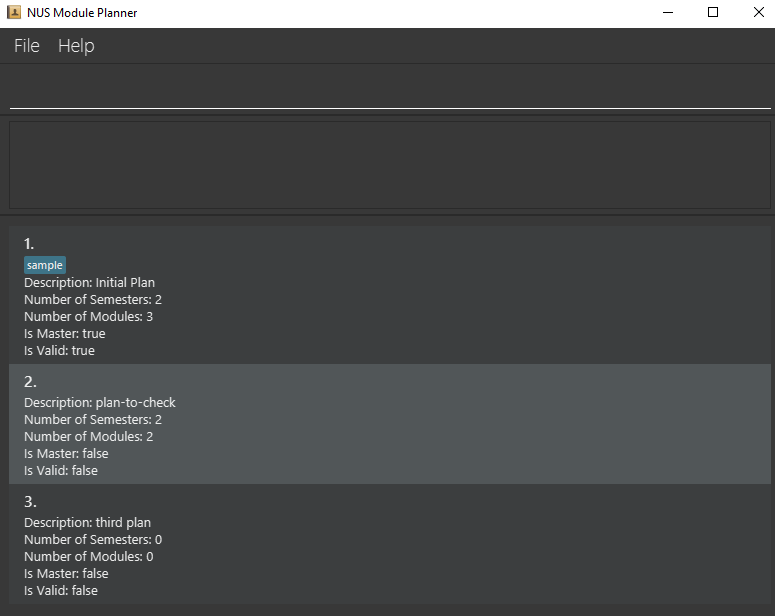
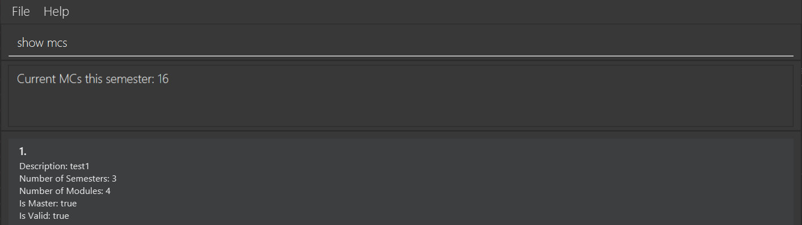

NUS Module Planner is a **desktop app for NUS students to manage and plan the modules to enrol in upcoming semesters, optimized for use via a Command Line Interface** (CLI) while still having the benefits of a Graphical User Interface (GUI). If you can type fast, NUS Module Planner can get your module planning done faster than traditional GUI apps.

---

## Quick start

1. Ensure you have Java `11` or above installed in your Computer.

1. Download the latest `moduleplanner.jar` from [here](https://github.com/AY2021S2-CS2103-W17-1/tp/releases).

1. Copy the file to the folder you want to use as the _home folder_ for your AddressBook.

1. Double-click the file to start the app. The GUI similar to the below should appear in a few seconds. Note how the app contains some sample data. 
   

1. Type the command in the command box and press Enter to execute it. e.g. typing **`help`** and pressing Enter will open the help window. 
   Some example commands you can try:

   - **`list`** : Lists all plans.

   - **`addp d/sample plan`** : Adds a plan with description `sample plan` to the Address Book.

   - **`deletep p/3`** : Deletes the 3rd plan shown in the current list.

   - **`clear`** : Deletes all plans.

   - **`exit`** : Exits the app.

1. Refer to the [Features](#features) below for details of each command.

---

## Features

**:information_source: Notes about the command format:** 

- Words in `UPPER_CASE` are the parameters to be supplied by the user. 
  e.g. in `addp d/DESCRIPTION`, `DESCRIPTION` is a parameter which can be used as `addp d/Networking Focus Area`.

- Items in square brackets are optional. 
  e.g `d/planDesc [t/TAG]` can be used as `d/planDesc t/3 years`.

- Items with `…`​ after them can be used multiple times including zero times. 
  e.g. `[t/TAG]…​` can be used as ` ` (i.e. 0 times), `t/3 years`, `t/3 years t/2 internships` etc.

- Parameters can be in any order. 
  e.g. if the command specifies `p/PLAN_NUMBER s/SEM_NUMBER`, `s/SEM_NUMBER p/PLAN_NUMBER` is also acceptable.

- If a parameter is expected only once in the command but you specified it multiple times, only the last occurrence of the parameter will be taken. 
  e.g. if you specify `d/myplan1 d/myplan2`, only `d/myplan2` will be taken.

- Extraneous parameters for commands that do not take in parameters (such as `help`, `list`, `exit` and `clear`) will be ignored. 
  e.g. if the command specifies `help 123`, it will be interpreted as `help`.

### Viewing help : `help`

Shows a message explaining how to access the help page.

Format: `help`

# User Commands
## General Commands

### Check graduation : `validate`
Format: `validate`

> Note: The validate command checks if a plan is valid by looking at whether or not the modules contained in its history match those of the current `master`. Hence, `master` is always valid. The command does not check for pre-requisites and preclusions with this release.

> Example: if master is at current semester `2`, all other plans have their semester `1`s checked, if these semester `1`s match the master module, the plan is valid.

- Shows header
    - Shows plan number
    - Shows description of plan
    - Shows if the plan is valid compared to master plan
    - Shows how many MCs the plan has
    - Shows how many semesters the plan has

### Clearing all entries : `clear`

Clears all entries from the address book.

Format: `clear`

### Exiting the program : `exit`

Exits the program.

Format: `exit`

## Plan commands
### List a summary of all plans: `list`

Format: `list`

This command must be done by the user at least once before they can use other commands.
Marks the given plan as the master plan, and this plan should contain all the modules that the user has taken (if any).

Example output:

### Create/Delete Plan: `addp`/`deletep`

Format for adding: `addp d/DESCRIPTION [OPTIONAL: t/TAG...]`

Format for deleting: `deletep p/PLAN_NUMBER`

Shows 2 rows:
- Whether plan is added/deleted successfully/unsuccessfully
- Plan number

Constraints:
- Trying to add a plan with invalid description will not be allowed
- Trying to delete a plan that does not exist will not be allowed
- Tags provided when adding a plan should contain only alphanumeric characters with no spaces

Example output for adding plan:

Example output for deleting plan:

### Set Plan as Master Plan: `master`
Format: `master p/PLAN_NUMBER`

This command must be done by the user at least once before they can use other commands.
Marks the given plan as the master plan, and this plan should contain all the modules that the user has taken (if any).

Example output:

## Semester commands
### Show the number of MCs the user is currently taking: `show MCs`
Format: `show mcs`

Example output:

### Calculate and show the current CAP (Cumulative academic points) of the student: `show cap`
Format: `show cap`

This command takes in the grades of modules user has marked as completed and entered their grade, and calculate their CAP using this formula:

Example output:

### Add/Delete Semester to/from Plan: `adds`/`deletes`
Format for adding: `adds p/PLAN_NUMBER s/SEM_NUMBER`

Format for deleting: `deletes p/PLAN_NUMBER s/SEM_NUMBER`

The output will show whether the operation was successful and include the semester number in its output.

Constraints:
* Trying to add a semester that already exist will not be allowed
* Trying to delete a semester that does not exist will not be allowed
* A semester number must be a positive integer

Example output for adding semester:

Example output for deleting semester:

### Set Semester as in-progress: `current`
Format: `current s/SEM_NUMBER`

Marks the supplied semester as the current semester of the master plan.
This indicates that all previous semesters are part of the user’s history and all future semesters have yet to be attempted.
The user will have to manually update the current semester as time progresses.

Example output:

### Show history: `history`
Format: `history`

The above command takes no arguments and shows the user a list of modules that they have completed up until **before** the *current semester*.

> Tip: The *current semester* is the semester that was marked using the `current semester` command.

Example output:

## Module commands

### Add/Delete module to/from semester: `addm/deletem`
Format for adding: `addm m/MODULE_CODE p/PLAN_NUMBER s/SEM_NUMBER`

Format for adding module with grade: `addm m/MODULE_CODE p/PLAN_NUMBER s/SEM_NUMBER g/GRADE`

Format for deleting: `deletem m/MODULE_CODE p/PLAN_NUMBER s/SEM_NUMBER`

`SEM_NUMBER` here references to the semester number of the semester user created.

For example, if user added a semester using `adds p/1 s/5`, to add module to this semester user need to use `addm p/1 s/5 m/MODULE_CODE`

> Tip: A user can view module info to see more details about it. (See `info`)

This command takes in three arguments, `MODULE_CODE`, `PLAN_NUMBER` and `SEM_NUMBER`, and outputs meta details about the module being added/deleted, as well as whether the addition/deletion was successful or not.

The details to output are as follows:

* Module addition/deletion success status
* Semester number
* Module code

Constraints:
* Trying to add a module that already exists will not be allowed
* Trying to add/delete a nonexistent module code/plan number/semester number will not be allowed

> Note: As this is not a fully fledged production level project, there are limited modules for users to add. If in the future this project grows to a production piece, it will use relevant NUS APIs to collect modules for users to add. Instead, currently there are only dozens of modules for users to add, but for the purposes of testing and showcasing this product, it is sufficient.

#### Example output for add module command:

#### Example output for deleting a module:

### View module info: `info`
Format: `info m/MODULE_CODE`

> Tip: A user can also add a module to a plan/semester (See `add/delete`)

By default, this command takes in one optional argument, `MODULE_CODE` and outputs the module information including:
* Brief Description
* Number of MCs
* Semesters available
* Pre-requisites
* Preclusions

Constraints:
* Module has to exist

#### Example output listing all module information:

#### Example output for finding a specific module information

### Overall input constraints
The NUS Module Planner app is designed to help students track their typical study plans.
Hence, user inputs for indexes such as plan numbers or semester numbers are only guaranteed to work within reasonable limits. For example a student should never have 2 billion semesters in their study plan as this would exceed the typical human lifetime.

Explicitly, the following should take on values between 1 and 100 only. Correct behaviour of the app is not guaranteed beyond these bounds.
* Semester number
* Plan number
* Number of modules in a plan or semester

Please note that if you manually edit the `moduleinfo.json` or the `plans.json` files that the NUS Module Planner application may not longer function as expected.
