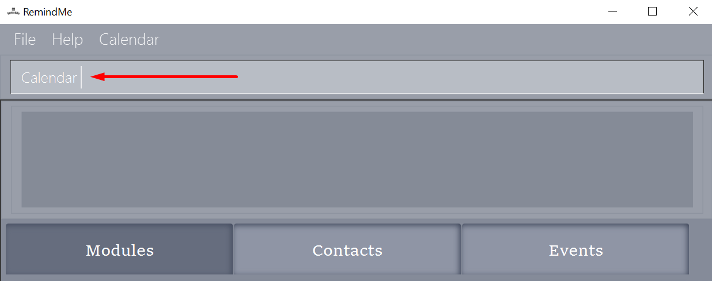
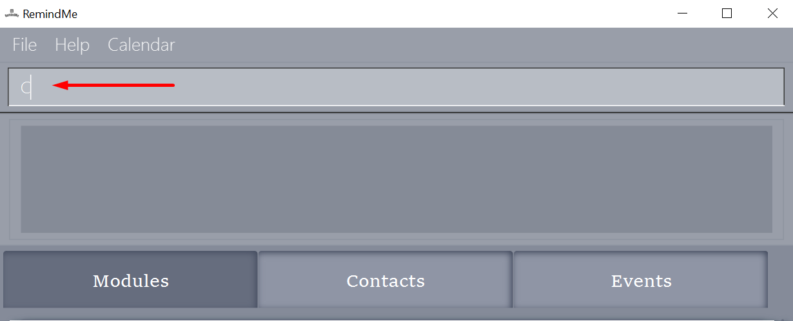
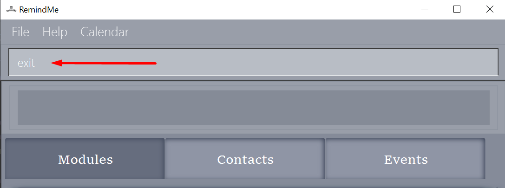
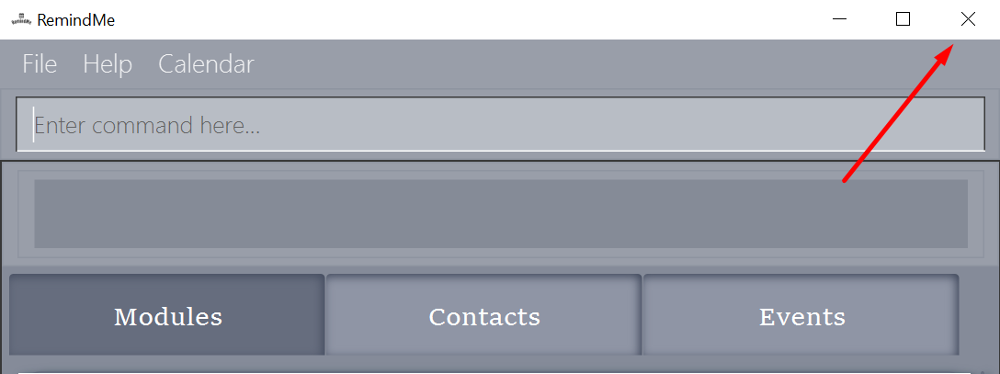

RemindMe User Guide v1.3
---
This user guide provides [start-up](#2-quick-start) instructions as well as detailed descriptions and usage of
all the [features](#3-features) in the RemindMe app. You can also access the product website via [link](https://ay2021s2-cs2103t-w15-1.github.io/tp/).

## Table of Contents

* **[1. Introduction](#1-introduction)**
* **[2. Quick Start](#2-quick-start)**
* **[3. Features](#3-features)**
    * **[3.1 Viewing Help: `help`](#31-viewing-help-help)**
    * **[3.2 Adding: `add`](#32-adding-add)**
      * [3.2.1 Adding a person](#321-adding-a-person)
      * [3.2.2 Adding a module](#322-adding-a-module)
      * [3.2.3 Adding an assignment](#323-adding-an-assignment)
      * [3.2.4 Adding an exam](#324-adding-an-exam)
      * [3.2.5 Adding a general event](#325-adding-a-general-event)
    * **[3.3 Editing: `edit`](#33-editing-edit)**
      * [3.3.1 Editing a person](#331-editing-a-person)
      * [3.3.2 Editing a module](#332-editing-a-module)
      * [3.3.3 Editing an assignment](#333-editing-an-assignment)
      * [3.3.4 Editing an exam](#334-editing-an-exam)
      * [3.3.5 Editing a general event](#335-editing-a-general-event)
    * **[3.4 Finding: `find`](#34-finding-find)**
      * [3.4.1 Finding persons](#341-finding-persons-n)
      * [3.4.2 Finding modules](#342-finding-modules-m)  
      * [3.4.3 Finding general events](#343-finding-general-events-g)
    * **[3.5 Listing all entries](#35-listing-all-entries-list)**
    * **[3.6 Marking as done `done`](#36-marking-as-done-done)**
    * **[3.7 Deleting: `delete`](#37-deleting-delete)**
      * [3.7.1 Deleting a person](#371-deleting-a-person)
      * [3.7.2 Deleting a module](#372-deleting-a-module)
      * [3.7.3 Deleting an assignment](#373-deleting-an-assignment)
      * [3.7.4 Deleting an exam](#374-deleting-an-exam)
      * [3.7.5 Deleting a general event](#375-deleting-a-general-event)  
    * **[3.8 Clearing: `clear`](#38-clearing-clear)**
      * [3.8.1 Clearing RemindMe](#381-clearing-remindme)
      * [3.8.2 Clearing all persons](#382-clearing-all-persons)
      * [3.8.3 Clearing all modules](#383-clearing-all-modules)
      * [3.8.4 Clearing all general events](#384-clearing-all-general-events)  
    * **[3.9 Viewing calendar: `calendar`](#39-viewing-calendar-calendar-c)**
    * **[3.10 Saving the data](#310-saving-the-data)**
    * **[3.11 Reminder window](#311-reminder-window)**
    * **[3.12 Exiting the program: `exit`](#312-exiting-the-program-exit-e)**
* **[FAQ](#4-faq)**
* **[Command summary](#5-command-summary)**

--------------------------------------------------------------------------------------------------------------------

## 1. Introduction
Thank you for downloading RemindMe! We really appreciate that you chose to trust us to take care of your scheduling
needs! RemindMe aims to help School of Computing students manage their work, assignments, submissions and exams. We
to help you take back control of YOUR life.

RemindMe visualises the tasks of our users using a combination of a list and a calendar, to help you plan your time
the best way that works for you!

We also use a Command-Line Interface, so that all the fast-fingered SOC students can use RemindMe quickly and
comfortably. For those of you who prefer to use a mouse, we have also integrated GUI into our interface! We hope that 
having this flexibility will allow you to use RemindMe in the way you are most comfortable with! 

Start scheduling a better work life with RemindMe [here](#2-quick-start)!

--------------------------------------------------------------------------------------------------------------------

## 2. Quick Start

1. Ensure you have Java `11` or above installed on your computer. You can download Java `11` via [link.](https://www.oracle.com/sg/java/technologies/javase-jdk11-downloads.html)
   * Set-up tutorial:
        * [Windows user](https://java.tutorials24x7.com/blog/how-to-install-java-11-on-windows)
        * [Mac user](https://docs.oracle.com/en/java/javase/11/install/installation-jdk-macos.html#GUID-2FE451B0-9572-4E38-A1A5-568B77B146DE)
        * [Linux user](https://docs.oracle.com/en/java/javase/11/install/installation-jdk-linux-platforms.html#GUID-737A84E4-2EFF-4D38-8E60-3E29D1B884B8)
 
 

2. Download the latest `RemindMe.jar` from our [GitHub release page](https://github.com/AY2021S2-CS2103T-W15-1/tp/releases).
Copy the file to the folder you want to use as the home folder for your RemindMe.
Double click the file to start the app. 
 
 

3. Alternatively, you can use the command line to run RemindMe. 
   Open your command line by searching cmd in your desktop search bar. Next, navigate to the folder with RemindMe. 
Type in `java -jar RemindMe.jar` in the command box and press Enter to execute it. 
 
 
The GUI similar to the below should appear in a few seconds. Note how the app contains some sample data. 
    
   *[Start up image of RemindMe]*
 
    

4. Press start to proceed to the main window as shown below. 
    
   *[Main Window of RemindMe]*
 
          

5. Type a command in the command box and press enter on the keyboard to execute it.   
   For example typing `help` and pressing enter will open the help window.
 
    

6. Some example commands you can try:
   * `add m/CS2103`: Adds a module named "CS2103".
     
   * `calendar`: Displays the calendar with the assignments' deadlines, exams' date and friends' birthdays.
     
   * `exit`: Exits the app.
 
    
   
7. Refer to [Section 3: Features](#3-features) for details of each command.
 
 

8. Use `clear` to remove the sample inputs and start adding your events!
 
 
[Back to Table of Contents](#table-of-contents)

--------------------------------------------------------------------------------------------------------------------

## 3. Features
Examples used in RemindMe are interconnected. Therefore, you can follow along and gain a deeper insight into how each
feature works!

**Notes about the command format:** 

* Words in `UPPER_CASE` are the parameters you supply. 
  For example: In `add m/MODULE`, `MODULE` is a parameter you provide, such as `add m/CS2103`.
  
* Items in square brackets are optional. 
  For example: In `add n/NAME b/BIRTHDAY [t/TAG]`, the `TAG` parameter is optional. 
  Therefore, both `add n/Alice b/23/03/2021 t/friends` and `add n/Alice b/23/03/2021` are valid.
  
* Items with `...` after them can be used multiple times. 
  For example: `[t/TAG...]` can be used more than once! 
  Therefore, `add n/Bob b/10/12/2000 t/friend t/owes money` is valid.
 
**Tips:** 

* `DATE-TIME` should follow format day/month/year hour minutes: `DD/MM/YYYY HHMM`.
* `Commnands` are case-insensitive. 
    For example: `ADD` and `add` are both valid.

:exclamation: **Warning:** 

RemindMe will not accept multiple parameters if it only takes in one! 

Commands that do not take in parameters (such as `help` and `exit`) ignore extraneous parameters, except `clear`. 
For example: If you input `help 123`, RemindMe will return the result of the `help` function. 

Parameters must follow the order given. 
For example: `add b/BIRTHDAY n/NAME` is not allowed. 

If you have the [calendar window](#39-viewing-calendar-calendar-c) 
when adding/editing/deleting/clearing events, it will not be automatically reflected on the calendar window.
You would need to press on the **refresh button** to refresh the calendar. 

*[refresh button to refresh calendar]*

[Back to Table of Contents](#table-of-contents)

### 3.1 Viewing Help: `help`
The help function shows the URL to the user guide for RemindMe, which is this current document!

 
*[Image of RemindMe's help message]*

Format: `help`

[Back to Table of Contents](#table-of-contents)

### 3.2 Adding: `add`
This section explains how to add entries into your RemindMe. 
 

**Note:** 
* The adding of an assignment/exam requires the related module to be added first.

:exclamation: **Warning:** 

Duplicate entries are not allowed. Example: 
Person/Module with the same name. 
Assignments with the same description and date-time in the same module. 
Exams with the same date for the same module. 
General events with the same name and date-time. 

You can add:
* [3.2.1 Adding a person](#321-adding-a-person)
* [3.2.2 Adding a module](#322-adding-a-module)
* [3.2.3 Adding an assignment](#323-adding-an-assignment)
* [3.2.4 Adding an exam](#324-adding-an-exam)
* [3.2.5 Adding a general event](#325-adding-a-general-event)

[Back to Table of Contents](#table-of-contents)
 

#### 3.2.1 Adding a person
Using the add feature, you can add your friends to RemindMe and let RemindMe remind you of their birthdays. 
You can also add optional tags for them to showcase your relationship with them!

**Tip:**
* `BIRTHDAY` follows format day/month/year: `DD/MM/YYYY`.

Command: `add n/NAME b/BIRTHDAY [t/TAG...]`

Example:
* `add n/Alice b/22/10/1999`
* `add n/Benson b/30/09/1997 t/friends`

Expected Result: 
 
*[Result from adding Alice and Benson]*

[Back to Table of Contents](#table-of-contents)

#### 3.2.2 Adding a module
You can add modules that you are taking with their respective titles. Subsequently, you can add the corresponding
assignments and exams for each module. Now, you can distinguish the assignments and exams for each module, easily 
keeping track of your workload.

Command: `add m/MODULE`

Example:
* `add m/CS1101`
* `add m/CS1203`

Result expected:
* `New module added: CS1101`
* `New module added: CS1203`

[Back to Table of Contents](#table-of-contents)

#### 3.2.3 Adding an assignment
Now, let's add the corresponding assignment to the module. Don't forget that you need to specify the deadline when 
adding your task to RemindMe. 

**Note:**
* The deadline follows the `DATE-TIME` format.

Command: `add m/MODULE a/ASSIGNMENT by/DEADLINE`

Example:
* `add m/CS2101 a/Essay 1 by/01/01/2021 2359`

Result expected:
* `New assignment added: Essay 1 due: 01/01/2021 2359`

[Back to Table of Contents](#table-of-contents)

#### 3.2.4 Adding an exam
Add an exam under the module with the exam's date-time provided.

**Note:**
* The exam's date-time follows the `DATE-TIME` format.

Command: `add m/MODULE e/DATE-TIME`

Example:
* `add m/CS2101 e/01/01/2021 2359`
 

**Results after the examples from 3.2.2 to 3.2.4:**
 
 
*[Result of adding the modules and their respective assignments and exams]*
 

[Back to Table of Contents](#table-of-contents)

#### 3.2.5 Adding a general event
Outside of school work, we all have other activities that require reminders, such as meeting up with your friends or a 
doctor's appointment. You can add these activities to RemindMe, by adding them as general events!

**Note:**
* The date and time of your events follow the `DATE-TIME` format.

    
Command: `add g/GENERAL EVENT on/DATE-TIME`

Example:
* `add g/School contest on/10/10/2021 1200`

Result expected:
 
 
*[Result for adding the school event]*
 

[Back to Table of Contents](#table-of-contents)

### 3.3 Editing: `edit`
If you created an entry wrongly, you do not have to delete it! With RemindMe's edit function, you can edit the task, 
saving you the hassle of deleting and recreating an entry just because of a tiny mistake. 

**Note:** 
* The edited content must not be blank.

:exclamation: **Warning:** 
Editing of a person/module/event should not result in duplicates. 

You can edit:
* [3.3.1 Editing a person](#331-editing-a-person)
* [3.3.2 Editing a module](#332-editing-a-module)
* [3.3.3 Editing an assignment](#333-editing-an-assignment)
* [3.3.4 Editing an exam](#334-editing-an-exam)
* [3.3.5 Editing a general event](#335-editing-a-general-event)

[Back to Table of Contents](#table-of-contents)
    
#### 3.3.1 Editing a person
You can update your friend's identity, either changing their name, their birthday or their tags.

**Tip:** 
* You can find the contact you would want to change first with RemindMe's `find`, 
  such that you can easily update the existing details.
  
* You can use `t/` to remove all tags on the person you are editing!

Command: `edit INDEX n/NEW NAME [b/NEW BIRTHDAY] [t/NEW TAG]`

Examples:
* `edit 1 n/Jason`
* `edit 2 n/Benson b/30/09/1997`
* `edit 2 n/Benson t/enemy`

Results expected:
 
 
*[Result of editing Alice to Jason and updating Benson's birthday and tag]*
 

[Back to Table of Contents](#table-of-contents)

#### 3.3.2 Editing a module
You can update your modules' titles with the edit function. 

Command: `edit INDEX m/NEW MODULE TITLE`

Examples:
* `edit 1 m/CS2106`
* `edit 2 m/Software Engineering`

Results expected:
* `Module edited: CS2106`
* `Module edited: Software Engineering`

[Back to Table of Contents](#table-of-contents)

#### 3.3.3 Editing an assignment
Did an assignment's deadline get postponed? You can update the assignment's deadline using the edit function. Not only 
that, you can change the assignment name too.

:exclamation: **Warning:** 
At least one of the optional input is needed! 

Command: `edit m/MODULE a/ASSIGNMENT INDEX [d/NEW DESCRIPTION] [by/NEW DEADLINE]`

Examples:
* `edit m/Software Engineering a/1 d/Update UG`
* `edit m/Software Engineering a/1 by/27/04/2021 1900`

Result expected:
* `Assignment edited: Update UG due: 23/03/2021 2359 [ ]`
* `Assignment edited: Update UG due: 27/04/2021 1900 [ ]`

[Back to Table of Contents](#table-of-contents)

#### 3.3.4 Editing an exam
You can also change the date of the exam in a module.

Command: `edit m/MODULE e/EXAM INDEX on/NEW DATE-TIME`

Examples:
* `edit m/CS2106 e/1 on/04/05/2021 1400`

Result expected:
* `Exam edited: Exam is on: 04/05/2021 1400`

**Final result for editing module, assignments, and exams:**
 
 
*[Results for editing the respective modules, assignments, and exams]*
 

[Back to Table of Contents](#table-of-contents)

#### 3.3.5 Editing a general event
You can also update the name and date-time of your general events.

:exclamation: **Warning:** 
At least one of the optional input is needed! 

Command: `edit INDEX [g/NEW DESCRIPTION on/NEW DATE]`

Examples:
* `edit 1 g/FOC logs meeting`
* `edit 1 on/01/04/2021 0001`

Results expected:
* `Event edited: FOC logs meeting on: 10/06/2021 1630`
* `Event edited: FOC logs meeting on: 01/04/2021 0001`
 
 
 
*[Results for editing the general event]*
 

[Back to Table of Contents](#table-of-contents)

### 3.4 Finding: `find`
As you use RemindMe, you will have more and more entries. It can get taxing to look for specific entries, scrolling 
through all of them. Luckily, RemindMe has a way to look for them, using the find function, where RemindMe will show you
those matching the keywords you provide!

**Note:** 
* Only whole words are matched.
* Entries matching at least one of the keywords will be returned.
  
**Tips:** 
* The order of keywords doesn't matter. Hence, you can list all keywords the entry you are looking for contains.
* All find operations are case-insensitive. Hence, capitalisation doesn't matter!

You can find:
* [3.4.1 Finding persons](#341-finding-persons-n)
* [3.4.2 Finding modules](#342-finding-modules-m)  
* [3.4.3 Finding general events](#343-finding-general-events-g)

[Back to Table of Contents](#table-of-contents)

#### 3.4.1 Finding persons: `n/`
You can search your contacts whose names contain any of the given keywords.  

**Note:** 
* Only the names are matched to the keywords

Command: `find n/KEYWORD [MORE KEYWORDS...]`  

Example:
* `find n/jason`

Expected Result:
 
 
*[Result for `find n/jason`]*
 

[Back to Table of Contents](#table-of-contents)
  
#### 3.4.2 Finding modules: `m/`
You can look up your modules based on their titles as well.

**Note:** 
* Only the module titles are matched to the keywords
    

    
Command: `find m/KEYWORD [MORE KEYWORDS...]`  

Examples: 
* `find m/CS1101`  

Expected Result:
 
 
*[Result for `find m/CS1101`]*
 

[Back to Table of Contents](#table-of-contents)
  
#### 3.4.3 Finding general events: `g/`
You can find the general events that match with your keywords too! 

**Note:** 
* Only the descriptions of the general events are matched to the keywords
    

    

Command: `find g/KEYWORD [MORE KEYWORDS...]`  

Examples:
* `find g/FOC`  

Expected Result:
 
 
*[Result for `find g/FOC`]*
 

[Back to Table of Contents](#table-of-contents)

### 3.5 Listing all entries: `list`
After you find your specific tasks, you now want to view all your entries. You can use RemindMe's list function to show 
everything in RemindMe.

Command: `list`

[Back to Table of Contents](#table-of-contents)

### 3.6 Marking as done: `done`
When you complete your assignments, you can mark them as done to remind yourself you complete the task and pat yourself 
on the back! If you need to refine your assignments further, you can remove the done status by calling `done` again!

**Note:** 
* You can only mark assignments as done. 

  

Command: `done m/MODULE a/INDEX`

Example:
*  `done m/Software Engineering a/1`

Expected Result:
 
 
 
*[Result for marking assignment 1 in Software Engineering as done.]*
 

[Back to Table of Contents](#table-of-contents)
  
### 3.7 Deleting: `delete`
When you do not need your entries anymore, you can delete them using RemindMe's delete function.

**Note:**
* Deleting an entry in RemindME requires it to be present at the given index.
    

You can delete:
* [3.7.1 Deleting a person](#371-deleting-a-person)
* [3.7.2 Deleting a module](#372-deleting-a-module)
* [3.7.3 Deleting an assignment](#373-deleting-an-assignment)
* [3.7.4 Deleting an exam](#374-deleting-an-exam)
* [3.7.5 Deleting a general event](#375-deleting-a-general-event)

[Back to Table of Contents](#table-of-contents)    

#### 3.7.1 Deleting a person
You can remove a person from your RemindMe, but hopefully, you won't need to use it :)

Command: `delete INDEX`  

Examples:
* `delete 1`  

Expected Result:
 
 
*[Result for deleting Jason which is the first person in the contact list.]*
 

[Back to Table of Contents](#table-of-contents)

#### 3.7.2 Deleting a module
Once you have completed a module, you can delete it from RemindMe as a final goodbye!

Command: `delete m/MODULE`

Example:
* `delete m/CS1101`  

Expected Result:
 
 
*[Result for deleting CS1101.]*
 

[Back to Table of Contents](#table-of-contents)

#### 3.7.3 Deleting an assignment
When you have completed an assignment and do not need it anymore, you can remove it from RemindMe.

Command: `delete m/MODULE a/INDEX`

Example:
* `delete m/Software Engineering a/1`

Expected Result:
 
 
*[Result for deleting assignment Update UG in Software Engineering]*
 

[Back to Table of Contents](#table-of-contents)

#### 3.7.4 Deleting an exam
After an exam, you can delete it from RemindMe to celebrate that the exam is over!

Command: `delete m/MODULE e/INDEX`

Example: 
* `delete m/CS2106 e/1`

Expected Result:
 

*[Result for deleting the first exam in CS2106.]*
 

[Back to Table of Contents](#table-of-contents)

#### 3.7.5 Deleting a general event
When a general event is over, you can remove it from RemindMe, making it less cluttered.

Command: `delete g/INDEX`

Example:
* `delete g/1`

Expected Result:
 
 
*[Result for deleting the first general event in the list.]*
 

[Back to Table of Contents](#table-of-contents)

### 3.8 Clearing `clear`
This section shows features that deals with the clearing of entries in the RemindMe app.  

 

:exclamation: **Warning:** 

All cleared data cannot be recovered. 

Although the tags used for clearing person, modules, and general events are optional, they are needed to remove only 
that specific component of RemindMe.Else, RemindMe will clear everything.

 

You can clear:
* [3.8.1 Clearing RemindMe](#381-clearing-remindme)
* [3.8.2 Clearing all persons](#382-clearing-all-persons)
* [3.8.3 Clearing all modules](#383-clearing-all-modules)
* [3.8.4 Clearing all general events](#384-clearing-all-general-events)

[Back to Table of Contents](#table-of-contents)

#### 3.8.1 Clearing RemindMe  
You can start with a brand new RemindMe.

Command: `clear`

#### 3.8.2 Clearing all persons
You can remove all contacts in RemindMe.  

Command: `clear n/`

#### 3.8.3 Clearing all modules
You can remove all modules in RemindMe.  

Command: `clear m/`

#### 3.8.4 Clearing all general events
You can clear all general events in RemindMe.

Command: `clear g/`

**If you followed along, your RemindMe should be empty. Now let's start using RemindMe to remind you!** 
The following features are more ways for you to view your tasks in RemindMe.

[Back to Table of Contents](#table-of-contents)

### 3.9 Viewing calendar `calendar` `C`
There are 3 ways to check out the calendar.
 
1. you may type in `calendar` in the command box as shown below.
 

 
 

2. Alternatively, you may type shortcut `C` in the command box as shown below.
 

 
 

3. You may also click on the drop out calendar menu.
 

 
 

The calendar window as shown below will be displayed.
 

 
 
You may browse through the calendar  by clicking the left arrow button `<` or right arrow button `>` 
on the top right of the calendar window. Additionally, you may click on the `today` button 
to browse back to the month of the current day's date.

:exclamation: **Warning:** 

Please refresh the calendar with the `refresh` button whenever you update assignments/exams/birthdays/general events while 
the calendar window is still open. 
The calendar window does not automatically update the changes when you update
assignments/exams/birthdays/general events at the main window.

[Back to Table of Contents](#table-of-contents)

### 3.10 Saving the data
Saving of data is automatic by the application whenever you 
update RemindMe.

[Back to Table of Contents](#table-of-contents)

### 3.11 Reminder window
A reminder will automatically pop up at the start of RemindMe.

 

[Back to Table of Contents](#table-of-contents)

### 3.12 Exiting the program `exit` `E`
There are 3 ways to exit the application. 
 
1. you may type in `exit` in the command box as shown below.
 

 
2. You may type in `E` in the command box as a shortcut as shown below.
 

 
3. Lastly, you may simply click the `X` button on the top right-hand corner of the
application to exit the program.
 

[Back to Table of Contents](#table-of-contents)

## 4. FAQ

**Q: Can I add an assignment/exam first before the module?** 
A: No, you need to add a module first.

**Q: Can I add multiple modules with the same name?** 
A: No, modules must have unique names to identify them.

**Q: How do I clear away all my data?**  
A: You can use the [`clear` command](#38-clearing-clear).

**Q: When I close RemindMe's main application, will other windows close?** 
A: Yes, do take note that if you close the main application, other windows will close as well.

[Back to Table of Contents](#table-of-contents)

## 5. Command Summary  

**Note:**
* The respective `FORMAT` in the Description, Format column replaces the `FORMAT` in Action.
* The sentences that are `code-formatted` in the Description, Format column are the `FORMAT` to be used.

**Tips:**
* The format for `BIRTHDAY` is `DD/MM/YYYY`. 
* The format for `DATE-TIME` is `DD/MM/YYYY HHMM`.

Action | Description, Format 
--------|------------------
**add** `add FORMAT` |  Adds a person   *`n/NAME b/BIRTHDAY [T/TAG...]`*    Adds a module   *`m/MODULE`*    Adds an assignment   *`m/MODULE a/ASSIGNMENT by/DATE-TIME`*    Adds an exam   *`m/MODULE e/DATE-TIME`*    Adds an event   *`g/GENERALEVENT on/DATE-TIME`*   
**edit** `edit DESCRIPTION` | Edits a person   *`INDEX n/NEW NAME [b/NEW BIRTHDAY] [T/NEW TAG...]`*    Edits a module   *`INDEX m/NEW MODULE TITLE`*    Edits an assignment    *`m/MODULE a/INDEX d/NEW DESCRIPTION by/NEW DATE-TIME`*    Edits an exam   *`m/MODULE e/INDEX on/NEW DATE-TIME`*    Edits an event   *`INDEX g/NEW DESCRIPTION on/NEW DATE-TIME`*   
**find** `find DESCRIPTION` | Find persons   *`n/KEYWORD [MORE KEYWORDS...]`*    Find modules   *`m/KEYWORD [MORE KEYWORDS...]`*    Find general events   *`g/KEYWORD [MORE KEYWORDS...]`*   
**list** | Lists all entries in RemindMe
**delete** `delete DESCRIPTION` | Delete a person   *`INDEX`*    Delete a module   *`m/MODULE`*    Delete an assignment   *`m/MODULE a/INDEX`*    Delete an exam   *`m/MODULE e/INDEX`*   Delete a general event   *`g/INDEX`*  
**Clear** `clear DESCRIPTION` | Clear RemindMe   *`NO DESCRIPTION NEEDED`*   Clear persons   *`n/`*    Clear module   *`m/`*    Clear general events   *`g/`*
**See help page** | `help` 
**View Calendar** | `calendar`/`C`
**Exit program** | `exit`/`E` 

[Back to Table of Contents](#table-of-contents)
