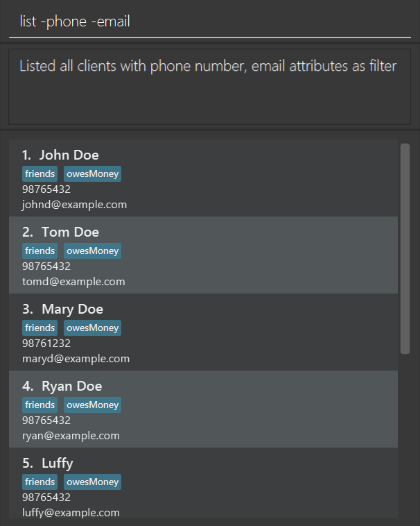

ClientBook is a desktop app for managing client contacts, optimized for use via a Command Line Interface (CLI) while still having the benefits of a Graphical User Interface (GUI). If you can type fast, ClientBook can get your client management tasks done faster than traditional GUI apps.

## Quick start

1. Ensure you have Java `11` or above installed in your Computer.

1. Download the latest `clientbook.jar`. (A release will be coming out soon)

1. Copy the file to the folder you want to use as the _home folder_ for your ClientBook.

1. Double-click the file to start the app. The GUI similar to the below should appear in a few seconds. Note how the app contains some sample data. 
   

1. Type the command in the command box and press Enter to execute it. e.g. typing **`help`** and pressing Enter will open the help window. 
   Some example commands you can try:

   * **`list`** : Lists all contacts.

   * **`add n/John Doe p/98765432 e/johnd@example.com a/John street, block 123, #01-01 i/Policy_1022`** : Adds a client named `John Doe` to the ClientBook.

   * **`delete 3`** : Deletes the 3rd contact shown in the current list.

   * **`exit`** : Exits the app.

1. Refer to the [Features](#features) below for the full list of commands and their descriptions.

--------------------------------------------------------------------------------------------------------------------
## Features
- Viewing help : `help`
- Adding a client: `add`
- List all clients: `list`
- Locating clients by name: `find`
- View policy information: `policy`
- Deleting a client : `delete`
- Sorting the list of clients : `sort`
- Exiting the program : `exit`
- Locking ClientBook: `lock`
- Unlocking ClientBook: `unlock`
- Saving the data

--------------------------------------------------------------------------------------------------------------------

**:information_source: Notes about the command format:** 

* Words in UPPER_CASE are the parameters to be supplied by the user.
 e.g. in `add n/NAME`, NAME is a parameter which can be used as `add n/John Doe`.

* Items in square brackets are optional.
 e.g. `n/NAME [t/TAG]` can be used as `n/John Doe t/friend` or as `n/John Doe`.

* Items with …​ after them can be used multiple times including zero times.
 e.g. `[t/TAG]…​` can be used as   (i.e. 0 times), `t/basic`, `t/basic t/lifeinsurance` etc.

* Parameters can be in any order.
 e.g. if the command specifies `n/NAME p/PHONE_NUMBER`, `p/PHONE_NUMBER n/NAME` is also acceptable.

* If a parameter is expected only once in the command, but you specified it multiple times, only the last occurrence of the parameter will be taken.
 e.g. if you specify `p/12341234 p/56785678`, only `p/56785678` will be taken.

* Extraneous parameters for commands that do not take in parameters (such as `help`, `exit` and `clear`) will be ignored.
 e.g. if the command specifies `help 123`, it will be interpreted as `help`.

### Viewing help : `help`

Shows a message explaining how to access the help page.

Format: `help`

### Adding a person: `add`

Adds a client to ClientBook.

Format: `add n/NAME p/PHONE_NUMBER e/EMAIL a/ADDRESS [i/POLICY_ID[>POLICY_URL]] [t/TAG]…​`

:bulb: **Tip:**
A person can have any number of tags and insurance policies (including 0)

* It is perfectly fine to not include the URL to the insurance policy document!
* To include the URL, remember to use '>' to indicate that a particular insurance policy is linked to a URL, as shown in the second example below.

Examples:
* (example of a client with insurance policy but no URL)`add n/John Doe p/98765432 e/johnd@example.com a/Orchard i/Policy_1273 t/basic`
* (example of a client with insurance policy and URL)`add n/Tom Tan p/91234567 e/tomt@example.com a/Orchard i/Policy_1274>www.myinsurancecompany.com/policy_1274 t/basic`
* (example with no insurance policy and no tag)`add n/Betsy Crowe e/betsycrowe@example.com a/Kent Ridge`

### Listing all persons : `list [-ATTRIBUTE]`

Shows a list of all clients in ClientBook. An optional attribute option can be added to show a list with only the specified attribute.

Format: `list [-ATTRIBUTE]…​`

Examples:
* `list` Shows a list of all clients and all their information
* `list -policy` Shows a list of all clients and their policy numbers
* `list -phone -policy` Shows a list of all clients, their phone number, and their policy numbers

### Editing a person : `edit`

Edits an existing client in the ClientBook.

Format: `edit INDEX [n/NAME] [p/PHONE] [e/EMAIL] [a/ADDRESS] [i/POLICY_NUMBER] [t/TAG]…​`

* Edits the client at the specified INDEX. The index refers to the index number shown in the displayed client list. The index must be a positive integer 1, 2, 3, …​
* At least one of the optional fields must be provided.
* Existing values will be updated to the input values.

Examples:
*  `edit 1 p/91234567 e/johndoe@example.com` Edits the phone number and email address of the 1st person to be `91234567` and `johndoe@example.com` respectively.
*  `edit 2 n/Betsy Crower` Edits the name of the 2nd person to be `Betsy Crower`.

### Locating persons by name: `find`

Finds and displays all clients whose field (name, phone, email, address, tags, insurance policy) contains any of the given keywords.

Format: `find FLAG/KEYWORD [& MORE_KEYWORDS] [-ATTRIBUTES]…​`

* The search is case-insensitive. e.g hans will match Hans.
* The order of the keywords does not matter.
* Only one `FLAG` can be used in each find command.
* The `FLAG` can only be from: `n`, `p`, `e`, `a`, `t` and `i`, representing name, phone, email, address, tags and insurance policies respectively.
* The delimiter `&` between keywords is used to search using multiple keywords. e.g. `Aaron & Tan` will return all persons with either `Aaron` or `Tan` in their names.
* Without the use of delimiter `&`, all keywords following the `FLAG` will be used in the search. e.g. `Aaron Tan` will only return persons with `Aaron Tan` in their names.
* Clients whose chosen field contains at least one keyword will be returned (i.e. OR search). e.g. Hans & Bo will return Hans Sum, Bo Yang.
* Filter options are set by typing the attribute name after a dash. e.g. `-phone` filters phone number information of the listed clients

Examples:
* `find n/John` returns `john` and `John Doe`
* `find n/alex david` returns `Alex David`
* `find n/alex & david` returns `Alex Yeoh`, `David Li`
* `find a/orchard` returns `Alex Yeoh` whose address is `Orchard Road` 
* `find n/alex & david -address -phone` returns `Alex Yeoh`, `David Li` and only shows their phone numbers and addresses

### Deleting a person : `delete`

Deletes the specified client from ClientBook after listing or finding contacts.

Format: `delete INDEX`

* Deletes the client at the specified `INDEX`.
* The index refers to the index number shown in the displayed client list.
* The index **must be a positive integer** 1, 2, 3, …​

Examples:
* `list` followed by `delete 2` deletes the 2nd person in the address book.
* `find Betsy` followed by `delete 1` deletes the 1st person in the results of the `find` command.

### Viewing a contact's policies: `policy`

Launches a popup window to show all the policies associated with the selected contact, if the selected contact has any policies.

Format: `policy INDEX`

* Selects the client at the specified `INDEX`.
* The index refers to the index number shown in the displayed client list.
* The index **must be a positive integer** 1, 2, 3, …​
* Policy ID cannot contain '>' character!
* Note that your URLs with should not contain '>' characters either! They are not valid URLs by the Internet's definition.

Examples:
* `list` followed by `policy 2` displays the policies associated with the 2nd person in the address book.
* `find Betsy` followed by `policy 1` displays the policies associated with the 1st person in the results of the `find` command.

### Sorting the list of clients : `sort`

Sorts the list of clients in ClientBook.

Format: `sort ATTRIBUTE DIRECTION`

* Sorts the list of clients according to the specified `ATTRIBUTE` and `DIRECTION`.
* The specified `ATTRIBUTE` can be `-n` to sort by name or `-i` to sort by insurance policy.
* The specified `DIRECTION` can be `-asc` for ascending order or `-des` for descending order.

Examples:
* `sort -n -asc` sorts the list of clients by name in ascending order.

### Exiting the program : `exit`

Exits the program.

Format: `exit`

### Locking ClientBook : `lock`

Locks ClientBook.

Format: `lock [CURRENT_PASSWORD] [NEW_PASSWORD]`

* Verifies the current password before locking ClientBook with the new password.
* The `CURRENT_PASSWORD` field can be omitted if ClientBook is not yet locked.
* When `CURRENT_PASSWORD` and `NEW_PASSWORD` fields are both omitted, ClientBook will attempt to lock itself using the last used password that is safely stored on your device.

### Unlocking ClientBook : `unlock`

Unlocks ClientBook.

Format: `unlock CURRENT_PASSWORD`

* Verifies the current password before unlocking ClientBook.

### Saving the data

ClientBook saves its data in the hard disk automatically after any command that changes the data. There is no need to save manually.

### Editing the data file

ClientBook saves its data as a JSON file `[JAR file location]/data/clientbook.json`. Advanced users are welcome to update data directly by editing that data file.

:exclamation: **Caution:**
If your changes to the data file makes its format invalid, ClientBook will discard all data and start with an empty data file at the next run.

### Archiving data files `[coming in v2.0]`

_Details coming soon ..._

--------------------------------------------------------------------------------------------------------------------

## FAQ

**Q**: How do I transfer my data to another Computer? 
**A**: Install the app in the other computer and overwrite the empty data file it creates with the file that contains the data of your previous ClientBook home folder.

--------------------------------------------------------------------------------------------------------------------

## Command summary

Action | Format, Examples
--------|------------------
**Add** | `add n/NAME p/PHONE_NUMBER e/EMAIL a/ADDRESS [i/POLICY_ID] [t/TAG]…​`   e.g., `add n/James Ho p/22224444 e/jamesho@example.com a/123, Clementi Rd, 1234665 i/Policy_1023 t/premium t/lifeinsurance`
**Delete** | `delete INDEX`  e.g., `delete 3`
**Policy** | `policy INDEX`  e.g., `policy 4`
**Edit** | `edit INDEX [n/NAME] [p/PHONE_NUMBER] [e/EMAIL] [a/ADDRESS] [i/POLICY_NUMBER] [t/TAG]…​`  e.g.,`edit 2 n/James Lee e/jameslee@example.com`
**List** | `list [-ATTRIBUTE]…​`  e.g., `list -policy -phone`
**Find** | `find FLAG/KEYWORD [& MORE_KEYWORDS] [-ATTRIBUTES]…​`  e.g., `find a/Bedok & Clementi -phone`
**Sort** | `sort ATTRIBUTE DIRECTION`
**Help** | `help`
**Exit** | `exit`
**Lock** | `lock [CURRENT_PASSWORD] NEW_PASSWORD`
**Unlock** | `unlock [CURRENT_PASSWORD]`
