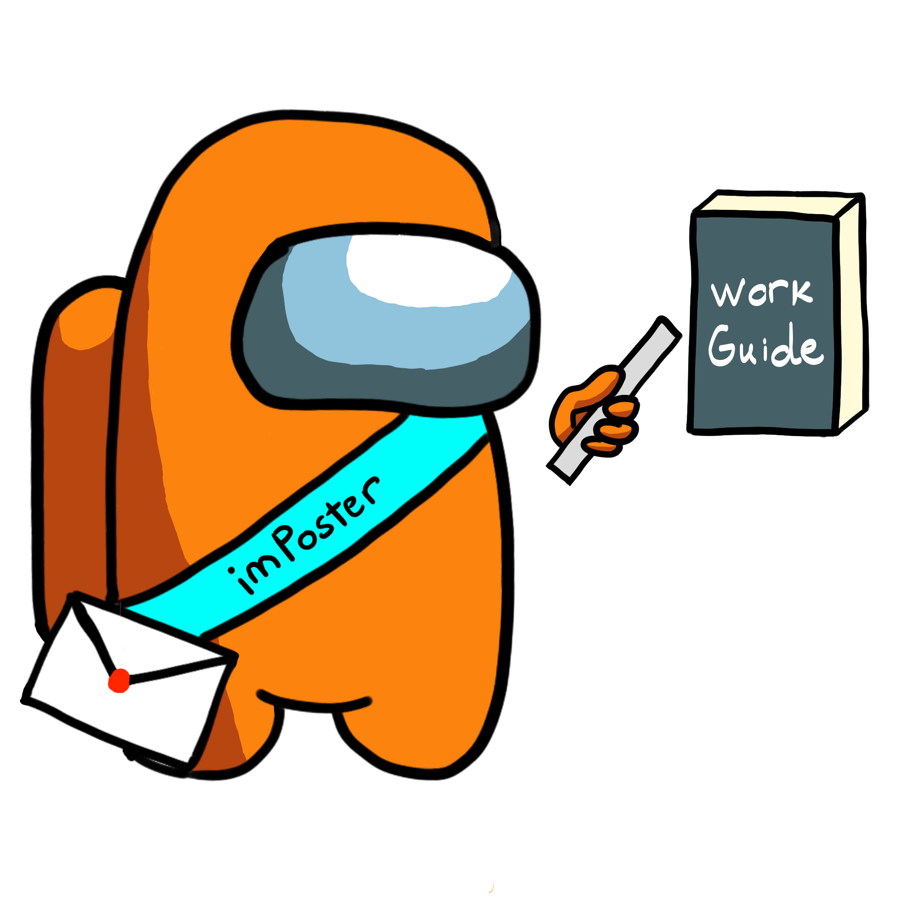

<p align="center">
  
</p>

<h1 class="post-title">{{ page.title | escape }}</h1>
<div style="page-break-after: always;"></div>
<br/>

## Table of Contents

- [Table of Contents](#table-of-contents)
  - [Introduction](#introduction)
  - [Forking Workflow](#forking-workflow)
  - [Issues](#issues)
  - [Pull Requests (PR)](#pull-requests-pr)
  - [Reviews](#reviews)
  - [Unfinished Work](#unfinished-work)
  - [Pre commit githook](#pre-commit-githook)

### Introduction

imPoster Workflow Guide documents the team's agreed upon standardization of
workflow practices to adhere to in the development of the project.

### Forking Workflow

The team will adopt the
[forking workflow](https://nus-cs2103-ay2021s2.github.io/website/schedule/week7/topics.html#w7-7-project-mgt-workflows)
in accordance with the requirements of the module. In general, before working on
a new issue, an individual will first update their fork's master branch with the
master branch of the team's repository. Typically, the command to do so would be
as such (the second step is only necessary for the first time):

```
git checkout master
git remote add upstream https://github.com/AY2021S2-CS2103T-T12-4/tp.git
git fetch upstream
git merge upstream/master
git push
```

Running the script `sync.sh` within the scripts folder will also achieve the
same affect. Following which, the branch for the new issue will be checked out
from the master branch and development work can begin. By this point, an
[issue](#issues) should also have been created to match what a PR from this new
branch will be able to address.

### Issues

Apart from listing user stories, issues will be used as the primary way to track
in detail the tasks being worked on (the broad overview is also captured in the
[gantt chart](https://docs.google.com/spreadsheets/d/10HzmFh2pCHIu-8VpJSCRy0jzpVehnYpm/edit#gid=577662797)).
When adding new issues, the following format will be adhered to:

- Issues will be labelled with a type and priority (e.g. type.Task,
  priority.High)
- Issues will be tagged with a milestone
- Issues will be assigned with an assignee

### Pull Requests (PR)

For code that is ready to be merged, a pull request will be opened from the
working branch on the individual fork of the project to the master branch of the
team repository. This follows the [forking workflow](#forking-workflow)
highlighted above. In addition, all pull requests will have the following
format:

- PRs will be labelled with only a priority label (e.g. priority.High)
- PRs will be tagged with a milestone
- PRs will have no assignees which defaults to the author of the PR
- PRs will link clearly at the bottom of the PR message the issue it will
  address (e.g. Closes #34)
- PRs will need to pass all CI checks and require approval of at least one
  reviewer before merging
- PRs will be merged by the PR author after an approval from a reviewer
- PRs may be merged by the reviewer if given the PR authors permission.

### Reviews

Reviews may be done by any members of the team except for the PR author. An
approval will be given only when the PR is deemed fully ready to be merged. Reviewers may give comments on how to improve the code but not edit the PR authors branch directly.

### Unfinished Work

If there is any unfinished work/ work that needs to be improved upon, add the keyword `//to-do` behind it followed by a comment on the actions that need to be pursued afterwards. An example is as follows:

```//to-do work on adding more Tests```

Optionally, the author may write their name behind to signal that they will be continuing work on this `//to-do` so that other members do not write unnecessary code. An example would be as follows:

```//to-do Jun Xiong work on adding more Tests```

### Pre commit githook

Whenever a local git commit is executed, the hook will automatically run checkstyle and test cases to make sure both of them pass before the commit goes through. This will drastically remove the commits clutter made for fixing checkstyle errors.

Type the following in the local project repository to add the hook: 
`git config --local core.hooksPath .githooks/`
