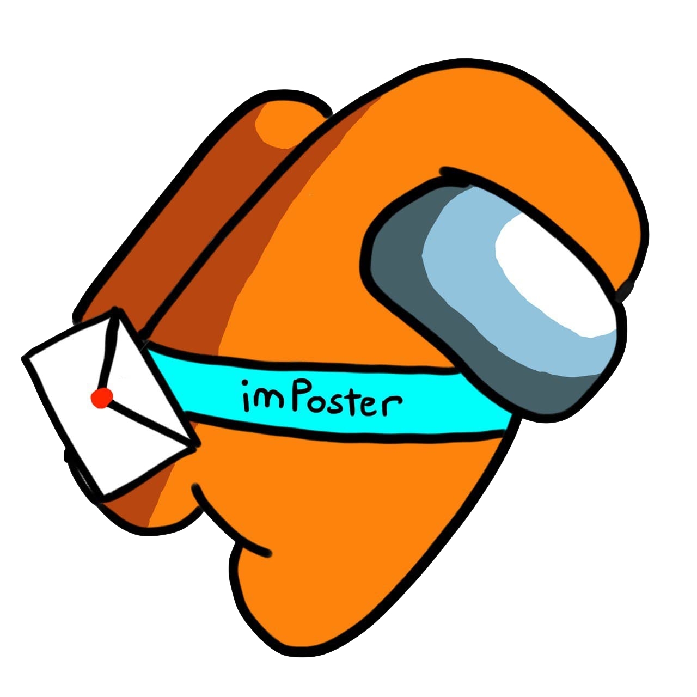

<p align="center">
  
  <h1 align="center">ImPoster Workflow Guide</h1>
</p>

## Table of Contents
* [Introduction](#introduction)
* [Forking Workflow](#forking-workflow)
* [Issues](#issues)
* [Pull Requests](#pull-requests-pr)

### Introduction
ImPoster Workflow Guide documents the team's agreed upon standardisation of workflow practices to adhere to in the development of the project.

### Forking Workflow
The team will adopt the [forking workflow](https://nus-cs2103-ay2021s2.github.io/website/schedule/week7/topics.html#w7-7-project-mgt-workflows) in accordance with the requirements of the module. In general, before working on a new issue, an individual will first update their fork's master branch with the master branch of the team's repository. Typically, the command to do so would be as such (the second step is only necessary for the first time):
```
git checkout master
git remote add upstream https://github.com/AY2021S2-CS2103T-T12-4/tp.git
git fetch upstream
git merge upstream/master
git push
```
Running the script `sync.sh` within the scripts folder will also achieve the same affect. Following which, the branch for the new issue will be checked out from the master branch and development work can begin. By this point, an [issue](#issues) should also have been created to match what a PR from this new branch will be able to address.

### Issues
Apart from listing user stories, issues will be used as the primary way to track in detail the tasks being worked on (the broad overview is also captured in the [gantt chart](https://docs.google.com/spreadsheets/d/10HzmFh2pCHIu-8VpJSCRy0jzpVehnYpm/edit#gid=577662797)). When adding new issues, the following format will be adhered to:
- Issues will be labelled with a type and priority (e.g. type.Task, priority.High)
- Issues will be tagged with a milestone
- Issues will be assigned with an assignee

### Pull Requests (PR)
For code that is ready to be merged, a pull request will be opened from the working branch on the individual fork of the project to the master branch of the team repository. This follows the [forking workflow](#forking-workflow) highlighted above. In addition, all pull requests will have the following format:
- PRs will be labelled with only a priority label (e.g. priority.High)
- PRs will be tagged with a milestone
- PRs will have no assignees which defaults to the author of the PR
- PRs will link clearly at the bottom of the PR message the issue it will address (e.g. Closes #34)
- PRs will need to pass all CI checks and require approval of at least one reviewer before merging
- PRs will be merged by the PR author after an approval from a reviewer

### Reviews
Reviews may be done by any members of the team except for the PR author. An approval will be given only when the PR is deemed fully ready to be merged.
