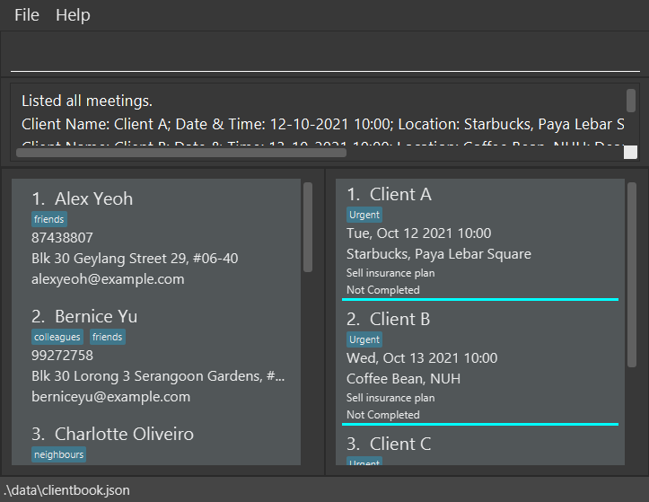

**Welcome to iSCAM, your new client management app.** It helps catalogue and manage your clients' information, including upcoming appointments with them, and allows you to retrieve these data efficiently. iSCAM also presents your daily scheduled appointments in a one-page solution, where you can easily see your schedule for the day. While it has a GUI, most of the user interactions happen using a CLI (Command Line Interface).

* If you are interested in using iScam, head over to the [_Quick Start_ section of the **User Guide**](UserGuide.html#quick-start).
* If you are interested about developing iScam, the [**Developer Guide**](DeveloperGuide.html) is a good place to start.

**Acknowledgements**

* Libraries used: [JavaFX](https://openjfx.io/), [Jackson](https://github.com/FasterXML/jackson), [JUnit5](https://github.com/junit-team/junit5)
