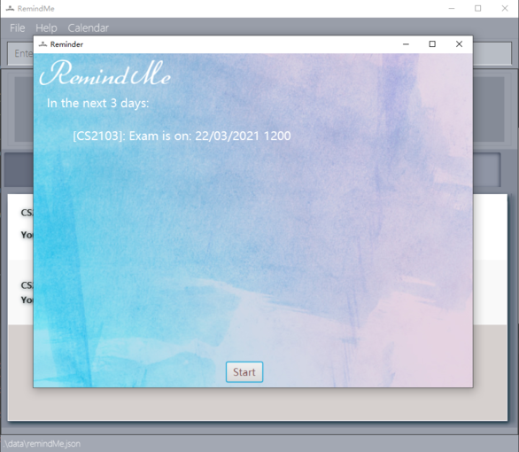

**RemindMe is a desktop app designed to help School of Computing students better manage their workload
  and take control of their work life.**

* If you are interested in using RemindMe, head over to the [_Start-up_ section of the **User Guide**](UserGuide.html#2-quick-start).
* If you are interested about developing RemindMe, the [**Developer Guide**](DeveloperGuide.html) is a good place to start.

**Acknowledgements**
* This project is based on the AddressBook-Level3 project created by the [SE-EDU initiative](https://se-education.org).
* Libraries used: [JavaFX](https://openjfx.io/), [Jackson](https://github.com/FasterXML/jackson), [JUnit5](https://github.com/junit-team/junit5)
