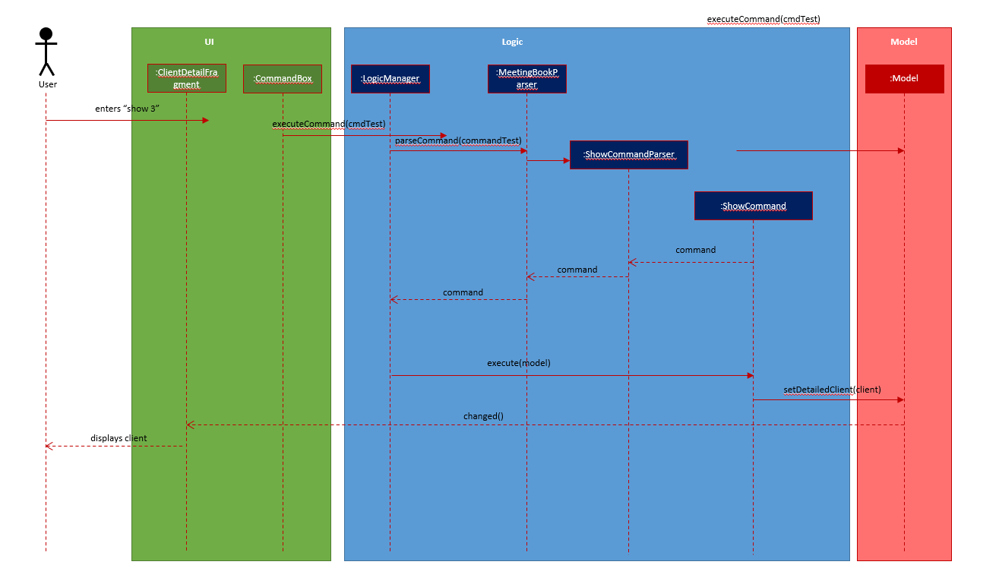

## Project: insurance Sure Can Arrange Meeting (iScam)

iScam is a desktop application used for insurance agents to keep track of their clients and the meetings that they have.
The user interacts with it using a CLI, and it has a GUI created with JavaFX. It is written in Java, and has about 18k
LoC.

Given below are my contributions to the project.

* **New Feature**: ClientDetailFragment
    * What it does: Displays detailed information about a client in a separate window. Quickly compiles all the client's associated meetings and insurance plans into a single list while displaying the client's profile image.
    * Justification: Agents may need to save and view more information about an individual client.
      Extra information about the client may be too lengthy to display within each individual client
      card inside the client list. Hence, a separate window would help display more information in a
      more accessible manner. Furthermore, agents may want to only see the list of meetings they 
      have with only that client, which can be displayed in this fragment.
    * Highlights:
        * A new UI panel that displays key information for one client.
            * Addition command `show` introduced to activate the function.
        * Displays a filtered list of meetings with the shown client in a dedicated list
        * New feature to display the profile image of each client
            * Allows the user to upload individual pictures for each client
            * Modified commands like `add` and `edit` to accommodate the new feature
            * Automatically handles invalid user input and displays a default image if the specified one is not found
    * Credits:
        * *Structure of the command suite is adopted from the Person commands from AddressBook-3*
        * *Default profile image taken from [Vectorified](https://vectorified.com/facebook-profile-icon#facebook-profile-icon-10.png)*
    

* **Code contributed**: [RepoSense link](https://nus-cs2103-ay2021s2.github.io/tp-dashboard/?search=zaiah0505&sort=groupTitle&sortWithin=title&timeframe=commit&mergegroup=&groupSelect=groupByRepos&breakdown=true&checkedFileTypes=docs~functional-code~test-code~other&since=2021-02-19&tabOpen=true&tabType=authorship&tabAuthor=Zaiah0505&tabRepo=AY2021S2-CS2103-W17-4%2Ftp%5Bmaster%5D&authorshipIsMergeGroup=false&authorshipFileTypes=docs~functional-code~test-code~other&authorshipIsBinaryFileTypeChecked=false)

* **Project management**:
    * Enforced CI and helped teammates resolve CI conflicts.
    * Standardised package naming and resolved checkstyle issues from other contributors ([\#35](https://github.com/AY2021S2-CS2103-W17-4/tp/pull/35))
    * Helped others debug issues during integration ([\#220](https://github.com/AY2021S2-CS2103-W17-4/tp/pull/220))

* **Enhancements to existing features**:
    * Extended existing client commands and tests to accommodate new image feature. ([\#72](https://github.com/AY2021S2-CS2103-W17-4/tp/pull/72))
    * Extended model and UI to accommodate split screen configurations. ([\#208](https://github.com/AY2021S2-CS2103-W17-4/tp/pull/208))
    * Wrote tests for MeetingCommandParser classes to increase test coverage on the Meetings feature, increasing coverage from 67% to 72%. ([\#250](https://github.com/AY2021S2-CS2103-W17-4/tp/pull/250))

* **Documentation**:
    * User Guide:
        * Added information for use case with images. ([\#267](https://github.com/AY2021S2-CS2103-W17-4/tp/pull/267))
    * Developer Guide:
        * Added sequence diagram for illustrating sequence diagram for ClientDetailFragments
        * Added description of image storage and retrieval for DG diagrams. ([\#267](https://github.com/AY2021S2-CS2103-W17-4/tp/pull/267))

* **Community**:
    * Reviewed numerous PRs
    

* **Diagram extracts from DG**
    * ShowCommand's Sequence Diagram
      
      
