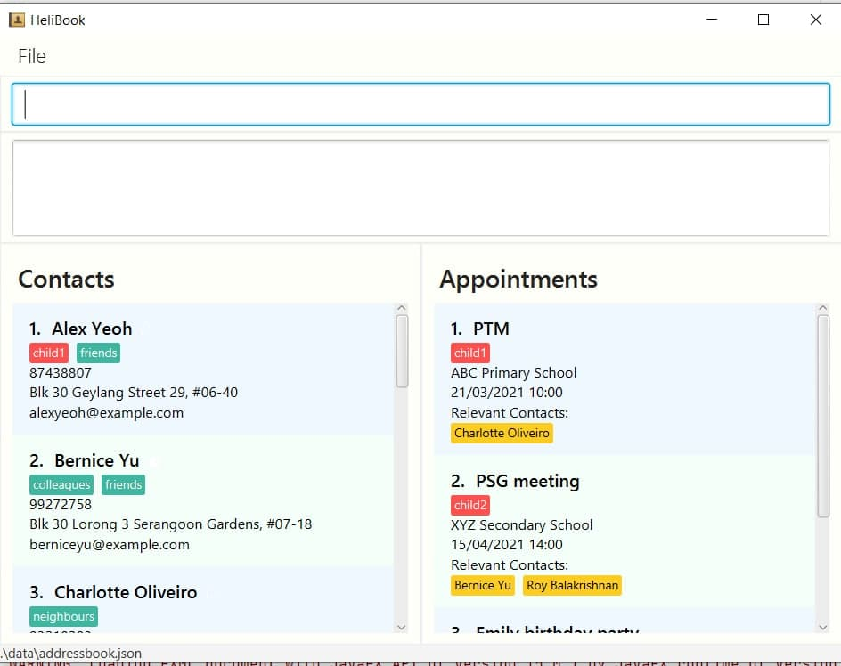

## Project: ParentPal

ParentPal is a desktop app for parents to manage their children's contacts and their related appointments. The user interacts with it using a CLI, and it has a GUI created with JavaFX. It is written in Java, and has about 10 kLoC.

Given below are my contributions to the project.

* **New Feature**: Designed architecture for Appointment functionalities.
  * What it does: Designed UML class diagrams for the different components (Model, Logic, UI and Storage) for Appointment.
  * Justification: Appointment functionalities will allow parents to manage both their children's contacts and appointments in one place, which increases the efficiency of ParentPal.
  * Highlights: This step was important as the classes and methods related to Appointment would greatly affect the design of the current architecture. Hence, it was necessary to draft out the design so that changes would be easy to integrate, without affecting the design of AddressBook-Level 3 too much.
* **New Feature**: Add Model and UI component for Appointment.
  * What it does: Implement classes and methods in the Model and UI components for Appointment.
  * Justification: Implementing the classes first would allow my other teammates to work on the other components, including the logic components which contain all the Appointment commands.
* **New Feature**: Add command to enable users to change theme.
  * What it does: allows the user to change theme to a light or dark theme.
  * Justification: This feature provides user with more UI choices. The light theme also provides a more family-oriented appearance to the application.
  
* **Code contributed**: [RepoSense link](https://nus-cs2103-ay2021s2.github.io/tp-dashboard/?search=clarlzx)

* **Project management**:
  * Managed releases `v1.2` - `v1.4` (4 releases) on GitHub

* **Enhancements to existing features**:
  * Changed behavior of FindCommand to accept incomplete words (Pull requests [\#58](https://github.com/AY2021S2-CS2103T-W13-3/tp/pull/58))
  * Updated the UI to show Appointment and Contacts (Pull requests [\#118](https://github.com/AY2021S2-CS2103T-W13-3/tp/pull/118), [\#121](https://github.com/AY2021S2-CS2103T-W13-3/tp/pull/121))
  * Updated the GUI color scheme by providing 2 additional color schemes (Pull requests [\#157](https://github.com/AY2021S2-CS2103T-W13-3/tp/pull/157))
    * 
    * 
    * The team decided to just use 1 of the added color schemes, with the dark theme
    
* **Documentation**:
  * User Guide:
    * Edited documentation for the feature `find`[\#88](https://github.com/AY2021S2-CS2103T-W13-3/tp/pull/88)
    * Added documentation for the feature `theme` [\#169](https://github.com/AY2021S2-CS2103T-W13-3/tp/pull/169)
  * Developer Guide:
    * Edited class diagrams for ParentPal to include Appointment-related classes ([\#110](https://github.com/AY2021S2-CS2103T-W13-3/tp/pull/110), [\#111](https://github.com/AY2021S2-CS2103T-W13-3/tp/pull/111), [\#299](https://github.com/AY2021S2-CS2103T-W13-3/tp/pull/299))
    
* **Community**:
  * PRs reviewed (with non-trivial review comments): [\#138](https://github.com/nus-cs2103-AY2021S2/ip/pull/138), [\#27](https://github.com/nus-cs2103-AY2021S2/ip/pull/27), [\#192](https://github.com/nus-cs2103-AY2021S2/ip/pull/192), [\#149](https://github.com/nus-cs2103-AY2021S2/ip/pull/149)
  * Contributed to forum discussions (examples: [96](https://github.com/nus-cs2103-AY2021S2/forum/issues/96))
  * Reported bugs and suggestions for other teams in the class (examples: [1](https://github.com/clarlzx/ped/issues/1), [2](https://github.com/clarlzx/ped/issues/2), [3](https://github.com/clarlzx/ped/issues/3), [4](https://github.com/clarlzx/ped/issues/4), [5](https://github.com/clarlzx/ped/issues/5), [7](https://github.com/clarlzx/ped/issues/7), [8](https://github.com/clarlzx/ped/issues/8))
