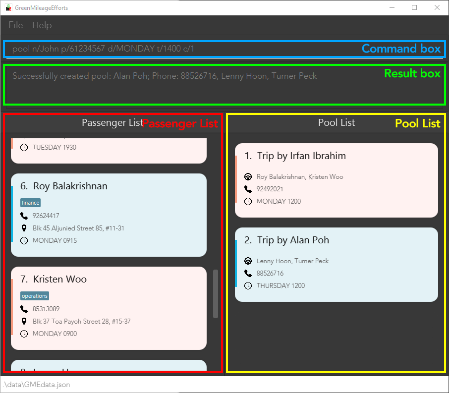

# Project: GreenMileageEfforts

GreenMileageEfforts (GME) is a platform that helps drivers and passengers of any IT company quickly arrange carpooling in order to lower their carbon footprint. The platform follows that of a command-line interface (CLI) such that power users that are familiar can efficiently navigate the program.

Given below are my contributions to the project.

* **New Feature**: Added the ability to `drive` passengers.
  * What it does: allows the user to select passengers to be driven by a driver.
  * Justification: This is a core feature of the product whereby we assign drivers to passengers
  * This feature has since been refactored to the `pool` command.

* **Code contributed**: [RepoSense link](https://nus-cs2103-ay2021s2.github.io/tp-dashboard/?search=&sort=groupTitle&sortWithin=title&since=&timeframe=commit&mergegroup=&groupSelect=groupByRepos&breakdown=false&tabOpen=true&tabType=authorship&tabAuthor=JoelHo&tabRepo=AY2021S2-CS2103T-W10-1%2Ftp%5Bmaster%5D&authorshipIsMergeGroup=false&authorshipFileTypes=docs~functional-code~test-code)

* **Project management**:
  * Setup team repo and organisation
  * Designed icon and branding for product
  * Ensured PRs and issues are linked to the correct author and milestone for proper tracking
  * Managed releases `v1.1` - `v1.4` (4 releases) on GitHub

* **Enhancements to existing features**:
  * Augmented Person and Index to make them more testable (PR [\#57](https://github.com/AY2021S2-CS2103T-W10-1/tp/pull/57))
  * Wrote additional tests for existing features to increase coverage by 1.63% (PR [\#57](https://github.com/AY2021S2-CS2103T-W10-1/tp/pull/57)), 2.56% (PR [\#78](https://github.com/AY2021S2-CS2103T-W10-1/tp/pull/78)),
    2.81% (PR [\#286](https://github.com/AY2021S2-CS2103T-W10-1/tp/pull/286))
  * Refactored code using Java Optionals (PR [\#225](https://github.com/AY2021S2-CS2103T-W10-1/tp/pull/225))
  * Prevent Passengers from being deleted if they are being referenced by a Pool (PR [\#132](https://github.com/AY2021S2-CS2103T-W10-1/tp/pull/132))
  * Fix Index being parsed incorrectly, resulting in wrong error message (PR [\#269](https://github.com/AY2021S2-CS2103T-W10-1/tp/pull/269))
  * Refactored the serialisation of Drivers and Pools such that they are stored as proper JSON (PR [\#125](https://github.com/AY2021S2-CS2103T-W10-1/tp/pull/125), [\#117](https://github.com/AY2021S2-CS2103T-W10-1/tp/pull/117))
  * Refactored toModelType of Passenger to better fit SLAP (PR [\#117](https://github.com/AY2021S2-CS2103T-W10-1/tp/pull/117))
  * Added sanity checking for JSON read to ensure manually edited files have no errors (PR [\#256](https://github.com/AY2021S2-CS2103T-W10-1/tp/pull/256), [\#298](https://github.com/AY2021S2-CS2103T-W10-1/tp/pull/298))

* **Community**:
  * PRs reviewed (with non-trivial review comments): [\#16](https://github.com/AY2021S2-CS2103T-W10-1/tp/pull/16), [\#133](https://github.com/AY2021S2-CS2103T-W10-1/tp/pull/133)
  * Substantial number of code related PRs merged, with code quality comments taken offline (and sadly not on github)

* **Tools**:
  * Patched security vulnerabilities in nokogiri and kramdown versions
  * Added [Codacy](https://app.codacy.com/gh/AY2021S2-CS2103T-W10-1/tp/dashboard) static analysis to repo
  * Setup Codecov check to PRs to ensure we attempt to maintain coverage
  
* **Documentation**:
  * User Guide:
    * Added documentation for the features `drive` (PR [\#62](https://github.com/AY2021S2-CS2103T-W10-1/tp/pull/62) [\#32](https://github.com/AY2021S2-CS2103T-W10-1/tp/pull/32))
    * Did cosmetic tweaks to existing documentation examples: (PR [\#62](https://github.com/AY2021S2-CS2103T-W10-1/tp/pull/62))
    * Change layout to use Github pages functionality (PR [\#32](https://github.com/AY2021S2-CS2103T-W10-1/tp/pull/32))
    * General cosmetic and formatting issues
  

## **Excerpts**

### User Guide

--------------------------------------------------------------------------------------------------------------------

### 3.1.1 User Interface

The various sections of the User Interface are described as in the picture below.

--------------------------------------------------------------------------------------------------------------------

### 3.1.6 Editing the data file

GME data is saved as a JSON file `[JAR file location]/data/GMEdata.json`. Advanced users are welcome to update data directly by editing that data file.

* Ensure that the following constraints are met if you decide to edit the file:
  * There are no duplicate `Passengers`
  * There are no duplicate `Pools`
  * Only one `Pool` can reference a `Passenger`
  * The `Passenger` referenced in `Pool` can be found in the `Passenger` object
  * The `Passenger` in a `Pool` must have the same Trip Day as the `Pool`

**:warning: GME will replace the JSON file with a new one if it cannot read the file** 
* Make a backup before any changes
* Edit at your own risk

--------------------------------------------------------------------------------------------------------------------
**Format:** <code>delete INDEX [<a title="These extra parameters are optional.">INDEX INDEX...</a>]</code>

**Format:** <code>pool n/DRIVER_NAME p/DRIVER_PHONE d/TRIPDAY t/TRIPTIME c/INDEX [<a title="These extra parameters are optional.">c/INDEX c/INDEX ...</a>] [tag/TAG]</code>

--------------------------------------------------------------------------------------------------------------------

## Developer Guide

### Diagrams:

--------------------------------------------------------------------------------------------------------------------

--------------------------------------------------------------------------------------------------------------------

### Model

The class diagram for the `Model` can be seen [above](DeveloperGuide.html#model-component) in the Design section. Such a design was chosen after a few iterations on other designs. One such design is briefly documented as below:

**v1.2**

In v1.2, `Passenger` has-an optional `Driver`, which was initially chosen for its ease of implementation and storage. However, it was spotted that this would lead to issues in future when implementing trips on multiple days, since each `Driver` would have their own times, leading to a lot of duplication of `Drivers`. Further, this was not an easy format to display to the user intuitively, and would require a traverse of the whole `Passenger` list just to group `Passengers` by `Drivers`.

#### Implementation
Therefore, the decision was made to encapsulate the details of each trip (which is a trip by 1 driver with multiple passengers), into a `Pool` class. This `Pool` class would have it's own CRUD, and would contain a `Driver`, `Passengers`, `TripDay` and `TripTime`.

This is done to facilitate `Storage` and `UI`, and also from a Users perspective, to allow for `Pools` with timings that may be slightly different from the `Passengers` preferred time.

A package `Pool` containing class `Pool` and `UniquePoolList` was created. This package performs a function that is similar to the `Passenger` package, exposing CRUD operations through `ModelManager`.

The decision was also made to make `Passenger` and `Driver` extend `Person`, so that for future iterations, we can support a `Driver` who is also a `Passenger` with minimal changes to the code.

### Storage

As above, with regards to [Model](DeveloperGuide.html#model-component), the initial implementation of `Storage` was simply to store a `Driver` as a `String` field inside Passenger.

However, this involved extra parsing to ensure that the `Driver` String was still a valid `Driver` on load. Therefore, `Driver` was also made into a Jackson `JsonProperty`.

The class diagram for `Storage` can be found [above](DeveloperGuide.html#storage-component).

#### Implementation

As of v1.3, the relation between `Driver` and `Passenger` is encapsulated in a `Pool`. All of `Driver`, `Passenger`, `Pool` and `Tag` are stored as JSON Objects. The choice was also made to store all data in 1 file, for ease of portability, such that the user only needs to manage 1 file.

At a high level, the JSON file is structured as such:

The `Passengers` are duplicated between the `Passenger` list and each of the `Pools` that reference the `Passenger` simply so we can reuse the `JsonSerializablePassenger` structure. This association would be much better represented in a RDBMS, which would be an easy change for a potential future iteration.

`JsonSerializableAddressBook` implements checks to ensure the following from the read JSON file:
* There are no duplicate Passengers
* There are no duplicate Pools
* No more than one Pool can reference a single Passenger
* There are no Pools that reference a Passenger that does not exist

This is to ensure the sanitization of data that is read from JSON, if the user decides to edit the JSON file directly.

--------------------------------------------------------------------------------------------------------------------

### Delete feature

This feature was adapted from AB-3. It allows users to delete `Passengers`.

Design considerations include being able to delete multiple`Passengers` with one command, and prevent the deletion of any `Passengers` that are currently in a `Pool`. This is done to prevent any accidental deletions of `Passengers` without either party being informed.

Given below is the Sequence Diagram for interactions within the `Logic` component for the `delete 1 2` command

:information_source: **Note:** The lifeline for `DeleteCommandParser` and `DeleteCommand` should end at the destroy marker (X) but due to a limitation of PlantUML, the lifeline reaches the end of diagram.

From the diagram illustrated above:
1. `LogicManager` has its `execute()` method called when a user enters the `"delete 1 2"` command.
1. Object of `AddressBookParser` class is then accessed, which then subsequently creates `DeleteCommandParser` class object to help parse the user's command.
1. `AddressBookParser` would then invoke the `parse()` method of `DeleteCommandParser`, with parameters `1 2`.
1. `DeleteCommandParser` invokes the `parseDeleteIndex()` method of `ParserUtil`, with the arguments `"1 2"`, which splits the arguments into tokens via whitespace.
1. `ParserUtil` self invokes `parseIndex()` on each token, which is used for parsing single indexes, and returns all the `Index` objects created to `DeleteCommandParser` as `indexes`.
1. `DeleteCommandParser` then instantiates a `DeleteCommand` object with `indexes` as a parameter. The `DeleteCommand` object is then returned to `LogicManager`.
1. `LogicManager` would subsequently invoke the `execute()` method of `DeleteCommand`, which in turn calls the `getFilteredPassengerList()` method in `Model`, to get the current passenger list being shown to the user as `lastShownList`.
1. `lastShownList` is then iterated through to and each passenger is passed to `Model` via `hasPoolWithPassenger()`, to check if that passenger is indeed currently being `Pool`ed.
  1. If any `Passenger` is found to be contained in a `Pool`, a new `CommandException` is thrown, informing the user as such.
1. After checking that it is indeed safe to delete all the `Passengers` in `lastShownList`, each `Passenger` is then deleted in `Model` via passing it to the `deletePassenger()` method.
1. A `CommandResult` object is then created with a message which includes the names of the `Passengers` deleted, in `lastShownList`
1. Finally, the `CommandResult` object is returned to `LogicManager`.

--------------------------------------------------------------------------------------------------------------------

### Editing a passenger

1. Editing passengers with 1 parameter while all passengers shown.

  1. Prerequisites: Newly generated sample data is used. This can be done by deleting `data/GMEdata.json`. All passengers listed using `list`.

  1. Test case: `edit 1 n/Alice`. 
     Expected: Name of passenger previously named `Alex Yeoh` is changed to `Alice`. Status message shows all the details of `Alice`.

  1. Test Case: `edit 0 n/Alice`.  
     Expected: No passenger is edited. Result box shows error: `One of the passenger indexes provided is invalid`. Command box text turns red.

  1. Other incorrect edit commands to try: `edit n/Alice`, `edit x n/Alice`, ... (where x is larger than the list size).
     Expected: Similar to previous.

1. Editing passengers with multiple parameters while all passengers shown.
  1. Prerequisites: Newly generated sample data is used. This can be done by deleting `data/GMEdata.json`. All passengers listed using `list`.

  1. Test case: `edit 1 p/12345678 a/Floor Street tag/abcd`. 
     Expected: Phone number, address, and tag of passenger named `Alice` is changed to `12345678`, `Floor Street`, and `abcd` respectively. Status message shows all the new details of `Alice`

1. Editing passenger to match an existing passenger's identity.
  1. Prerequisites: Using sample passengers, list all passengers using the `list` command. Multiple passengers in the list.

  1. Test case: `edit 1 n/Bernice Yu p/99272758`. 
     Expected: No passenger is edited. Result box shows error: `This passenger already exists in the GME Terminal.`. Command box text turns red.

1. Editing passenger that is in a Pool.
  1. Prerequisites: Newly generated sample data is used. This can be done by deleting `data/GMEdata.json`. All passengers listed using `list`. All pools listed using `listPool`.

  1. Test case: `edit 7 n/Kelly`. 
     Expected: Name of passenger previously named `Kristen Woo` is changed to `Kelly`. Status message shows all the details of `Kelly`. `Trip by Irfan Ibrahim` in Pool list updates to `Roy Balakrishnan, Kelly`.

  1. Test case: `edit 7 d/TUESDAY`. 
     Expected: No passenger is edited. Result box shows error: `TThe Passenger to be edited exists in a pool. Day cannot be edited.`. Command box text turns red.

  1. Test case: `edit 7 t/1400`. 
     Expected: Time of passenger named `Kelly` is changed to `1400`. Status message shows all the details of `Kelly`, and `NOTE: The passenger edited exists in a pool and has had their preferred trip time edited. This might result in a time difference of more than 15 minutes with the pool time.`

--------------------------------------------------------------------------------------------------------------------
