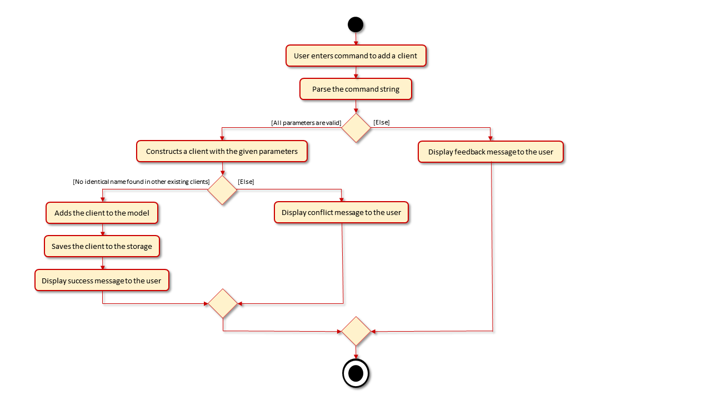
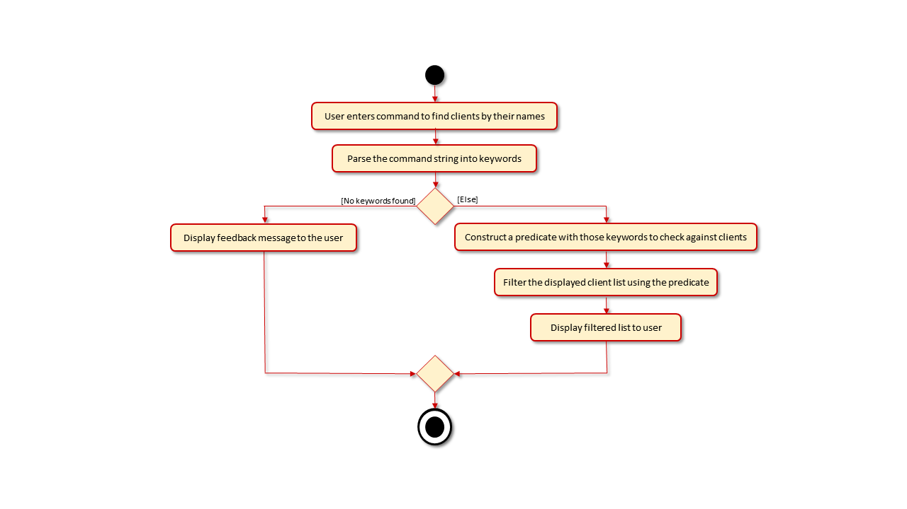
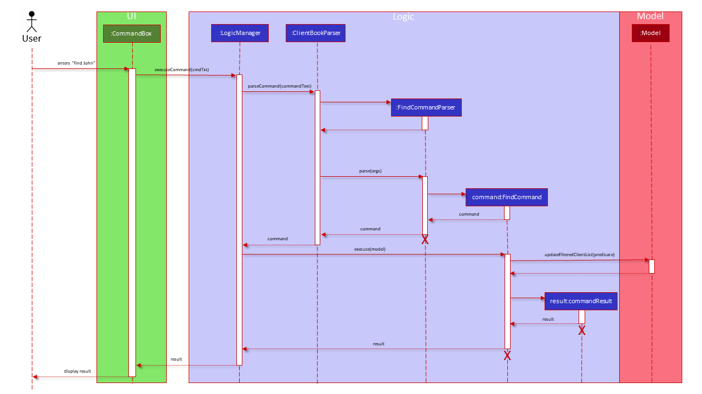
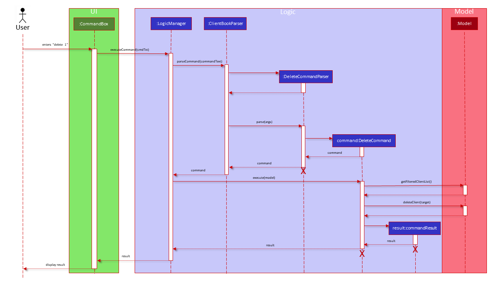

## insurance Sure Can Arrange Meeting (iScam)

iScam is a desktop application used for insurance agents to keep track of their clients and the meetings that they have.
The user interacts with it using a CLI, and it has a GUI created with JavaFX. It is written in Java, and has about 18k
LoC.

Given below are my contributions to the project.

* **New Feature**: Undo-Redo
    * What it does: allows the user to undo and redo commands
    * Justification: user may make mistakes that would require retyping the entire opposite command if undo/redo is not
      available. Implementing undo and redo commands would help save the user time. Another benefit is that the user would
      be able to undo or redo commands that had been done many commands ago, which the user may have forgotten.
    * Highlights:
        * Pre-existing commands are divided into undoable and commands that cannot be undone.
        * This feature was removed from the final product. As the undo-redo feature had not been finalised for the Meeting
          commands and was causing bugs. It was decided that there wasn't sufficient time left to debug the feature before
          release.
    * Credits: *Structure of the implementation is adopted from OneArmyj's implementation of undo and redo at
      https://ay1920s1-cs2103t-t09-1.github.io/main/team/onearmyj.html.*

* **Code contributed**: [RepoSense Link](https://nus-cs2103-ay2021s2.github.io/tp-dashboard/?search=juzzanoob&sort=groupTitle&sortWithin=title&timeframe=commit&mergegroup=&groupSelect=groupByAuthors&breakdown=true&checkedFileTypes=docs~functional-code~test-code~other&since=2021-02-19&tabOpen=true&tabType=authorship&tabAuthor=Tomashiwa&tabRepo=AY2021S2-CS2103-W17-4%2Ftp%5Bmaster%5D&authorshipIsMergeGroup=false&authorshipFileTypes=docs~functional-code~test-code~other&authorshipIsBinaryFileTypeChecked=false)

* **Enhancements to existing features**:
    * Added the Insurance Plan field for the Client class, which was implemented as its own class.

* **Contributions to the UG**:
    * Corrected formatting, grammatical and instruction mistakes in the UG.

* **Contributions to the DG**:
    * Corrected formatting and diagram mistakes in the DG.
    * Added activity and sequence diagrams for client commands.

* **Diagrams extracts from DG**:
    * AddClient's Activity Diagram
      
    * AddClient's Sequence Diagram
      
    * FindClient's Activity Diagram
      
    * FindClient Sequence Diagram
      
    * DeleteClient Activity Diagram
      
    * DeleteClient Sequence Diagram
      
