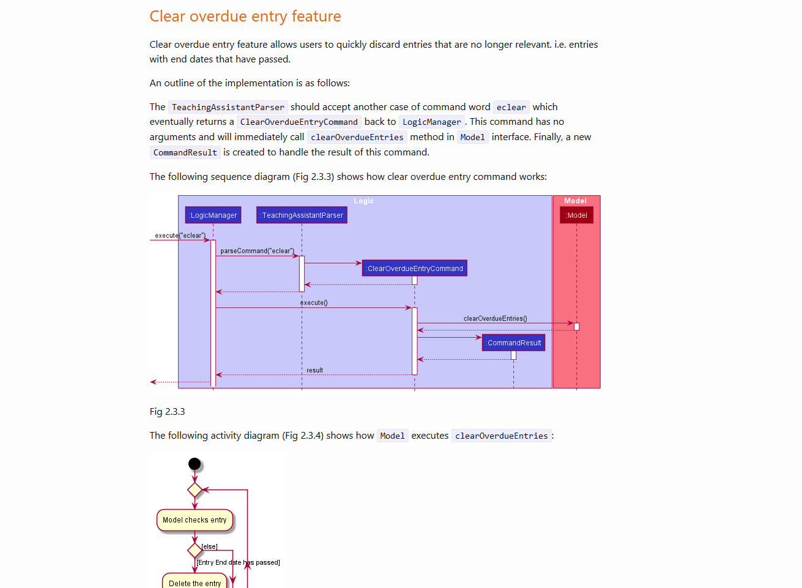

## Project: Teaching Assistant

Teaching Assistant is a desktop application used for managing contacts and entries for JC/Secondary school teachers.
The user interacts with it using a Command Line Interface (CLI), and it has a Graphical User Interface (GUI) created
with JavaFX. It is written in Java, and has about 10 (tbc) kLoC.

Given below are my contributions to the project.
* **Code contributed**: [RepoSense Link](https://nus-cs2103-ay2021s2.github.io/tp-dashboard/?search=&sort=groupTitle&sortWithin=title&since=&timeframe=commit&mergegroup=&groupSelect=groupByRepos&breakdown=false&tabOpen=true&tabType=authorship&tabAuthor=lrj689&tabRepo=AY2021S2-CS2103T-W13-4%2Ftp%5Bmaster%5D&authorshipIsMergeGroup=false&authorshipFileTypes=docs~functional-code~test-code&authorshipIsBinaryFileTypeChecked=false)
* **Enhancements implemented**:
    * Task class and its respective attribute classes (Which was updated to Entry class).
    * Task, Schedule, Entry class storage functionality.
    * Delete Task command and other dependencies(Which later became delete entry command).
    * Clear overdue entries command and other dependencies.
    * List Entry command by day/week/all and other dependencies.
    * Test code for storage.
    * Test code for other feature implementations mentioned above.
    
* **Contributions to the UG**:
    * Task section (Later updated to Entry section)
    * Illustrations for command examples.
    
* **Contributions to DG**:
    * Implementation for ClearOverdueCommand
    * Use Cases
    
* **Contributions to team-based tasks**:
    * Contributing issues in issue tracker
    * Removing code not needed for final product
    * Released V1.2.1
    
* **Review/mentoring contributions**:
    * Reviewed most pull requests. [Pull Request page](https://github.com/AY2021S2-CS2103T-W13-4/tp/pulls)
    * Provided suggestions in prs.
        * [PR comment](https://github.com/AY2021S2-CS2103T-W13-4/tp/pull/183)
        * [PR comment 2](https://github.com/AY2021S2-CS2103T-W13-4/tp/pull/208)
    
* **Contributions to DG extracts**:
    * 
    * .png)
    * .png)
    * .png)
  
* **Contributions to UG extracts**:
  * .png)
  * .png)
    
