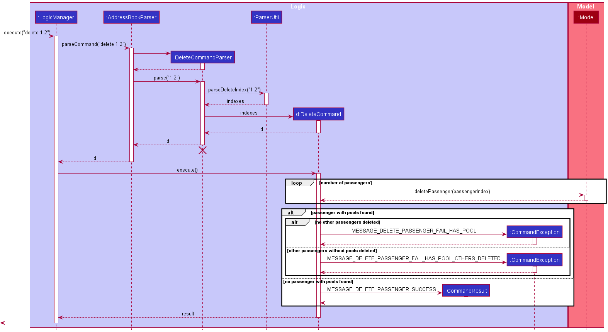

## Yue Yang's Portfolio

## Project: GreenMileageEfforts

### Overview

GreenMileageEfforts (GME) is a platform that helps the HR executive of any company quickly arrange carpooling among its employees in order to lower the carbon footprint of the company.

Given below are my contributions to the project.

* **New Feature**: Added the ability to find by more parameters. (PR #110, #122)
  * What it does: allows the user to find passengers by other parameters not limited to name.
  * Justification: This is allows users to find passengers more quickly.

* **Code contributed**: [RepoSense link](https://nus-cs2103-ay2021s2.github.io/tp-dashboard/?search=&sort=groupTitle&sortWithin=title&since=&timeframe=commit&mergegroup=&groupSelect=groupByRepos&breakdown=false&tabOpen=true&tabType=authorship&tabAuthor=lyueyang&tabRepo=AY2021S2-CS2103T-W10-1%2Ftp%5Bmaster%5D&authorshipIsMergeGroup=false&authorshipFileTypes=docs~functional-code~test-code&authorshipIsBinaryFileTypeChecked=false)

* **Enhancements to existing features**:
  * Allow for multiple deletion of passengers. (PR #133)
  * Renamed addressbook.json to GMEdata.json. (PR #133)
  * Provide warning when time difference of pool and any of passenger is more than 15 minutes. (PR #145)
  
* **Contributions to UG**:
  * Add explanations for the behaviour of Find command.
  * Add explanations for the multi-delete enhancement of Delete command.
  * Added more examples for the command summary for Find and Delete.
  * Correcting other minor mistakes made such as the lack of full stops.
  * Suggested the grouping of features according to Passenger-oriented and Pool-oriented commands later implemented by Zech.

* **Contributions to DG**:
  * Add rationale, sequence diagram and explanation for Find command.
  * Created sequence diagram for older iteration of Delete command.
  * Added manual tests for Find and Delete.
  * Correct other minor mistakes made such as the inconsistent lack of full stops.
  * Added explanation for the effort section.
  
* **Contributions to the team**:
  * Reviewed issues to close duplicates such as [#159](https://github.com/AY2021S2-CS2103T-W10-1/tp/issues/159) [#166](https://github.com/AY2021S2-CS2103T-W10-1/tp/issues/166) [#205](https://github.com/AY2021S2-CS2103T-W10-1/tp/issues/205)
  * Reviewed PRs such as [#226](https://github.com/AY2021S2-CS2103T-W10-1/tp/pull/226#pullrequestreview-632542191)

### UG Contributions

#### Explanation for Find Command:

  Finds passengers whose names contain any of the given keywords.
  
  **Format:** `find PREFIX/KEYWORD` where PREFIX is one of the following: `n`, `a`, `p`, `tag`, `pr`, `all`, `d`, `t`
  
  

  
  **:information_source: Notes about the find command:** 
  
  * Only full words will be matched e.g. `Han` will not match `Hans`.
  * Only **one type of prefix** can be specified.
  * More than 1 keyword can be specified for a single prefix.
  * Keywords separated by space will require both keywords to be matched in whole and cannot be broken apart.
    e.g. `Hans Yang` will only return `Gruber Hans Yang` instead of `Bo Yang` and `Hans Gruber Yang`.
  * Prefixes for searching name `n/`, address `a/`, tag `tag/`, phone number `p/`, price `pr/`, day `d/` and time `t/`.
  * Searching with prefixes such as `n/` and `a/` which are anticipated to have multiple words separated by spaces will have multiple spaces shortened to one. Refer to 4th example for clarification.
  * `all` prefix for searching across names, addresses, tags and phone numbers quickly.
  * However, if any or all of the words are invalid arguments, searching with `all` will not tell you it is invalid. It will only show that no passengers with those arguments are found.
  

  
  **Examples:**
  * `find a/serangoon` returns `Bernice Yu`, `David Li`. 
    
  * `find d/Monday d/Tuesday` returns `Alex Yeoh`, `Irfan Ibrahim` and `Roy Balakrishnan`.
    
  * `find n/Alex Yeoh` with multiple spaces between Alex and Yeoh
     

     

#### Explanation for Delete Command:

  * Multiple passengers can be deleted by including additional indexes after the first.
  * The index refers to the index number shown in the displayed passenger list.
  * The index **must be a positive integer** 1, 2, 3, …​
  * `search female` followed by `delete 3` deletes the *1st* passenger in the results of `search female` command.
  * Passengers with a carpool arrangement cannot be deleted, `unpool` must first be done on the pools they are in before deletion.
  

  
  **Examples:**
  * `list` followed by `delete 3` deletes the *3rd* person in the passenger list.
  * `delete 1 2 5` deletes the 1st, 2nd and 5th person in the passenger list. 
    
  

#### Additional examples for command summary
  * **find** | `find a/ADDRESS [a/ADDRESS a/ADDRESS ...]` or `find n/NAME [n/NAME n/NAME ...]` or `find p/PHONE NUMBER [p/PHONE NUMBER p/PHONE NUMBER ...]` or `find tag/TAG [tag/TAG tag/TAG ...]` or `find all/KEYWORD [all/KEYWORD all/KEYWORD ...]` or `find d/DAY [d/DAY d/DAY ...]` or `find t/TIME [t/TIME t/TIME ...]`   e.g., `find tag/female`
  * **delete** | `delete INDEX [INDEX INDEX...]`  e.g.`delete 1 3`
  
 

### DG Contributions
#### Explanation for Find Command
  The rationale behind expanding on the find feature is to allow for the user to find passengers by more attributes to improve usability.
  Instead of being restricted to searching for names only, the user can now find other passengers with the same day or of a certain area.
  This is vital as it is necessary to improve the usability for the user when attempting to find passengers to carpool with drivers.

  
  
  
:information_source: **Note:**  The `command` argument that is passed into
  `execute()`, represents the string `"find n/Lucy n/Adam"`, and has been abstracted for readability.
   
  The lifeline for `FindCommandParser` should end at the destroy marker (X) but due to a limitation of PlantUML, the lifeline reaches the end of diagram.
  

  
  From the diagram illustrated above:
  1. `LogicManager` has its `execute()` method called when a user enters the `"find n/Lucy n/Adam"` command.
  1. Object of `AddressBookParser` class is then accessed, which then subsequently creates `FindCommandParser` class object to help parse the user's command.
  1. `AddressBookParser` would then invoke the `parse()` method of `FindCommandParser`, with parameters `n/Lucy n/Adam`, to parse the arguments `n/Lucy n/Adam`.
  1. `FindCommandParser` parses the arguments `n/Lucy n/Adam` and creates a `NameContainsKeywordPredicate` object named `predicate` which is returned to the `FindCommandParser` object.
  1. `FindCommandParser` then instantiates a `FindCommand` object with `predicate` as a parameter. The `FindCommand` object is then returned to `LogicManager`.
  1. `LogicManager` would subsequently invoke the `execute()` method of `FindCommand`, which in turn calls the `updateFilteredPoolList()` method in `Model`, causing the shown pool list to be updated according to `predicate` in the `FindCommand` object.
  1. A `CommandResult` object is then created with a message which includes the number of passengers found on the list updated by `updateFilteredPoolList()`.
  1. Finally, the `CommandResult` object is returned to `LogicManager`.

 

#### Old Delete Sequence Diagram

 

#### Manual testing

Deleting a passenger

1. Deleting a passenger while all passengers are being shown.

    1. Prerequisites: List all passengers using the `list` command. Multiple passengers in the list. Passengers to be deleted are not in a pool.

    1. Test case: `delete 1`. 
       Expected: First contact is deleted from the list. Name of the deleted contact shown in the status message.

    1. Test case: `delete 0`. 
       Expected: No passenger is deleted. Error details shown in the status message. Text in command bar turns red.

    1. Other incorrect delete commands to try: `delete`, `delete x`, `...` (where x is larger than the list size). 
       Expected: Similar to previous.

1. Deleting multiple passengers while all passengers are being shown.

    1. Prerequisites: List all passengers using the `list` command. Multiple passengers in the list. Passengers to be deleted are not in a pool.

    1. Test case: `delete 1 2`. 
       Expected: First and second contact is deleted from the list. Names of deleted contacts are shown in the status message.
       
Finding a passenger

1. Finding passengers by name while all passengers shown.

    1. Prerequisites: Newly generated sample data is used. This can be done by deleting `data/GMEdata.json`.
       All passengers listed using `list`.

    1. Test case: `find n/bernice`. 
       Expected: Details of passenger named `Bernice Yu` is shown. Status message shows 1 passenger listed.

    1. Test case: `find n/bob`. 
       Expected: No passengers are shown. Status message shows 0 passenger listed.

    1. Test case: `find n/ROY n/lEnny`. 
       Expected: Details of passengers named `Roy Balakrishnan` and `Lenny Hoon` shown. Status message shows 2 passengers listed.

    1. Test case: `find n/   David lI`. 
       Expected: Details of passenger named `David Li` is shown. Status message shows 1 passenger listed.

1. Finding passengers by tag while all passengers are shown.

    1. Prerequisites: Newly generated sample data is used. This can be done by deleting `data/GMEdata.json`.
       All passengers listed using `list`.

    1. Test case: `find tag/finance`. 
       Expected: Details of `Bernice Yu` and `Roy Balakrishnan` are shown. Status message shows 2 passengers listed.

    1. Test case: `find tag/marketing tag/sales`. 
       Expected: Details of `Alex Yeoh`, `Bernice Yu`, `Irfan Ibrahim` and `Turner Peck` are shown. Status message shows 4 passengers listed.

    1. Test case: `find tag/marketing sales`. 
       Expected: Passengers are shown are same as previous. Status message shows tag provided is invalid.

#### Effort appendix

Extension of `find` command

The initial implementation of `find` inherited from AB3 only allowed users to search by names.
To improve usability for users, we introduced searching of other fields of a passenger.
While implementing the first iteration in v1.2, it took some additional time as it took some time to understand which classes interacted with each other when `find` was executed.
This was harder to understand as there was no sequence diagram included for the `find` command as well.
To implement the command, a predicate was needed for each of the attributes as well as the parsing of the arguments in `FindCommandParser` to allow for different type of searches to be possible.

Extension of `delete` command

The initial implementation of `delete` inherited from AB3 only allowed users to delete 1 passenger at a time.
To improve usability for users, we introduced multi-passenger deletion using indexes.
The first iteration of this allowed for passengers to be deleted despite some other passengers being already in a pool.
This was later revised to prevent users from executing `delete` all together when there are passengers still in a pool.
This was chosen as better code quality could be achieved through such a decision.
