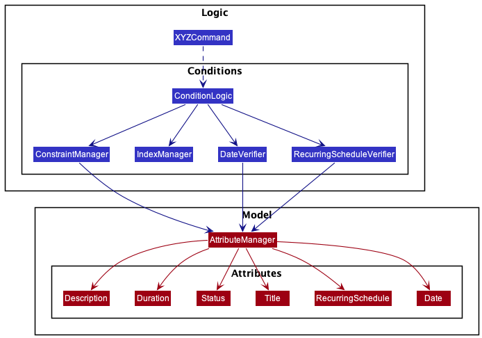

## Project: PlanIT

**PlanIT** is a task scheduling application targeted at NUS computing students. Our goal is to improve students'
productivity with features and tools to help them manage their schedules. It features simple and short commands
that are enhanced for fast typists as well as features which focuses on solving our target audience's problems.

Given below are my contributions to the project.

* **New Feature**: Added a `status` attribute.
  * What it does: Allows the user to track tasks which they have completed and tasks which may be uncompleted.
  * Justification: There are recurring tasks which make use of the same task card. Users can track if they are done for
  the week by setting the status to 'done'.
  * Highlights: The status attribute will be set to 'not done' by default, which allows users to quickly add tasks
  without wasting time by adding the status. The status attribute can be easily extended to include more statuses in 
  the future.

* **New Feature**: Added the ability to quickly mark a task's status as done.
    * What it does: Shortens the process to mark a task as done.
    * Justification: During testing, the done command was a frequently used command and was a bottle-neck in the
    efficiency in utilizing commands in PlanIT. Providing a shortcut solves the issue of spending unnecessary time on
    a frequently used command, solving one of our user's pain points.
    * Highlights: This command is built upon the existing edit command but shortens the command that a user needs to
    enter to access the same functionality.
    * Testing: Added Unit tests to ensure code coverage.
    
    
* **New Feature**: Added the ability to postpone a task's date attribute.
    * What it does: Postpones a task's date to a later date by the given number of days specified by the user.
    * Justification: Our target user, NUS computing students often have many interviews and group meetings. This leads
    to many instances when a meeting is postponed or a more pressing issue has arised which requires other tasks'
    deadline to be postponed.
    * Highlights: To better serve the target audience's need for quick and short commands, the `snooze` command can
    still work with only 1 parameter, the INDEX, and sets the default number of days to postpone a task as 1, therefore
    shortening the command even further.
    * Testing: Added Unit tests to ensure code coverage and ensures that future changes will still be correct with CI.
    
    
* **Enhancements to existing features**: Refactoring of code for constraint enforcement.
    * Refactored the checking of conditions and enforcement of constraints over a period of time from 
    Pull request: [\#103](https://github.com/AY2021S2-CS2103T-T10-2/tp/pull/103) to
    Pull request: [\#217](https://github.com/AY2021S2-CS2103T-T10-2/tp/pull/217)
    * Key issue 1: The first step was to create a class which is in charge of checking constraints. This improved the
    later process of changing and editing the various checks for constraints as our group decides to change certain
    logical implementations of the conditions and constraints on task creation.
    * Key issue 2: The next step was the planning of the architecture. While the facade class can direcly access the 
    various functionalities provided by the various attribute classes (e.g Date, RecurringSchedule, etc), this would
    violate the law of demeter. Furthermore, the checks cannot be done on the model since potientially invalid tasks
    cannot be added to the model first. Hence the final implementation is done as shown below.
    
    * Testing: Added unit tests for the various constraints and conditions classes. (Pull request: [\#125](https://github.com/AY2021S2-CS2103T-T10-2/tp/pull/125))
    
* **Enhancements to existing features**:
    * Refactored Add and Edit commands to abide by SLAP and fix error messages to be specific to the issue causing it.
    Pull request: [\#204](https://github.com/AY2021S2-CS2103T-T10-2/tp/pull/204)
    * Error messages are also more consistent due to the modularity of the code.
        
    
* **Code contributed**: [RepoSense link](https://nus-cs2103-ay2021s2.github.io/tp-dashboard/?search=&sort=groupTitle&sortWithin=title&timeframe=commit&mergegroup=&groupSelect=groupByRepos&breakdown=true&checkedFileTypes=docs~functional-code~test-code~other&since=&tabOpen=true&tabType=authorship&tabAuthor=maxxng&tabRepo=AY2021S2-CS2103T-T10-2%2Ftp%5Bmaster%5D&authorshipIsMergeGroup=false&authorshipFileTypes=docs~functional-code~test-code~other&authorshipIsBinaryFileTypeChecked=false)

* **Documentation**:
  * User Guide:
    * Added documentation for the feature `snooze` and `done`: [\#128](https://github.com/AY2021S2-CS2103T-T10-2/tp/pull/128)
    * Added 'How to use this guide' section: [\#128](https://github.com/AY2021S2-CS2103T-T10-2/tp/pull/128)
    * Added 'Summary of attributes' section: [\#128](https://github.com/AY2021S2-CS2103T-T10-2/tp/pull/128)
  * Developer Guide:
    * Update Model and Logic class diagrams based on new architecture: [\#219](https://github.com/AY2021S2-CS2103T-T10-2/tp/pull/219)
    * Add documentation and class diagram for enforcing constraints: [\#219](https://github.com/AY2021S2-CS2103T-T10-2/tp/pull/219)
    * Add documentation, class diagram, activity diagram and use case for Done command: [\#88](https://github.com/AY2021S2-CS2103T-T10-2/tp/pull/88)
    * Add user story: 
    
* **Community**:
  * PRs reviewed (with non-trivial review comments or bugs found): [\#74](https://github.com/AY2021S2-CS2103T-T10-2/tp/pull/74), [\#68](https://github.com/AY2021S2-CS2103T-T10-2/tp/pull/68), [\#63](https://github.com/AY2021S2-CS2103T-T10-2/tp/pull/63), [\#7](https://github.com/AY2021S2-CS2103T-T10-2/tp/pull/7)
  * Contributed to forum discussions (examples: [1](https://github.com/nus-cs2103-AY2021S2/forum/issues/263), [2](https://github.com/nus-cs2103-AY2021S2/forum/issues/143), [3](https://github.com/nus-cs2103-AY2021S2/forum/issues/122))
  * Reported bugs and suggestions for other teams in the class (examples: [1](https://github.com/maxxng/ped/issues/1), [2](https://github.com/maxxng/ped/issues/3), [3](https://github.com/maxxng/ped/issues/6))

* **Contribution to team-based tasks**:
    * In charge of merging pull requests and ensuring that reviews for PRs are valid.
    * Help set up the GitHub team org and repo.
    * Managed issue tracker, assigning of issues and tagging of issues for PE-D.
    * Monitored team tasks using Github Project board.
