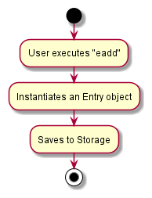
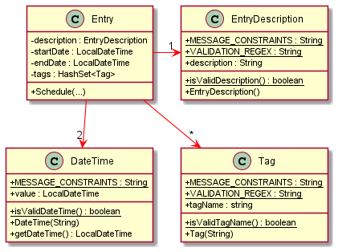
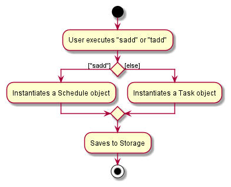

# Project: Teaching Assistant

## Overview
Teaching Assistant is a desktop application used for managing contacts and entries for JC/Secondary school teachers.
The user interacts with it using a Command Line Interface (CLI), and it has a Graphical User Interface (GUI) created
with JavaFX. It is written in Java, and has about 10 (tbc) kLoC.

## Summary of Contributions
Given below are some of my major contributions to the project.
* **Code contributed**: [RepoSense Link](https://nus-cs2103-ay2021s2.github.io/tp-dashboard/?search=&sort=groupTitle&sortWithin=title&since=&timeframe=commit&mergegroup=&groupSelect=groupByRepos&breakdown=false&tabOpen=true&tabType=authorship&tabAuthor=nicholastanvis&tabRepo=AY2021S2-CS2103T-W13-4%2Ftp%5Bmaster%5D&authorshipIsMergeGroup=false&authorshipFileTypes=docs~functional-code~test-code&authorshipIsBinaryFileTypeChecked=false)
* **Enhancements implemented**:
  * Add Schedule class in [#45](https://github.com/AY2021S2-CS2103T-W13-4/tp/pull/45)
    * Add and find schedule commands in [#54](https://github.com/AY2021S2-CS2103T-W13-4/tp/pull/54)
    * Delete schedule command in [#60](https://github.com/AY2021S2-CS2103T-W13-4/tp/pull/60)
  * Refactor Schedule and Task classes into a single Entry class in [#90](https://github.com/AY2021S2-CS2103T-W13-4/tp/pull/90)
    * Delete entry command in [#94](https://github.com/AY2021S2-CS2103T-W13-4/tp/pull/94) and [#102](https://github.com/AY2021S2-CS2103T-W13-4/tp/pull/102)
    * Edit entry command in [#112](https://github.com/AY2021S2-CS2103T-W13-4/tp/pull/112)
    * Find and Filter entry command tests in [#192](https://github.com/AY2021S2-CS2103T-W13-4/tp/pull/192) and [#200](https://github.com/AY2021S2-CS2103T-W13-4/tp/pull/200)
  * Refactor Person class into Contact class in [#181](https://github.com/AY2021S2-CS2103T-W13-4/tp/pull/181)
  * Refactor all tests in [#243](https://github.com/AY2021S2-CS2103T-W13-4/tp/pull/243)
    * Implement add and edit entry command parsers
    * Fix styling
    * Look after the entire test suite
* **Documentation**:
  * Developer Guide
    * A part of User Stories [#22](https://github.com/AY2021S2-CS2103T-W13-4/tp/pull/22)
    * One implementation [#80](https://github.com/AY2021S2-CS2103T-W13-4/tp/pull/80)
    * Architecture, Getting Started in [#231](https://github.com/AY2021S2-CS2103T-W13-4/tp/pull/231)
  * User Guide
    * Quick Start, Table in Contents in [#87](https://github.com/AY2021S2-CS2103T-W13-4/tp/pull/87)
* **Review Contributions**:
  * Major refactoring problems in [#89](https://github.com/AY2021S2-CS2103T-W13-4/tp/pull/89)
  * Missing PlantUML diagrams in [#245](https://github.com/AY2021S2-CS2103T-W13-4/tp/pull/245)
  * Enforce UML diagram standard in [#248](https://github.com/AY2021S2-CS2103T-W13-4/tp/pull/248)

## Contributions to the Developer Guide (Extracts)

### Architecture Sequence Diagram

---

### Delete Contact Sequence Diagram

---

### Entry Activity Diagram

---

### Entry Class Diagram

---

### Filter Entry Sequence Diagram

---

### Logic Class Diagram

---

### Model Class Diagram

---

### Schedule and Task Activity Diagram

---

### Storage Class Diagram

---

### Ui Class Diagram

